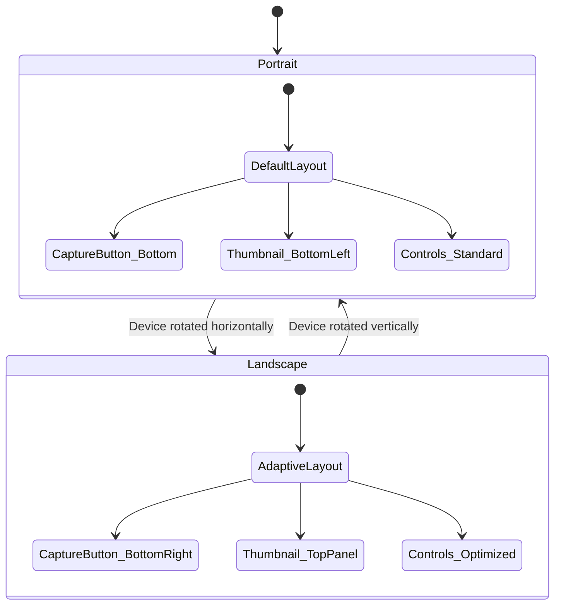
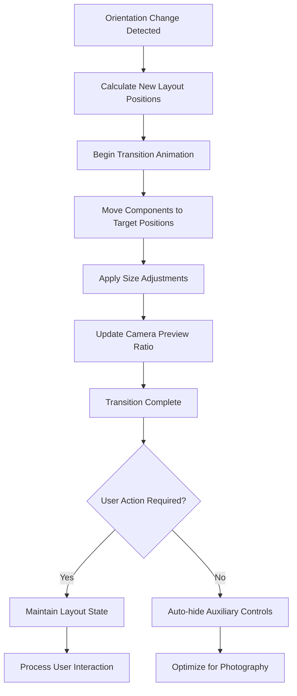
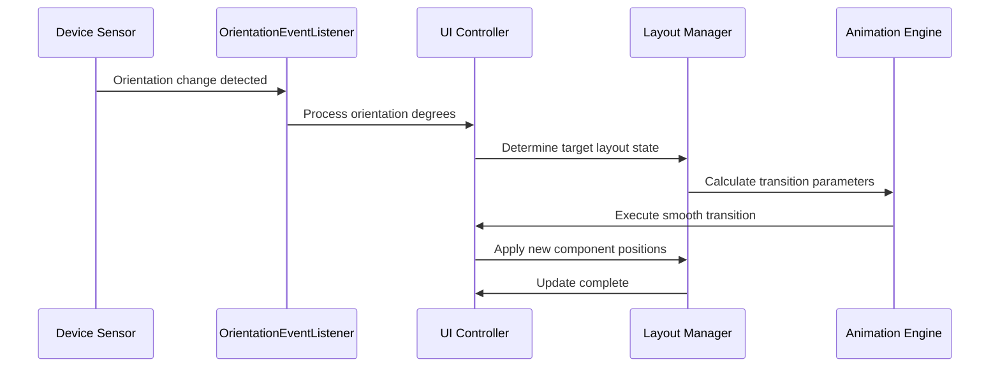
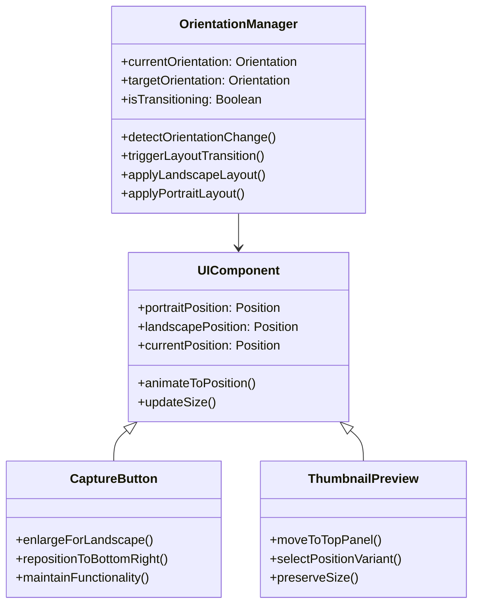

# Camera Interface Enhancement: Adaptive Orientation Layout

## Overview

This design specification defines the enhancement of the camera interface to provide optimal user experience across both portrait and landscape device orientations. The enhancement introduces adaptive UI layouts that automatically adjust based on device orientation, ensuring consistent functionality and improved usability in both orientations.

The camera interface currently operates primarily in portrait mode with basic orientation handling for captured media. This enhancement extends the interface to provide distinct, optimized layouts for both portrait and landscape orientations with smooth transitions between states.

## Architecture

### Orientation Detection Strategy

The existing `OrientationEventListener` mechanism will be extended to handle UI layout transitions in addition to camera target rotation updates. The system maintains two distinct layout configurations:

- **Portrait Mode**: Default configuration optimized for vertical device orientation
- **Landscape Mode**: Alternative configuration optimized for horizontal device orientation

### UI Component Repositioning System

The interface enhancement implements a dynamic repositioning system that manages the placement and sizing of key UI components based on orientation state:

| Component | Portrait Position | Landscape Position | Size Adjustment |
|-----------|------------------|-------------------|-----------------|
| Capture Button | Bottom center | Bottom-right corner | +15-20% in landscape |
| Thumbnail Preview | Bottom-left corner | Top panel (center or right) | Consistent size |
| Camera Preview | Full screen with controls overlay | Optimized 16:9 ratio | Aspect ratio adjusted |
| Control Panels | Top and bottom bars | Minimal overlay | Auto-hide non-essential |
| Zoom Control | Left side vertical | Left side vertical | Maintained |
| Settings Button | Top-left | Top-left (minimal) | Maintained |

### Transition Management

The orientation transition system ensures smooth, animated changes between layout states without jarring visual jumps:

## Landscape Mode Specifications

### Capture Button Enhancement

In landscape orientation, the capture button relocates to the bottom-right corner for optimal thumb accessibility. The button undergoes the following modifications:

- **Position**: Bottom-right corner with appropriate margin from screen edges
- **Size**: 15-20% larger than portrait mode for improved touch target
- **Accessibility**: Positioned for natural thumb reach in landscape grip
- **Visual**: Maintains current styling with enhanced prominence

### Thumbnail Preview Repositioning

The thumbnail preview component moves from the bottom-left to the top panel in landscape mode:

**Top Panel Center Option**:
- Centered horizontally in the top control bar
- Consistent size with portrait mode
- Balanced visual weight distribution

**Top Panel Right Option**:
- Positioned in top-right corner for visual consistency with capture button
- Maintains visual hierarchy and user expectations
- Provides clear separation from other controls

### Camera Preview Optimization

The camera preview adapts to landscape orientation through:

- **Aspect Ratio**: Optimized for 16:9 or current camera sensor ratio
- **Scaling**: Maintains proper proportions without distortion
- **Coverage**: Maximizes viewable area while preserving UI accessibility
- **Quality**: Ensures no degradation in preview resolution or clarity

### Control Panel Minimization

In landscape mode, auxiliary controls are minimized or auto-hidden to maximize photography area:

- **Essential Controls**: Settings, torch, camera switch remain accessible
- **Non-Essential Elements**: Resolution selector, mode switch positioned minimally
- **Auto-Hide Behavior**: Controls fade after brief inactivity period
- **Touch Activation**: Tap anywhere to temporarily reveal all controls

## Portrait Mode Specifications

Portrait mode maintains the current layout with refinements:

- **Capture Button**: Center-bottom position as current implementation
- **Thumbnail Preview**: Bottom-left corner as existing design
- **Control Layout**: Standard top and bottom panel arrangement
- **Camera Preview**: Full-screen with current overlay approach

## Behavioral Requirements

### Automatic Orientation Response

The interface automatically detects and responds to device orientation changes:

### Functionality Preservation

All camera functions remain accessible in both orientations:

- **Photo Capture**: Available with appropriate button positioning
- **Video Recording**: Maintained with optimized controls
- **Settings Access**: Consistent access to camera settings
- **Gallery Preview**: Thumbnail navigation preserved
- **Focus Control**: Tap-to-focus functionality maintained
- **Zoom Control**: Gesture and seekbar zoom available

### Performance Considerations

The orientation transition system is optimized for performance:

- **Lightweight Transitions**: Minimal computational overhead during rotation
- **Cached Layouts**: Pre-calculated positions for instant switching
- **Smooth Animation**: 60fps animation targets for fluid experience
- **Memory Efficiency**: No layout duplication or excessive resource usage

## Implementation Strategy

### Layout Resource Organization

The system utilizes Android's built-in orientation handling with enhanced programmatic control:

- **Base Layout**: `activity_camera.xml` for portrait orientation
- **Landscape Variant**: `activity_camera.xml` (layout-land) for landscape-specific optimizations
- **Dynamic Positioning**: Programmatic adjustment of constraint layout parameters
- **Animation Resources**: Transition animations for smooth orientation changes

### Component State Management

Each UI component maintains state awareness for orientation transitions:

### Animation Framework

Transition animations provide visual continuity during orientation changes:

- **Duration**: 250-300ms for optimal perceived responsiveness
- **Easing**: Smooth acceleration/deceleration curves
- **Staggering**: Sequential component transitions for natural flow
- **Interruption Handling**: Graceful handling of rapid orientation changes

## Integration Points

### Existing Camera System

The enhancement integrates with current camera components:

- **CameraActivity**: Extended with orientation layout management
- **OrientationEventListener**: Enhanced for UI transition triggering
- **UI Component References**: Updated for dynamic positioning
- **State Management**: Coordinated with existing camera state handling

### Settings Persistence

User preferences for landscape layout options:

- **Thumbnail Position**: Choice between center and right top panel placement
- **Auto-Hide Timing**: Configurable duration for control auto-hiding
- **Transition Speed**: User preference for animation duration
- **Button Size**: Optional override for capture button enlargement

### Accessibility Compliance

The enhanced interface maintains accessibility standards:

- **Touch Targets**: All interactive elements meet minimum size requirements
- **Screen Reader**: Proper content descriptions for repositioned elements
- **High Contrast**: Visual elements remain distinguishable in all orientations
- **Motion Sensitivity**: Option to disable transition animations

## Testing Strategy

### Orientation Transition Testing

Comprehensive testing covers all orientation change scenarios:

- **Rapid Rotation**: Multiple quick orientation changes
- **Partial Rotation**: Handling of intermediate orientation states
- **Configuration Changes**: System-level configuration change handling
- **Performance**: Frame rate maintenance during transitions

### Functional Verification

All camera functions verified in both orientations:

- **Capture Operations**: Photo and video capture in all orientations
- **Settings Access**: Complete settings functionality in landscape
- **Navigation**: Thumbnail gallery access and navigation
- **Gesture Control**: Zoom and focus gestures in both modes

### User Experience Validation

User testing focuses on usability improvements:

- **Ergonomics**: Thumb accessibility for capture button in landscape
- **Visual Clarity**: Camera preview quality and control visibility
- **Learning Curve**: Intuitive understanding of orientation-specific layouts
- **Performance Satisfaction**: Smooth transition perception

## Quality Assurance

### Performance Benchmarks

- **Transition Latency**: Sub-300ms orientation response time
- **Animation Smoothness**: Consistent 60fps during transitions
- **Memory Usage**: No significant memory increase during orientation changes
- **Battery Impact**: Minimal additional power consumption

### Compatibility Requirements

- **Device Support**: All screen sizes and aspect ratios
- **Android Versions**: Compatible with existing minimum SDK requirements
- **Hardware Variations**: Proper scaling across different device capabilities
- **Edge Cases**: Graceful degradation for unsupported configurations