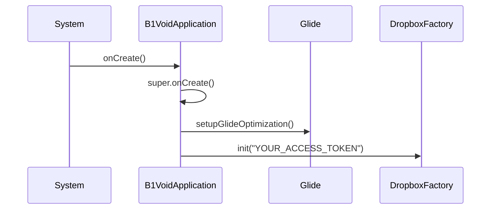
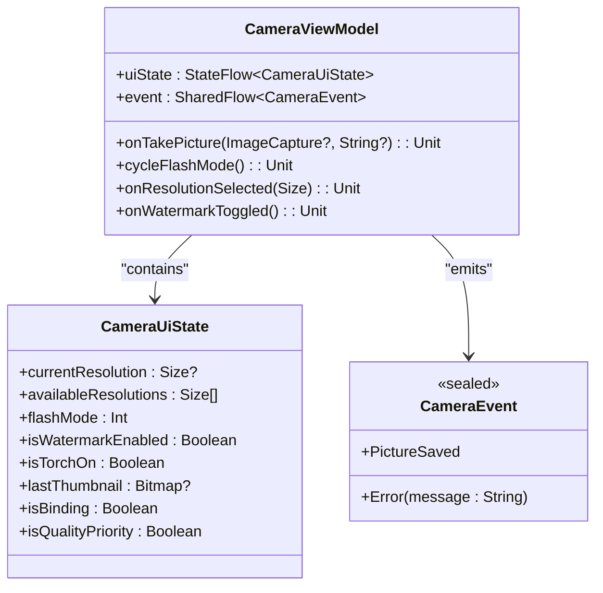
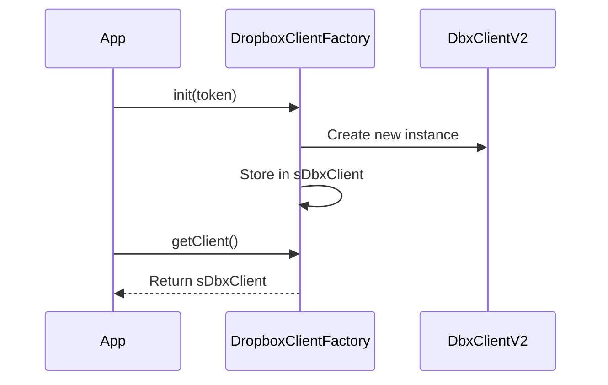

# API Reference

<cite>
**Referenced Files in This Document**   
- [B1VoidApplication.kt](file://app/src/main/java/com/example/b1void/B1VoidApplication.kt)
- [CameraViewModel.kt](file://app/src/main/java/com/example/b1void/viewmodels/CameraViewModel.kt)
- [DropboxClientFactory.kt](file://app/src/main/java/com/example/b1void/utils/DropboxClientFactory.kt)
- [FileManagerUtils.kt](file://app/src/main/java/com/example/b1void/utils/FileManagerUtils.kt)
- [CameraOptimizer.kt](file://app/src/main/java/com/example/b1void/utils/CameraOptimizer.kt)
</cite>

## Table of Contents
1. [B1VoidApplication](#b1voidapplication)
2. [CameraViewModel](#cameraviewmodel)
3. [DropboxClientFactory](#dropboxclientfactory)
4. [FileManagerUtils](#filemanagerutils)
5. [CameraOptimizer](#cameraoptimizer)

## B1VoidApplication

The `B1VoidApplication` class serves as the base Application class for the V1 application, responsible for initializing core components such as WorkManager and Glide image loading library during app startup.

### onCreate()
Initializes essential services when the application starts. This lifecycle method configures Glide for optimized image handling and initializes the Dropbox client with a predefined access token.

- **Threading**: Must be called on the main thread (automatically handled by Android system)
- **Nullability**: None of the operations accept null parameters
- **Version Stability**: Stable since v1.0
- **Extension Points**: Override this method in subclasses to add custom initialization logic



**Diagram sources**
- [B1VoidApplication.kt](file://app/src/main/java/com/example/b1void/B1VoidApplication.kt#L21-L25)

**Section sources**
- [B1VoidApplication.kt](file://app/src/main/java/com/example/b1void/B1VoidApplication.kt#L14-L53)

## CameraViewModel

The `CameraViewModel` manages camera-related UI state and user interactions using modern Android architecture components. It exposes observable properties and command methods for controlling camera functions.

### uiState
A `StateFlow<CameraUiState>` that emits changes to the camera's current state including resolution, flash mode, watermark settings, and thumbnail previews.

- **Type**: StateFlow<CameraUiState>
- **Thread Safety**: Thread-safe via StateFlow
- **Nullability**: Properties may contain nullable values (e.g., currentResolution, lastThumbnail)
- **Version Stability**: Stable since v1.0

### onTakePicture(imageCapture: ImageCapture?, savePath: String?)
Captures a photo using the provided ImageCapture instance and saves it to the specified path or default directory.

- **Parameters**:
  - `imageCapture`: The ImageCapture use case object (nullable)
  - `savePath`: Optional custom save path (nullable)
- **Return Type**: Unit (void)
- **Exceptions**: Emits CameraEvent.Error through event flow if capture fails
- **Threading**: Can be called from any thread; internal operations use appropriate dispatchers
- **Usage Example**:
```kotlin
viewModel.onTakePicture(cameraProvider.bindUseCases(...), "/storage/photos")
```
- **Version Stability**: Stable since v1.0

### cycleFlashMode()
Cycles through available flash modes (Auto → On → Off → Torch) and updates the UI state accordingly.

- **Parameters**: None
- **Return Type**: Unit (void)
- **Threading**: Main thread recommended
- **Version Stability**: Stable since v1.0

### onResolutionSelected(resolution: Size)
Updates the camera resolution setting and triggers binding reconfiguration.

- **Parameters**:
  - `resolution`: Target Size object for capture resolution
- **Return Type**: Unit (void)
- **Threading**: Main thread required
- **Version Stability**: Stable since v1.0

### Commands and Events
- **Commands**: takePhoto (via onTakePicture), recordVideo (not shown in code), cycleFlashMode, onResolutionSelected
- **Events**: Exposed via `event: SharedFlow<CameraEvent>` which emits PictureSaved or Error states



**Diagram sources**
- [CameraViewModel.kt](file://app/src/main/java/com/example/b1void/viewmodels/CameraViewModel.kt#L57-L265)

**Section sources**
- [CameraViewModel.kt](file://app/src/main/java/com/example/b1void/viewmodels/CameraViewModel.kt#L57-L265)

## DropboxClientFactory

Singleton factory class for managing Dropbox API client instances throughout the application lifecycle.

### getClient(): DbxClientV2
Retrieves the initialized Dropbox client instance.

- **Return Type**: DbxClientV2
- **Exceptions**: Throws IllegalStateException if init() hasn't been called
- **Thread Safety**: Safe for concurrent access after initialization
- **Nullability**: Never returns null after initialization
- **Version Stability**: Stable since v1.0
- **Usage Example**:
```kotlin
val client = DropboxClientFactory.getClient()
client.files().listFolder("/photos")
```

### init(accessToken: String)
Initializes the singleton Dropbox client with the provided access token.

- **Parameters**:
  - `accessToken`: Valid OAuth2 access token (non-null)
- **Return Type**: Unit (void)
- **Thread Safety**: Safe for single initialization
- **Idempotent**: Multiple calls have no effect after first successful initialization
- **Version Stability**: Stable since v1.0



**Diagram sources**
- [DropboxClientFactory.kt](file://app/src/main/java/com/example/b1void/utils/DropboxClientFactory.kt#L5-L22)

**Section sources**
- [DropboxClientFactory.kt](file://app/src/main/java/com/example/b1void/utils/DropboxClientFactory.kt#L5-L22)

## FileManagerUtils

Utility object providing file management operations including directory creation, file import, trash management, and compression.

### createAppDirectories(context: Context): AppDirectories
Creates standard application directories and returns their locations.

- **Parameters**:
  - `context`: Android Context instance (non-null)
- **Return Type**: AppDirectories data class containing appDirectory, zipDirectory, trashDirectory
- **Side Effects**: Creates directories on external storage
- **Threading**: Should be called off the main thread
- **Version Stability**: Stable since v1.0

### importUrisToDirectory(context: Context, directory: File, uris: List<Uri>): List<File>
Imports files from content URIs into the specified directory.

- **Parameters**:
  - `context`: Android Context (non-null)
  - `directory`: Target File directory (non-null)
  - `uris`: List of Uri objects to import (non-null)
- **Return Type**: List<File> representing successfully imported files
- **Threading**: Blocking operation, call from background thread
- **Nullability**: Returns empty list on failure rather than null
- **Version Stability**: Stable since v1.0

### moveToTrash(target: File, trashDirectory: File): Boolean
Moves a file or directory to the application's trash folder.

- **Parameters**:
  - `target`: File to move (non-null)
  - `trashDirectory`: Destination trash directory (non-null)
- **Return Type**: Boolean indicating success
- **Behavior**: Renames conflicting files with timestamp suffix
- **Version Stability**: Stable since v1.0

### clearTrash(trashDirectory: File): Boolean
Permanently deletes all contents of the trash directory.

- **Parameters**:
  - `trashDirectory`: Trash folder to clear (non-null)
- **Return Type**: Boolean indicating complete success
- **Failure Handling**: Continues deleting other items even if some deletions fail
- **Version Stability**: Stable since v1.0

**Section sources**
- [FileManagerUtils.kt](file://app/src/main/java/com/example/b1void/utils/FileManagerUtils.kt#L15-L248)

## CameraOptimizer

Utility object for optimizing camera performance based on device capabilities, particularly memory constraints.

### getOptimalResolution(context: Context): Size
Determines the best camera resolution based on device hardware capabilities.

- **Parameters**:
  - `context`: Android Context (non-null)
- **Return Type**: Size object (1280x720 for low-end, 1920x1080 for others)
- **Decision Logic**: Uses MemoryManager.isLowEndDevice() to determine device tier
- **Threading**: Can be called from any thread
- **Version Stability**: Stable since v1.0

### createOptimizedSizeSelector(context: Context): SizeSelector
Creates a size selector that constrains camera preview sizes based on device performance.

- **Parameters**:
  - `context`: Android Context (non-null)
- **Return Type**: SizeSelector configured with maxWidth/maxHeight constraints
- **Optimization**: Tighter constraints for low-end devices
- **Version Stability**: Stable since v1.0

### getOptimalImageQuality(context: Context): Int
Returns optimal JPEG compression quality level adjusted for device performance.

- **Parameters**:
  - `context`: Android Context (non-null)
- **Return Type**: Integer quality percentage (70% for low-end, 80% for others)
- **Source**: References B1VoidApplication.IMAGE_COMPRESSION_QUALITY constant
- **Version Stability**: Stable since v1.0

### isCameraSupported(context: Context): Boolean
Checks whether the device has functional camera hardware.

- **Parameters**:
  - `context`: Android Context (non-null)
- **Return Type**: Boolean indicating camera availability
- **Exception Handling**: Returns false on any error
- **Version Stability**: Stable since v1.0

### getOptimizedCameraSettings(context: Context): Map<String, Any>
Provides comprehensive camera configuration optimized for the current device.

- **Parameters**:
  - `context`: Android Context (non-null)
- **Return Type**: Map containing resolution, quality, HDR, stabilization, zoom, and other feature flags
- **Adaptive Settings**: Disables resource-intensive features on low-end devices
- **Version Stability**: Stable since v1.0

**Section sources**
- [CameraOptimizer.kt](file://app/src/main/java/com/example/b1void/utils/CameraOptimizer.kt#L11-L158)