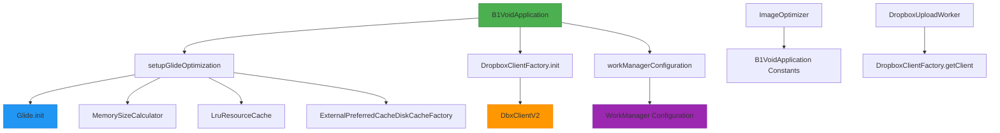
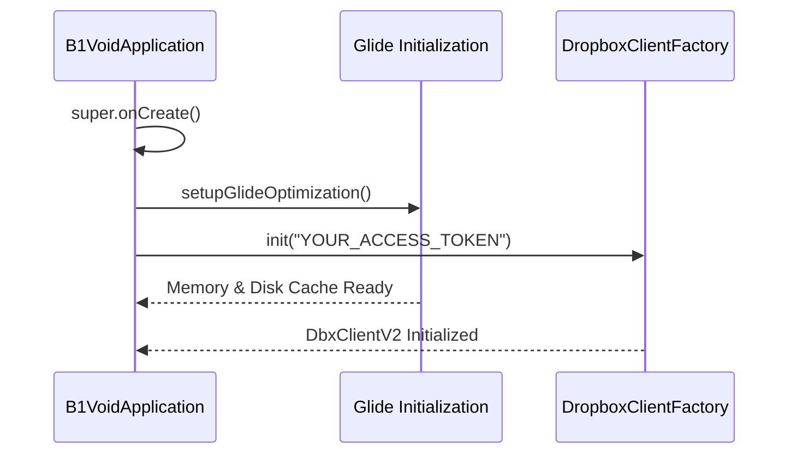
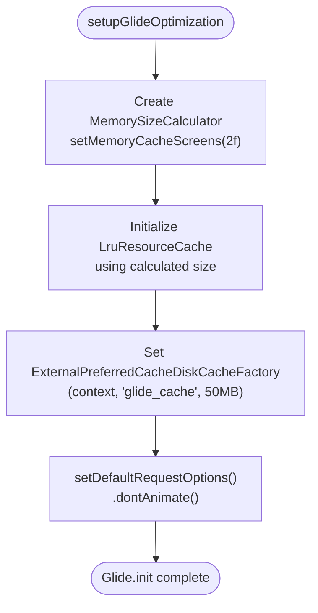
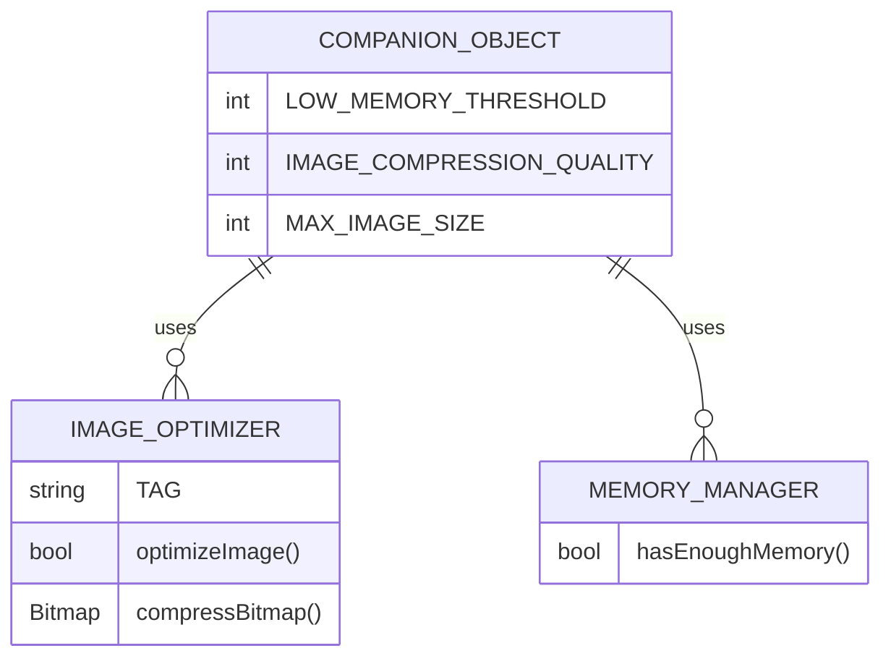

# B1VoidApplication Class

<cite>
**Referenced Files in This Document**
- [B1VoidApplication.kt](file://app/src/main/java/com/example/b1void/B1VoidApplication.kt)
- [DropboxClientFactory.kt](file://app/src/main/java/com/example/b1void/utils/DropboxClientFactory.kt)
- [ImageOptimizer.kt](file://app/src/main/java/com/example/b1void/utils/ImageOptimizer.kt)
- [DropboxUploadWorker.kt](file://app/src/main/java/com/example/b1void/workers/DropboxUploadWorker.kt)
</cite>

## Table of Contents
1. [Introduction](#introduction)
2. [Core Components](#core-components)
3. [Architecture Overview](#architecture-overview)
4. [Detailed Component Analysis](#detailed-component-analysis)
5. [Dependency Analysis](#dependency-analysis)
6. [Performance Considerations](#performance-considerations)
7. [Troubleshooting Guide](#troubleshooting-guide)
8. [Conclusion](#conclusion)

## Introduction
The `B1VoidApplication` class serves as the foundational application class for the B1Void mobile application, extending Android's `Application` class and implementing the `WorkConfigurationProvider` interface. It orchestrates critical initialization routines at app startup, including image loading optimization via Glide, configuration of WorkManager for background task scheduling, and integration with Dropbox for cloud storage operations. This documentation provides a comprehensive overview of its architecture, initialization sequence, threading behavior, and integration points with key components across the application.

**Section sources**
- [B1VoidApplication.kt](file://app/src/main/java/com/example/b1void/B1VoidApplication.kt#L1-L10)

## Core Components
The `B1VoidApplication` class is responsible for initializing core services essential to the application’s performance and functionality. These include optimized image handling through Glide, secure cloud file synchronization using Dropbox, and robust background processing powered by WorkManager. Constants defined in the companion object guide memory management and image processing policies throughout the app.

**Section sources**
- [B1VoidApplication.kt](file://app/src/main/java/com/example/b1void/B1VoidApplication.kt#L14-L53)

## Architecture Overview



**Diagram sources**
- [B1VoidApplication.kt](file://app/src/main/java/com/example/b1void/B1VoidApplication.kt#L14-L53)
- [DropboxClientFactory.kt](file://app/src/main/java/com/example/b1void/utils/DropboxClientFactory.kt#L9-L21)
- [ImageOptimizer.kt](file://app/src/main/java/com/example/b1void/utils/ImageOptimizer.kt#L0-L170)
- [DropboxUploadWorker.kt](file://app/src/main/java/com/example/b1void/workers/DropboxUploadWorker.kt#L21-L49)

## Detailed Component Analysis

### onCreate Method Analysis
The `onCreate()` method is invoked when the application process starts. It performs two primary initialization tasks: configuring Glide for efficient image loading and setting up the Dropbox client with an access token. This ensures that all subsequent activities benefit from pre-warmed caches and authenticated cloud connectivity.



**Diagram sources**
- [B1VoidApplication.kt](file://app/src/main/java/com/example/b1void/B1VoidApplication.kt#L21-L25)

**Section sources**
- [B1VoidApplication.kt](file://app/src/main/java/com/example/b1void/B1VoidApplication.kt#L21-L25)

### setupGlideOptimization Method Analysis
This private method configures Glide with custom memory and disk caching strategies tailored for performance on devices with limited resources. It calculates memory cache size based on screen dimensions (2 screens), sets up a disk cache on external storage with a 50MB limit, and disables animations by default to improve UI responsiveness.



**Diagram sources**
- [B1VoidApplication.kt](file://app/src/main/java/com/example/b1void/B1VoidApplication.kt#L27-L39)

**Section sources**
- [B1VoidApplication.kt](file://app/src/main/java/com/example/b1void/B1VoidApplication.kt#L27-L39)

### workManagerConfiguration Property Analysis
The `workManagerConfiguration` property returns a `Configuration.Builder` instance customized for the app’s background task execution needs. It sets the minimum logging level to INFO for debugging visibility and limits the maximum number of concurrent schedulers to 3 to prevent system resource exhaustion.

```mermaid
classDiagram
class ConfigurationBuilder {
+setMinimumLoggingLevel(level) : Builder
+setMaxSchedulerLimit(limit) : Builder
+build() : Configuration
}
class WorkConfigurationProvider {
<<interface>>
+getWorkManagerConfiguration() : Configuration
}
B1VoidApplication --> ConfigurationBuilder : overrides workManagerConfiguration
B1VoidApplication ..|> WorkConfigurationProvider
note right of B1VoidApplication
Returns Configuration.Builder
with .setMinimumLoggingLevel(INFO)
and .setMaxSchedulerLimit(3)
end note
```

**Diagram sources**
- [B1VoidApplication.kt](file://app/src/main/java/com/example/b1void/B1VoidApplication.kt#L42-L47)

**Section sources**
- [B1VoidApplication.kt](file://app/src/main/java/com/example/b1void/B1VoidApplication.kt#L42-L47)

### Companion Object Constants Analysis
The companion object defines three constant values used globally across the application for consistent behavior in image processing and memory-sensitive operations:
- `LOW_MEMORY_THRESHOLD`: 50MB threshold for determining low-memory conditions
- `IMAGE_COMPRESSION_QUALITY`: Default JPEG compression quality set to 80%
- `MAX_IMAGE_SIZE`: Maximum dimension (width/height) allowed for processed images (1024px)

These constants are referenced by utility classes such as `ImageOptimizer` to maintain uniformity in image handling logic.



**Diagram sources**
- [B1VoidApplication.kt](file://app/src/main/java/com/example/b1void/B1VoidApplication.kt#L49-L51)
- [ImageOptimizer.kt](file://app/src/main/java/com/example/b1void/utils/ImageOptimizer.kt#L0-L170)

**Section sources**
- [B1VoidApplication.kt](file://app/src/main/java/com/example/b1void/B1VoidApplication.kt#L49-L51)

## Dependency Analysis

```mermaid
dependency-graph
graph LR
A[B1VoidApplication] --> B[Glide]
A --> C[DropboxClientFactory]
A --> D[WorkManager]
C --> E[DbxClientV2]
F[ImageOptimizer] --> A
G[DropboxUploadWorker] --> C
style A fill:#f9f,stroke:#333
style B fill:#bbf,stroke:#333
style C fill:#fbb,stroke:#333
style D fill:#bfb,stroke:#333
```

**Diagram sources**
- [B1VoidApplication.kt](file://app/src/main/java/com/example/b1void/B1VoidApplication.kt#L14-L53)
- [DropboxClientFactory.kt](file://app/src/main/java/com/example/b1void/utils/DropboxClientFactory.kt#L9-L21)
- [ImageOptimizer.kt](file://app/src/main/java/com/example/b1void/utils/ImageOptimizer.kt#L0-L170)
- [DropboxUploadWorker.kt](file://app/src/main/java/com/example/b1void/workers/DropboxUploadWorker.kt#L21-L49)

**Section sources**
- [B1VoidApplication.kt](file://app/src/main/java/com/example/b1void/B1VoidApplication.kt#L14-L53)
- [DropboxClientFactory.kt](file://app/src/main/java/com/example/b1void/utils/DropboxClientFactory.kt#L9-L21)

## Performance Considerations
Initialization within `B1VoidApplication` occurs on the main thread during app startup. To minimize launch time, heavy operations should be deferred or executed asynchronously where possible. The use of `MultiDex.install(this)` in `attachBaseContext` may impact cold start performance on older devices. Glide's memory calculator dynamically adapts to device characteristics, ensuring optimal cache sizing without manual tuning. WorkManager's scheduler limit prevents excessive background job concurrency, preserving battery and CPU resources.

Integration with `ImageOptimizer` leverages the defined constants to make runtime decisions about image processing under memory constraints, enhancing stability on low-end devices.

**Section sources**
- [B1VoidApplication.kt](file://app/src/main/java/com/example/b1void/B1VoidApplication.kt#L14-L53)
- [ImageOptimizer.kt](file://app/src/main/java/com/example/b1void/utils/ImageOptimizer.kt#L0-L170)

## Troubleshooting Guide
Common issues related to `B1VoidApplication` typically involve misconfiguration of third-party libraries or incorrect usage of shared constants:
- **Glide not initializing**: Ensure `setupGlideOptimization()` is called in `onCreate()`
- **Dropbox upload failures**: Verify that `DropboxClientFactory.init()` is called before `getClient()`
- **WorkManager jobs not running**: Confirm `workManagerConfiguration` returns valid builder with proper logging/scheduler settings
- **OutOfMemoryError during image processing**: Check that `hasEnoughMemory()` uses correct `LOW_MEMORY_THRESHOLD`

Clearing the Glide disk cache can be done via `ImageOptimizer.clearImageCache(context)` if corrupted files are suspected.

**Section sources**
- [B1VoidApplication.kt](file://app/src/main/java/com/example/b1void/B1VoidApplication.kt#L14-L53)
- [DropboxClientFactory.kt](file://app/src/main/java/com/example/b1void/utils/DropboxClientFactory.kt#L16-L21)
- [ImageOptimizer.kt](file://app/src/main/java/com/example/b1void/utils/ImageOptimizer.kt#L137-L170)

## Conclusion
The `B1VoidApplication` class plays a pivotal role in establishing the runtime environment for the B1Void application. By centralizing configuration for image loading, background work, and cloud integration, it enables consistent, performant, and maintainable behavior across all components. Its design emphasizes early initialization, resource efficiency, and extensibility through well-defined constants and factory patterns.