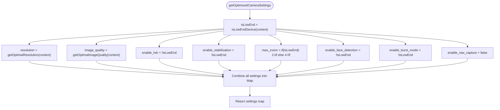
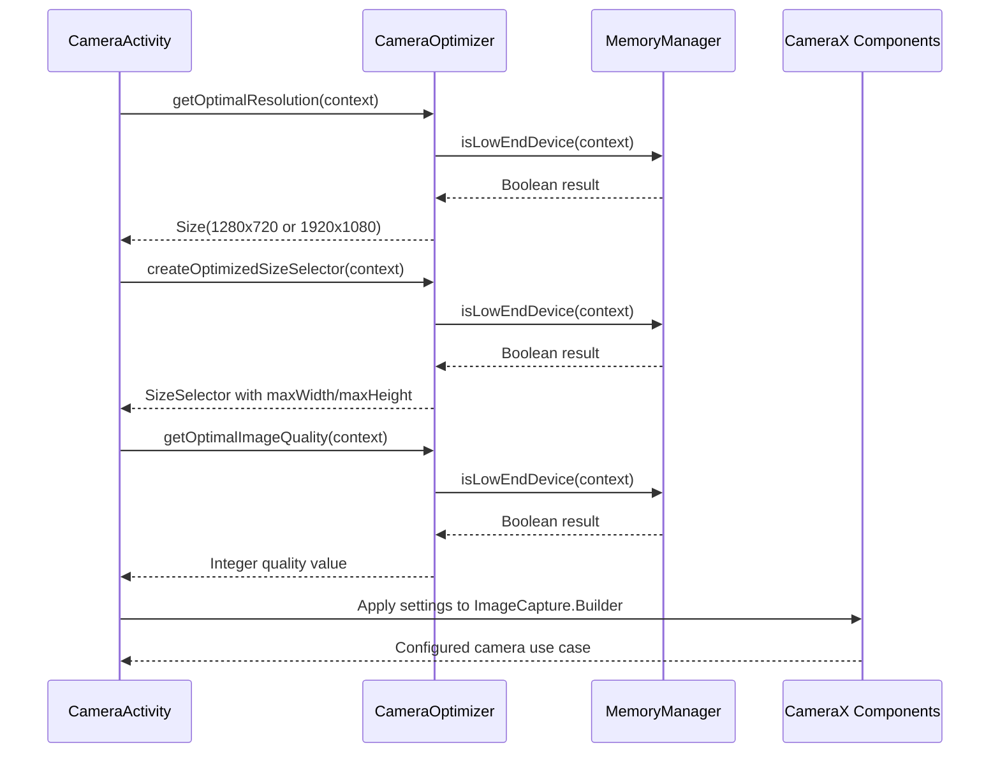

# CameraOptimizer

<cite>
**Referenced Files in This Document**   
- [CameraOptimizer.kt](file://app/src/main/java/com/example/b1void/utils/CameraOptimizer.kt)
- [MemoryManager.kt](file://app/src/main/java/com/example/b1void/utils/MemoryManager.kt)
- [B1VoidApplication.kt](file://app/src/main/java/com/example/b1void/B1VoidApplication.kt)
- [CameraActivity.kt](file://app/src/main/java/com/example/b1void/activities/CameraActivity.kt)
</cite>

## Table of Contents
1. [Introduction](#introduction)
2. [Core Optimization Functions](#core-optimization-functions)
3. [Device Capability Detection](#device-capability-detection)
4. [Comprehensive Camera Settings](#comprehensive-camera-settings)
5. [Image Processing Optimization](#image-processing-optimization)
6. [Integration with Camera Subsystem](#integration-with-camera-subsystem)
7. [Performance and Memory Management](#performance-and-memory-management)
8. [User Recommendations](#user-recommendations)

## Introduction

The CameraOptimizer utility object provides adaptive camera configuration based on device capabilities, ensuring optimal performance across different hardware tiers. It integrates with the MemoryManager to detect low-end devices and adjusts camera settings accordingly to balance quality and performance. The optimizer provides functions for resolution selection, image quality adjustment, camera capability detection, and comprehensive camera recommendations.

**Section sources**
- [CameraOptimizer.kt](file://app/src/main/java/com/example/b1void/utils/CameraOptimizer.kt#L11-L158)

## Core Optimization Functions

### getOptimalResolution(context: Context): Size
Returns the optimal camera resolution based on device capabilities. For low-end devices (determined by MemoryManager.isLowEndDevice()), it returns 1280x720 (720p) to ensure smooth performance. For other devices, it returns 1920x1080 (1080p) to provide higher quality output.

[SPEC SYMBOL](file://app/src/main/java/com/example/b1void/utils/CameraOptimizer.kt#L15-L25)

### createOptimizedSizeSelector(context: Context): SizeSelector
Creates an optimized size selector that combines maximum width and height constraints using SizeSelectors.and(). For low-end devices, the constraint is set to 1280 pixels, while for other devices, it's set to 1920 pixels. This ensures captured images do not exceed the specified dimensions in either direction.

[SPEC SYMBOL](file://app/src/main/java/com/example/b1void/utils/CameraOptimizer.kt#L27-L39)

### getOptimalImageQuality(context: Context): Int
Determines the optimal image compression quality based on device capabilities. Returns B1VoidApplication.IMAGE_COMPRESSION_QUALITY (80) for standard devices, but reduces this value by 10% (to 70) for low-end devices to reduce file size and processing requirements.

[SPEC SYMBOL](file://app/src/main/java/com/example/b1void/utils/CameraOptimizer.kt#L41-L50)

**Section sources**
- [CameraOptimizer.kt](file://app/src/main/java/com/example/b1void/utils/CameraOptimizer.kt#L15-L50)
- [B1VoidApplication.kt](file://app/src/main/java/com/example/b1void/B1VoidApplication.kt#L50-L50)

## Device Capability Detection

### isCameraSupported(context: Context): Boolean
Checks whether the device supports camera functionality by verifying the availability of CAMERA_SERVICE and ensuring there is at least one available camera. Returns false if the camera service cannot be accessed or if no cameras are detected, with errors logged appropriately.

[SPEC SYMBOL](file://app/src/main/java/com/example/b1void/utils/CameraOptimizer.kt#L52-L60)

### getCameraInfo(context: Context): Map<String, Any>
Retrieves comprehensive information about the device's camera system, including:
- camera_count: Number of available cameras
- supported_cameras: List of camera IDs
- sensor_orientation: Orientation of the primary camera sensor
- lens_facing: Direction the primary camera lens is facing

This function accesses camera characteristics through CameraManager to gather detailed hardware information.

[SPEC SYMBOL](file://app/src/main/java/com/example/b1void/utils/CameraOptimizer.kt#L62-L85)

**Section sources**
- [CameraOptimizer.kt](file://app/src/main/java/com/example/b1void/utils/CameraOptimizer.kt#L52-L85)

## Comprehensive Camera Settings

### getOptimizedCameraSettings(context: Context): Map<String, Any>
Returns a comprehensive map of recommended camera settings tailored to the device's capabilities. The settings include:

| Setting | Low-End Devices | Standard Devices |
|--------|----------------|------------------|
| resolution | 1280x720 | 1920x1080 |
| image_quality | Reduced by 10% | Full quality |
| enable_hdr | Disabled | Enabled |
| enable_stabilization | Disabled | Enabled |
| max_zoom | 2.0f | 4.0f |
| face_detection | Disabled | Enabled |
| burst_mode | Disabled | Enabled |
| raw_capture | Always disabled | Always disabled |

RAW capture is disabled for all devices to conserve memory. The function leverages other optimization methods like getOptimalResolution() and getOptimalImageQuality() to maintain consistency.

[SPEC SYMBOL](file://app/src/main/java/com/example/b1void/utils/CameraOptimizer.kt#L87-L114)

**Diagram sources**
- [CameraOptimizer.kt](file://app/src/main/java/com/example/b1void/utils/CameraOptimizer.kt#L87-L114)

**Section sources**
- [CameraOptimizer.kt](file://app/src/main/java/com/example/b1void/utils/CameraOptimizer.kt#L87-L114)

## Image Processing Optimization

### optimizeImageProcessing(context: Context): Map<String, Any>
Provides optimized settings for post-capture image processing based on device capabilities. The function returns a map containing processing constraints:

| Parameter | Low-End Devices | Standard Devices |
|---------|----------------|------------------|
| max_image_size | 800px | 1024px |
| compression_quality | Optimized quality | Optimized quality |
| enable_thumbnail_generation | Disabled | Enabled |
| enable_metadata_extraction | Disabled | Enabled |
| enable_face_detection | Disabled | Enabled |
| enable_scene_detection | Disabled | Enabled |
| enable_auto_enhancement | Disabled | Enabled |

This optimization reduces computational load on low-end devices by disabling resource-intensive processing features while maintaining full functionality on capable devices.

[SPEC SYMBOL](file://app/src/main/java/com/example/b1void/utils/CameraOptimizer.kt#L137-L151)

**Section sources**
- [CameraOptimizer.kt](file://app/src/main/java/com/example/b1void/utils/CameraOptimizer.kt#L137-L151)
- [B1VoidApplication.kt](file://app/src/main/java/com/example/b1void/B1VoidApplication.kt#L51-L51)

## Integration with Camera Subsystem

The CameraOptimizer is integrated throughout the camera subsystem, particularly in CameraActivity which manages the camera interface and functionality. The optimizer's recommendations are used to configure camera parameters during initialization and when applying user settings.

**Diagram sources**
- [CameraOptimizer.kt](file://app/src/main/java/com/example/b1void/utils/CameraOptimizer.kt#L11-L158)
- [CameraActivity.kt](file://app/src/main/java/com/example/b1void/activities/CameraActivity.kt#L375-L388)

**Section sources**
- [CameraOptimizer.kt](file://app/src/main/java/com/example/b1void/utils/CameraOptimizer.kt#L11-L158)
- [CameraActivity.kt](file://app/src/main/java/com/example/b1void/activities/CameraActivity.kt#L375-L388)

## Performance and Memory Management

### hasEnoughMemoryForCapture(context: Context): Boolean
Checks whether the device has sufficient memory for capturing images, requiring at least 50MB of available memory. This threshold helps prevent out-of-memory errors during image capture operations, especially important on low-end devices with limited RAM.

[SPEC SYMBOL](file://app/src/main/java/com/example/b1void/utils/CameraOptimizer.kt#L116-L123)

### MemoryManager Integration
The CameraOptimizer relies on MemoryManager to determine device tier classification. A device is considered low-end if it has less than 100MB of available memory. This assessment drives all optimization decisions within the CameraOptimizer.

[SPEC SYMBOL](file://app/src/main/java/com/example/b1void/utils/MemoryManager.kt#L28-L35)

**Section sources**
- [CameraOptimizer.kt](file://app/src/main/java/com/example/b1void/utils/CameraOptimizer.kt#L116-L123)
- [MemoryManager.kt](file://app/src/main/java/com/example/b1void/utils/MemoryManager.kt#L28-L35)

## User Recommendations

### getLowEndDeviceRecommendations(): List<String>
Provides user-facing recommendations for optimizing camera usage on low-end devices. These suggestions are designed to help users understand how to get the best performance from their devices:

- Use 720p resolution instead of 1080p
- Disable HDR to conserve resources
- Use JPEG format instead of RAW
- Limit zoom to 2x maximum
- Disable image stabilization
- Use autofocus mode
- Limit image cache size

These recommendations complement the technical optimizations by guiding user behavior toward optimal performance.

[SPEC SYMBOL](file://app/src/main/java/com/example/b1void/utils/CameraOptimizer.kt#L125-L135)

**Section sources**
- [CameraOptimizer.kt](file://app/src/main/java/com/example/b1void/utils/CameraOptimizer.kt#L125-L135)