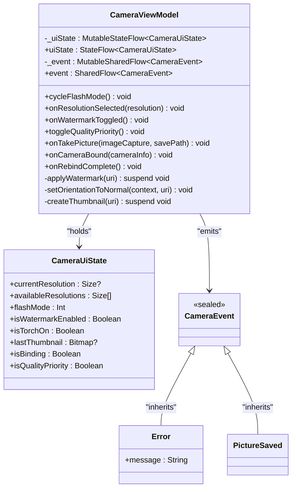
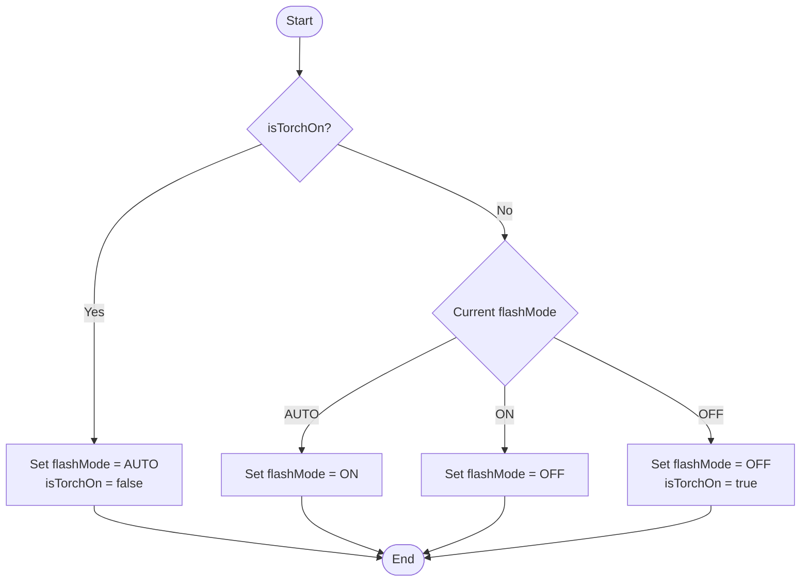
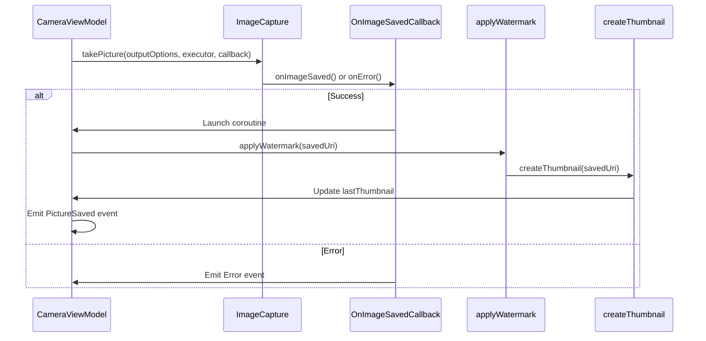
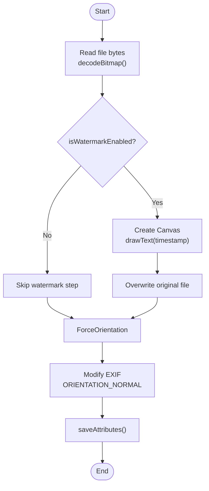
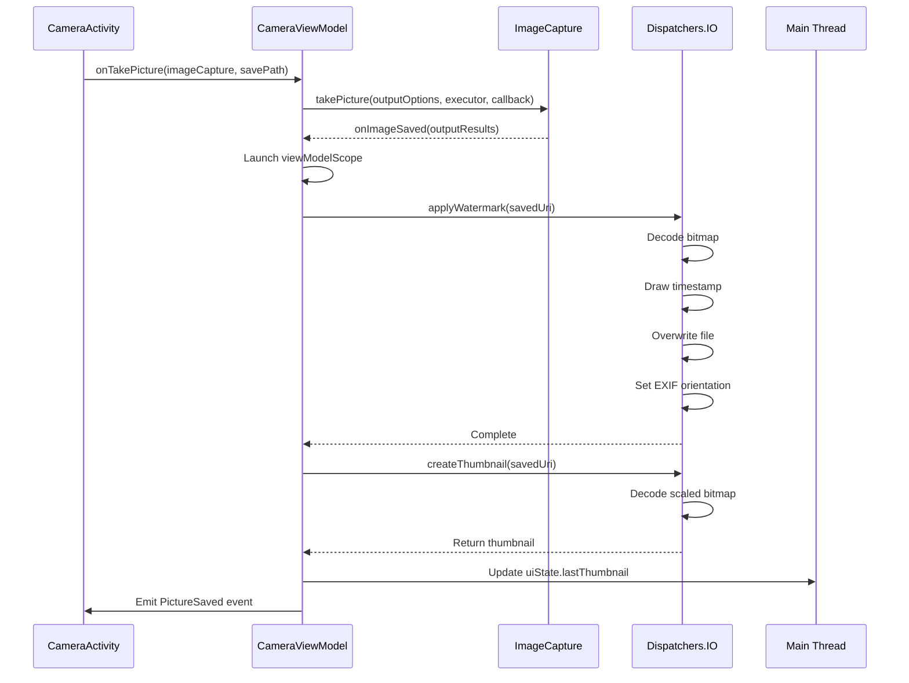

# CameraViewModel

<cite>
**Referenced Files in This Document**   
- [CameraViewModel.kt](file://app/src/main/java/com/example/b1void/viewmodels/CameraViewModel.kt)
</cite>

## Table of Contents
1. [Introduction](#introduction)
2. [Core Components](#core-components)
3. [State Management](#state-management)
4. [Event Broadcasting](#event-broadcasting)
5. [Public Methods](#public-methods)
6. [Internal Operations](#internal-operations)
7. [Photo Capture Workflow](#photo-capture-workflow)
8. [Conclusion](#conclusion)

## Introduction

The `CameraViewModel` is a critical component within the InspectorApp's camera functionality, designed to manage the state and behavior of the camera interface. As an extension of AndroidViewModel, it provides lifecycle-aware data management for the camera screen, ensuring that UI state persists across configuration changes such as screen rotations.

This documentation details the architecture and functionality of the `CameraViewModel`, focusing on its state holder (`_uiState`), event broadcasting mechanism (`_event`), and the suite of public methods that enable interaction with the camera system. The ViewModel integrates tightly with CameraX components, particularly `ImageCapture`, to handle photo capture, resolution selection, flash control, and image processing tasks such as watermarking and thumbnail generation.

The design emphasizes separation of concerns, with clear distinctions between UI state management, user interactions, background processing, and error handling. All operations are performed within appropriate coroutine contexts to ensure responsiveness and thread safety.

**Section sources**
- [CameraViewModel.kt](file://app/src/main/java/com/example/b1void/viewmodels/CameraViewModel.kt#L57-L265)

## Core Components

The `CameraViewModel` is built around two primary reactive streams: one for managing UI state and another for broadcasting events. These streams provide a unidirectional data flow pattern, where the UI observes state changes and reacts to emitted events.



**Diagram sources**
- [CameraViewModel.kt](file://app/src/main/java/com/example/b1void/viewmodels/CameraViewModel.kt#L57-L265)

**Section sources**
- [CameraViewModel.kt](file://app/src/main/java/com/example/b1void/viewmodels/CameraViewModel.kt#L57-L265)

## State Management

The `CameraViewModel` manages its internal state using a `MutableStateFlow<CameraUiState>` named `_uiState`. This state object is exposed to the UI layer as an immutable `StateFlow<CameraUiState>` through the `uiState` property, enabling the UI to collect and react to state changes in a lifecycle-safe manner.

The `CameraUiState` data class encapsulates all relevant state properties for the camera interface:

| Property | Type | Description | Default Value |
|---------|------|-------------|---------------|
| **currentResolution** | Size? | The currently selected capture resolution | null |
| **availableResolutions** | List<Size> | Resolutions supported by the current camera device | emptyList() |
| **flashMode** | Int | Current flash mode (AUTO, ON, OFF) annotated with @ImageCapture.FlashMode | ImageCapture.FLASH_MODE_AUTO |
| **isWatermarkEnabled** | Boolean | Flag indicating whether timestamp watermarking is enabled | true |
| **isTorchOn** | Boolean | Flag indicating torch (flashlight) mode status | false |
| **lastThumbnail** | Bitmap? | Thumbnail bitmap of the most recently captured photo | null |
| **isBinding** | Boolean | Flag indicating camera use case binding operation in progress | false |
| **isQualityPriority** | Boolean | Preference for image quality over capture speed | true |

State updates are performed immutably using the `update` function, which creates a new instance of `CameraUiState` with modified properties while preserving unchanged values. This approach ensures predictable state transitions and facilitates testing.

**Section sources**
- [CameraViewModel.kt](file://app/src/main/java/com/example/b1void/viewmodels/CameraViewModel.kt#L41-L50)
- [CameraViewModel.kt](file://app/src/main/java/com/example/b1void/viewmodels/CameraViewModel.kt#L57-L265)

## Event Broadcasting

The `CameraViewModel` uses a `MutableSharedFlow<CameraEvent>` named `_event` to broadcast one-time events to the UI layer. This stream is exposed as a `SharedFlow<CameraEvent>` through the `event` property, allowing the UI to observe and react to significant occurrences without treating them as persistent state.

The `CameraEvent` sealed class defines two possible event types:

```kotlin
sealed class CameraEvent {
    data class Error(val message: String) : CameraEvent()
    object PictureSaved : CameraEvent()
}
```

- **Error**: Emitted when an operation fails (e.g., photo capture failure, image processing error). Contains a descriptive error message.
- **PictureSaved**: Emitted when a photo has been successfully captured and processed, signaling the UI to update accordingly.

Using `SharedFlow` for events prevents the UI from missing transient events that might occur during configuration changes or when the observer is temporarily inactive. Events are collected using `viewModelScope.launch` within coroutine blocks to ensure proper lifecycle management.

**Section sources**
- [CameraViewModel.kt](file://app/src/main/java/com/example/b1void/viewmodels/CameraViewModel.kt#L52-L55)
- [CameraViewModel.kt](file://app/src/main/java/com/example/b1void/viewmodels/CameraViewModel.kt#L57-L265)

## Public Methods

### cycleFlashMode()

Cycles through available flash modes in a specific sequence: Auto → On → Off → Torch → Auto. The method handles both standard flash modes and torch (flashlight) functionality as a distinct state.



**Diagram sources**
- [CameraViewModel.kt](file://app/src/main/java/com/example/b1void/viewmodels/CameraViewModel.kt#L65-L88)

### onResolutionSelected()

Updates the current capture resolution and sets the `isBinding` flag to true, indicating that a camera reconfiguration is required.

**Section sources**
- [CameraViewModel.kt](file://app/src/main/java/com/example/b1void/viewmodels/CameraViewModel.kt#L90-L93)

### onWatermarkToggled()

Toggles the `isWatermarkEnabled` state property, controlling whether timestamps will be overlaid on captured images.

**Section sources**
- [CameraViewModel.kt](file://app/src/main/java/com/example/b1void/viewmodels/CameraViewModel.kt#L95-L98)

### toggleQualityPriority()

Switches the `isQualityPriority` preference between quality-focused and speed-focused capture modes.

**Section sources**
- [CameraViewModel.kt](file://app/src/main/java/com/example/b1void/viewmodels/CameraViewModel.kt#L100-L102)

### onTakePicture()

Initiates the photo capture process using the provided `ImageCapture` use case. Handles output file creation, executes the capture, and processes the result.



**Diagram sources**
- [CameraViewModel.kt](file://app/src/main/java/com/example/b1void/viewmodels/CameraViewModel.kt#L102-L145)

### onCameraBound()

Populates the `availableResolutions` list by querying the camera's `SCALER_STREAM_CONFIGURATION_MAP` through Camera2 interop, then clears the `isBinding` flag.

**Section sources**
- [CameraViewModel.kt](file://app/src/main/java/com/example/b1void/viewmodels/CameraViewModel.kt#L248-L258)

### onRebindComplete()

Clears the `isBinding` flag after a camera reconfiguration operation has completed.

**Section sources**
- [CameraViewModel.kt](file://app/src/main/java/com/example/b1void/viewmodels/CameraViewModel.kt#L260-L263)

## Internal Operations

### applyWatermark()

Applies a timestamp watermark to the captured image and forces EXIF orientation to normal. This suspending function runs on `Dispatchers.IO` due to its resource-intensive nature.



**Diagram sources**
- [CameraViewModel.kt](file://app/src/main/java/com/example/b1void/viewmodels/CameraViewModel.kt#L153-L206)

### setOrientationToNormal()

Modifies the EXIF metadata of the saved JPEG file to force a standard landscape orientation (ORIENTATION_NORMAL), ensuring consistent image display across different viewers.

**Section sources**
- [CameraViewModel.kt](file://app/src/main/java/com/example/b1void/viewmodels/CameraViewModel.kt#L208-L225)

### createThumbnail()

Generates a downscaled thumbnail from the captured image using `inSampleSize = 8` for efficient memory usage, then updates the `lastThumbnail` state.

**Section sources**
- [CameraViewModel.kt](file://app/src/main/java/com/example/b1void/viewmodels/CameraViewModel.kt#L227-L246)

## Photo Capture Workflow

The complete photo capture workflow involves multiple coordinated steps across different execution contexts:



**Diagram sources**
- [CameraViewModel.kt](file://app/src/main/java/com/example/b1void/viewmodels/CameraViewModel.kt#L102-L145)
- [CameraViewModel.kt](file://app/src/main/java/com/example/b1void/viewmodels/CameraViewModel.kt#L153-L206)
- [CameraViewModel.kt](file://app/src/main/java/com/example/b1void/viewmodels/CameraViewModel.kt#L227-L246)

## Conclusion

The `CameraViewModel` serves as a robust state management layer for the camera interface, effectively coordinating between UI interactions, camera hardware operations, and image processing tasks. Its architecture follows modern Android development best practices, utilizing Kotlin coroutines, Flow for state management, and a clear separation between state, events, and business logic.

Key strengths include:
- Lifecycle-aware state preservation through AndroidViewModel
- Unidirectional data flow with immutable state updates
- Proper threading model using `Dispatchers.IO` for intensive operations
- Comprehensive error handling with user feedback
- Integration with CameraX for modern camera functionality
- Efficient image processing with memory-conscious thumbnail generation

The ViewModel provides a clean API surface for the UI layer while encapsulating complex camera operations and image processing logic, making it easier to maintain and extend the camera functionality in the InspectorApp.