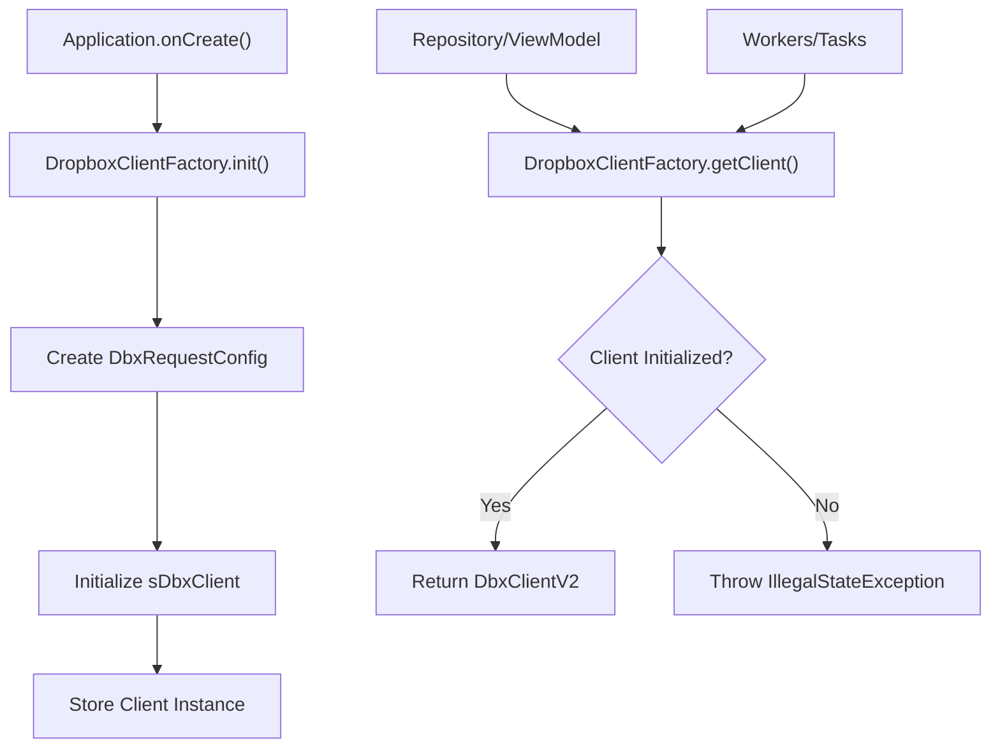
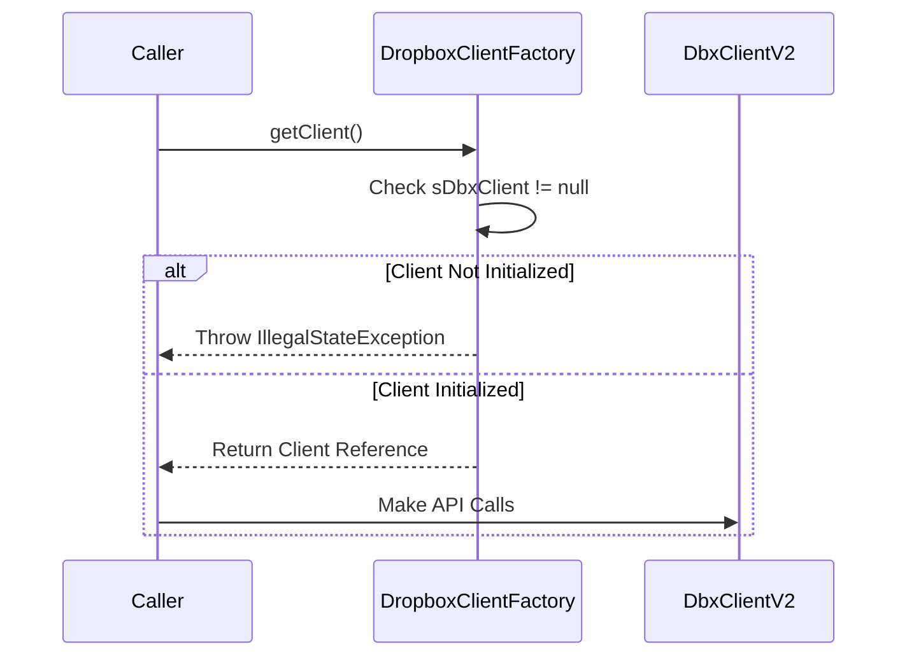

# DropboxClientFactory

<cite>
**Referenced Files in This Document**   
- [DropboxClientFactory.kt](file://app/src/main/java/com/example/b1void/utils/DropboxClientFactory.kt)
- [B1VoidApplication.kt](file://app/src/main/java/com/example/b1void/B1VoidApplication.kt)
- [DropboxUploadWorker.kt](file://app/src/main/java/com/example/b1void/workers/DropboxUploadWorker.kt)
</cite>

## Table of Contents
1. [Introduction](#introduction)
2. [Core Components](#core-components)
3. [Architecture Overview](#architecture-overview)
4. [Detailed Component Analysis](#detailed-component-analysis)
5. [Usage Examples](#usage-examples)
6. [Common Issues and Troubleshooting](#common-issues-and-troubleshooting)
7. [Conclusion](#conclusion)

## Introduction
The `DropboxClientFactory` is a singleton object responsible for managing the lifecycle of the `DbxClientV2` instance used to interact with the Dropbox API throughout the application. It ensures that only one client instance is created and shared across components, preventing redundant initializations and enforcing proper usage sequence through initialization checks. This document provides comprehensive documentation on its structure, functionality, thread-safety guarantees, configuration details, and integration patterns.

## Core Components

[In-depth analysis of core components with code snippets and explanations]

**Section sources**
- [DropboxClientFactory.kt](file://app/src/main/java/com/example/b1void/utils/DropboxClientFactory.kt#L5-L22)

## Architecture Overview



**Diagram sources**
- [DropboxClientFactory.kt](file://app/src/main/java/com/example/b1void/utils/DropboxClientFactory.kt#L5-L22)
- [B1VoidApplication.kt](file://app/src/main/java/com/example/b1void/B1VoidApplication.kt#L21-L25)

## Detailed Component Analysis

### DropboxClientFactory Object Analysis

#### Class Diagram
```mermaid
classDiagram
class DropboxClientFactory {
-sDbxClient : DbxClientV2?
+init(accessToken : String) : Unit
+getClient() : DbxClientV2
}
note right of DropboxClientFactory
Singleton object ensuring single instance
Thread-safe by Kotlin object declaration
Initializes client with 'b1void/1.0' user agent
end note
```

**Diagram sources**
- [DropboxClientFactory.kt](file://app/src/main/java/com/example/b1void/utils/DropboxClientFactory.kt#L5-L22)

#### Initialization Flowchart
```mermaid
flowchart TD
Start([init(accessToken)]) --> CheckNull{"sDbxClient == null?"}
CheckNull --> |Yes| CreateConfig["Create DbxRequestConfig<br/>with 'b1void/1.0'"]
CreateConfig --> InitClient["Initialize sDbxClient<br/>with config & token"]
InitClient --> Store["Store in private field"]
CheckNull --> |No| Skip["Skip initialization"]
Store --> End([Client Ready])
Skip --> End
```

**Diagram sources**
- [DropboxClientFactory.kt](file://app/src/main/java/com/example/b1void/utils/DropboxClientFactory.kt#L9-L14)

#### Client Retrieval Sequence


**Diagram sources**
- [DropboxClientFactory.kt](file://app/src/main/java/com/example/b1void/utils/DropboxClientFactory.kt#L16-L21)

**Section sources**
- [DropboxClientFactory.kt](file://app/src/main/java/com/example/b1void/utils/DropboxClientFactory.kt#L5-L22)

### Configuration and Thread Safety

The `DbxRequestConfig` is initialized within the `init()` method using a builder pattern with the custom user agent string `'b1void/1.0'`. This identifier helps Dropbox track API usage from this specific application. The configuration object plays a critical role in all subsequent API communications by defining request behavior, headers, and connection settings.

Kotlin's `object` declaration inherently provides lazy, thread-safe singleton instantiation. The `DropboxClientFactory` benefits from this language feature, ensuring that:
- The object is instantiated only when first accessed
- Multiple threads cannot create duplicate instances
- No additional synchronization code is required
- Initialization happens exactly once across the entire application lifecycle

This eliminates race conditions during client creation and guarantees consistent access to the same `DbxClientV2` instance from any thread or component.

**Section sources**
- [DropboxClientFactory.kt](file://app/src/main/java/com/example/b1void/utils/DropboxClientFactory.kt#L5-L22)

## Usage Examples

### Application-Level Initialization
The factory must be initialized early in the application lifecycle, typically within the custom `Application` class's `onCreate()` method. This ensures the client is available before any other components attempt to retrieve it.

```kotlin
override fun onCreate() {
    super.onCreate()
    setupGlideOptimization()
    DropboxClientFactory.init("YOUR_ACCESS_TOKEN")
}
```

**Section sources**
- [B1VoidApplication.kt](file://app/src/main/java/com/example/b1void/B1VoidApplication.kt#L21-L25)

### Repository or ViewModel Access
Once initialized, any repository class or ViewModel can safely retrieve the client instance to perform Dropbox operations:

```kotlin
val dbxClient = DropboxClientFactory.getClient()
// Use client for file operations, folder listing, etc.
```

### Worker Integration Example
Background workers such as `DropboxUploadWorker` rely on the factory to obtain the authenticated client without handling initialization logic:

```kotlin
val dbxClient: DbxClientV2 = DropboxClientFactory.getClient()
withContext(Dispatchers.IO) {
    val inputStream = FileInputStream(file)
    dbxClient.files().uploadBuilder(dropboxPath)
        .withMode(WriteMode.OVERWRITE)
        .uploadAndFinish(inputStream)
}
```

**Section sources**
- [DropboxUploadWorker.kt](file://app/src/main/java/com/example/b1void/workers/DropboxUploadWorker.kt#L21-L49)

## Common Issues and Troubleshooting

### Uninitialized Client Exception
If `getClient()` is called before `init()`, an `IllegalStateException` with message *"Client not initialized. Call init() first."* will be thrown. To prevent this:
- Ensure `init()` is called in `Application.onCreate()`
- Verify token availability before initialization
- Consider wrapping access in try-catch blocks in development

### Token Management Considerations
While the current implementation uses a hardcoded placeholder token (`"YOUR_ACCESS_TOKEN"`), production applications should:
- Retrieve tokens securely from encrypted storage
- Handle token expiration and refresh mechanisms
- Implement logout functionality that clears stored tokens
- Provide fallback authentication flows when tokens are invalid

### Best Practices
- Initialize the factory as early as possible
- Never call `init()` multiple times (it's idempotent but unnecessary)
- Always check for exceptions when retrieving the client
- Use dependency injection frameworks in larger applications for better testability

**Section sources**
- [DropboxClientFactory.kt](file://app/src/main/java/com/example/b1void/utils/DropboxClientFactory.kt#L16-L21)
- [B1VoidApplication.kt](file://app/src/main/java/com/example/b1void/B1VoidApplication.kt#L21-L25)

## Conclusion
The `DropboxClientFactory` serves as the sole entry point for Dropbox API interactions in the application, providing a clean, safe, and efficient way to manage the `DbxClientV2` instance. Its design leverages Kotlin's singleton capabilities for thread safety, enforces proper initialization order, and centralizes client configuration. By following the documented usage patterns, developers can ensure reliable access to Dropbox services while avoiding common pitfalls related to client lifecycle management.