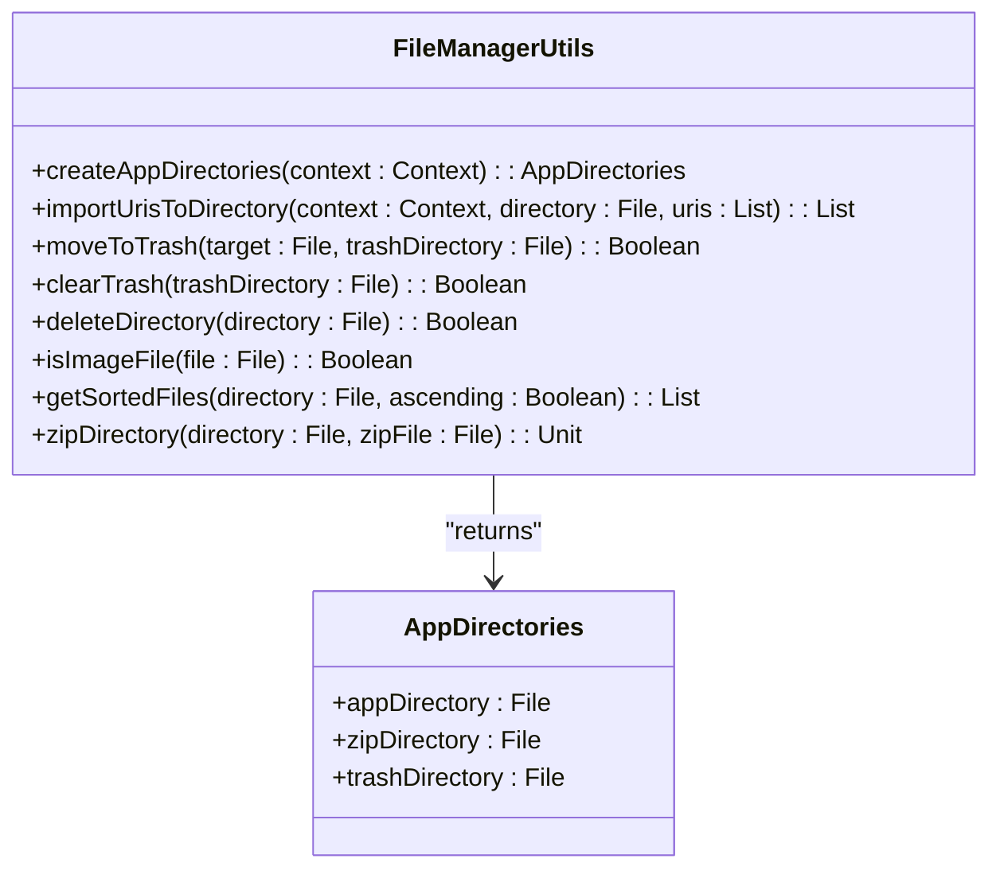
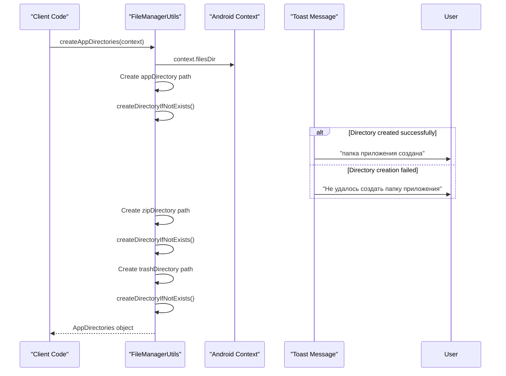
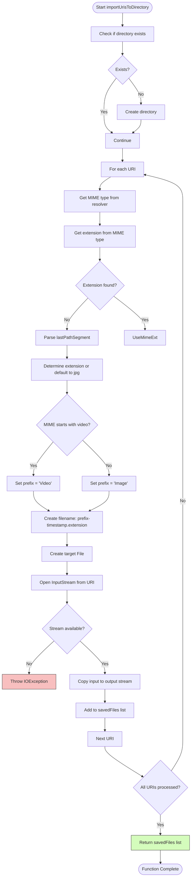
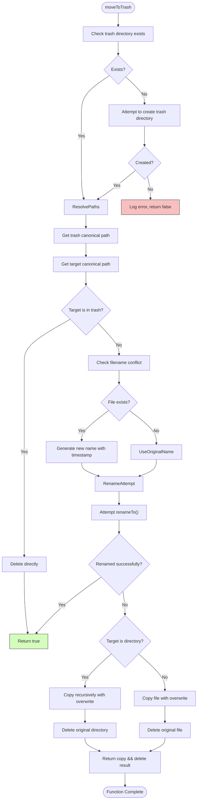
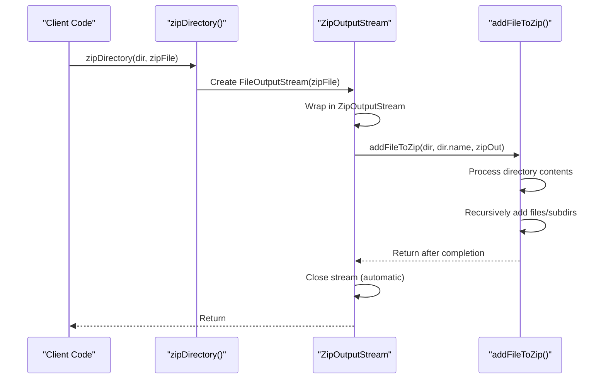

# FileManagerUtils

<cite>
**Referenced Files in This Document**   
- [FileManagerUtils.kt](file://app/src/main/java/com/example/b1void/utils/FileManagerUtils.kt)
- [FileManagerActivity.kt](file://app/src/main/java/com/example/b1void/activities/FileManagerActivity.kt)
- [ShareImportActivity.kt](file://app/src/main/java/com/example/b1void/activities/ShareImportActivity.kt)
</cite>

## Table of Contents
1. [Introduction](#introduction)
2. [Core Components](#core-components)
3. [AppDirectories Data Class](#appdirectories-data-class)
4. [Directory Management](#directory-management)
5. [File Import and Export](#file-import-and-export)
6. [Trash Management System](#trash-management-system)
7. [File Operations](#file-operations)
8. [Sorting and Filtering](#sorting-and-filtering)
9. [ZIP Archive Creation](#zip-archive-creation)
10. [Error Handling and Security](#error-handling-and-security)
11. [Usage Examples](#usage-examples)

## Introduction

The `FileManagerUtils` utility object provides a comprehensive set of file system operations for the Inspector application. Designed as a Kotlin singleton object, it offers static methods for managing application directories, importing media from external sources, handling trash operations, and performing various file manipulations. The utility is extensively used throughout the application, particularly in the `FileManagerActivity` and `ShareImportActivity`, to ensure consistent file management across different components of the app.

The core functionality revolves around creating and maintaining the application's directory structure, safely moving files to and from a designated trash folder, importing shared content from other applications, and providing helper methods for common file operations like sorting and type detection. All operations include appropriate error handling and user feedback through Toast messages, ensuring a robust user experience even when file system operations encounter issues.

**Section sources**
- [FileManagerUtils.kt](file://app/src/main/java/com/example/b1void/utils/FileManagerUtils.kt#L1-L20)

## Core Components

The `FileManagerUtils` object contains several key components that work together to provide a complete file management solution. At its core is the `AppDirectories` data class that encapsulates the main application directories, along with a suite of utility functions that perform specific file operations. These components are designed to be used independently but can also work together to create complex file workflows.

The utility follows Android best practices by using the application's private files directory for storing app-specific data, ensuring that files are properly isolated from other applications. It leverages Android's ContentResolver for accessing shared content from other apps, handles file permissions gracefully, and provides fallback mechanisms when direct file operations fail.



**Diagram sources**
- [FileManagerUtils.kt](file://app/src/main/java/com/example/b1void/utils/FileManagerUtils.kt#L15-L248)

**Section sources**
- [FileManagerUtils.kt](file://app/src/main/java/com/example/b1void/utils/FileManagerUtils.kt#L15-L248)

## AppDirectories Data Class

The `AppDirectories` data class serves as a container for the three primary directories used by the application. It is returned by the `createAppDirectories` function and provides a structured way to access the application's main folder, ZIP archive storage, and trash directory. This approach eliminates the need to repeatedly construct directory paths throughout the application code.

The data class contains three immutable properties:
- `appDirectory`: The main application folder where user-created files and folders are stored
- `zipDirectory`: A dedicated folder for storing ZIP archives created by the application
- `trashDirectory`: A special folder within the main application directory used as a temporary holding area for deleted files

By returning these directories as a single object, the utility ensures that all components of the application use consistent directory paths, reducing the risk of errors and making the code more maintainable.

**Section sources**
- [FileManagerUtils.kt](file://app/src/main/java/com/example/b1void/utils/FileManagerUtils.kt#L17-L22)

## Directory Management

### createAppDirectories Function

The `createAppDirectories` function initializes the application's directory structure by creating the main app folder, ZIP folder, and trash directory. It takes an Android `Context` as a parameter and returns an `AppDirectories` object containing references to all created directories.

The function creates directories in the application's private files directory (`context.filesDir`) to ensure they are properly sandboxed. The main application directory is named "InspectorAppFolder", the ZIP directory is "zipFolder", and the trash directory is located within the main app folder as "Trash". For each directory creation, the function calls the private `createDirectoryIfNotExists` helper method, which includes error handling and user feedback.



**Diagram sources**
- [FileManagerUtils.kt](file://app/src/main/java/com/example/b1void/utils/FileManagerUtils.kt#L24-L35)

**Section sources**
- [FileManagerUtils.kt](file://app/src/main/java/com/example/b1void/utils/FileManagerUtils.kt#L24-L35)
- [FileManagerUtils.kt](file://app/src/main/java/com/example/b1void/utils/FileManagerUtils.kt#L76-L92)

### createDirectoryIfNotExists Helper

The private `createDirectoryIfNotExists` function is a critical helper method that safely creates directories with proper error handling. It attempts to create the specified directory and provides immediate user feedback through Toast messages in multiple languages (Russian in the current implementation).

The method includes comprehensive exception handling for both `SecurityException` and `IOException`, displaying appropriate error messages when directory creation fails due to permission issues or I/O problems. This defensive programming approach ensures that the application remains stable even when file system operations encounter unexpected conditions.

**Section sources**
- [FileManagerUtils.kt](file://app/src/main/java/com/example/b1void/utils/FileManagerUtils.kt#L76-L92)

## File Import and Export

### importUrisToDirectory Function

The `importUrisToDirectory` function enables the application to import files from external sources through Android's content sharing mechanism. It accepts a list of `Uri` objects representing content from other applications (such as photos from a gallery app) and copies them to a specified target directory.

The function intelligently determines file extensions by first checking the MIME type through the `ContentResolver`, falling back to parsing the URI path if necessary. Files are automatically named with prefixes indicating their type ("Image-" or "Video-") followed by a timestamp to ensure uniqueness. The method uses input and output streams to copy data efficiently while including comprehensive error handling for cases where the input stream cannot be opened.



**Diagram sources**
- [FileManagerUtils.kt](file://app/src/main/java/com/example/b1void/utils/FileManagerUtils.kt#L37-L74)

**Section sources**
- [FileManagerUtils.kt](file://app/src/main/java/com/example/b1void/utils/FileManagerUtils.kt#L37-L74)

## Trash Management System

### moveToTrash Function

The `moveToTrash` function implements a safe file deletion mechanism by moving files and directories to a designated trash folder rather than permanently deleting them immediately. This allows users to recover accidentally deleted items and provides a more user-friendly experience.

The function includes sophisticated conflict resolution by checking if a file with the same name already exists in the trash. If a conflict is detected, it generates a new filename by appending a timestamp to ensure uniqueness. The method first attempts to rename (move) the file, which is the most efficient operation, but falls back to copying and then deleting if the rename operation fails (which can happen across different filesystems).

A key feature is the canonical path resolution, which prevents security vulnerabilities by resolving symbolic links and ensuring that files cannot be moved outside the intended trash directory. The function also includes special handling to prevent moving the trash directory itself into the trash.



**Diagram sources**
- [FileManagerUtils.kt](file://app/src/main/java/com/example/b1void/utils/FileManagerUtils.kt#L94-L145)

**Section sources**
- [FileManagerUtils.kt](file://app/src/main/java/com/example/b1void/utils/FileManagerUtils.kt#L94-L145)

### clearTrash Function

The `clearTrash` function permanently deletes all contents of the trash directory, effectively emptying the trash. It recursively processes all files and subdirectories within the trash folder, attempting to delete each item individually.

The function continues processing even if some deletions fail, collecting all failures in a log message while returning a boolean indicating overall success. This approach ensures that as much content as possible is cleared, even if certain files are temporarily locked or have permission issues. If the trash directory itself doesn't exist, the function attempts to recreate it, which helps maintain the expected directory structure.

**Section sources**
- [FileManagerUtils.kt](file://app/src/main/java/com/example/b1void/utils/FileManagerUtils.kt#L147-L175)

## File Operations

### deleteDirectory Function

The `deleteDirectory` function recursively deletes a directory and all its contents. It traverses the directory tree depth-first, ensuring that files are deleted before their parent directories. For each file, it attempts deletion and immediately returns false if any single file cannot be removed, providing clear feedback about the operation's success.

This function is used as part of the trash management system and for direct directory deletion when appropriate. Its recursive nature makes it suitable for removing entire folder hierarchies regardless of complexity.

**Section sources**
- [FileManagerUtils.kt](file://app/src/main/java/com/example/b1void/utils/FileManagerUtils.kt#L177-L192)

### isImageFile Function

The `isImageFile` function provides a simple way to determine if a given file is likely to be an image based on its filename extension. It checks for common image formats including JPG, JPEG, PNG, GIF, and BMP by performing case-insensitive comparisons on the lowercase filename.

This utility function is used in the file manager interface to determine how to display files and what actions are appropriate (e.g., showing image previews). While not foolproof (as file extensions can be changed), it provides a reliable heuristic for most use cases.

**Section sources**
- [FileManagerUtils.kt](file://app/src/main/java/com/example/b1void/utils/FileManagerUtils.kt#L194-L201)

## Sorting and Filtering

### getSortedFiles Function

The `getSortedFiles` function retrieves all files from a specified directory and returns them sorted by modification time. It accepts a boolean parameter to control sort order (ascending or descending), allowing clients to choose between showing oldest or newest files first.

The function safely handles cases where the directory cannot be listed (returning an empty list) and uses Kotlin's built-in sorting functions for efficiency. This method is essential for providing a consistent user experience in the file manager interface, where files are typically displayed with the most recently modified items at the top.

**Section sources**
- [FileManagerUtils.kt](file://app/src/main/java/com/example/b1void/utils/FileManagerUtils.kt#L203-L210)

## ZIP Archive Creation

### zipDirectory Function

The `zipDirectory` function creates a ZIP archive from a directory and all its contents. It uses Java's `ZipOutputStream` to write the archive and delegates the recursive file processing to the `addFileToZip` helper method.

The function employs Kotlin's `use` syntax to ensure proper resource management, automatically closing the `ZipOutputStream` even if an exception occurs during the archiving process. This prevents resource leaks and ensures that partial archives are not left open.



**Diagram sources**
- [FileManagerUtils.kt](file://app/src/main/java/com/example/b1void/utils/FileManagerUtils.kt#L212-L216)

**Section sources**
- [FileManagerUtils.kt](file://app/src/main/java/com/example/b1void/utils/FileManagerUtils.kt#L212-L216)

### addFileToZip Helper

The private `addFileToZip` function handles the recursive traversal of a directory structure and adds each file to the ZIP output stream. It skips hidden files, properly handles directory entries by adding trailing slashes, and reads file data in chunks to manage memory usage efficiently.

For directories, it creates appropriate ZIP entries and recursively processes child files. For regular files, it creates a `ZipEntry`, writes the file data in 1KB chunks, and ensures proper stream management. This helper method is the workhorse of the ZIP creation functionality, implementing the core logic needed to package directory hierarchies into compressed archives.

**Section sources**
- [FileManagerUtils.kt](file://app/src/main/java/com/example/b1void/utils/FileManagerUtils.kt#L218-L247)

## Error Handling and Security

The `FileManagerUtils` implementation demonstrates robust error handling and security practices throughout its codebase. Key strategies include:

1. **Comprehensive Exception Handling**: Multiple try-catch blocks handle `SecurityException`, `IOException`, and general `Exception` types, preventing crashes and providing meaningful error messages.

2. **Canonical Path Resolution**: When moving files to trash, the function resolves canonical paths to prevent directory traversal attacks and ensure files are moved to the intended location.

3. **Graceful Degradation**: When direct operations fail (like `renameTo`), the utility falls back to alternative approaches (copy then delete) rather than failing outright.

4. **Resource Management**: Kotlin's `use` syntax ensures that streams and other resources are properly closed, preventing memory leaks.

5. **User Feedback**: Toast messages provide immediate feedback for both successful operations and errors, keeping users informed about what's happening.

6. **Validation**: Input validation checks for null values, existing files, and proper directory structures before performing operations.

These practices ensure that the file management system remains stable and secure even when encountering unexpected conditions or malicious inputs.

**Section sources**
- [FileManagerUtils.kt](file://app/src/main/java/com/example/b1void/utils/FileManagerUtils.kt#L76-L92)
- [FileManagerUtils.kt](file://app/src/main/java/com/example/b1void/utils/FileManagerUtils.kt#L94-L145)
- [FileManagerUtils.kt](file://app/src/main/java/com/example/b1void/utils/FileManagerUtils.kt#L147-L175)

## Usage Examples

### Importing Shared Media

When the application receives shared content from other apps (photos, videos, etc.), it uses the following workflow:

```kotlin
// In ShareImportActivity
lifecycleScope.launch {
    val directories = FileManagerUtils.createAppDirectories(this@ShareImportActivity)
    val targetDirectory = directories.appDirectory
    val savedFiles = FileManagerUtils.importUrisToDirectory(
        this@ShareImportActivity, 
        targetDirectory, 
        uris
    )
}
```

This sequence ensures that the application directories exist, imports the shared content with automatic naming, and provides user feedback on the import status.

### Managing File Lifecycle

In the `FileManagerActivity`, the utility is used to implement the complete file lifecycle:

```kotlin
// Deleting a file
fun deleteFile(file: File) {
    val movedToTrash = FileManagerUtils.moveToTrash(file, trashDirectory)
}

// Emptying trash
private fun clearTrashDirectory() {
    val cleared = FileManagerUtils.clearTrash(trashDirectory)
}

// Sharing a directory as ZIP
private fun shareFile(file: File) {
    FileManagerUtils.zipDirectory(file, zipFile)
}
```

These examples demonstrate how the `FileManagerUtils` functions are integrated into the application's UI components to provide a seamless file management experience.

**Section sources**
- [ShareImportActivity.kt](file://app/src/main/java/com/example/b1void/activities/ShareImportActivity.kt#L40-L55)
- [FileManagerActivity.kt](file://app/src/main/java/com/example/b1void/activities/FileManagerActivity.kt#L350-L355)
- [FileManagerActivity.kt](file://app/src/main/java/com/example/b1void/activities/FileManagerActivity.kt#L375-L385)