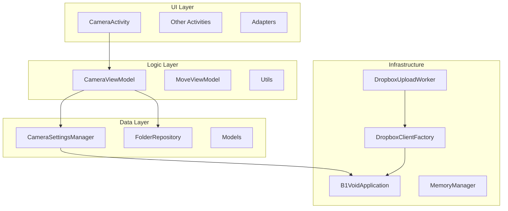
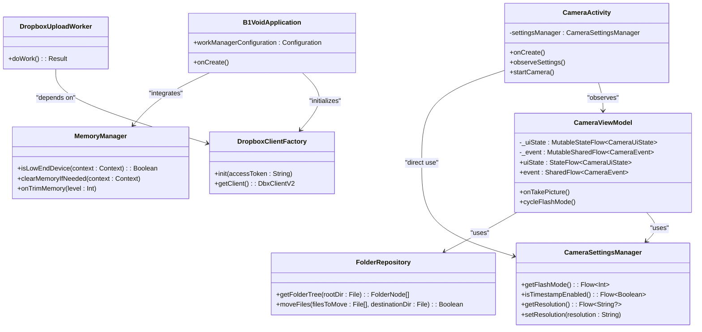
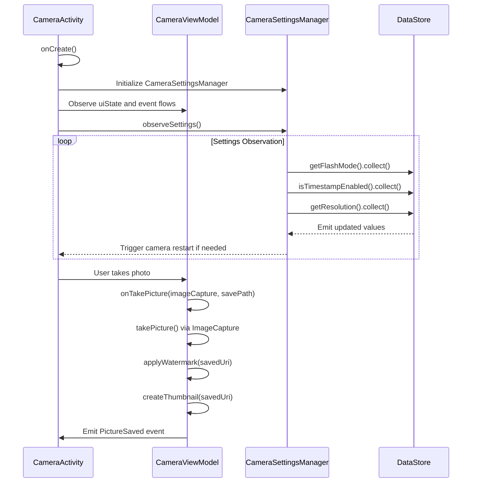
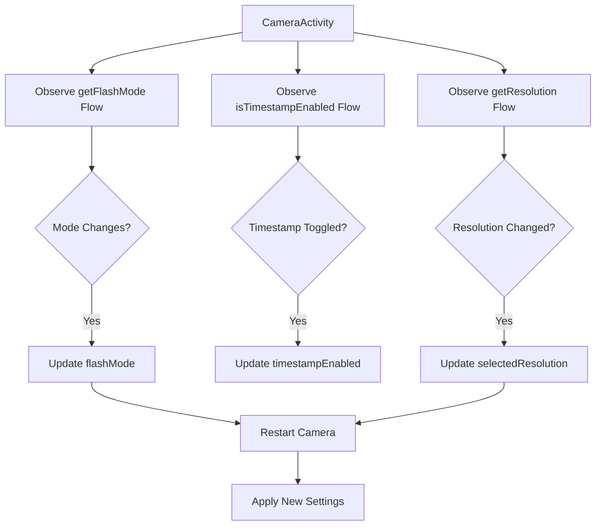
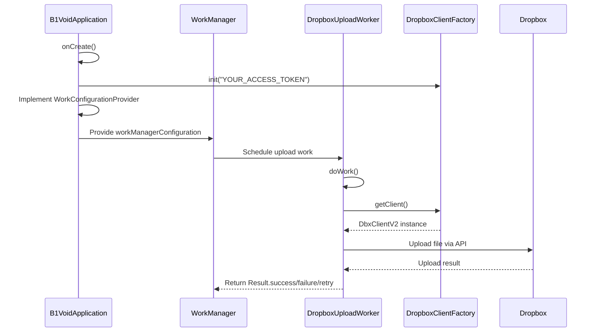
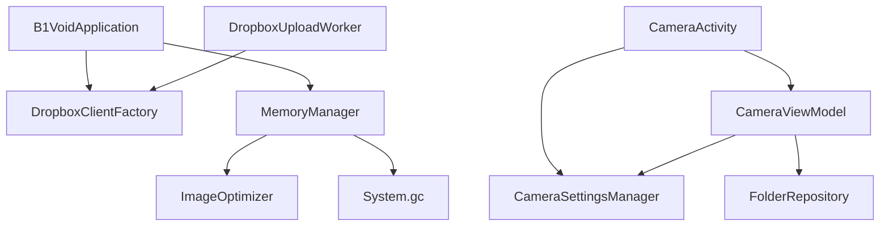

# Architecture Overview

<cite>
**Referenced Files in This Document**   
- [CameraActivity.kt](file://app/src/main/java/com/example/b1void/activities/CameraActivity.kt)
- [CameraViewModel.kt](file://app/src/main/java/com/example/b1void/viewmodels/CameraViewModel.kt)
- [CameraSettingsManager.kt](file://app/src/main/java/com/example/b1void/data/CameraSettingsManager.kt)
- [FolderRepository.kt](file://app/src/main/java/com/example/b1void/data/FolderRepository.kt)
- [B1VoidApplication.kt](file://app/src/main/java/com/example/b1void/B1VoidApplication.kt)
- [DropboxUploadWorker.kt](file://app/src/main/java/com/example/b1void/workers/DropboxUploadWorker.kt)
- [DropboxClientFactory.kt](file://app/src/main/java/com/example/b1void/utils/DropboxClientFactory.kt)
- [MemoryManager.kt](file://app/src/main/java/com/example/b1void/utils/MemoryManager.kt)
</cite>

## Table of Contents
1. [Introduction](#introduction)
2. [Project Structure](#project-structure)
3. [Core Components](#core-components)
4. [Architecture Overview](#architecture-overview)
5. [Detailed Component Analysis](#detailed-component-analysis)
6. [Dependency Analysis](#dependency-analysis)
7. [Performance Considerations](#performance-considerations)
8. [Troubleshooting Guide](#troubleshooting-guide)
9. [Conclusion](#conclusion)

## Introduction
The V1 application implements a clean, layered architecture based on the MVVM (Model-View-ViewModel) pattern, designed for maintainability and separation of concerns. The system is structured into distinct layers: UI components (Activities and Fragments), ViewModel classes managing UI state and logic, and Repository/Data classes handling persistent storage and external service integration. Key design patterns such as Singleton, Observer via Kotlin Flow and coroutines, and the Repository pattern are employed throughout the codebase. The application integrates with external services like Dropbox and Firebase, manages background operations through WorkManager, and includes robust mechanisms for memory management and permission handling.

## Project Structure
The project follows a feature-based package organization within the main source directory. Core architectural layers are separated into distinct packages:
- `activities`: Contains UI controllers (Activities) that serve as Views in the MVVM pattern
- `viewmodels`: Houses ViewModel classes responsible for UI state management
- `data`: Includes data managers and repositories for persistent configuration and file operations
- `utils`: Utility classes including singletons for global services and memory optimization
- `workers`: Background workers managed by WorkManager for asynchronous tasks
- `adapters`, `ui`, `cameraFun`: Supporting components for UI rendering and camera functionality
- `models`: Data model definitions used across layers

This structure enforces clear boundaries between presentation, business logic, and data access concerns.

**Diagram sources**
- [CameraActivity.kt](file://app/src/main/java/com/example/b1void/activities/CameraActivity.kt)
- [CameraViewModel.kt](file://app/src/main/java/com/example/b1void/viewmodels/CameraViewModel.kt)
- [CameraSettingsManager.kt](file://app/src/main/java/com/example/b1void/data/CameraSettingsManager.kt)
- [FolderRepository.kt](file://app/src/main/java/com/example/b1void/data/FolderRepository.kt)
- [B1VoidApplication.kt](file://app/src/main/java/com/example/b1void/B1VoidApplication.kt)
- [DropboxUploadWorker.kt](file://app/src/main/java/com/example/b1void/workers/DropboxUploadWorker.kt)
- [DropboxClientFactory.kt](file://app/src/main/java/com/example/b1void/utils/DropboxClientFactory.kt)
- [MemoryManager.kt](file://app/src/main/java/com/example/b1void/utils/MemoryManager.kt)

**Section sources**
- [CameraActivity.kt](file://app/src/main/java/com/example/b1void/activities/CameraActivity.kt)
- [build.gradle.kts](file://app/build.gradle.kts)

## Core Components
The application's core functionality revolves around camera operations, file management, and cloud synchronization. The primary entry point for camera features is `CameraActivity`, which observes state from `CameraViewModel` and interacts with `CameraSettingsManager` for persistent configuration storage using Android DataStore. The `FolderRepository` class provides data access methods for file system operations, while background uploads to Dropbox are handled by `DropboxUploadWorker`. Global application configuration and initialization occur in `B1VoidApplication`, which also serves as the WorkManager configuration provider.

**Section sources**
- [CameraActivity.kt](file://app/src/main/java/com/example/b1void/activities/CameraActivity.kt)
- [CameraViewModel.kt](file://app/src/main/java/com/example/b1void/viewmodels/CameraViewModel.kt)
- [CameraSettingsManager.kt](file://app/src/main/java/com/example/b1void/data/CameraSettingsManager.kt)

## Architecture Overview
The V1 application employs a strict MVVM architecture where Activities act as Views, ViewModels manage UI-related data and state, and Repository classes encapsulate data access logic. This separation ensures testability and maintainability. The `CameraActivity` serves as the View, observing LiveData or StateFlow from `CameraViewModel` which exposes UI state through `uiState` and events through `event` properties. The ViewModel interacts with `CameraSettingsManager` to persist user preferences using DataStore, leveraging Kotlin Flow for reactive updates. File operations are abstracted behind `FolderRepository`, implementing the Repository pattern to decouple business logic from data source implementation details.

External service integration is managed through dedicated utility classes like `DropboxClientFactory`, which implements the Singleton pattern to provide a globally accessible Dropbox client instance. Background processing is orchestrated by WorkManager, with `DropboxUploadWorker` handling asynchronous file uploads. The system handles cross-cutting concerns such as memory management through `MemoryManager`, which monitors device resources and triggers cleanup when necessary.

**Diagram sources**
- [CameraActivity.kt](file://app/src/main/java/com/example/b1void/activities/CameraActivity.kt)
- [CameraViewModel.kt](file://app/src/main/java/com/example/b1void/viewmodels/CameraViewModel.kt)
- [CameraSettingsManager.kt](file://app/src/main/java/com/example/b1void/data/CameraSettingsManager.kt)
- [FolderRepository.kt](file://app/src/main/java/com/example/b1void/data/FolderRepository.kt)
- [B1VoidApplication.kt](file://app/src/main/java/com/example/b1void/B1VoidApplication.kt)
- [DropboxUploadWorker.kt](file://app/src/main/java/com/example/b1void/workers/DropboxUploadWorker.kt)
- [DropboxClientFactory.kt](file://app/src/main/java/com/example/b1void/utils/DropboxClientFactory.kt)
- [MemoryManager.kt](file://app/src/main/java/com/example/b1void/utils/MemoryManager.kt)

## Detailed Component Analysis

### Camera Functionality Analysis
The camera subsystem demonstrates the MVVM pattern in action, with clear separation between UI, state management, and data persistence. `CameraActivity` acts as the View, responsible for UI rendering and user interaction, while `CameraViewModel` manages the UI state and coordinates operations.

#### MVVM Interaction Flow

**Diagram sources**
- [CameraActivity.kt](file://app/src/main/java/com/example/b1void/activities/CameraActivity.kt)
- [CameraViewModel.kt](file://app/src/main/java/com/example/b1void/viewmodels/CameraViewModel.kt)
- [CameraSettingsManager.kt](file://app/src/main/java/com/example/b1void/data/CameraSettingsManager.kt)

#### Data Persistence with DataStore
The `CameraSettingsManager` class uses Android DataStore with Kotlin Flow to provide reactive access to camera settings. This implementation follows the Observer pattern, allowing the UI to automatically update when settings change without explicit refresh calls.

**Diagram sources**
- [CameraSettingsManager.kt](file://app/src/main/java/com/example/b1void/data/CameraSettingsManager.kt)
- [CameraActivity.kt](file://app/src/main/java/com/example/b1void/activities/CameraActivity.kt)

**Section sources**
- [CameraSettingsManager.kt](file://app/src/main/java/com/example/b1void/data/CameraSettingsManager.kt)
- [CameraActivity.kt](file://app/src/main/java/com/example/b1void/activities/CameraActivity.kt)

### Background Processing Analysis
The application uses WorkManager for reliable background execution of tasks such as file synchronization with cloud services.

#### WorkManager Integration

**Diagram sources**
- [B1VoidApplication.kt](file://app/src/main/java/com/example/b1void/B1VoidApplication.kt)
- [DropboxUploadWorker.kt](file://app/src/main/java/com/example/b1void/workers/DropboxUploadWorker.kt)
- [DropboxClientFactory.kt](file://app/src/main/java/com/example/b1void/utils/DropboxClientFactory.kt)

**Section sources**
- [B1VoidApplication.kt](file://app/src/main/java/com/example/b1void/B1VoidApplication.kt)
- [DropboxUploadWorker.kt](file://app/src/main/java/com/example/b1void/workers/DropboxUploadWorker.kt)

## Dependency Analysis
The application exhibits well-defined dependencies between components, following dependency inversion principles where higher-level modules depend on abstractions rather than concrete implementations. The dependency graph shows a clear hierarchy from UI to data layers, with utility classes providing cross-cutting services.

**Diagram sources**
- [B1VoidApplication.kt](file://app/src/main/java/com/example/b1void/B1VoidApplication.kt)
- [DropboxClientFactory.kt](file://app/src/main/java/com/example/b1void/utils/DropboxClientFactory.kt)
- [MemoryManager.kt](file://app/src/main/java/com/example/b1void/utils/MemoryManager.kt)
- [CameraActivity.kt](file://app/src/main/java/com/example/b1void/activities/CameraActivity.kt)
- [CameraViewModel.kt](file://app/src/main/java/com/example/b1void/viewmodels/CameraViewModel.kt)
- [CameraSettingsManager.kt](file://app/src/main/java/com/example/b1void/data/CameraSettingsManager.kt)
- [FolderRepository.kt](file://app/src/main/java/com/example/b1void/data/FolderRepository.kt)
- [DropboxUploadWorker.kt](file://app/src/main/java/com/example/b1void/workers/DropboxUploadWorker.kt)

## Performance Considerations
The application incorporates several performance optimizations, particularly for low-end devices. The `MemoryManager` class monitors available memory and triggers cleanup operations when thresholds are crossed. It responds to system trim memory events at various levels, from moderate pressure to critical conditions, ensuring efficient resource utilization.

Image handling is optimized through Glide configuration in `B1VoidApplication`, with customized memory and disk cache settings. The application also configures multi-dex support and ABI filters in the build configuration to optimize APK size and performance across different device architectures.

For weak devices, the system dynamically adjusts settings such as image quality, maximum image size, cache size, and animation usage based on available resources, providing a degraded but functional experience on lower-end hardware.

## Troubleshooting Guide
Common issues in the application typically relate to permissions, camera availability, or network connectivity for cloud services. The `CameraActivity` requests CAMERA and RECORD_AUDIO permissions at runtime and gracefully handles denial by showing appropriate messages and closing the activity.

Memory-related issues are mitigated through the `MemoryManager` which logs warnings and errors at different trim memory levels and proactively clears caches when available memory falls below the threshold defined in `B1VoidApplication.LOW_MEMORY_THRESHOLD`.

Background worker failures, particularly `DropboxUploadWorker`, implement retry logic for transient network issues (DbxException) while failing permanently for other exceptions. Developers should check logcat for entries tagged with "DropboxUploadWorker" when investigating upload failures.

Camera initialization problems may occur due to binding failures, which are logged with the tag "CameraActivity". These can be caused by unavailable camera resources or permission issues.

**Section sources**
- [MemoryManager.kt](file://app/src/main/java/com/example/b1void/utils/MemoryManager.kt)
- [CameraActivity.kt](file://app/src/main/java/com/example/b1void/activities/CameraActivity.kt)
- [DropboxUploadWorker.kt](file://app/src/main/java/com/example/b1void/workers/DropboxUploadWorker.kt)
- [B1VoidApplication.kt](file://app/src/main/java/com/example/b1void/B1VoidApplication.kt)

## Conclusion
The V1 application demonstrates a well-architected Android application following modern best practices. The MVVM pattern provides clear separation of concerns between UI, business logic, and data layers. Reactive programming with Kotlin Flow enables efficient state management, while the Repository pattern abstracts data sources. The Singleton pattern is appropriately used for global service access, and WorkManager ensures reliable background execution. Cross-cutting concerns like memory management and permission handling are addressed systematically, making the application robust across different device configurations and usage scenarios.