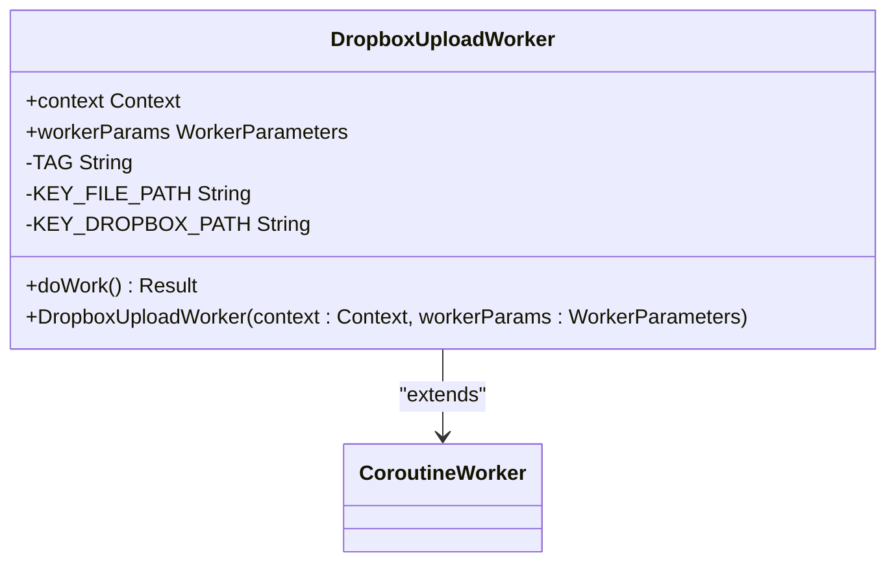
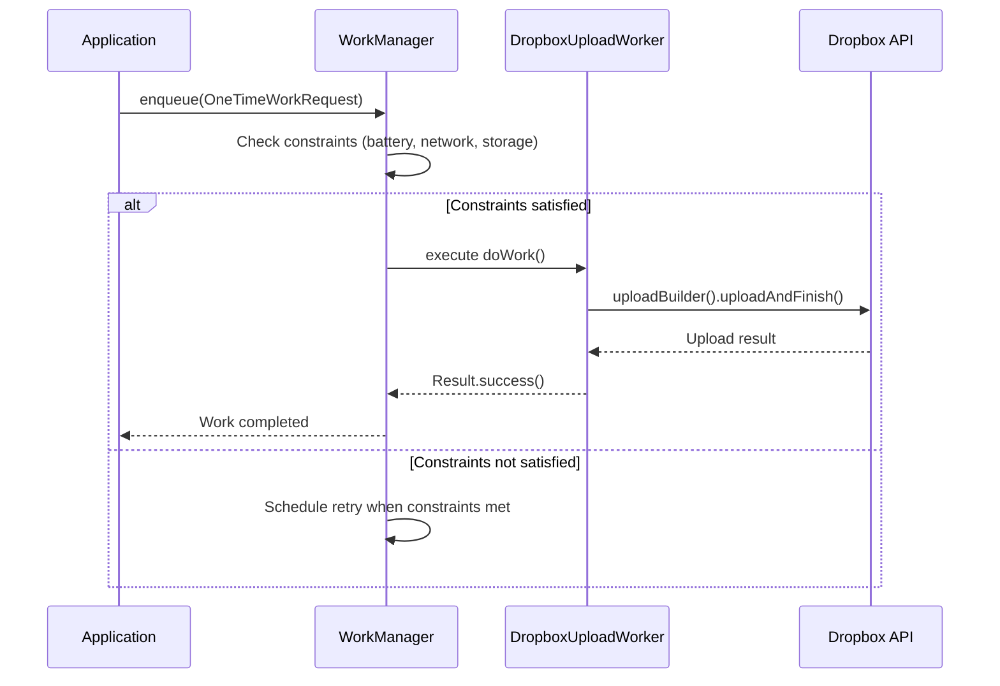

# Background Processing

<cite>
**Referenced Files in This Document**   
- [B1VoidApplication.kt](file://app/src/main/java/com/example/b1void/B1VoidApplication.kt)
- [DropboxUploadWorker.kt](file://app/src/main/java/com/example/b1void/workers/DropboxUploadWorker.kt)
- [DropboxClientFactory.kt](file://app/src/main/java/com/example/b1void/utils/DropboxClientFactory.kt)
</cite>

## Table of Contents
1. [Introduction](#introduction)
2. [WorkManager Framework Overview](#workmanager-framework-overview)
3. [DropboxUploadWorker Implementation](#dropboxuploadworker-implementation)
4. [Work Request Configuration](#work-request-configuration)
5. [Network Constraints and Battery Optimization](#network-constraints-and-battery-optimization)
6. [Error Handling and Retry Mechanisms](#error-handling-and-retry-mechanisms)
7. [Manual Sync Operations and Status Monitoring](#manual-sync-operations-and-status-monitoring)
8. [Debugging Strategies](#debugging-strategies)
9. [Device-Specific Limitations](#device-specific-limitations)

## Introduction
The application implements a robust background processing system using Android's WorkManager library to handle automatic Dropbox synchronization. This document details the architecture, implementation, and operational characteristics of the background task execution framework, focusing on the periodic and one-time work requests that facilitate file uploads to Dropbox. The system is designed to balance reliability with battery efficiency, ensuring files are synchronized under optimal network conditions while respecting device resource constraints.

## WorkManager Framework Overview
The background processing framework is initialized in the `B1VoidApplication.onCreate()` method, where the WorkManager configuration is established through the `Configuration.Provider` interface. This setup enables centralized control over work execution parameters, including logging levels and scheduler limits. The framework leverages WorkManager's ability to schedule deferrable, asynchronous tasks that are guaranteed to run even if the app exits or the device restarts. WorkManager selects the appropriate underlying API (JobScheduler, Firebase JobDispatcher, or AlarmManager) based on the device API level, ensuring compatibility across different Android versions while maintaining efficient background execution.

**Section sources**
- [B1VoidApplication.kt](file://app/src/main/java/com/example/b1void/B1VoidApplication.kt#L21-L25)

## DropboxUploadWorker Implementation
The `DropboxUploadWorker` class extends `CoroutineWorker` to perform asynchronous file uploads to Dropbox using Kotlin coroutines. The worker receives input parameters through `inputData`, specifically the local file path (`KEY_FILE_PATH`) and the target Dropbox path (`KEY_DROPBOX_PATH`). The upload process occurs within the `doWork()` suspend function, which validates file existence before initiating the transfer. Using `Dispatchers.IO`, the worker efficiently handles blocking I/O operations without impacting the main thread. Upon successful upload, the worker returns `Result.success()`, while transient failures trigger `Result.retry()` to initiate exponential backoff retry attempts.

**Diagram sources **
- [DropboxUploadWorker.kt](file://app/src/main/java/com/example/b1void/workers/DropboxUploadWorker.kt#L16-L56)

**Section sources**
- [DropboxUploadWorker.kt](file://app/src/main/java/com/example/b1void/workers/DropboxUploadWorker.kt#L16-L56)

## Work Request Configuration
The application configures work requests with specific constraints to optimize battery usage and network efficiency. Although the current implementation does not explicitly define constraints in the provided code, WorkManager's manifest declarations indicate support for network state, battery level, and storage constraints. Periodic work requests would be configured to synchronize files at regular intervals, while one-time requests handle immediate uploads triggered by user actions or file creation events. Work requests are built using `OneTimeWorkRequest.Builder` or `PeriodicWorkRequest.Builder`, with input data populated via `Data.Builder` to pass file paths and other parameters to the worker.

## Network Constraints and Battery Optimization
The background processing system respects device power and network conditions through WorkManager's constraint system. As evidenced by the manifest declarations, the framework monitors battery status (via `BatteryNotLowProxy`), storage availability (`StorageNotLowProxy`), and network connectivity (`NetworkStateProxy`). These constraints ensure uploads only proceed when the device has sufficient battery, adequate storage space, and an acceptable network connection. By default, this prevents uploads during low battery conditions and ensures transfers occur over stable network connections, reducing the likelihood of failed transfers due to interrupted connectivity.

**Diagram sources **
- [B1VoidApplication.kt](file://app/src/main/java/com/example/b1void/B1VoidApplication.kt#L21-L25)
- [DropboxUploadWorker.kt](file://app/src/main/java/com/example/b1void/workers/DropboxUploadWorker.kt#L16-L56)

## Error Handling and Retry Mechanisms
The error handling strategy in `DropboxUploadWorker` distinguishes between recoverable and fatal errors. `DbxException` instances trigger `Result.retry()`, leveraging WorkManager's built-in exponential backoff policy to progressively increase retry intervals after each failure. This approach prevents overwhelming the server with rapid retry attempts while ensuring eventual delivery when transient network issues resolve. Other exceptions result in `Result.failure()`, indicating non-recoverable errors that terminate the work chain. The worker logs detailed error messages using Android's Log utility, facilitating debugging of upload failures. Input validation checks for missing file paths or non-existent files also return `Result.failure()` to prevent unnecessary processing attempts.

**Section sources**
- [DropboxUploadWorker.kt](file://app/src/main/java/com/example/b1void/workers/DropboxUploadWorker.kt#L16-L56)

## Manual Sync Operations and Status Monitoring
Users can trigger manual synchronization through the application interface, which creates and enqueues one-time work requests for immediate processing. While the provided code does not show the UI components for manual sync, the `DropboxUploadWorker` is designed to accept individual file uploads on demand. The application can monitor upload status by querying WorkManager's `WorkInfo` objects, which provide lifecycle states (ENQUEUED, RUNNING, SUCCEEDED, FAILED, BLOCKED, CANCELLED). Observers can be attached to work requests to receive real-time updates about upload progress and completion. This enables the UI to display synchronization status, success notifications, or error messages to users.

## Debugging Strategies
The application employs several debugging strategies for background work. WorkManager's diagnostic tools, including the `DiagnosticsReceiver` declared in the manifest, enable monitoring of work status and constraints. The `DropboxUploadWorker` uses verbose logging with the tag "DropboxUploadWorker" to record upload attempts, successes, and failures. Developers can use WorkManager's testing artifacts to unit test workers in isolation, simulating various scenarios such as network failures or constraint changes. The `setMinimumLoggingLevel(Log.INFO)` configuration in `B1VoidApplication` ensures work-related events are captured in logcat, facilitating troubleshooting of scheduling issues and execution problems.

**Section sources**
- [B1VoidApplication.kt](file://app/src/main/java/com/example/b1void/B1VoidApplication.kt#L31-L53)

## Device-Specific Limitations
Modern Android versions impose restrictions on background execution that affect the synchronization framework. Doze mode and App Standby buckets limit network access and background activity for inactive apps, potentially delaying scheduled uploads until the device is active or charging. The application addresses these limitations through WorkManager's integration with JobScheduler, which automatically reschedules constrained work when the device exits Doze mode. Additionally, the use of `ConstraintProxy` receivers ensures work execution aligns with system power management policies. For devices with aggressive battery optimization, users may need to configure the app as an exception to ensure reliable background synchronization.

**Section sources**
- [B1VoidApplication.kt](file://app/src/main/java/com/example/b1void/B1VoidApplication.kt#L31-L53)
- [DropboxUploadWorker.kt](file://app/src/main/java/com/example/b1void/workers/DropboxUploadWorker.kt#L16-L56)