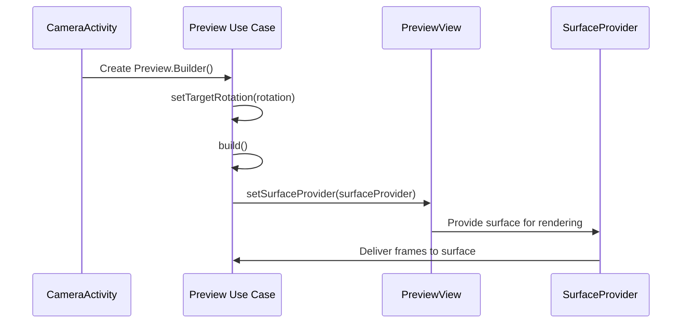
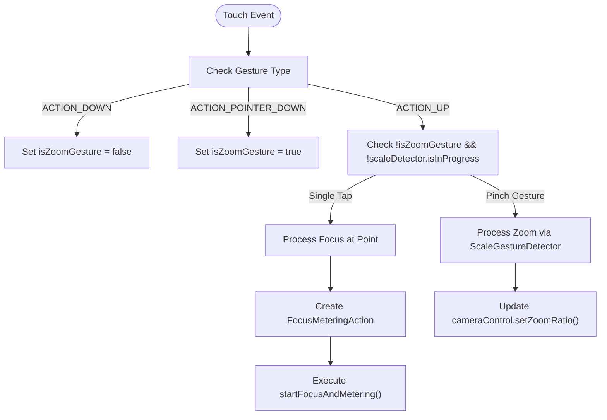
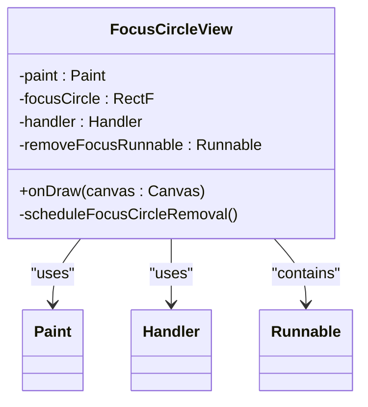
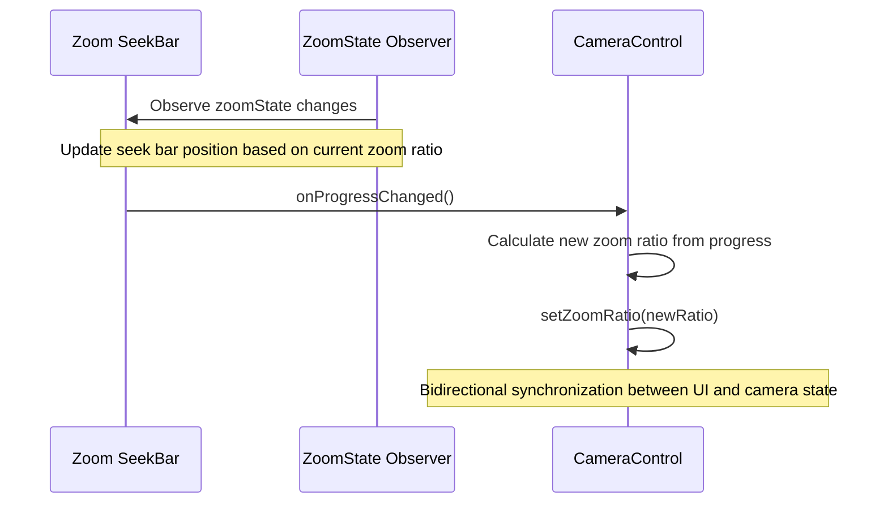
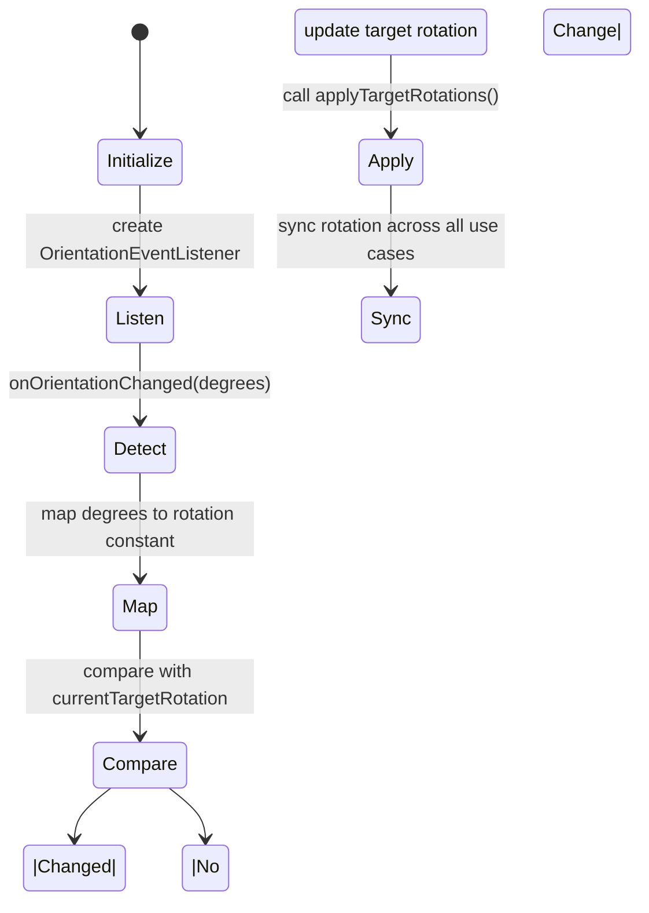

# Camera Preview and Controls

<cite>
**Referenced Files in This Document **   
- [CameraActivity.kt](file://app/src/main/java/com/example/b1void/activities/CameraActivity.kt)
- [FocusCircleView.kt](file://app/src/main/java/com/example/b1void/cameraFun/FocusCircleView.kt)
- [activity_camera.xml](file://app/src/main/res/layout/activity_camera.xml)
- [focus_indicator.xml](file://app/src/main/res/drawable/focus_indicator.xml)
</cite>

## Table of Contents
1. [Introduction](#introduction)
2. [PreviewView Setup and SurfaceProvider Integration](#previewview-setup-and-surfaceprovider-integration)
3. [Touch Interaction System](#touch-interaction-system)
4. [Custom FocusCircleView Component](#custom-focuscircleview-component)
5. [Zoom Seek Bar Implementation](#zoom-seek-bar-implementation)
6. [Orientation Handling and Target Rotation Management](#orientation-handling-and-target-rotation-management)
7. [Performance Considerations](#performance-considerations)

## Introduction
This document provides a comprehensive analysis of the camera preview system and interactive controls implemented in the `CameraActivity` class. It details the integration of CameraX components, touch-based interactions for zooming and focusing, custom UI elements for visual feedback, and orientation handling mechanisms. The documentation covers both the architectural design and implementation specifics of the camera preview functionality.

## PreviewView Setup and SurfaceProvider Integration

The camera preview is established using CameraX's `PreviewView` component integrated with the `SurfaceProvider` API to manage the display surface lifecycle. The `Preview` use case is configured with target rotation settings that adapt to device orientation changes, ensuring proper image alignment across different device positions.

During initialization in the `startCamera()` method, the `Preview` builder sets the target rotation based on the current display orientation. The `setSurfaceProvider()` method connects the preview output directly to the `PreviewView`'s surface provider, establishing the rendering pipeline from the camera sensor to the UI element.

**Diagram sources**
- [CameraActivity.kt](file://app/src/main/java/com/example/b1void/activities/CameraActivity.kt#L351-L399)
- [activity_camera.xml](file://app/src/main/res/layout/activity_camera.xml#L8-L16)

**Section sources**
- [CameraActivity.kt](file://app/src/main/java/com/example/b1void/activities/CameraActivity.kt#L351-L399)

## Touch Interaction System

The touch interaction system implements two primary gesture controls: pinch-to-zoom using `ScaleGestureDetector` and tap-to-focus using `FocusMeteringAction`. These interactions are processed through the `PreviewView`'s touch listener, which distinguishes between different touch events to determine the appropriate action.

The `ScaleGestureDetector` is initialized with a custom `ScaleGestureListener` that captures scale factor changes during pinch gestures. When a scaling motion is detected, the detector calculates the new zoom ratio by multiplying the current zoom ratio with the scale factor, then applies this value through the camera control interface.

Tap-to-focus functionality is triggered when a single tap is detected without an active zoom gesture. The system converts screen coordinates to metering points using the `MeteringPointFactory` from the `PreviewView`, then creates a `FocusMeteringAction` that combines autofocus (AF) and auto-exposure (AE) at the tapped location.

**Diagram sources**
- [CameraActivity.kt](file://app/src/main/java/com/example/b1void/activities/CameraActivity.kt#L167-L252)
- [CameraActivity.kt](file://app/src/main/java/com/example/b1void/activities/CameraActivity.kt#L112-L156)

**Section sources**
- [CameraActivity.kt](file://app/src/main/java/com/example/b1void/activities/CameraActivity.kt#L112-L252)

## Custom FocusCircleView Component

The visual feedback for focus operations is provided by a custom view implementation that displays animated concentric circles at the focus point. Although named `FocusCircleView` in the codebase, the actual implementation uses a standard `View` with ID `focusIndicator` that is animated programmatically rather than using the separate `FocusCircleView` class.

The focus indicator animation features two concentric white circles drawn with stroke only (transparent fill). When a focus operation is initiated, the indicator appears at the tapped location with a pulsing animation that scales the view from 1.0 to 0.85 and back to provide visual feedback. The animation duration and timing are carefully tuned to provide responsive feedback while maintaining smooth performance.

The indicator positioning logic accounts for the parent container bounds, ensuring the focus circle remains within the visible area of the preview by clamping the coordinates to prevent overflow. After a successful focus operation, the indicator automatically fades out after a delay that varies based on focus success (600ms for success, 200ms for failure).

**Diagram sources**
- [FocusCircleView.kt](file://app/src/main/java/com/example/b1void/cameraFun/FocusCircleView.kt#L12-L54)
- [focus_indicator.xml](file://app/src/main/res/drawable/focus_indicator.xml#L1-L8)

**Section sources**
- [FocusCircleView.kt](file://app/src/main/java/com/example/b1void/cameraFun/FocusCircleView.kt#L12-L54)
- [CameraActivity.kt](file://app/src/main/java/com/example/b1void/activities/CameraActivity.kt#L508-L545)

## Zoom Seek Bar Implementation

The zoom functionality includes a vertical seek bar that provides an alternative to pinch-to-zoom gestures. The seek bar is conditionally displayed only when the current camera supports zoom capabilities, as determined by the difference between minimum and maximum zoom ratios.

The `setupZoomObserver()` method establishes a LiveData observer on the camera's zoom state, which automatically updates the seek bar's visibility and enabled state based on the available zoom range. When zoom is supported, the seek bar progress is synchronized with the current zoom ratio, converting between the physical progress value (0-100) and the actual zoom ratio range.

User interactions with the seek bar trigger immediate zoom adjustments through the camera control interface. The `OnSeekBarChangeListener` implementation converts the progress value back to a zoom ratio by interpolating within the available zoom range, then applies this value using `setZoomRatio()`. This creates a seamless bidirectional synchronization between the UI control and the camera hardware state.

**Diagram sources**
- [CameraActivity.kt](file://app/src/main/java/com/example/b1void/activities/CameraActivity.kt#L438-L464)
- [activity_camera.xml](file://app/src/main/res/layout/activity_camera.xml#L188-L208)

**Section sources**
- [CameraActivity.kt](file://app/src/main/java/com/example/b1void/activities/CameraActivity.kt#L438-L464)
- [CameraActivity.kt](file://app/src/main/java/com/example/b1void/activities/CameraActivity.kt#L167-L252)

## Orientation Handling and Target Rotation Management

The camera system implements comprehensive orientation handling using Android's `OrientationEventListener` to detect device rotation changes and adjust the camera preview accordingly. The `initializeOrientationListener()` method creates an orientation listener that maps degree readings to standard surface rotation constants (ROTATION_0, ROTATION_90, etc.).

When orientation changes are detected, the system updates the `currentTargetRotation` variable and calls `applyTargetRotations()` to propagate the new rotation setting to all active use cases (preview, image capture, and video capture). This ensures consistent orientation handling across all camera operations and prevents image rotation issues in captured media.

The target rotation is also initialized during activity creation by querying the display's current rotation, providing correct orientation from the moment the camera preview starts. This approach handles both natural device orientation changes and configuration changes seamlessly.

**Diagram sources**
- [CameraActivity.kt](file://app/src/main/java/com/example/b1void/activities/CameraActivity.kt#L602-L633)
- [CameraActivity.kt](file://app/src/main/java/com/example/b1void/activities/CameraActivity.kt#L351-L399)

**Section sources**
- [CameraActivity.kt](file://app/src/main/java/com/example/b1void/activities/CameraActivity.kt#L602-L633)

## Performance Considerations

The camera implementation addresses several performance considerations to maintain optimal frame rates and responsiveness:

1. **Frame Rate Maintenance**: The CameraX implementation automatically manages frame rate optimization by leveraging the underlying camera HAL (Hardware Abstraction Layer) capabilities. The preview stream is prioritized for smooth rendering, while capture operations are handled on separate threads to prevent UI jank.

2. **Touch Responsiveness**: The touch event processing is optimized by using the `ScaleGestureDetector` for gesture recognition, which efficiently handles complex multi-touch patterns without blocking the main thread. The detector's `onTouchEvent()` call is non-blocking and returns immediately, ensuring the UI remains responsive.

3. **Memory Management**: Image capture operations use `ImageProxy` objects that must be properly closed to prevent memory leaks. The implementation correctly closes the `ImageProxy` after processing in the `takePhoto()` callback.

4. **Thread Management**: Camera operations are executed on a dedicated single-thread executor (`cameraExecutor`), preventing blocking of the main UI thread during potentially long-running operations like image encoding and file writing.

5. **Lifecycle Awareness**: All observers and listeners are properly managed according to the activity lifecycle, with cleanup performed in `onDestroy()` to prevent memory leaks and unnecessary background processing.

**Section sources**
- [CameraActivity.kt](file://app/src/main/java/com/example/b1void/activities/CameraActivity.kt#L76-L880)