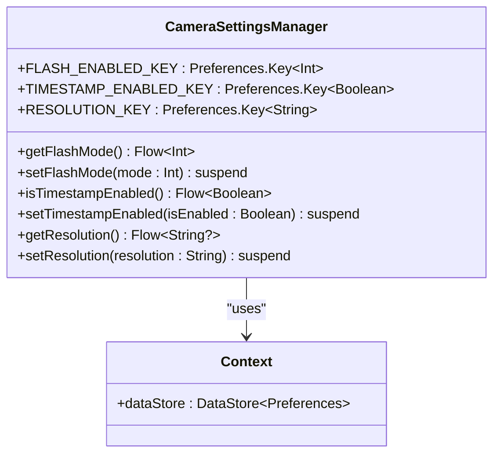
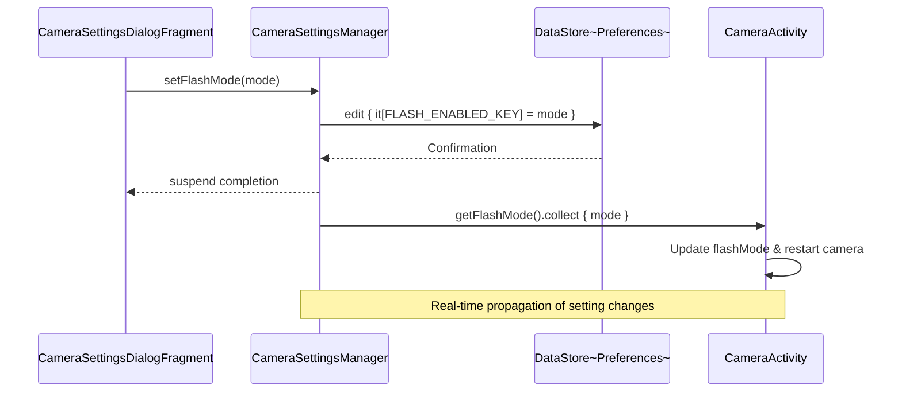
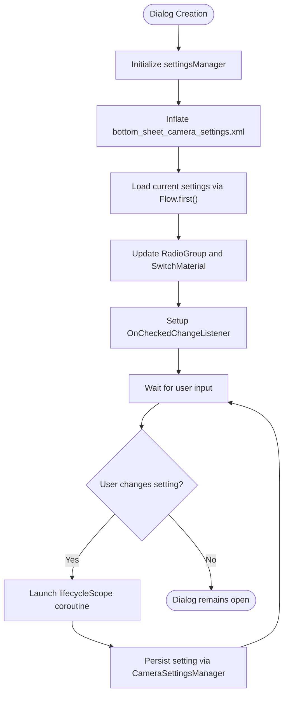
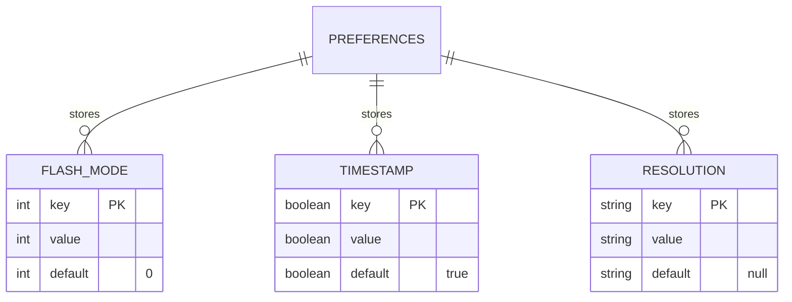

# Camera Settings Management

<cite>
**Referenced Files in This Document**   
- [CameraSettingsManager.kt](file://app/src/main/java/com/example/b1void/data/CameraSettingsManager.kt)
- [CameraSettingsDialogFragment.kt](file://app/src/main/java/com/example/b1void/ui/CameraSettingsDialogFragment.kt)
- [CameraActivity.kt](file://app/src/main/java/com/example/b1void/activities/CameraActivity.kt)
- [bottom_sheet_camera_settings.xml](file://app/src/main/res/layout/bottom_sheet_camera_settings.xml)
- [activity_camera.xml](file://app/src/main/res/layout/activity_camera.xml)
</cite>

## Table of Contents
1. [Introduction](#introduction)
2. [Core Components](#core-components)
3. [DataStore Persistence Mechanism](#datastore-persistence-mechanism)
4. [Reactive Architecture with Flow](#reactive-architecture-with-flow)
5. [CameraSettingsDialogFragment Implementation](#camerasettingsdialogfragment-implementation)
6. [Two-Way Data Binding](#two-way-data-binding)
7. [Default Values and Type Safety](#default-values-and-type-safety)
8. [Troubleshooting Guide](#troubleshooting-guide)

## Introduction
The camera settings persistence system in the Inspector_appVX application provides a robust mechanism for storing and retrieving user preferences across sessions. Built on Android's DataStore Preferences, this system ensures that critical camera configuration options—flash mode, timestamp overlay preference, and resolution settings—are preserved between app launches. The architecture leverages Kotlin's Flow-based reactive programming model to enable real-time observation of setting changes throughout the application lifecycle. This documentation details the implementation of the `CameraSettingsManager` class, the `CameraSettingsDialogFragment` UI component, and their integration within the `CameraActivity`, providing comprehensive guidance on reading, writing, and observing camera settings using Kotlin coroutines.

## Core Components

The camera settings management system consists of three primary components working in concert: the `CameraSettingsManager` data layer, the `CameraSettingsDialogFragment` presentation layer, and the `CameraActivity` consumer component. These elements form a cohesive architecture that enables persistent storage, real-time updates, and intuitive user interaction.

**Section sources**
- [CameraSettingsManager.kt](file://app/src/main/java/com/example/b1void/data/CameraSettingsManager.kt#L15-L58)
- [CameraSettingsDialogFragment.kt](file://app/src/main/java/com/example/b1void/ui/CameraSettingsDialogFragment.kt#L15-L65)
- [CameraActivity.kt](file://app/src/main/java/com/example/b1void/activities/CameraActivity.kt#L115-L115)

## DataStore Persistence Mechanism

The system utilizes Android's DataStore Preferences API as the underlying persistence mechanism for camera settings. This modern alternative to SharedPreferences provides asynchronous, transactional operations with type safety and coroutines support. The `CameraSettingsManager` class serves as the central access point for all camera-related preferences, encapsulating the DataStore implementation details behind a clean interface.

Three distinct preferences are managed by the system:
- Flash mode stored as an integer value
- Timestamp overlay preference stored as a boolean value  
- Resolution setting stored as a string value

Each preference is accessed through type-safe keys created using DataStore's dedicated key creation functions (`intPreferencesKey`, `booleanPreferencesKey`, `stringPreferencesKey`), ensuring compile-time type safety and preventing runtime errors from incorrect type casting.

**Diagram sources**
- [CameraSettingsManager.kt](file://app/src/main/java/com/example/b1void/data/CameraSettingsManager.kt#L18-L20)

**Section sources**
- [CameraSettingsManager.kt](file://app/src/main/java/com/example/b1void/data/CameraSettingsManager.kt#L15-L58)

## Reactive Architecture with Flow

The system implements a reactive architecture using Kotlin Flow to enable real-time observation of setting changes. In `CameraActivity`, the `observeSettings()` method establishes collectors on each of the Flow observables provided by `CameraSettingsManager`. When settings change—either through user interaction or programmatically—the corresponding Flow emits new values, triggering immediate updates in the UI and camera configuration.

This reactive approach eliminates the need for manual refresh operations or polling mechanisms. For example, when the flash mode setting changes, the collector updates the internal `flashMode` variable and calls `startCamera()` to reconfigure the camera use case with the new flash mode. Similarly, resolution changes trigger camera restarts to apply the new target resolution, while timestamp preference changes simply update the local `timestampEnabled` flag for use during photo capture.

**Diagram sources**
- [CameraSettingsManager.kt](file://app/src/main/java/com/example/b1void/data/CameraSettingsManager.kt#L23-L27)
- [CameraActivity.kt](file://app/src/main/java/com/example/b1void/activities/CameraActivity.kt#L274-L306)

**Section sources**
- [CameraActivity.kt](file://app/src/main/java/com/example/b1void/activities/CameraActivity.kt#L274-L306)

## CameraSettingsDialogFragment Implementation

The `CameraSettingsDialogFragment` provides the user interface for modifying camera settings, implemented as a `BottomSheetDialogFragment` for a modern, non-intrusive user experience. The dialog presents two primary controls: a `RadioGroup` for selecting flash modes (Off, On, Auto) and a `SwitchMaterial` toggle for enabling/disabling the timestamp overlay on photos.

Upon creation, the fragment initializes its `settingsManager` instance and inflates the layout from `bottom_sheet_camera_settings.xml`. In `onViewCreated()`, it retrieves references to the UI components and launches coroutine scopes to load the current settings from DataStore. The flash mode radio buttons are checked according to the current setting (0=Off, 1=On, 2=Auto), and the timestamp switch is set based on the boolean preference value.

Event listeners are attached to both controls to detect user interactions. When a radio button is selected or the switch state changes, a new coroutine is launched to persist the updated setting to DataStore via the `CameraSettingsManager` methods.

**Diagram sources**
- [CameraSettingsDialogFragment.kt](file://app/src/main/java/com/example/b1void/ui/CameraSettingsDialogFragment.kt#L19-L26)
- [bottom_sheet_camera_settings.xml](file://app/src/main/res/layout/bottom_sheet_camera_settings.xml#L1-L56)

**Section sources**
- [CameraSettingsDialogFragment.kt](file://app/src/main/java/com/example/b1void/ui/CameraSettingsDialogFragment.kt#L15-L65)

## Two-Way Data Binding

The system implements effective two-way data binding between the UI components and DataStore preferences through the `CameraSettingsManager` abstraction. Reading settings occurs through Flow-based observation, while writing happens through suspend functions, both executed within appropriate coroutine scopes.

For reading operations, the fragment uses `lifecycleScope.launch { ... }` to call `.first()` on the Flow observables, which suspends until the first (current) value is emitted from DataStore. This approach ensures the UI displays the most up-to-date settings immediately upon opening.

For writing operations, event listeners launch coroutines that call the appropriate `set*` suspend functions on `CameraSettingsManager`. These functions use DataStore's `edit` transaction to atomically update the preference value. The use of `lifecycleScope` ensures that all coroutines are automatically canceled when the fragment is destroyed, preventing memory leaks and ensuring proper lifecycle management.

Example of reading settings:
[SPEC SYMBOL](file://app/src/main/java/com/example/b1void/ui/CameraSettingsDialogFragment.kt#L34-L38)

Example of writing settings:
[SPEC SYMBOL](file://app/src/main/java/com/example/b1void/ui/CameraSettingsDialogFragment.kt#L50-L54)

**Section sources**
- [CameraSettingsDialogFragment.kt](file://app/src/main/java/com/example/b1void/ui/CameraSettingsDialogFragment.kt#L28-L64)

## Default Values and Type Safety

The system employs a strategic approach to default values and type safety through DataStore's built-in capabilities. Each getter method in `CameraSettingsManager` includes a default value using the Elvis operator (`?:`), ensuring that sensible defaults are applied when preferences haven't been set previously.

Flash mode defaults to 0 (OFF), while timestamp overlay defaults to true (ON). These defaults are specified directly in the Flow mapping operations, making them transparent and easy to modify. The resolution setting does not have a default in the DataStore layer but is handled in `CameraActivity` where a null resolution triggers setting the default resolution string.

Type safety is enforced through the use of type-specific preferences keys:
- `intPreferencesKey("flash_mode")` for flash mode
- `booleanPreferencesKey("timestamp_enabled")` for timestamp preference  
- `stringPreferencesKey("resolution")` for resolution setting

This approach prevents common errors such as type mismatches and ClassCastExceptions that can occur with traditional SharedPreferences. The compiler enforces correct types at compile time, reducing runtime bugs and improving code reliability.

**Diagram sources**
- [CameraSettingsManager.kt](file://app/src/main/java/com/example/b1void/data/CameraSettingsManager.kt#L18-L20)

**Section sources**
- [CameraSettingsManager.kt](file://app/src/main/java/com/example/b1void/data/CameraSettingsManager.kt#L23-L39)

## Troubleshooting Guide

When encountering issues with the camera settings persistence system, consider the following common problems and solutions:

**Settings not persisting across sessions**: Verify that the DataStore operations are properly awaited. Ensure that suspend functions like `setFlashMode()` are called from within a coroutine scope (e.g., `lifecycleScope.launch`). Direct calls without proper coroutine context will not complete successfully.

**UI not updating when settings change**: Confirm that collectors are properly established in `observeSettings()`. Check that `lifecycleScope.launch` is used to collect from the Flow observables. If collectors are not active, the UI won't receive updates when settings change.

**Initial settings not loading in dialog**: Ensure that `.first()` is used appropriately to retrieve the initial value from Flow. The operation must be performed within a coroutine since it's a suspending function. Verify that `settingsManager` is initialized before attempting to read settings.

**Type conversion errors**: Use the appropriate type-specific key functions (`intPreferencesKey`, `booleanPreferencesKey`, etc.) and ensure that the data types match between the key definition and usage. Avoid manual type casting of preference values.

**Null pointer exceptions**: Initialize `settingsManager` early in the component lifecycle (typically in `onCreateView` or `onCreate`) before attempting to access it. Use `lateinit var` with the understanding that it must be initialized before access.

**Section sources**
- [CameraSettingsManager.kt](file://app/src/main/java/com/example/b1void/data/CameraSettingsManager.kt#L15-L58)
- [CameraSettingsDialogFragment.kt](file://app/src/main/java/com/example/b1void/ui/CameraSettingsDialogFragment.kt#L28-L64)
- [CameraActivity.kt](file://app/src/main/java/com/example/b1void/activities/CameraActivity.kt#L274-L306)