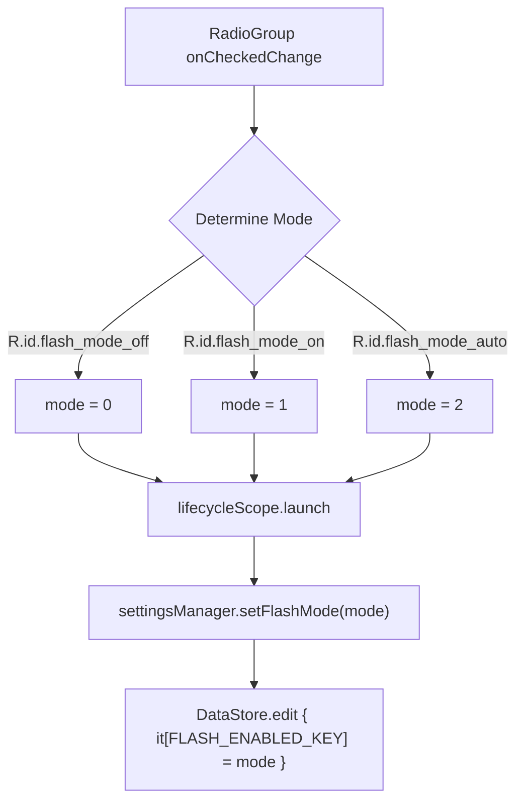
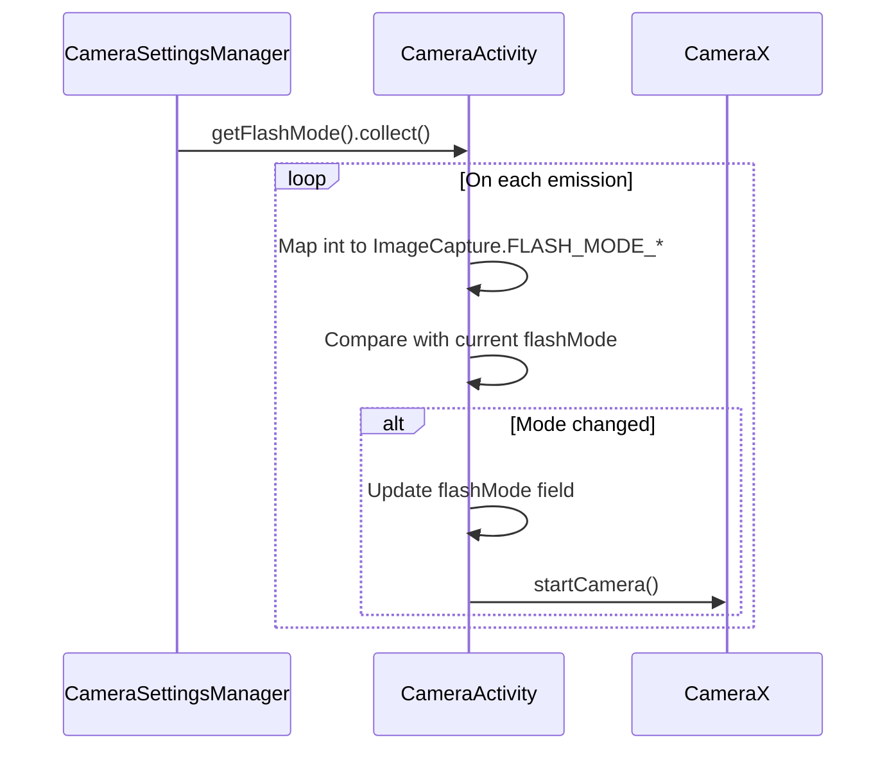
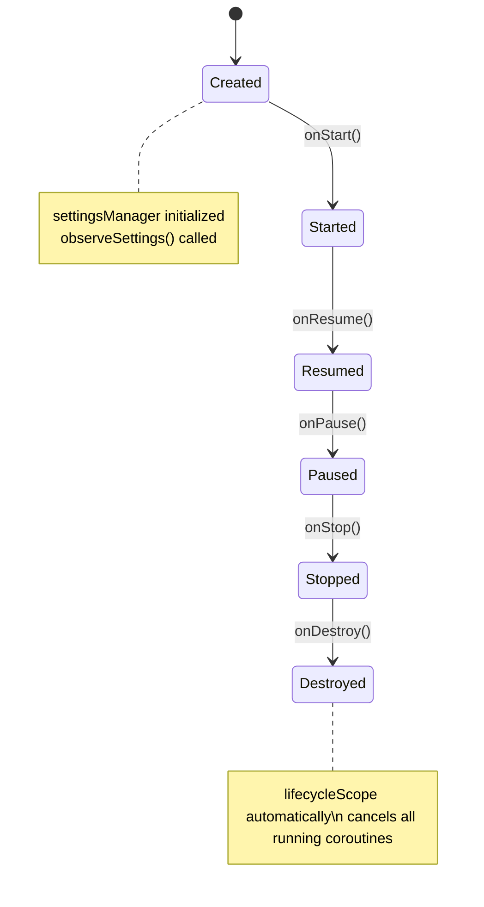

# Flash Control

<cite>
**Referenced Files in This Document**   
- [CameraSettingsManager.kt](file://app/src/main/java/com/example/b1void/data/CameraSettingsManager.kt)
- [CameraSettingsDialogFragment.kt](file://app/src/main/java/com/example/b1void/ui/CameraSettingsDialogFragment.kt)
- [CameraActivity.kt](file://app/src/main/java/com/example/b1void/activities/CameraActivity.kt)
- [bottom_sheet_camera_settings.xml](file://app/src/main/res/layout/bottom_sheet_camera_settings.xml)
</cite>

## Table of Contents
1. [Introduction](#introduction)
2. [Flash Mode States and Persistence](#flash-mode-states-and-persistence)
3. [UI Integration with RadioGroup](#ui-integration-with-radiogroup)
4. [Two-Way Binding Mechanism](#two-way-binding-mechanism)
5. [Reactive Camera Configuration](#reactive-camera-configuration)
6. [Lifecycle and Coroutine Management](#lifecycle-and-coroutine-management)
7. [Common Issues and Best Practices](#common-issues-and-best-practices)

## Introduction
This document details the implementation of flash control within the camera settings system. It covers state persistence using DataStore, UI integration via RadioGroup, reactive updates through Flow, and lifecycle-safe coroutine usage. The flash mode is persisted across sessions and dynamically applied to CameraX configuration upon changes.

## Flash Mode States and Persistence
The flash control system defines three distinct states mapped to integer values stored in DataStore:

| State | Value | Description |
|-------|-------|-------------|
| OFF | 0 | Flash disabled for photo capture |
| ON | 1 | Flash forced on regardless of lighting conditions |
| AUTO | 2 | Flash automatically activated based on scene luminance |

Persistence is implemented using Android's DataStore with `intPreferencesKey("flash_mode")` as the storage key. The default value is set to 0 (OFF) when no preference exists.

```kotlin
val FLASH_ENABLED_KEY = intPreferencesKey("flash_mode")
```

The `getFlashMode()` function returns a `Flow<Int>` that emits the current flash mode from DataStore, defaulting to 0 if no value is present.

**Section sources**
- [CameraSettingsManager.kt](file://app/src/main/java/com/example/b1void/data/CameraSettingsManager.kt#L23-L27)
- [CameraSettingsManager.kt](file://app/src/main/java/com/example/b1void/data/CameraSettingsManager.kt#L18-L18)

## UI Integration with RadioGroup
The flash mode selection is presented in the `CameraSettingsDialogFragment` using a horizontal `RadioGroup` containing three `RadioButton` options corresponding to each flash state.

```xml
<RadioGroup android:id="@+id/flash_mode_group">
    <RadioButton android:id="@+id/flash_mode_auto" android:text="Auto"/>
    <RadioButton android:id="@+id/flash_mode_on" android:text="On"/>
    <RadioButton android:id="@+id/flash_mode_off" android:text="Off"/>
</RadioGroup>
```

When the dialog is created, the current flash mode is retrieved from DataStore and the appropriate radio button is programmatically checked to reflect the persisted state.

**Section sources**
- [bottom_sheet_camera_settings.xml](file://app/src/main/res/layout/bottom_sheet_camera_settings.xml#L13-L39)
- [CameraSettingsDialogFragment.kt](file://app/src/main/java/com/example/b1void/ui/CameraSettingsDialogFragment.kt#L28-L35)

## Two-Way Binding Mechanism
A two-way binding pattern connects the UI component with the underlying data store through coroutines:

### Forward Binding (UI → DataStore)
When a user selects a different flash mode, the `onCheckedChanged` listener captures the selected radio button ID and maps it to the corresponding integer value. This triggers `setFlashMode()` within `lifecycleScope`.



**Diagram sources**
- [CameraSettingsDialogFragment.kt](file://app/src/main/java/com/example/b1void/ui/CameraSettingsDialogFragment.kt#L50-L64)
- [CameraSettingsManager.kt](file://app/src/main/java/com/example/b1void/data/CameraSettingsManager.kt#L29-L33)

### Reverse Binding (DataStore → UI)
During dialog initialization, the current flash mode is fetched once using `.first()` from the Flow returned by `getFlashMode()`, ensuring the UI reflects the latest persisted state.

**Section sources**
- [CameraSettingsDialogFragment.kt](file://app/src/main/java/com/example/b1void/ui/CameraSettingsDialogFragment.kt#L33-L42)

## Reactive Camera Configuration
The `CameraActivity` observes flash mode changes reactively using Kotlin Flow, enabling dynamic camera reconfiguration without requiring activity restarts.



**Diagram sources**
- [CameraActivity.kt](file://app/src/main/java/com/example/b1void/activities/CameraActivity.kt#L274-L285)

The observation occurs in `observeSettings()` launched within `lifecycleScope`, ensuring proper lifecycle management:

```kotlin
lifecycleScope.launch {
    settingsManager.getFlashMode().collect { mode ->
        val newFlashMode = when(mode) {
            0 -> ImageCapture.FLASH_MODE_OFF
            1 -> ImageCapture.FLASH_MODE_ON
            2 -> ImageCapture.FLASH_MODE_AUTO
            else -> ImageCapture.FLASH_MODE_OFF
        }
        if (newFlashMode != flashMode) {
            flashMode = newFlashMode
            startCamera()
        }
    }
}
```

When a change is detected, `startCamera()` is called to rebind use cases with the updated flash mode configuration.

**Section sources**
- [CameraActivity.kt](file://app/src/main/java/com/example/b1void/activities/CameraActivity.kt#L274-L285)
- [CameraActivity.kt](file://app/src/main/java/com/example/b1void/activities/CameraActivity.kt#L351-L399)

## Lifecycle and Coroutine Management
All coroutine operations are properly scoped to prevent memory leaks and ensure execution safety:

- **Initialization**: `settingsManager = CameraSettingsManager(this)` is created in `onCreate()`
- **Observation Setup**: `observeSettings()` is called during activity creation
- **Coroutine Scope**: All launches use `lifecycleScope` which automatically cancels jobs when the lifecycle is destroyed



**Diagram sources**
- [CameraActivity.kt](file://app/src/main/java/com/example/b1void/activities/CameraActivity.kt#L134-L154)

## Common Issues and Best Practices
### Default Value Handling
Ensure consistent default behavior by always providing fallback values when reading from DataStore:
```kotlin
it[FLASH_ENABLED_KEY] ?: 0 // Explicit default to OFF
```

### Stale UI State Prevention
To avoid stale UI states during configuration changes:
- Always initialize UI state from DataStore in `onViewCreated`
- Use `lifecycleScope` for all coroutine operations
- Avoid holding references to views outside their lifecycle

### Coroutine Best Practices
- Use `lifecycleScope` instead of global scope
- Launch collection in appropriate lifecycle phases
- Handle potential exceptions in suspend functions
- Avoid blocking calls in coroutine contexts

**Section sources**
- [CameraSettingsManager.kt](file://app/src/main/java/com/example/b1void/data/CameraSettingsManager.kt#L23-L27)
- [CameraActivity.kt](file://app/src/main/java/com/example/b1void/activities/CameraActivity.kt#L274-L285)
- [CameraSettingsDialogFragment.kt](file://app/src/main/java/com/example/b1void/ui/CameraSettingsDialogFragment.kt#L28-L64)