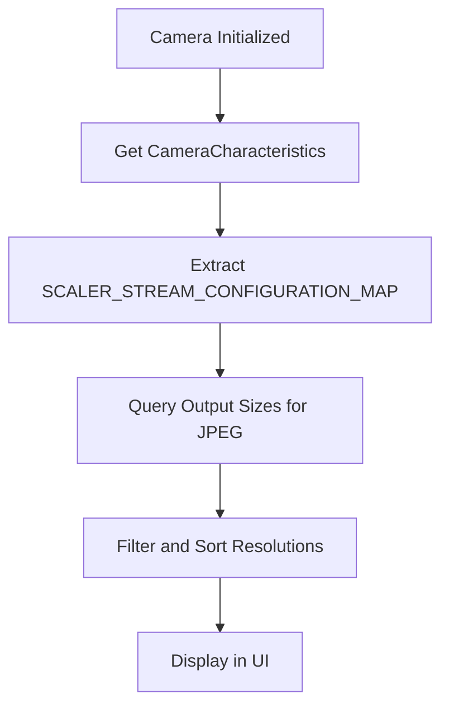
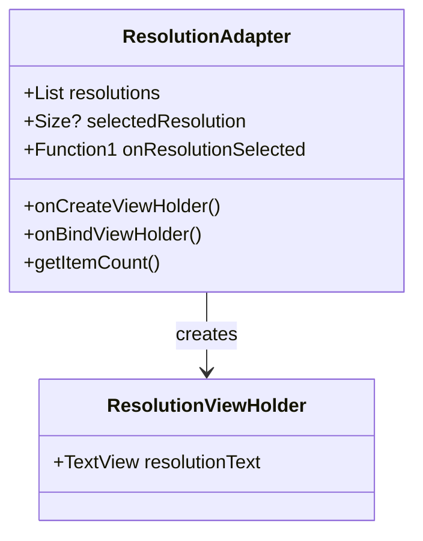
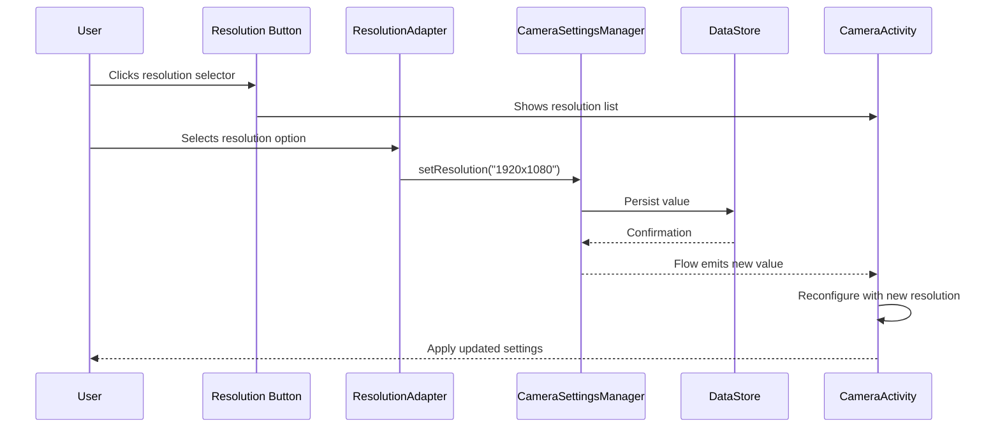

# Resolution Selection

<cite>
**Referenced Files in This Document**   
- [CameraSettingsManager.kt](file://app/src/main/java/com/example/b1void/data/CameraSettingsManager.kt)
- [CameraActivity.kt](file://app/src/main/java/com/example/b1void/activities/CameraActivity.kt)
- [ResolutionAdapter.kt](file://app/src/main/java/com/example/b1void/adapters/ResolutionAdapter.kt)
- [dialog_resolution_selector.xml](file://app/src/main/res/layout/dialog_resolution_selector.xml)
- [activity_camera.xml](file://app/src/main/res/layout/activity_camera.xml)
</cite>

## Table of Contents
1. [Introduction](#introduction)
2. [Data Persistence with DataStore](#data-persistence-with-datastore)
3. [Resolution Enumeration and Camera Support](#resolution-enumeration-and-camera-support)
4. [User Interface Components](#user-interface-components)
5. [Resolution Selection Workflow](#resolution-selection-workflow)
6. [Default and Fallback Behavior](#default-and-fallback-behavior)
7. [Performance and Memory Considerations](#performance-and-memory-considerations)
8. [Error Handling and Validation](#error-handling-and-validation)

## Introduction
The resolution selection feature enables users to choose preferred camera capture resolutions through a dedicated UI dialog. The selected resolution is persisted across sessions using Android's DataStore, ensuring consistent user preferences. This system integrates CameraX for camera operations, RecyclerView for displaying available options, and DataStore for reliable preference storage. The implementation supports dynamic resolution switching based on device capabilities while maintaining optimal performance characteristics.

## Data Persistence with DataStore
The application uses `androidx.datastore.preferences` to store and retrieve camera resolution preferences persistently. A string key named `'resolution'` is defined as `RESOLUTION_KEY` in the `CameraSettingsManager` class to manage this setting.

```kotlin
val RESOLUTION_KEY = stringPreferencesKey("resolution")
```

This preference stores resolution values in the format `"widthxheight"` (e.g., "1920x1080"). The `CameraSettingsManager` provides two primary methods for interacting with this data:

- `getResolution()`: Returns a `Flow<String?>` that emits the current resolution value whenever it changes
- `setResolution(resolution: String)`: Asynchronously updates the stored resolution value

The use of Kotlin Flows enables reactive programming patterns, allowing the UI and camera configuration to automatically respond to resolution changes without explicit polling.

**Section sources**
- [CameraSettingsManager.kt](file://app/src/main/java/com/example/b1void/data/CameraSettingsManager.kt#L23-L57)

## Resolution Enumeration and Camera Support
Available resolutions are dynamically enumerated from the device's camera hardware using the Camera2 API through CameraX interoperability. During camera initialization in `CameraActivity`, the system queries the `SCALER_STREAM_CONFIGURATION_MAP` from the camera characteristics to obtain all supported output sizes for JPEG image capture.



**Diagram sources**
- [CameraActivity.kt](file://app/src/main/java/com/example/b1void/activities/CameraActivity.kt#L410-L426)

The enumeration process follows these steps:
1. Obtain `CameraManager` system service
2. Retrieve camera characteristics using the active camera ID
3. Access the stream configuration map
4. Get all supported output sizes for JPEG format
5. Convert to list and reverse order (prioritizing higher resolutions)

This approach ensures that only resolutions actually supported by the device's camera hardware are presented to the user, preventing invalid configuration attempts.

**Section sources**
- [CameraActivity.kt](file://app/src/main/java/com/example/b1void/activities/CameraActivity.kt#L410-L426)

## User Interface Components
The resolution selection interface consists of three main components working together:

### ResolutionAdapter
This RecyclerView adapter displays available resolutions in a scrollable list. It takes three parameters:
- `resolutions`: List of supported `Size` objects
- `selectedResolution`: Currently selected `Size` (if any)
- `onResolutionSelected`: Callback triggered when a resolution is chosen

Each item displays the resolution dimensions (e.g., "1920 x 1080") with a checkmark and yellow text color for the currently selected option.



**Diagram sources**
- [ResolutionAdapter.kt](file://app/src/main/java/com/example/b1void/adapters/ResolutionAdapter.kt#L12-L50)

### DialogResolutionSelectorBinding
This view binding class provides type-safe access to the resolution selector dialog layout. The dialog contains a single `RecyclerView` that displays all available resolutions using the `ResolutionAdapter`.

The layout file `dialog_resolution_selector.xml` defines a simple RecyclerView centered in the dialog with appropriate padding.

**Section sources**
- [ResolutionAdapter.kt](file://app/src/main/java/com/example/b1void/adapters/ResolutionAdapter.kt#L12-L50)
- [dialog_resolution_selector.xml](file://app/src/main/res/layout/dialog_resolution_selector.xml#L1-L9)

## Resolution Selection Workflow
The complete resolution selection workflow involves coordination between multiple components:



**Diagram sources**
- [CameraActivity.kt](file://app/src/main/java/com/example/b1void/activities/CameraActivity.kt#L410-L426)
- [CameraSettingsManager.kt](file://app/src/main/java/com/example/b1void/data/CameraSettingsManager.kt#L53-L57)

When a user selects a resolution:
1. The `ResolutionAdapter` callback triggers
2. `CameraActivity` launches a coroutine to update the setting via `settingsManager.setResolution()`
3. DataStore persists the new resolution string
4. The `getResolution()` Flow emits the updated value
5. `CameraActivity` observes this change and reconfigures the camera with the new resolution
6. The resolution selection container is hidden

The button that triggers this dialog is defined in `activity_camera.xml` as `resolutionSelectorButton`, positioned in the bottom-right area of the camera interface.

**Section sources**
- [CameraActivity.kt](file://app/src/main/java/com/example/b1void/activities/CameraActivity.kt#L410-L426)
- [activity_camera.xml](file://app/src/main/res/layout/activity_camera.xml#L1-L226)

## Default and Fallback Behavior
The system implements robust default and fallback mechanisms to handle edge cases:

- If no resolution is stored in DataStore, the system defaults to `DEFAULT_PHOTO_RESOLUTION`
- When initializing, if the stored resolution string is null or invalid, it falls back to the default resolution
- The UI always shows the currently active resolution with visual indication (checkmark and yellow text)
- Empty resolution lists are handled gracefully with empty state management

This ensures that the camera can always be configured even when preference data is missing or corrupted.

**Section sources**
- [CameraActivity.kt](file://app/src/main/java/com/example/b1void/activities/CameraActivity.kt#L410-L426)

## Performance and Memory Considerations
High-resolution capture has significant implications for system resources:

- **Memory Usage**: Higher resolutions require substantially more RAM for image processing and buffering
- **Storage Space**: Large images consume more storage space per capture
- **Processing Time**: Image encoding, decoding, and manipulation take longer at higher resolutions
- **Battery Consumption**: Increased sensor usage and processing demands lead to faster battery drain

The implementation mitigates these issues by:
- Enumerating only actually supported resolutions (avoiding invalid configurations)
- Using efficient RecyclerView adapters with view recycling
- Leveraging DataStore's asynchronous operations to prevent UI blocking
- Sorting resolutions in descending order to prioritize higher quality options
- Implementing proper lifecycle management to release camera resources when not in use

For low-end devices, additional optimizations could be implemented using the `CameraOptimizer` utility which already contains logic for detecting device capabilities.

**Section sources**
- [CameraActivity.kt](file://app/src/main/java/com/example/b1void/activities/CameraActivity.kt#L410-L426)
- [CameraSettingsManager.kt](file://app/src/main/java/com/example/b1void/data/CameraSettingsManager.kt#L23-L57)

## Error Handling and Validation
The resolution selection system includes several layers of error handling:

- **Null Safety**: Uses Kotlin's nullable types (`String?`) to properly represent absent values
- **Graceful Degradation**: Falls back to default resolution when stored value is invalid
- **Asynchronous Operations**: Uses coroutines with proper scope management to prevent crashes
- **Hardware Capability Checking**: Queries actual camera capabilities rather than assuming support
- **UI State Management**: Properly handles visibility states of resolution selection components

When writing resolution values, the system safely converts `Size` objects to string format using the pattern `"${width}x${height}"`. When reading, it parses these strings back into `Size` objects, with validation to ensure the parsed values represent valid resolutions.

**Section sources**
- [CameraActivity.kt](file://app/src/main/java/com/example/b1void/activities/CameraActivity.kt#L410-L426)
- [CameraSettingsManager.kt](file://app/src/main/java/com/example/b1void/data/CameraSettingsManager.kt#L47-L57)