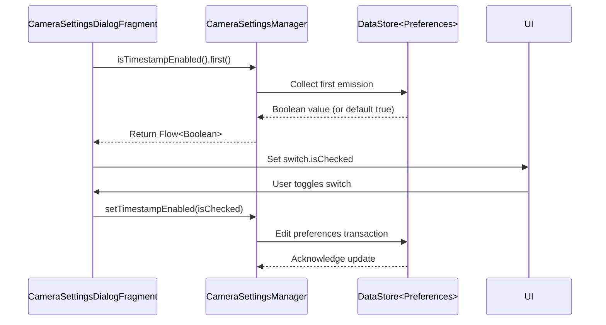

# Timestamp Overlay

<cite>
**Referenced Files in This Document **   
- [CameraSettingsManager.kt](file://app/src/main/java/com/example/b1void/data/CameraSettingsManager.kt)
- [CameraSettingsDialogFragment.kt](file://app/src/main/java/com/example/b1void/ui/CameraSettingsDialogFragment.kt)
- [CameraActivity.kt](file://app/src/main/java/com/example/b1void/activities/CameraActivity.kt)
- [bottom_sheet_camera_settings.xml](file://app/src/main/res/layout/bottom_sheet_camera_settings.xml)
</cite>

## Table of Contents
1. [Introduction](#introduction)
2. [Preference Storage and Default Behavior](#preference-storage-and-default-behavior)
3. [UI Integration and Data Binding](#ui-integration-and-data-binding)
4. [State Management and UI Recomposition](#state-management-and-ui-recomposition)
5. [Timestamp Rendering Implementation](#timestamp-rendering-implementation)
6. [Persistence Mechanism with DataStore](#persistence-mechanism-with-datastore)
7. [Observing Live Changes](#observing-live-changes)
8. [Troubleshooting Scenarios](#troubleshooting-scenarios)

## Introduction
The timestamp overlay functionality enables users to add date and time stamps to captured media within the camera application. This document details the implementation architecture, data flow, and state management mechanisms that govern this feature. The system leverages Android's DataStore for persistent preference storage, Flow for reactive state updates, and coroutines for asynchronous operations.

## Preference Storage and Default Behavior
The timestamp functionality is controlled by a boolean preference named `timestamp_enabled`, which is stored using `booleanPreferencesKey("timestamp_enabled")` in DataStore. This key is defined as a companion object constant in `CameraSettingsManager.kt`.

By default, the timestamp feature is enabled. When no explicit user preference exists, the system returns `true` as the default value through the null-coalescing operator (`?: true`) in the `isTimestampEnabled()` function. This ensures that new users automatically have timestamps applied to their media unless they explicitly disable the feature.

**Section sources**
- [CameraSettingsManager.kt](file://app/src/main/java/com/example/b1void/data/CameraSettingsManager.kt#L35-L39)

## UI Integration and Data Binding
The user interface for controlling the timestamp feature is implemented in `bottom_sheet_camera_settings.xml`, where a `SwitchMaterial` component with ID `timestamp_switch` provides the toggle interface. This switch is programmatically bound to the underlying preference system in `CameraSettingsDialogFragment.kt`.

During fragment creation in `onViewCreated()`, the current state of the timestamp preference is retrieved using `settingsManager.isTimestampEnabled().first()`. The `first()` operator suspends execution until the first value from the Flow is emitted, ensuring the UI reflects the most recently saved preference upon opening the settings dialog.

When the user interacts with the switch, the `setOnCheckedChangeListener` triggers `settingsManager.setTimestampEnabled(isChecked)` within a `lifecycleScope.launch` block, ensuring the operation occurs on the appropriate coroutine scope without blocking the main thread.



**Diagram sources **
- [CameraSettingsDialogFragment.kt](file://app/src/main/java/com/example/b1void/ui/CameraSettingsDialogFragment.kt#L34-L65)
- [bottom_sheet_camera_settings.xml](file://app/src/main/res/layout/bottom_sheet_camera_settings.xml#L50-L55)

**Section sources**
- [CameraSettingsDialogFragment.kt](file://app/src/main/java/com/example/b1void/ui/CameraSettingsDialogFragment.kt#L34-L65)
- [bottom_sheet_camera_settings.xml](file://app/src/main/res/layout/bottom_sheet_camera_settings.xml#L50-L55)

## State Management and UI Recomposition
In `CameraActivity.kt`, the `observeSettings()` method establishes a continuous observation of the timestamp preference using `settingsManager.isTimestampEnabled().collect`. Each time the preference changes—either through user interaction or programmatic update—the collected value updates the local `timestampEnabled` variable.

This reactive pattern ensures immediate UI response when capturing photos. In the `takePhoto()` method, the `timestampEnabled` flag determines whether to process the image through `addTimestampToBitmap()`. If enabled, the original bitmap undergoes modification to include the timestamp; otherwise, it proceeds unaltered to saving.

The separation between preference observation and image processing creates a clean separation of concerns, where state management is decoupled from rendering logic.

```mermaid
flowchart TD
A[User Toggles Switch] --> B[setTimestampEnabled()]
B --> C[DataStore Update]
C --> D[Flow emits new value]
D --> E[collect{} receives update]
E --> F[Update timestampEnabled flag]
G[Take Photo] --> H{timestampEnabled?}
H --> |True| I[addTimestampToBitmap()]
H --> |False| J[Save without modification]
```

**Diagram sources **
- [CameraActivity.kt](file://app/src/main/java/com/example/b1void/activities/CameraActivity.kt#L274-L306)
- [CameraActivity.kt](file://app/src/main/java/com/example/b1void/activities/CameraActivity.kt#L672-L707)

**Section sources**
- [CameraActivity.kt](file://app/src/main/java/com/example/b1void/activities/CameraActivity.kt#L274-L306)
- [CameraActivity.kt](file://app/src/main/java/com/example/b1void/activities/CameraActivity.kt#L672-L707)

## Timestamp Rendering Implementation
The actual rendering of the timestamp occurs in the `addTimestampToBitmap()` method within `CameraActivity.kt`. This function creates a mutable copy of the original bitmap, initializes a Canvas and Paint object, and draws the formatted timestamp text in the bottom-right corner.

Key implementation details:
- Text color is set to red for high visibility
- Font size scales proportionally to image width (1/35th of width)
- Padding maintains consistent margins (1/45th of width)
- Uses `SimpleDateFormat("yyyy-MM-dd HH:mm:ss")` for standardized formatting
- Positions text using right alignment with calculated X/Y coordinates based on font metrics

The rendered timestamp appears directly on the final saved image file, making it a permanent part of the media rather than a temporary preview overlay.

**Section sources**
- [CameraActivity.kt](file://app/src/main/java/com/example/b1void/activities/CameraActivity.kt#L717-L737)

## Persistence Mechanism with DataStore
The system uses Android's Preferences DataStore for persisting the timestamp preference. Defined as `Context.dataStore` using the name "camera_settings", this datastore provides type-safe, asynchronous access to preferences.

The `TIMESTAMP_ENABLED_KEY` is a `booleanPreferencesKey` that maps directly to the "timestamp_enabled" string identifier. Reading occurs through a Flow that maps the preferences container to the boolean value, while writing happens via an edit transaction in the `setTimestampEnabled()` suspend function.

This approach ensures thread-safe access, automatic lifecycle awareness through coroutines, and protection against runtime exceptions that can occur with SharedPreferences.

```mermaid
classDiagram
class CameraSettingsManager {
+context : Context
+getFlashMode() : Flow<Int>
+setFlashMode(mode : Int) : suspend
+isTimestampEnabled() : Flow<Boolean>
+setTimestampEnabled(isEnabled : Boolean) : suspend
+getResolution() : Flow<String?>
+setResolution(resolution : String) : suspend
}
class DataStore~Preferences~ {
+data : Flow<Preferences>
+edit(transform : suspend (MutablePreferences) -> Unit) : suspend
}
CameraSettingsManager --> DataStore~Preferences~ : "uses context.dataStore"
note right of CameraSettingsManager
Companion object defines :
- FLASH_ENABLED_KEY (int)
- TIMESTAMP_ENABLED_KEY (boolean)
- RESOLUTION_KEY (string)
end note
```

**Diagram sources **
- [CameraSettingsManager.kt](file://app/src/main/java/com/example/b1void/data/CameraSettingsManager.kt#L0-L58)

**Section sources**
- [CameraSettingsManager.kt](file://app/src/main/java/com/example/b1void/data/CameraSettingsManager.kt#L0-L58)

## Observing Live Changes
Live observation of preference changes is achieved through Kotlin Flows in the `observeSettings()` method. Three independent coroutine jobs are launched using `lifecycleScope` to collect emissions from different preference flows:

1. Flash mode changes trigger camera reconfiguration
2. Timestamp enablement updates the local flag
3. Resolution changes restart the camera pipeline

For the timestamp specifically, the collection simply updates the `timestampEnabled` field whenever the preference changes. Since this flag is read during each photo capture operation, the change takes effect immediately for subsequent captures without requiring any additional UI updates or recompositions.

This push-based model eliminates polling and ensures efficient resource usage while maintaining real-time responsiveness.

**Section sources**
- [CameraActivity.kt](file://app/src/main/java/com/example/b1void/activities/CameraActivity.kt#L274-L306)

## Troubleshooting Scenarios
### Switch State Not Reflecting Saved Value
This issue typically occurs if `first()` is called before DataStore has initialized. The solution implemented in `CameraSettingsDialogFragment` properly uses `lifecycleScope.launch` to ensure suspension until the value is available. Alternative approaches like `collectLatest{}` could cause race conditions if not properly scoped.

### Race Conditions During Fragment Creation
Potential race conditions are mitigated by using `first()` which guarantees exactly one emission. Using `collect{}` without proper cancellation could lead to memory leaks or inconsistent states. The current implementation ensures that UI binding happens once during initialization.

### Coroutine Scope Handling
All operations use `lifecycleScope` which automatically cancels ongoing coroutines when the associated lifecycle owner (fragment or activity) is destroyed. This prevents crashes from updating destroyed views and eliminates memory leaks. The use of `launch` instead of `async` is appropriate since these operations don't require returned values.

**Section sources**
- [CameraSettingsDialogFragment.kt](file://app/src/main/java/com/example/b1void/ui/CameraSettingsDialogFragment.kt#L34-L65)
- [CameraActivity.kt](file://app/src/main/java/com/example/b1void/activities/CameraActivity.kt#L274-L306)