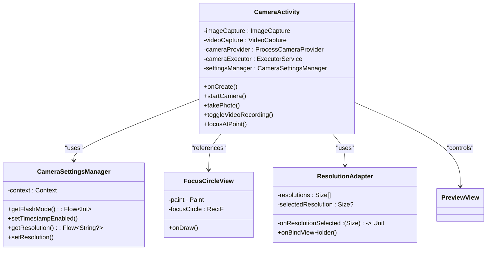
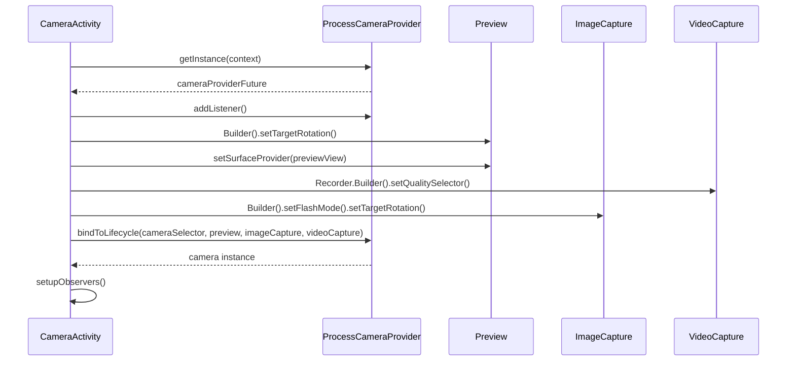
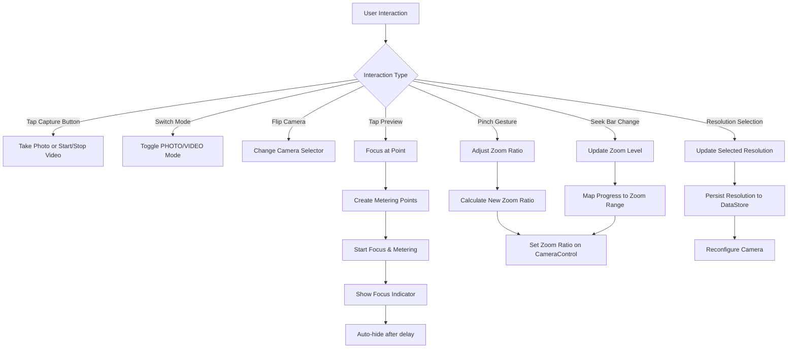
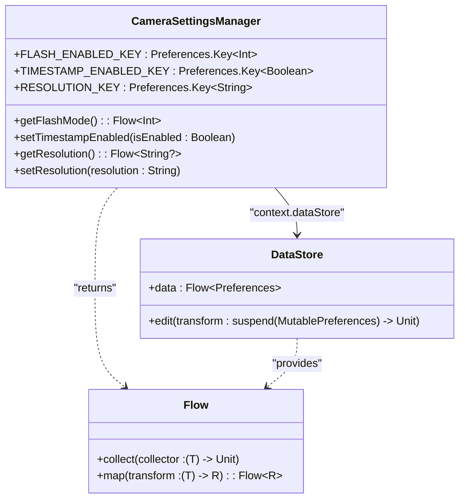
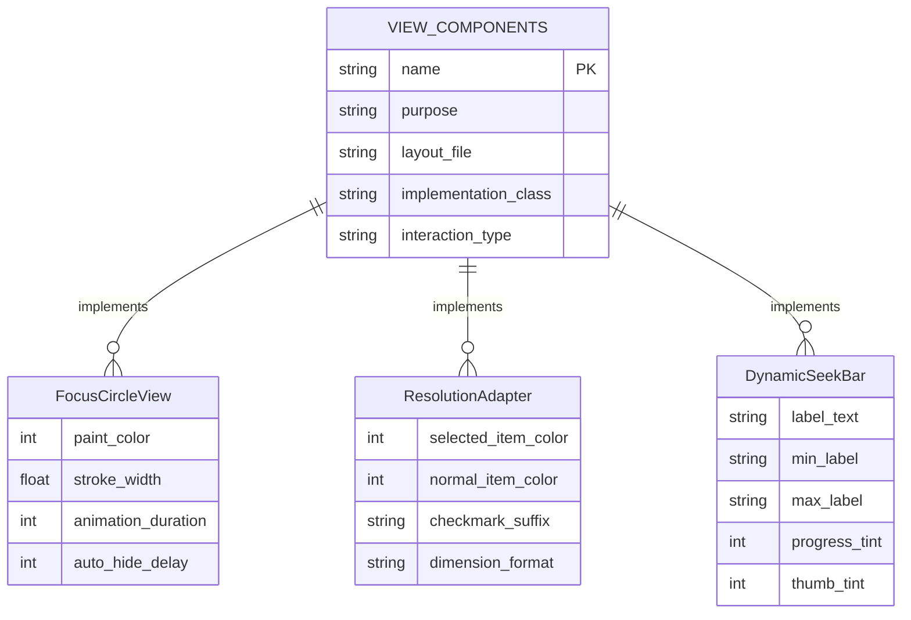
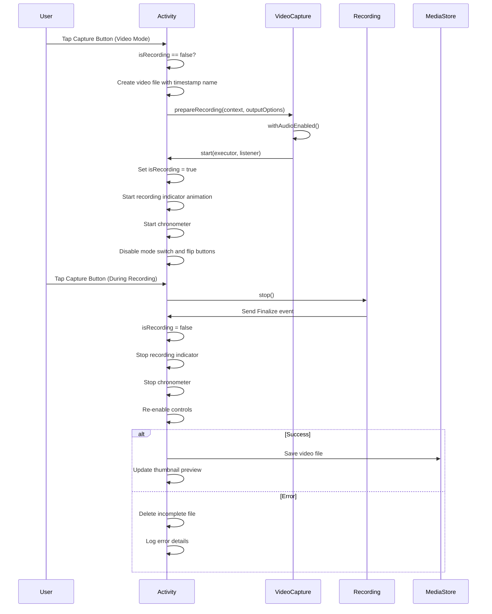
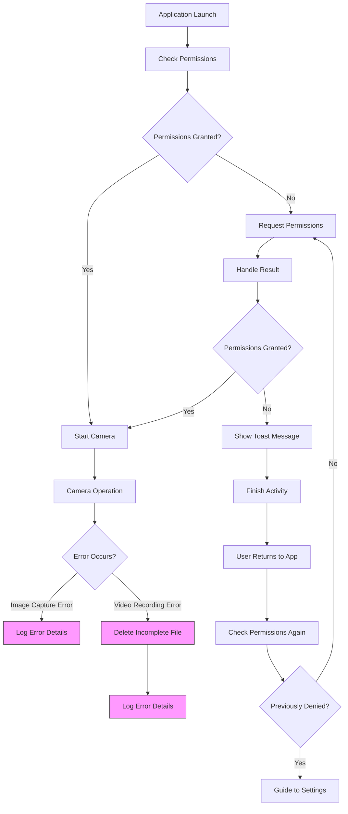

# Camera System

<cite>
**Referenced Files in This Document**   
- [CameraActivity.kt](file://app/src/main/java/com/example/b1void/activities/CameraActivity.kt)
- [CameraSettingsManager.kt](file://app/src/main/java/com/example/b1void/data/CameraSettingsManager.kt)
- [FocusCircleView.kt](file://app/src/main/java/com/example/b1void/cameraFun/FocusCircleView.kt)
- [ResolutionAdapter.kt](file://app/src/main/java/com/example/b1void/adapters/ResolutionAdapter.kt)
- [activity_camera.xml](file://app/src/main/res/layout/activity_camera.xml)
- [dialog_exposure.xml](file://app/src/main/res/layout/dialog_exposure.xml)
- [dialog_resolution_selector.xml](file://app/src/main/res/layout/dialog_resolution_selector.xml)
- [dynamic_seekbar_layout.xml](file://app/src/main/res/layout/dynamic_seekbar_layout.xml)
</cite>

## Table of Contents
1. [Introduction](#introduction)
2. [Core Components](#core-components)
3. [Camera Use Case Configuration](#camera-use-case-configuration)
4. [Real-Time Controls Implementation](#real-time-controls-implementation)
5. [User Preference Management](#user-preference-management)
6. [Custom UI Components](#custom-ui-components)
7. [Video Recording Workflow](#video-recording-workflow)
8. [Error Handling and Permissions](#error-handling-and-permissions)
9. [Performance Considerations](#performance-considerations)

## Introduction
The camera system in the application provides a comprehensive solution for photo capture and video recording using Android's CameraX API. The implementation centers around `CameraActivity`, which manages all camera operations, user interface interactions, and state management. The system supports both photo and video modes with seamless switching, real-time controls for flash, zoom, resolution, and exposure, and persistent user preferences through DataStore. The architecture follows modern Android development practices with lifecycle-aware components, coroutines for asynchronous operations, and reactive data streams for settings observation.

## Core Components

The camera functionality is implemented primarily in `CameraActivity`, which orchestrates the interaction between CameraX use cases and the user interface. The activity manages three primary CameraX use cases: Preview for displaying the camera feed, ImageCapture for taking photos, and VideoCapture for recording videos. These use cases are bound to the activity's lifecycle, ensuring proper resource management and automatic cleanup.

The system integrates several supporting components including `CameraSettingsManager` for persistent preference storage, `ResolutionAdapter` for resolution selection UI, and custom views like `FocusCircleView` for tap-to-focus feedback. The UI is defined in `activity_camera.xml` and includes controls for capture, mode switching, camera flipping, settings access, torch control, and resolution selection.

**Diagram sources**
- [CameraActivity.kt](file://app/src/main/java/com/example/b1void/activities/CameraActivity.kt#L76-L880)
- [CameraSettingsManager.kt](file://app/src/main/java/com/example/b1void/data/CameraSettingsManager.kt#L15-L58)
- [FocusCircleView.kt](file://app/src/main/java/com/example/b1void/cameraFun/FocusCircleView.kt#L12-L54)
- [ResolutionAdapter.kt](file://app/src/main/java/com/example/b1void/adapters/ResolutionAdapter.kt#L12-L50)

**Section sources**
- [CameraActivity.kt](file://app/src/main/java/com/example/b1void/activities/CameraActivity.kt#L76-L880)

## Camera Use Case Configuration

The camera system configures its use cases during initialization in the `startCamera()` method. The Preview use case is set up with the target rotation matching the device orientation and connected to the `PreviewView` surface provider. The VideoCapture use case is configured with HD quality using `QualitySelector.from(Quality.HD)` and properly sets the target rotation.

For photo capture, the ImageCapture use case is built with the current flash mode and target rotation, with optional target resolution configuration based on user preferences. All use cases are bound to the lifecycle using `ProcessCameraProvider.bindToLifecycle()`, which automatically handles camera resource allocation and release as the activity transitions through its lifecycle states.

When configuration changes occur (such as resolution changes or camera switching), the system unbinds all existing use cases before rebinding new configurations, ensuring clean state transitions without resource conflicts.

**Diagram sources**
- [CameraActivity.kt](file://app/src/main/java/com/example/b1void/activities/CameraActivity.kt#L351-L399)

**Section sources**
- [CameraActivity.kt](file://app/src/main/java/com/example/b1void/activities/CameraActivity.kt#L351-L399)

## Real-Time Controls Implementation

The camera system implements several real-time controls accessible through the user interface. Flash mode is managed through a settings dialog that persists the selection via DataStore, with the `observeSettings()` method listening for changes and reconfiguring the camera when needed. The torch button provides direct access to flashlight functionality by toggling the torch state on the current camera.

Digital zoom is implemented through two mechanisms: pinch gestures on the preview area and a vertical seek bar. The `ScaleGestureDetector` handles pinch-to-zoom gestures, converting the scale factor to a zoom ratio applied to the camera control. The vertical seek bar provides an alternative zoom control that maps progress values to the camera's zoom range, with `setupZoomObserver()` ensuring the UI reflects the current zoom state.

Resolution selection is handled through a dropdown list activated by the resolution selector button. The `ResolutionAdapter` populates available resolutions obtained from the camera characteristics, allowing users to select preferred capture dimensions. Exposure compensation could be implemented through `DialogExposure`, though the current implementation focuses on resolution and flash controls.

**Diagram sources**
- [CameraActivity.kt](file://app/src/main/java/com/example/b1void/activities/CameraActivity.kt#L167-L252)
- [CameraActivity.kt](file://app/src/main/java/com/example/b1void/activities/CameraActivity.kt#L428-L464)

**Section sources**
- [CameraActivity.kt](file://app/src/main/java/com/example/b1void/activities/CameraActivity.kt#L167-L252)

## User Preference Management

User preferences are managed through the `CameraSettingsManager` class, which utilizes Android's DataStore for persistent storage. The manager exposes three key settings through Kotlin flows: flash mode (stored as integer), timestamp enablement (boolean), and resolution (string). These flows allow the camera activity to observe setting changes in real-time and react accordingly.

The `observeSettings()` method in `CameraActivity` launches coroutines to collect these flows, updating internal state variables and reconfiguring the camera when necessary. For example, when the flash mode changes, the camera is restarted with the new flash configuration. Similarly, resolution changes trigger camera reconfiguration with the newly selected dimensions.

Default values are provided for each setting to ensure consistent behavior on first launch: flash mode defaults to OFF (0), timestamp is enabled by default (true), and a default photo resolution of 720x960 is used if no preference is stored. The manager uses type-safe preferences keys defined as companion objects, ensuring compile-time safety for data access.

**Diagram sources**
- [CameraSettingsManager.kt](file://app/src/main/java/com/example/b1void/data/CameraSettingsManager.kt#L15-L58)

**Section sources**
- [CameraSettingsManager.kt](file://app/src/main/java/com/example/b1void/data/CameraSettingsManager.kt#L15-L58)

## Custom UI Components

The camera system includes several custom UI components to enhance the user experience. The `FocusCircleView` provides visual feedback for tap-to-focus operations, displaying an animated circular indicator at the touch point. The view uses canvas drawing to render concentric circles and automatically hides after a timeout period, with animation handling smooth appearance and disappearance.

The dynamic seek bar layout (`dynamic_seekbar_layout.xml`) provides a reusable component for slider-based controls, featuring a labeled seek bar with textual indicators for minimum and maximum values. Though not currently integrated into the main camera UI, this component demonstrates the application's approach to consistent control design.

The resolution selector uses a RecyclerView with `ResolutionAdapter` to display available camera resolutions in a dropdown list. The adapter highlights the currently selected resolution with a checkmark and yellow text color, providing clear visual feedback. Each resolution item displays the width and height dimensions in a standard format.

**Diagram sources**
- [FocusCircleView.kt](file://app/src/main/java/com/example/b1void/cameraFun/FocusCircleView.kt#L12-L54)
- [ResolutionAdapter.kt](file://app/src/main/java/com/example/b1void/adapters/ResolutionAdapter.kt#L12-L50)
- [dynamic_seekbar_layout.xml](file://app/src/main/res/layout/dynamic_seekbar_layout.xml#L1-L54)

**Section sources**
- [FocusCircleView.kt](file://app/src/main/java/com/example/b1void/cameraFun/FocusCircleView.kt#L12-L54)
- [ResolutionAdapter.kt](file://app/src/main/java/com/example/b1void/adapters/ResolutionAdapter.kt#L12-L50)

## Video Recording Workflow

The video recording workflow is managed by the `toggleVideoRecording()` method, which handles both starting and stopping recordings. When starting a recording, the system creates a video file with a timestamp-based name in the designated save path, then prepares the recording with `FileOutputOptions`. Audio is enabled for recordings through `withAudioEnabled()`.

During recording, the UI provides visual feedback through an animated capture button and a visible chronometer that displays elapsed time. The capture button shows a pulsing animation to indicate active recording, while the chronometer starts counting from zero. Camera controls are disabled during recording to prevent configuration changes that could interrupt the process.

When stopping a recording, the system finalizes the output and checks for errors. Successful recordings update the thumbnail preview with the recorded video, while failed recordings are deleted and logged. The `VideoRecordEvent.Finalize` event contains error information that can be used for troubleshooting recording issues.

**Diagram sources**
- [CameraActivity.kt](file://app/src/main/java/com/example/b1void/activities/CameraActivity.kt#L748-L784)
- [CameraActivity.kt](file://app/src/main/java/com/example/b1void/activities/CameraActivity.kt#L795-L821)

**Section sources**
- [CameraActivity.kt](file://app/src/main/java/com/example/b1void/activities/CameraActivity.kt#L748-L784)

## Error Handling and Permissions

The camera system implements comprehensive error handling for various failure scenarios. Permission management is handled in `onRequestPermissionsResult()`, where the system checks for CAMERA and RECORD_AUDIO permissions. If permissions are denied, the activity displays a toast message and finishes, preventing operation without required permissions.

Camera-specific errors are handled within the respective capture callbacks. Photo capture errors are reported through `ImageCapture.OnImageCapturedCallback.onError()`, while video recording errors are communicated via the `VideoRecordEvent.Finalize` event's error property. The system logs these errors for debugging purposes but does not expose technical details to users.

Resource management is handled through proper lifecycle implementation. The `onDestroy()` method ensures cleanup of resources including disabling the orientation listener, removing callbacks from the focus indicator, canceling animations, and shutting down the camera executor service. The `onPause()` method stops any ongoing recordings to prevent resource conflicts when the activity is backgrounded.

**Diagram sources**
- [CameraActivity.kt](file://app/src/main/java/com/example/b1void/activities/CameraActivity.kt#L836-L847)
- [CameraActivity.kt](file://app/src/main/java/com/example/b1void/activities/CameraActivity.kt#L864-L871)

**Section sources**
- [CameraActivity.kt](file://app/src/main/java/com/example/b1void/activities/CameraActivity.kt#L836-L847)

## Performance Considerations

The camera system incorporates several performance optimizations to ensure smooth operation. Memory management is addressed through proper resource cleanup in lifecycle methods, particularly in `onDestroy()` where the camera executor is shut down and animations are canceled. The use of `lifecycleScope` for coroutines ensures that asynchronous operations are tied to the activity lifecycle and automatically cancelled when the activity is destroyed.

For long recordings, the system relies on CameraX's built-in optimizations for memory usage, with video data streamed directly to storage rather than held in memory. The capture animation for photos uses Glide for efficient bitmap loading and implements proper cleanup to prevent memory leaks.

Thermal throttling is indirectly mitigated through efficient camera configuration and timely resource release. The system minimizes unnecessary camera reconfigurations by only restarting the camera when essential settings change. Orientation changes are handled efficiently through `OrientationEventListener`, which updates the target rotation without requiring full camera restarts.

The implementation avoids blocking operations on the main thread by using the dedicated `cameraExecutor` for image capture operations and leveraging coroutines for data store operations. This ensures responsive UI even during intensive camera operations.

**Section sources**
- [CameraActivity.kt](file://app/src/main/java/com/example/b1void/activities/CameraActivity.kt#L864-L871)
- [CameraActivity.kt](file://app/src/main/java/com/example/b1void/activities/CameraActivity.kt#L547-L600)