# Photo Capture

<cite>
**Referenced Files in This Document **   
- [CameraActivity.kt](file://app/src/main/java/com/example/b1void/activities/CameraActivity.kt)
- [CameraSettingsManager.kt](file://app/src/main/java/com/example/b1void/data/CameraSettingsManager.kt)
- [ResolutionAdapter.kt](file://app/src/main/java/com/example/b1void/adapters/ResolutionAdapter.kt)
</cite>

## Table of Contents
1. [Introduction](#introduction)
2. [ImageCapture Configuration](#imagecapture-configuration)
3. [Photo Capture Pipeline](#photo-capture-pipeline)
4. [Bitmap Processing and Timestamp Overlay](#bitmap-processing-and-timestamp-overlay)
5. [Thumbnail Update Mechanism](#thumbnail-update-mechanism)
6. [Visual Feedback Animation](#visual-feedback-animation)
7. [Error Handling and Permissions](#error-handling-and-permissions)
8. [Performance Considerations](#performance-considerations)

## Introduction
The photo capture feature in CameraActivity implements a comprehensive image acquisition system using Android's CameraX framework. This document details the implementation of the ImageCapture use case, covering configuration parameters, the complete capture pipeline from button press to file storage, bitmap processing with timestamp overlay, thumbnail management, visual feedback animations, error handling, and performance optimization strategies.

**Section sources**
- [CameraActivity.kt](file://app/src/main/java/com/example/b1void/activities/CameraActivity.kt#L76-L880)

## ImageCapture Configuration

### Flash Mode Configuration
The ImageCapture use case is configured with dynamic flash mode support through CameraX's flash mode settings. The application supports three flash modes: OFF, ON, and AUTO, which are mapped from user preferences stored in DataStore. The flash mode is set during ImageCapture builder initialization and can be updated dynamically when user settings change.

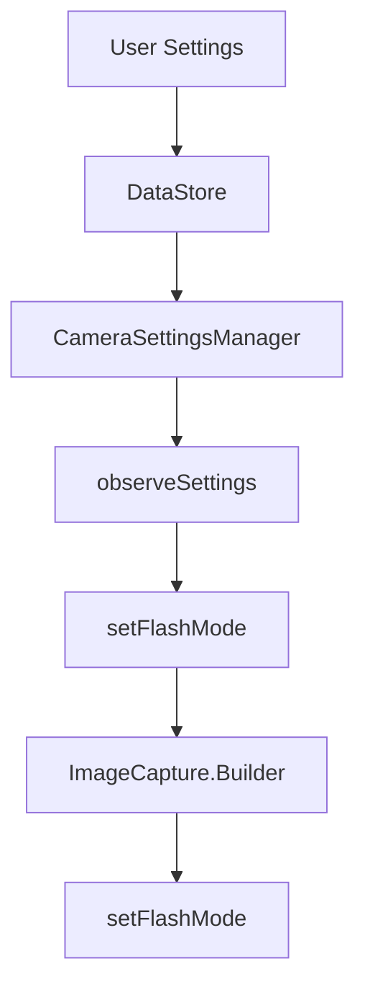

**Diagram sources **
- [CameraSettingsManager.kt](file://app/src/main/java/com/example/b1void/data/CameraSettingsManager.kt#L23-L27)
- [CameraActivity.kt](file://app/src/main/java/com/example/b1void/activities/CameraActivity.kt#L274-L306)

### Target Resolution Configuration
The ImageCapture use case is configured with a specific target resolution based on user selection. The application queries available camera resolutions through Camera2 API characteristics and presents them in a resolution selector UI. When a resolution is selected, it is persisted in DataStore and applied to the ImageCapture builder.

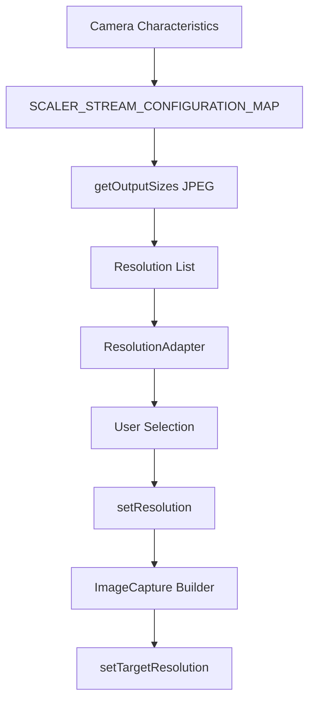

**Diagram sources **
- [CameraActivity.kt](file://app/src/main/java/com/example/b1void/activities/CameraActivity.kt#L410-L426)
- [ResolutionAdapter.kt](file://app/src/main/java/com/example/b1void/adapters/ResolutionAdapter.kt#L28-L47)

### Rotation Handling
The ImageCapture use case properly handles device rotation through the OrientationEventListener and Surface rotation constants. The system detects orientation changes and updates the target rotation for all camera use cases (preview, image capture, and video capture) to ensure proper image orientation regardless of device orientation.

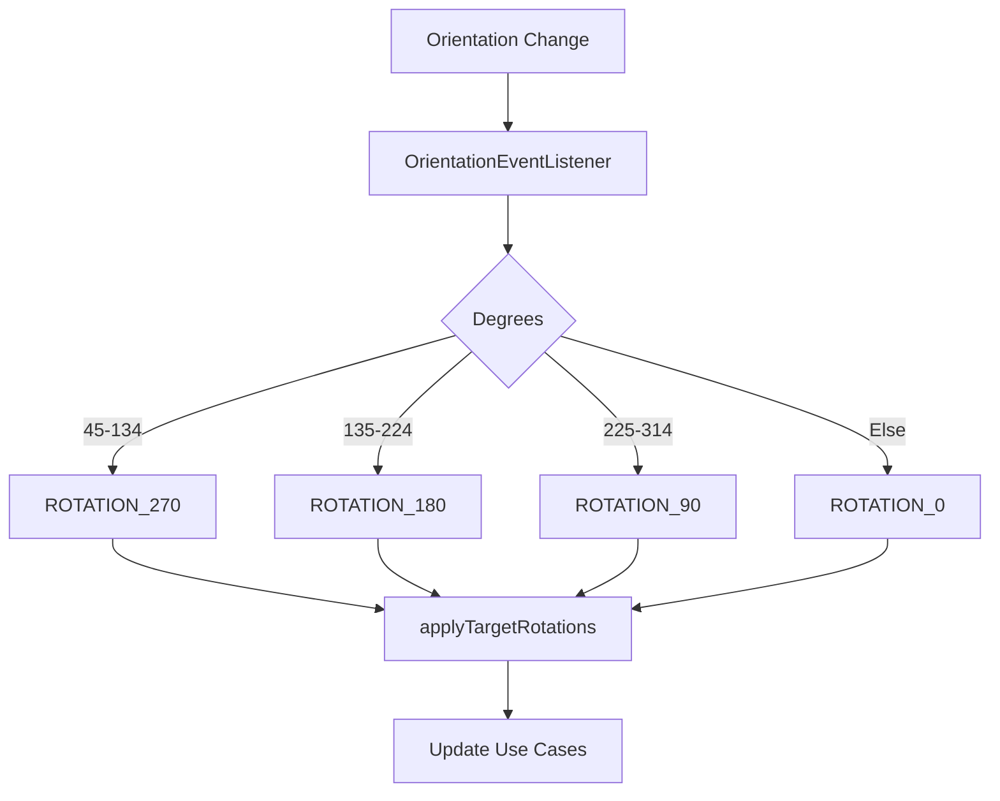

**Diagram sources **
- [CameraActivity.kt](file://app/src/main/java/com/example/b1void/activities/CameraActivity.kt#L602-L627)
- [CameraActivity.kt](file://app/src/main/java/com/example/b1void/activities/CameraActivity.kt#L629-L633)

**Section sources**
- [CameraActivity.kt](file://app/src/main/java/com/example/b1void/activities/CameraActivity.kt#L351-L399)

## Photo Capture Pipeline

### Button Press to Capture Initiation
The photo capture process begins when the user presses the capture button in PHOTO mode. The takePhoto() method is triggered, which accesses the ImageCapture instance and initiates the capture process by calling takePicture() with a camera executor and an OnImageCapturedCallback implementation.

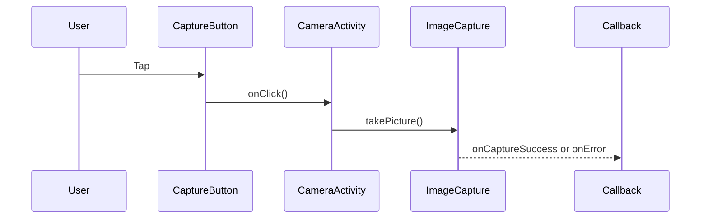

**Diagram sources **
- [CameraActivity.kt](file://app/src/main/java/com/example/b1void/activities/CameraActivity.kt#L672-L707)

### Image Capture Callback Flow
The OnImageCapturedCallback handles both successful captures and errors. On success, the captured ImageProxy is converted to a Bitmap, rotated according to the device orientation, processed with timestamp overlay if enabled, saved to storage, and used to update the thumbnail preview with visual feedback.

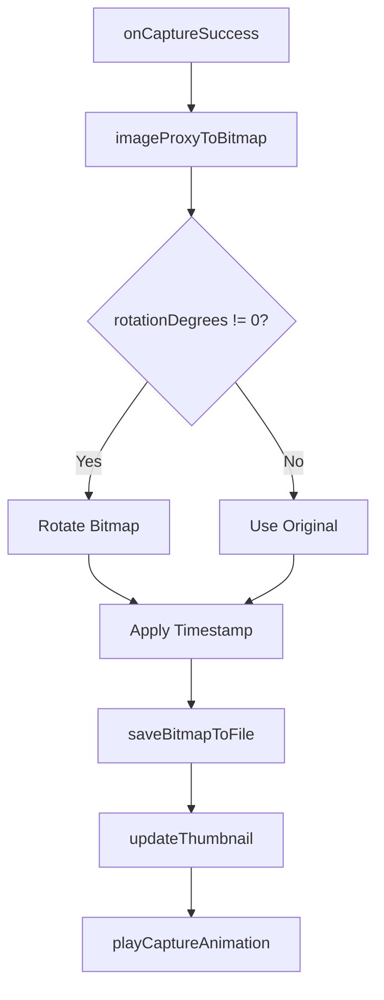

**Diagram sources **
- [CameraActivity.kt](file://app/src/main/java/com/example/b1void/activities/CameraActivity.kt#L672-L707)

**Section sources**
- [CameraActivity.kt](file://app/src/main/java/com/example/b1void/activities/CameraActivity.kt#L672-L707)

## Bitmap Processing and Timestamp Overlay

### Bitmap Conversion Process
The captured ImageProxy is converted to a Bitmap by extracting the pixel data from the image planes. The first plane contains the JPEG data, which is copied to a byte array and decoded using BitmapFactory.

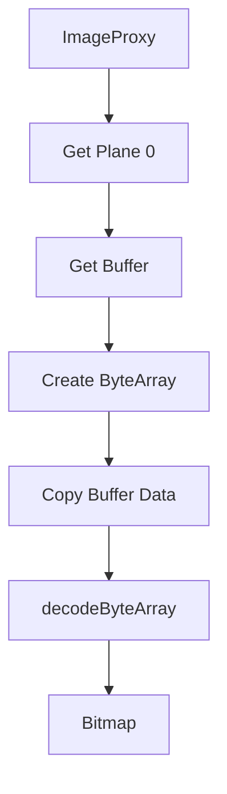

**Diagram sources **
- [CameraActivity.kt](file://app/src/main/java/com/example/b1void/activities/CameraActivity.kt#L709-L715)

### Timestamp Overlay Implementation
The timestamp overlay is implemented using Android's Canvas and Paint classes. The system creates a mutable copy of the original bitmap, sets up a red-colored Paint object with anti-aliasing, formats the current date and time, and draws the text in the bottom-right corner with appropriate padding.

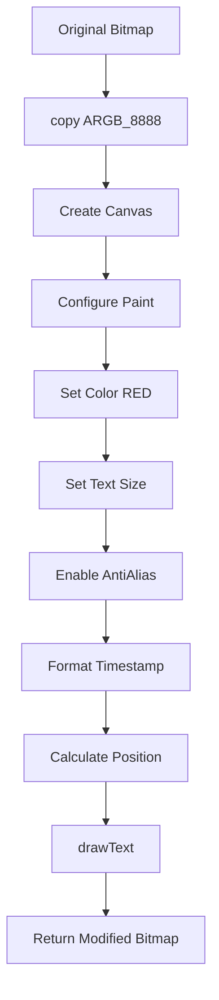

**Diagram sources **
- [CameraActivity.kt](file://app/src/main/java/com/example/b1void/activities/CameraActivity.kt#L717-L737)

### JPEG Compression and File Saving
The processed bitmap is saved as a JPEG file with 95% quality compression. The file is named with a timestamp prefix and saved to the designated storage directory, which is either provided via intent extra or defaults to external media directories.

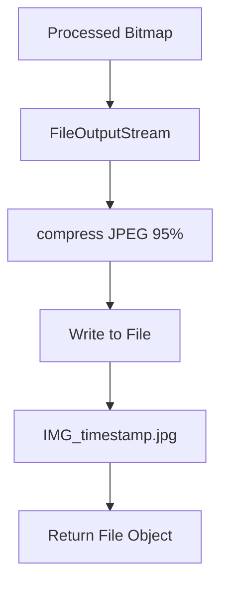

**Diagram sources **
- [CameraActivity.kt](file://app/src/main/java/com/example/b1void/activities/CameraActivity.kt#L739-L746)

**Section sources**
- [CameraActivity.kt](file://app/src/main/java/com/example/b1void/activities/CameraActivity.kt#L717-L746)

## Thumbnail Update Mechanism

### Glide Integration for Thumbnail Loading
The application uses Glide library to efficiently load and display thumbnails. After a photo is captured and saved, the thumbnail preview is updated by loading the newly created image file URI into the ImageView with circle cropping transformation.

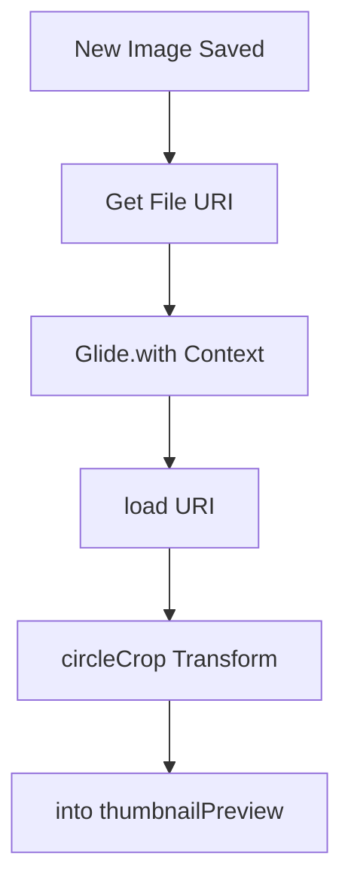

**Diagram sources **
- [CameraActivity.kt](file://app/src/main/java/com/example/b1void/activities/CameraActivity.kt#L786-L793)

### Thumbnail Click Handling
The thumbnail preview is clickable, allowing users to view their recently captured images. When clicked, the application checks if the last saved file exists and launches the ImagePreviewActivity with the appropriate image path and index.

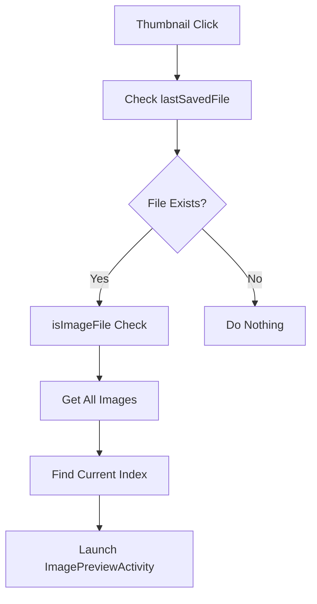

**Section sources**
- [CameraActivity.kt](file://app/src/main/java/com/example/b1void/activities/CameraActivity.kt#L240-L268)

## Visual Feedback Animation

### Capture Animation Sequence
The visual feedback animation provides immediate confirmation of photo capture by animating the captured image from the center of the screen to the thumbnail preview location. The animation consists of two phases: an initial scale-up and fade-in, followed by a translation to the thumbnail position with scaling down and fade-out.

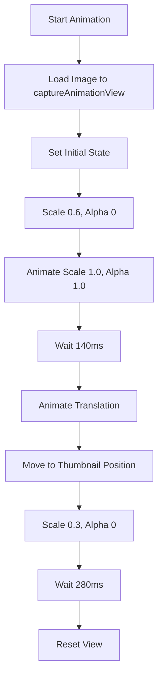

**Diagram sources **
- [CameraActivity.kt](file://app/src/main/java/com/example/b1void/activities/CameraActivity.kt#L547-L600)

### Animation Interpolation
The animation uses different interpolators for each phase to create a natural feel. The initial appearance uses DecelerateInterpolator for a smooth start, while the movement phase uses AccelerateInterpolator for a quick finish, mimicking real-world physics.

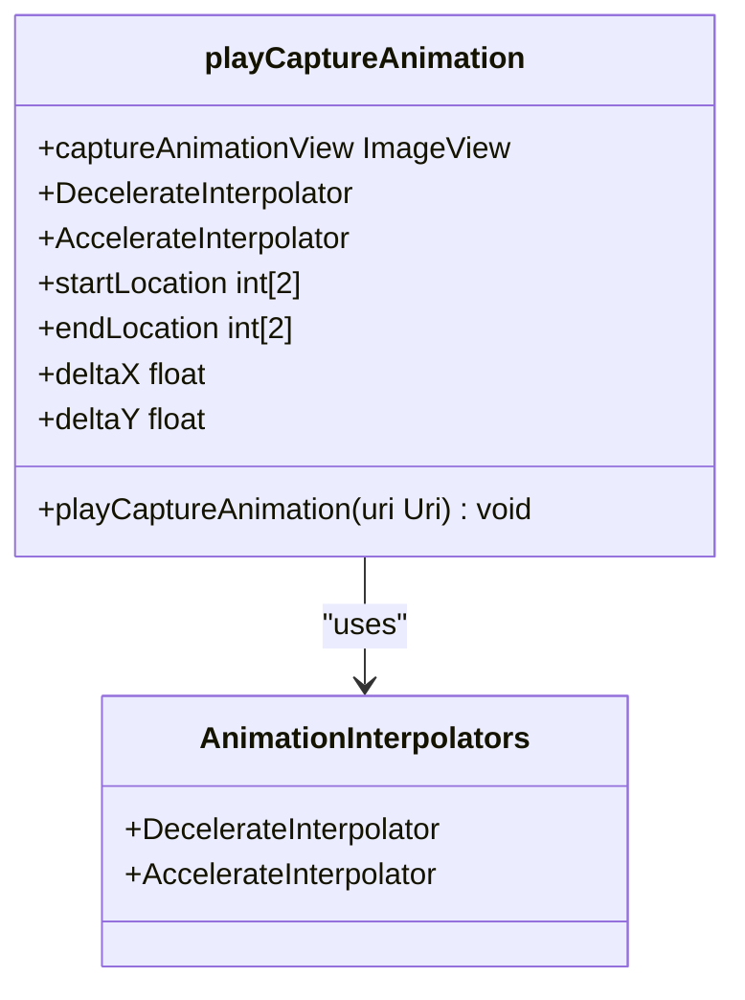

**Diagram sources **
- [CameraActivity.kt](file://app/src/main/java/com/example/b1void/activities/CameraActivity.kt#L547-L600)

**Section sources**
- [CameraActivity.kt](file://app/src/main/java/com/example/b1void/activities/CameraActivity.kt#L547-L600)

## Error Handling and Permissions

### Capture Failure Handling
The application implements robust error handling for photo capture failures through the OnImageCapturedCallback's onError method. Any capture exceptions are logged with error level, providing diagnostic information while maintaining application stability.

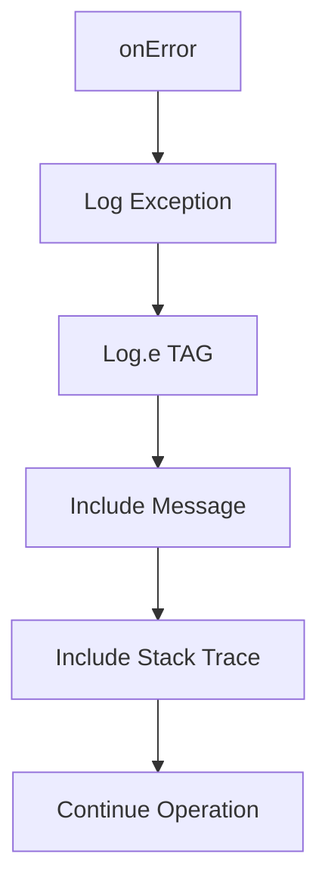

**Section sources**
- [CameraActivity.kt](file://app/src/main/java/com/example/b1void/activities/CameraActivity.kt#L672-L707)

### Permission Requirements
The photo capture feature requires CAMERA and RECORD_AUDIO permissions, with the latter needed due to shared components with video recording functionality. The application checks for these permissions on startup and requests them if not granted, terminating gracefully if permissions are denied.

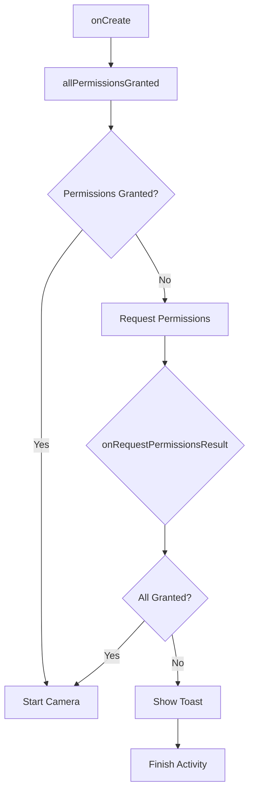

**Section sources**
- [CameraActivity.kt](file://app/src/main/java/com/example/b1void/activities/CameraActivity.kt#L150-L158)

## Performance Considerations

### Memory Management During Bitmap Processing
The application manages memory carefully during bitmap processing by using efficient conversion methods and ensuring proper resource cleanup. The ImageProxy is closed after conversion to free native resources, and bitmaps are processed in-place when possible to minimize memory allocation.

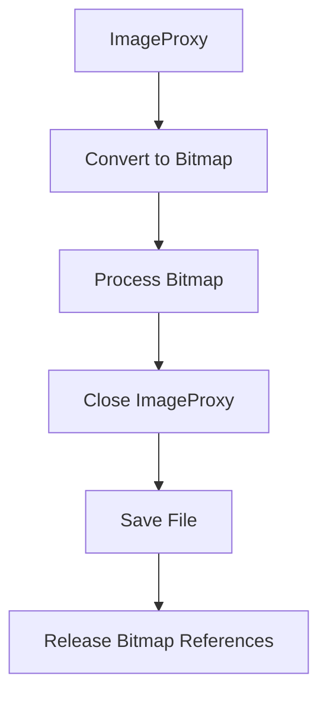

### Storage Optimization
The application optimizes storage usage through JPEG compression at 95% quality, which provides excellent visual quality while significantly reducing file size compared to lossless formats. Files are named with timestamps to ensure uniqueness without requiring additional metadata storage.

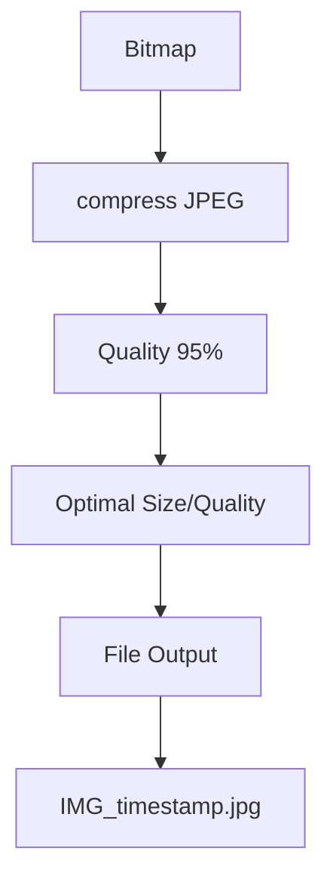

**Section sources**
- [CameraActivity.kt](file://app/src/main/java/com/example/b1void/activities/CameraActivity.kt#L739-L746)