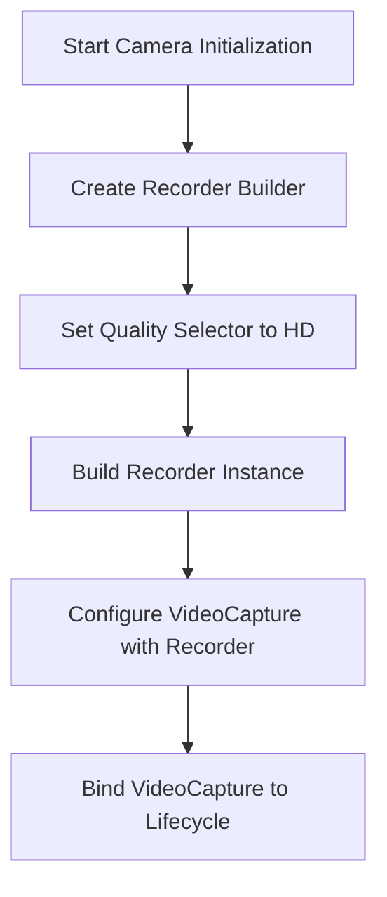
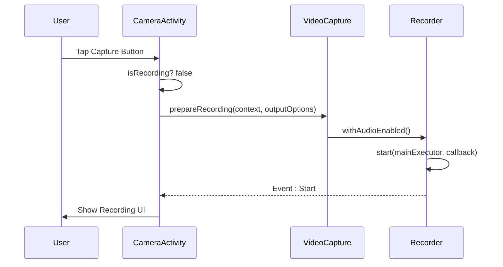
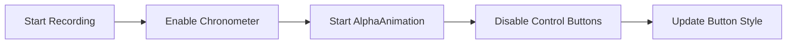
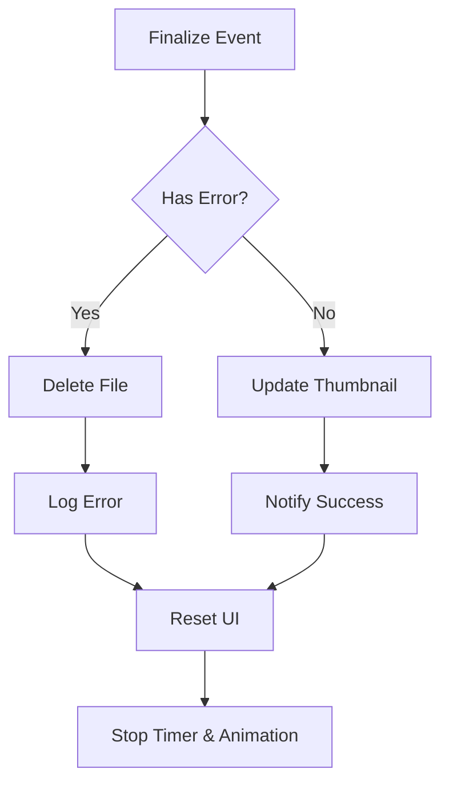

# Video Recording

<cite>
**Referenced Files in This Document**   
- [CameraActivity.kt](file://app/src/main/java/com/example/b1void/activities/CameraActivity.kt)
- [CameraSettingsManager.kt](file://app/src/main/java/com/example/b1void/data/CameraSettingsManager.kt)
- [ResolutionAdapter.kt](file://app/src/main/java/com/example/b1void/adapters/ResolutionAdapter.kt)
- [CameraSettingsDialogFragment.kt](file://app/src/main/java/com/example/b1void/ui/CameraSettingsDialogFragment.kt)
</cite>

## Table of Contents
1. [Introduction](#introduction)
2. [Video Recording Implementation](#video-recording-implementation)
3. [HD Quality Selection and Recorder Configuration](#hd-quality-selection-and-recorder-configuration)
4. [Recording Workflow: Start and Stop Triggers](#recording-workflow-start-and-stop-triggers)
5. [MediaStore Integration and Filename Generation](#mediastore-integration-and-filename-generation)
6. [User Interface Feedback During Recording](#user-interface-feedback-during-recording)
7. [Error Handling and Corrupted File Cleanup](#error-handling-and-corrupted-file-cleanup)
8. [Audio Enablement and Orientation Handling](#audio-enablement-and-orientation-handling)
9. [Preparing Recording Output Options](#preparing-recording-output-options)
10. [Handling VideoRecordEvent Callbacks](#handling-videorecordevent-callbacks)
11. [Performance Considerations](#performance-considerations)
12. [Conclusion](#conclusion)

## Introduction
This document provides a comprehensive analysis of the video recording functionality implemented in the `CameraActivity` class of the B1Void application. The implementation leverages Android's CameraX library, specifically using the `Recorder` and `VideoCapture` components to enable high-definition (HD) video recording. The system supports dynamic resolution selection, audio capture, orientation tracking, and responsive UI feedback during recording sessions. This documentation details the architecture, workflow, error handling, and performance considerations involved in the video recording feature.

## Video Recording Implementation
The video recording functionality is managed within the `CameraActivity` class, which extends `AppCompatActivity`. The core components for video capture are initialized using CameraX’s modern API, ensuring compatibility across various Android devices. The `VideoCapture` component is configured with a `Recorder` instance that defines output quality and encoding settings. The activity handles lifecycle events to properly bind and unbind use cases, manage permissions, and maintain camera state across configuration changes.

Key responsibilities include:
- Managing camera lifecycle via `ProcessCameraProvider`
- Binding preview, image capture, and video capture use cases
- Responding to user input for mode switching between photo and video
- Coordinating UI updates during recording states

**Section sources**
- [CameraActivity.kt](file://app/src/main/java/com/example/b1void/activities/CameraActivity.kt#L76-L880)

## HD Quality Selection and Recorder Configuration
High-definition video recording is achieved through explicit configuration of the `Recorder` class from CameraX. In the `startCamera()` method, a `Recorder.Builder` is used to set the desired quality level by specifying `Quality.HD` via `QualitySelector.from(Quality.HD)`.



This ensures that the recorded videos are encoded at 720p resolution or higher, depending on device capabilities. The `QualitySelector` automatically adapts to the best available HD profile supported by the hardware, providing consistent output quality while maintaining performance.

**Diagram sources**
- [CameraActivity.kt](file://app/src/main/java/com/example/b1void/activities/CameraActivity.kt#L351-L399)

**Section sources**
- [CameraActivity.kt](file://app/src/main/java/com/example/b1void/activities/CameraActivity.kt#L351-L399)

## Recording Workflow: Start and Stop Triggers
The recording process is controlled through the `toggleVideoRecording()` method, which acts as a state machine for starting and stopping recordings. When the user taps the capture button in video mode:

1. If not already recording, it prepares a new recording session.
2. If currently recording, it stops the ongoing recording.

The transition is triggered by checking the `isRecording` flag. Upon initiation, the system creates a `FileOutputOptions` object pointing to a timestamped file name in the designated save directory. The recording is started asynchronously with callbacks delivered on the main thread executor.



**Diagram sources**
- [CameraActivity.kt](file://app/src/main/java/com/example/b1void/activities/CameraActivity.kt#L748-L784)

**Section sources**
- [CameraActivity.kt](file://app/src/main/java/com/example/b1void/activities/CameraActivity.kt#L748-L784)

## MediaStore Integration and Filename Generation
Videos are saved directly to external storage using a file-based approach rather than direct MediaStore insertion. However, the generated files are immediately accessible to the media scanner due to their location in standard media directories (`externalMediaDirs`).

Filename generation follows a deterministic pattern using timestamps:
- Format: `"VID_${System.currentTimeMillis()}.mp4"`
- Ensures uniqueness and chronological sorting
- Uses UTC time via `System.currentTimeMillis()` for consistency

The file is created under the directory specified by the `EXTRA_SAVE_PATH` intent parameter or defaults to the first available external media directory. After successful recording, the output URI is passed to `updateThumbnail()` to refresh the preview thumbnail in the UI.

**Section sources**
- [CameraActivity.kt](file://app/src/main/java/com/example/b1void/activities/CameraActivity.kt#L748-L784)

## User Interface Feedback During Recording
During active recording, the application provides multiple visual cues to indicate status:

### Chronometer Display
A `Chronometer` widget (`recordingTimer`) starts counting up from zero when recording begins. It displays elapsed time in minutes and seconds, enhancing user awareness of recording duration.

### Button Animation with AlphaAnimation
The capture button undergoes visual transformation:
- Background changes to red indicator style
- An `AlphaAnimation` pulses opacity between 50% and 100%
- Animation repeats infinitely until recording stops

```kotlin
val anim = AlphaAnimation(0.5f, 1.0f).apply {
    duration = 700
    repeatMode = Animation.REVERSE
    repeatCount = Animation.INFINITE
}
captureButton.startAnimation(anim)
```

### Disabled UI Controls
To prevent conflicting operations:
- Mode switch button is disabled
- Camera flip button is disabled
- Other interactive elements are locked

These changes are applied atomically via `startRecordingIndicator()` and reversed in `stopRecordingIndicator()`.



**Diagram sources**
- [CameraActivity.kt](file://app/src/main/java/com/example/b1void/activities/CameraActivity.kt#L795-L810)
- [CameraActivity.kt](file://app/src/main/java/com/example/b1void/activities/CameraActivity.kt#L812-L821)

**Section sources**
- [CameraActivity.kt](file://app/src/main/java/com/example/b1void/activities/CameraActivity.kt#L795-L821)

## Error Handling and Corrupted File Cleanup
Robust error handling is implemented through the `VideoRecordEvent.Finalize` callback. If the recording fails due to encoder issues, storage errors, or interruptions, the `hasError()` method returns true, and the associated exception can be logged.

Upon detection of an error:
- The corrupted video file is deleted using `videoFile.delete()`
- Logging occurs via `Log.e(TAG, "Video capture error: ...")`
- UI indicators are reset via `stopRecordingIndicator()`

This prevents partial or invalid files from persisting in storage and maintains application stability.



**Diagram sources**
- [CameraActivity.kt](file://app/src/main/java/com/example/b1void/activities/CameraActivity.kt#L748-L784)

**Section sources**
- [CameraActivity.kt](file://app/src/main/java/com/example/b1void/activities/CameraActivity.kt#L748-L784)

## Audio Enablement and Orientation Handling
### Audio Configuration
Audio recording is explicitly enabled using `.withAudioEnabled()` during the preparation phase:

```kotlin
recording = videoCapture.output
    .prepareRecording(this, outputOptions)
    .withAudioEnabled()
    .start(...)
```

This integrates microphone input into the final video stream, synchronized with video frames.

### Orientation Handling
Orientation changes are tracked using `OrientationEventListener`, which maps device rotation angles to `Surface.ROTATION_*` constants. When orientation changes:
- New rotation value is detected
- Only update if different from current
- Apply new rotation to all use cases via `applyTargetRotations()`

```kotlin
private fun applyTargetRotations(rotation: Int) {
    previewUseCase?.targetRotation = rotation
    imageCapture?.targetRotation = rotation
    videoCapture?.targetRotation = rotation
}
```

This ensures proper metadata embedding so videos play back correctly regardless of capture orientation.

**Diagram sources**
- [CameraActivity.kt](file://app/src/main/java/com/example/b1void/activities/CameraActivity.kt#L602-L627)
- [CameraActivity.kt](file://app/src/main/java/com/example/b1void/activities/CameraActivity.kt#L629-L633)

**Section sources**
- [CameraActivity.kt](file://app/src/main/java/com/example/b1void/activities/CameraActivity.kt#L602-L633)

## Preparing Recording Output Options
Before initiating a recording, output options are prepared using `FileOutputOptions.Builder`. This includes:
- Specifying the target `File` object
- Using `Context` and `FileOutputOptions` to define destination
- Building immutable options for the recorder

The file path is derived either from the intent's `EXTRA_SAVE_PATH` or falls back to `externalMediaDirs.firstOrNull()`, ensuring availability across device types.

```kotlin
val outputOptions = FileOutputOptions.Builder(videoFile).build()
```

This setup allows seamless integration with scoped storage policies and avoids permission issues on modern Android versions.

**Section sources**
- [CameraActivity.kt](file://app/src/main/java/com/example/b1void/activities/CameraActivity.kt#L748-L784)

## Handling VideoRecordEvent Callbacks
The `VideoRecordEvent` callback mechanism provides lifecycle updates during recording:

| Event Type | Action |
|-----------|--------|
| `VideoRecordEvent.Start` | No action needed; recording has begun |
| `VideoRecordEvent.Finalize` | Check result, handle success/failure |

The callback runs on the main thread via `ContextCompat.getMainExecutor(this)`, allowing safe UI manipulation. On finalize:
- Success: Update thumbnail with `outputResults.outputUri`
- Failure: Log error and delete corrupted file

This event-driven model decouples recording logic from UI concerns and enables clean separation of responsibilities.

**Section sources**
- [CameraActivity.kt](file://app/src/main/java/com/example/b1void/activities/CameraActivity.kt#L748-L784)

## Performance Considerations
Several performance optimizations are implemented:

### Thermal Throttling Mitigation
Long recordings may trigger thermal throttling. To mitigate:
- HD quality balances clarity and resource usage
- Camera is unbound on pause to release hardware resources
- Executor service is shut down cleanly in `onDestroy()`

### Battery Optimization
- Screen stays on only during active use via `FLAG_KEEP_SCREEN_ON`
- Released in `onPause()` to prevent battery drain
- Orientation listener disabled when inactive

### Memory Management
- `cameraExecutor` uses single-threaded pool to limit concurrency
- Glide manages thumbnail memory efficiently
- Animations canceled explicitly during destruction

Additionally, the app requests minimal required permissions (`CAMERA`, `RECORD_AUDIO`) and gracefully handles denial without crashing.

**Section sources**
- [CameraActivity.kt](file://app/src/main/java/com/example/b1void/activities/CameraActivity.kt#L849-L871)

## Conclusion
The video recording implementation in `CameraActivity` demonstrates a robust, user-friendly approach leveraging modern Android CameraX APIs. By combining `Recorder` with `VideoCapture`, the app achieves HD-quality video output with reliable audio support. The integration of real-time UI feedback, orientation adaptation, and error resilience ensures a professional-grade experience. With careful attention to lifecycle management, file handling, and performance optimization, the solution is well-suited for field inspection scenarios where reliability and usability are paramount.