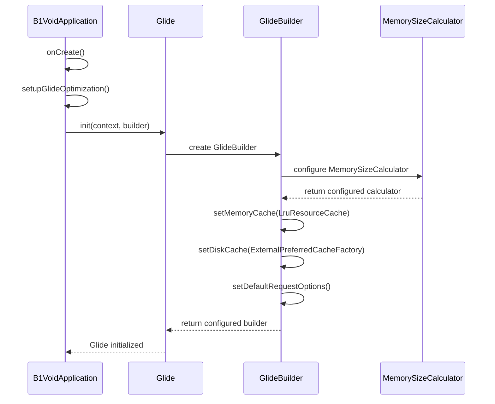
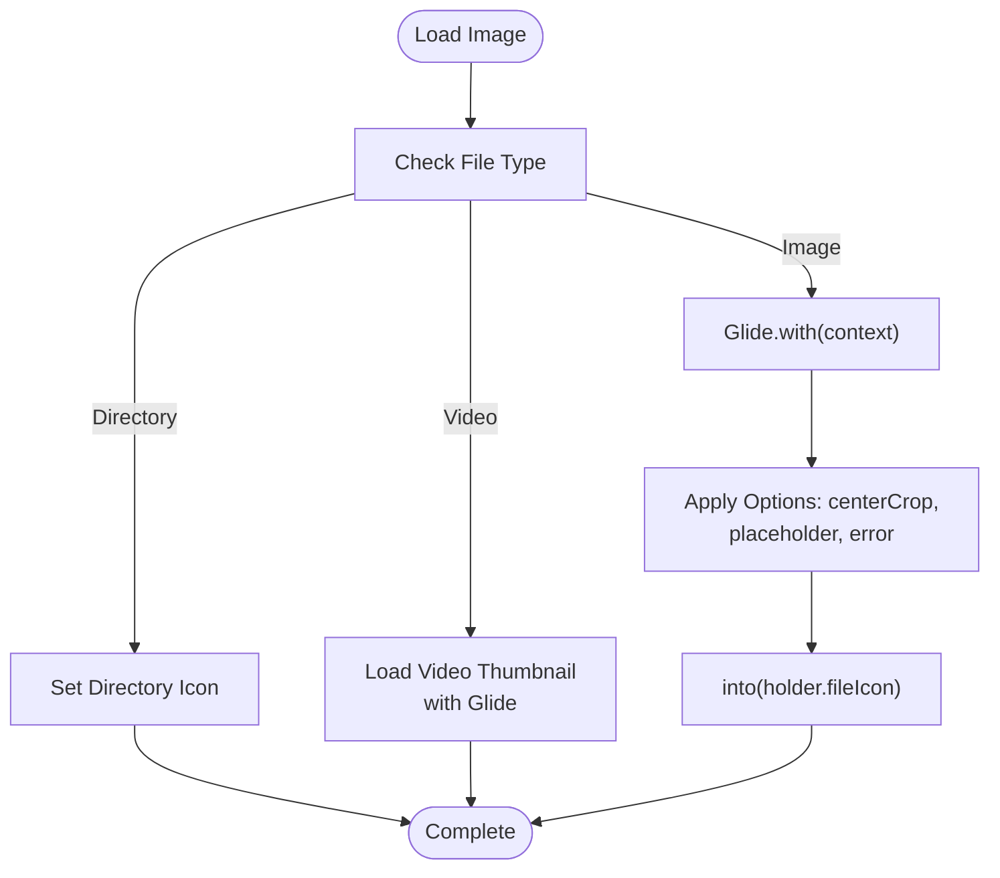
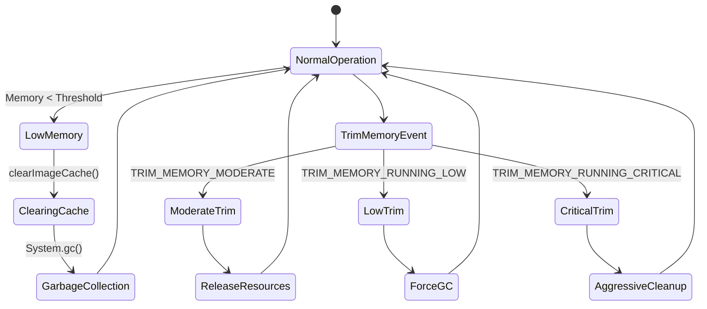

# Caching Strategy with Glide

<cite>
**Referenced Files in This Document **   
- [B1VoidApplication.kt](file://app/src/main/java/com/example/b1void/B1VoidApplication.kt)
- [FileAdapter.kt](file://app/src/main/java/com/example/b1void/adapters/FileAdapter.kt)
- [InspectionAdapter.java](file://app/src/main/java/com/example/b1void/adapters/InspectionAdapter.java)
- [MemoryManager.kt](file://app/src/main/java/com/example/b1void/utils/MemoryManager.kt)
- [ImageOptimizer.kt](file://app/src/main/java/com/example/b1void/utils/ImageOptimizer.kt)
</cite>

## Table of Contents
1. [Introduction](#introduction)
2. [Glide Initialization and Configuration](#glide-initialization-and-configuration)
3. [Memory Cache Configuration](#memory-cache-configuration)
4. [Disk Cache Configuration](#disk-cache-configuration)
5. [Global Request Options](#global-request-options)
6. [Image Loading in RecyclerView Adapters](#image-loading-in-recyclerview-adapters)
7. [Cache Invalidation and Memory Management](#cache-invalidation-and-memory-management)
8. [High-Resolution Image Handling](#high-resolution-image-handling)
9. [Optimization Best Practices](#optimization-best-practices)
10. [Performance Monitoring and Tuning](#performance-monitoring-and-tuning)

## Introduction
This document details the image caching strategy implemented using Glide in the B1Void application. The caching system is specifically designed to support the app's inspection workflow, which involves frequent loading and display of images in list views and detail screens. The implementation focuses on optimizing memory usage, preventing OutOfMemory (OOM) errors on low-end devices, and ensuring smooth scrolling performance in RecyclerView components. The strategy combines customized memory and disk cache configurations with global request options and integration with the app's memory management system.

## Glide Initialization and Configuration

The Glide library is initialized in the `B1VoidApplication` class during the application startup process. This ensures that the custom caching configuration is applied before any image loading operations occur throughout the application lifecycle.

**Diagram sources**
- [B1VoidApplication.kt](file://app/src/main/java/com/example/b1void/B1VoidApplication.kt#L14-L53)

**Section sources**
- [B1VoidApplication.kt](file://app/src/main/java/com/example/b1void/B1VoidApplication.kt#L14-L53)

## Memory Cache Configuration

The memory cache is configured using the `MemorySizeCalculator.Builder` with a specific focus on the device's screen characteristics. The application sets the memory cache size to accommodate approximately two full-screen images, which provides optimal performance for list scrolling while minimizing memory pressure.

The `setMemoryCacheScreens(2f)` method configures the cache to hold enough bitmap memory for two screen-sized images. This value was chosen to balance between having sufficient cached images for smooth scrolling in RecyclerView components and conserving RAM for other application functions. The calculated memory size is then used to initialize an `LruResourceCache` instance, which implements a Least Recently Used eviction policy.

This configuration ensures that recently viewed images remain in memory cache, reducing disk I/O operations when users scroll through lists or navigate back to previously viewed screens. The LRU algorithm automatically removes the least recently accessed items when the cache reaches its capacity, maintaining optimal performance without manual cache management.

**Section sources**
- [B1VoidApplication.kt](file://app/src/main/java/com/example/b1void/B1VoidApplication.kt#L30-L33)

## Disk Cache Configuration

The disk cache is configured using `ExternalPreferredCacheDiskCacheFactory`, which stores cached images in external storage when available. This approach provides several advantages for the inspection workflow:

1. **Durability**: Images persist across application sessions, reducing network bandwidth usage and improving load times for frequently accessed inspection images.
2. **Capacity**: External storage typically offers more space than internal storage, allowing for a larger cache size.
3. **Separation**: Keeping cache data on external storage helps preserve internal storage space for critical application data.

The disk cache is limited to 50MB (50 * 1024 * 1024 bytes) to prevent excessive storage consumption while still providing substantial caching benefits. This size was determined based on typical inspection image sizes and the expected number of recent images users would access during a session.

The cache directory is named "glide_cache" for easy identification and management. This external cache location is particularly beneficial for field inspectors who may have limited internet connectivity, as previously viewed inspection images remain available even when offline.

**Section sources**
- [B1VoidApplication.kt](file://app/src/main/java/com/example/b1void/B1VoidApplication.kt#L34-L35)

## Global Request Options

The application applies global request options to optimize image rendering performance across all components. The primary option configured is `dontAnimate()`, which disables default animation effects during image loading.

This optimization is crucial for RecyclerView adapters like `FileAdapter` and `InspectionAdapter`, where numerous images are loaded simultaneously during scrolling. Animations on each image load would significantly impact frame rate and create a choppy user experience, especially on lower-end devices.

By setting this as a default option in the Glide initialization, the application ensures consistent behavior across all image loading operations without requiring explicit configuration in each individual image load call. This approach reduces code duplication and guarantees that performance optimizations are applied universally throughout the application.

Additional request options could be added to this configuration in the future, such as default placeholders or error drawables, to further standardize image loading behavior.

**Section sources**
- [B1VoidApplication.kt](file://app/src/main/java/com/example/b1void/B1VoidApplication.kt#L36-L39)

## Image Loading in RecyclerView Adapters

The caching strategy is effectively implemented in RecyclerView adapters to ensure efficient image loading while preventing OOM errors. Two primary adapters demonstrate this implementation:

### FileAdapter Implementation

The `FileAdapter` handles various file types including images, videos, and directories. For image files, it uses Glide with specific options tailored to the UI requirements:

**Diagram sources**
- [FileAdapter.kt](file://app/src/main/java/com/example/b1void/adapters/FileAdapter.kt#L58-L78)

The adapter applies `centerCrop()` transformation to ensure consistent thumbnail sizing, along with placeholder and error drawables (`R.drawable.image_ic`) to provide visual feedback during loading and in case of failures. These options work in conjunction with the global `dontAnimate()` setting to ensure smooth scrolling performance.

### InspectionAdapter Implementation

The `InspectionAdapter` demonstrates a simpler implementation for displaying inspection records in a list format. While less complex than the `FileAdapter`, it still benefits from the global Glide configuration, ensuring consistent image loading behavior across different UI components.

Both adapters leverage the pre-configured memory and disk caches, allowing images to be quickly retrieved from cache when users scroll through lists or navigate between screens.

**Section sources**
- [FileAdapter.kt](file://app/src/main/java/com/example/b1void/adapters/FileAdapter.kt#L58-L88)
- [InspectionAdapter.java](file://app/src/main/java/com/example/b1void/adapters/InspectionAdapter.java#L14-L41)

## Cache Invalidation and Memory Management

The application implements a comprehensive cache invalidation and memory management strategy that integrates with Android's lifecycle events and system resource monitoring.

### Automatic Cache Clearing

The `MemoryManager` class monitors available system memory and triggers cache cleanup when memory falls below a threshold (50MB). When low memory conditions are detected, the system:

1. Clears the Glide disk cache by deleting the "glide_cache" directory
2. Invokes the garbage collector to reclaim unused memory
3. Logs warning messages for monitoring purposes

This proactive approach prevents OOM errors on low-end devices by releasing cached image data before memory pressure becomes critical.

### System Event Integration

The application responds to Android's trim memory events through the `onTrimMemory()` method in `MemoryManager`. Different memory pressure levels trigger appropriate responses:

- **UI Hidden**: Clears UI-related caches
- **Running Low/Critical**: Forces garbage collection and clears non-essential resources
- **Background/Complete**: Cleans up background resources and caches

These responses ensure that the application gracefully handles memory pressure from the operating system, improving overall stability and user experience.

**Diagram sources**
- [MemoryManager.kt](file://app/src/main/java/com/example/b1void/utils/MemoryManager.kt#L58-L104)
- [ImageOptimizer.kt](file://app/src/main/java/com/example/b1void/utils/ImageOptimizer.kt#L154-L170)

**Section sources**
- [MemoryManager.kt](file://app/src/main/java/com/example/b1void/utils/MemoryManager.kt#L58-L104)
- [ImageOptimizer.kt](file://app/src/main/java/com/example/b1void/utils/ImageOptimizer.kt#L154-L170)

## High-Resolution Image Handling

The application addresses high-resolution image handling through a combination of Glide's built-in capabilities and custom optimization utilities. The `ImageOptimizer` class provides additional processing for large images:

1. **Downsampling**: Uses `BitmapFactory.Options.inSampleSize` to load scaled-down versions of large images
2. **Memory-Efficient Configuration**: Sets `inPreferredConfig` to `RGB_565` to reduce memory footprint
3. **Quality Control**: Applies configurable compression quality (default 80%) to balance file size and visual quality

For display in list items, Glide automatically transforms high-resolution images to appropriate thumbnail sizes using the `centerCrop()` transformation. This prevents loading full-resolution images into memory when only small thumbnails are needed, significantly reducing memory usage.

The maximum image size is capped at 1024 pixels (defined in `B1VoidApplication.MAX_IMAGE_SIZE`) to prevent excessively large images from consuming disproportionate memory resources.

**Section sources**
- [ImageOptimizer.kt](file://app/src/main/java/com/example/b1void/utils/ImageOptimizer.kt#L16-L153)
- [B1VoidApplication.kt](file://app/src/main/java/com/example/b1void/B1VoidApplication.kt#L50)

## Optimization Best Practices

The implementation follows several best practices for optimal image loading performance:

### Placeholder Usage
The application consistently uses appropriate placeholder drawables (`R.drawable.image_ic`) that match the expected aspect ratio of target images. This prevents layout jumps during image loading and provides immediate visual feedback to users.

### Thumbnail Generation
While not explicitly implemented in the current code, Glide's built-in thumbnail support could be leveraged to show low-resolution previews while high-resolution images load from disk or network.

### Device-Specific Optimization
The `MemoryManager.getOptimizedSettings()` method provides device-aware configuration, suggesting lower cache sizes (25MB vs 50MB) and image quality settings for low-end devices. This adaptive approach ensures acceptable performance across a range of hardware capabilities.

### Efficient Resource Recycling
Bitmaps are properly recycled after use, and the application avoids holding long-lived references to bitmap objects, allowing the garbage collector to reclaim memory efficiently.

**Section sources**
- [FileAdapter.kt](file://app/src/main/java/com/example/b1void/adapters/FileAdapter.kt#L70-L71)
- [MemoryManager.kt](file://app/src/main/java/com/example/b1void/utils/MemoryManager.kt#L117-L132)
- [ImageOptimizer.kt](file://app/src/main/java/com/example/b1void/utils/ImageOptimizer.kt#L110-L113)

## Performance Monitoring and Tuning

The caching strategy includes mechanisms for monitoring and tuning performance:

1. **Memory Monitoring**: The `MemoryManager` provides detailed information about available, total, and threshold memory levels
2. **Logging**: Comprehensive logging at different severity levels (DEBUG, WARN, ERROR) helps identify potential issues
3. **Configuration Constants**: Key parameters are defined as constants in `B1VoidApplication`, making them easy to adjust and tune

To monitor cache hit rates, developers could implement Glide's `RequestListener` to track successful cache hits versus disk/network loads. This data could inform future optimizations to cache sizes and eviction policies.

The current configuration represents a balanced approach optimized for the inspection workflow, where users frequently review image-heavy inspection records. The 2-screen memory cache and 50MB disk cache provide responsive performance while remaining mindful of device resource constraints.

**Section sources**
- [MemoryManager.kt](file://app/src/main/java/com/example/b1void/utils/MemoryManager.kt#L106-L115)
- [B1VoidApplication.kt](file://app/src/main/java/com/example/b1void/B1VoidApplication.kt#L48-L50)