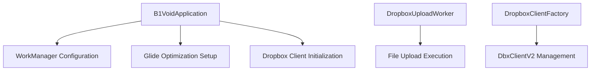
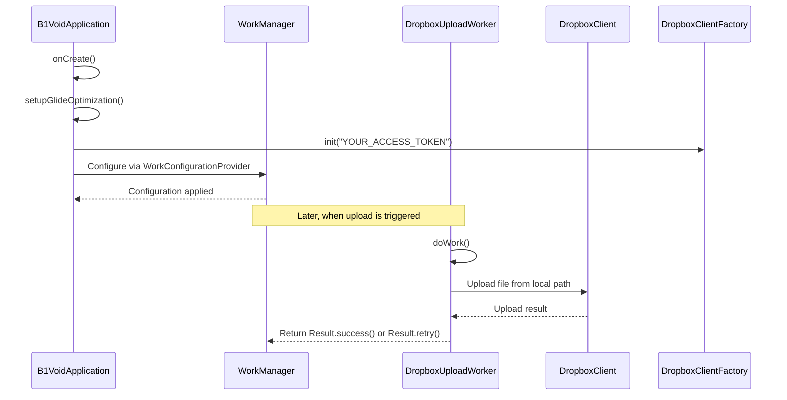
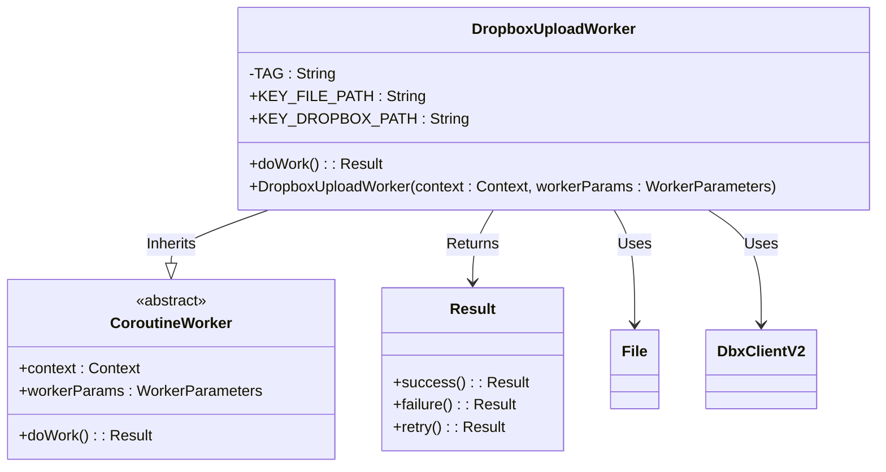
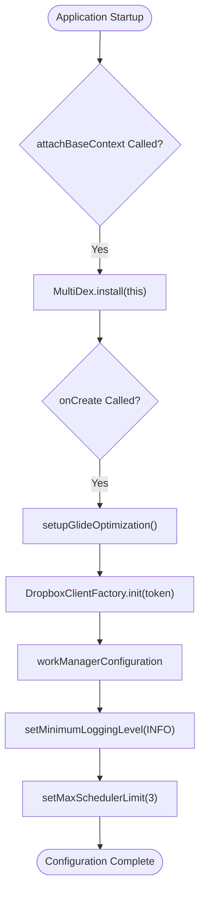
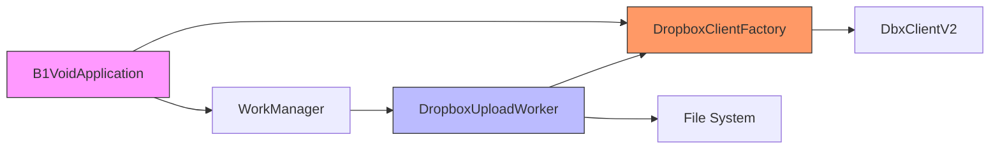

# Background Synchronization Strategy

<cite>
**Referenced Files in This Document **   
- [B1VoidApplication.kt](file://app/src/main/java/com/example/b1void/B1VoidApplication.kt)
- [DropboxUploadWorker.kt](file://app/src/main/java/com/example/b1void/workers/DropboxUploadWorker.kt)
- [DropboxClientFactory.kt](file://app/src/main/java/com/example/b1void/utils/DropboxClientFactory.kt)
- [AndroidManifest.xml](file://app/src/main/AndroidManifest.xml)
</cite>

## Table of Contents
1. [Introduction](#introduction)
2. [Project Structure](#project-structure)
3. [Core Components](#core-components)
4. [Architecture Overview](#architecture-overview)
5. [Detailed Component Analysis](#detailed-component-analysis)
6. [Dependency Analysis](#dependency-analysis)
7. [Performance Considerations](#performance-considerations)
8. [Troubleshooting Guide](#troubleshooting-guide)
9. [Conclusion](#conclusion)

## Introduction
The B1Void application implements a robust background synchronization strategy using Android's WorkManager to ensure reliable data syncing with Dropbox. This document details how the app initializes periodic and one-time work requests during startup, manages constraints such as network availability, handles retry policies, and integrates with system-level features like Doze mode. The architecture leverages lifecycle-aware scheduling to maintain sync reliability while respecting device resource constraints.

## Project Structure
The project follows a standard Android application structure with clear separation of concerns. Key components related to background synchronization are organized under specific packages:
- `workers/`: Contains the `DropboxUploadWorker` responsible for executing background upload tasks.
- `utils/`: Houses utility classes including `DropboxClientFactory` for managing Dropbox API connections.
- `application class`: The `B1VoidApplication` class configures WorkManager and initializes core services at startup.



**Diagram sources **
- [B1VoidApplication.kt](file://app/src/main/java/com/example/b1void/B1VoidApplication.kt#L14-L53)
- [DropboxUploadWorker.kt](file://app/src/main/java/com/example/b1void/workers/DropboxUploadWorker.kt#L16-L56)
- [DropboxClientFactory.kt](file://app/src/main/java/com/example/b1void/utils/DropboxClientFactory.kt#L1-L23)

**Section sources**
- [B1VoidApplication.kt](file://app/src/main/java/com/example/b1void/B1VoidApplication.kt#L14-L53)
- [AndroidManifest.xml](file://app/src/main/AndroidManifest.xml#L1-L136)

## Core Components
The background synchronization system is built around three core components: the application class that configures WorkManager, the worker implementation that performs file uploads, and the client factory that manages Dropbox connectivity. These components work together to ensure reliable, constrained execution of background tasks.

**Section sources**
- [B1VoidApplication.kt](file://app/src/main/java/com/example/b1void/B1VoidApplication.kt#L14-L53)
- [DropboxUploadWorker.kt](file://app/src/main/java/com/example/b1void/workers/DropboxUploadWorker.kt#L16-L56)
- [DropboxClientFactory.kt](file://app/src/main/java/com/example/b1void/utils/DropboxClientFactory.kt#L1-L23)

## Architecture Overview
The synchronization architecture uses WorkManager as the central scheduler for background tasks. During application startup, the `B1VoidApplication` class configures WorkManager with custom settings and initializes the Dropbox client. Upload operations are encapsulated in the `DropboxUploadWorker`, which executes within WorkManager's lifecycle-aware environment, ensuring tasks survive process death and respect system constraints.



**Diagram sources **
- [B1VoidApplication.kt](file://app/src/main/java/com/example/b1void/B1VoidApplication.kt#L21-L25)
- [DropboxUploadWorker.kt](file://app/src/main/java/com/example/b1void/workers/DropboxUploadWorker.kt#L21-L49)

## Detailed Component Analysis

### DropboxUploadWorker Analysis
The `DropboxUploadWorker` is a CoroutineWorker implementation responsible for uploading files to Dropbox in the background. It receives input parameters specifying the local file path and target Dropbox path, then performs the upload operation within a coroutine context.

#### For Object-Oriented Components:


**Diagram sources **
- [DropboxUploadWorker.kt](file://app/src/main/java/com/example/b1void/workers/DropboxUploadWorker.kt#L16-L56)

#### For API/Service Components:
```mermaid
sequenceDiagram
participant Worker as DropboxUploadWorker
participant Input as inputData
participant File as File(filePath)
participant Dropbox as DbxClientV2
participant Result as Work Result
Worker->>Input : getString(KEY_FILE_PATH)
Input-->>Worker : filePath
Worker->>Input : getString(KEY_DROPBOX_PATH)
Input-->>Worker : dropboxPath
alt Path validation
Worker->>Worker : Check if file exists
File->>Worker : exists()
Worker-->>Result : Result.failure() if not exists
else Proceed with upload
Worker->>Dropbox : getClient()
Dropbox-->>Worker : DbxClientV2 instance
Worker->>Worker : withContext(Dispatchers.IO)
Worker->>Dropbox : uploadBuilder(dropboxPath)
Dropbox-->>Worker : Upload session
Worker-->>Result : Result.success()
end
catch DbxException
Worker->>Log : Log.e(TAG, "Dropbox upload failed", e)
Worker-->>Result : Result.retry()
catch Exception
Worker->>Log : Log.e(TAG, "Error during upload", e)
Worker-->>Result : Result.failure()
end
```

**Diagram sources **
- [DropboxUploadWorker.kt](file://app/src/main/java/com/example/b1void/workers/DropboxUploadWorker.kt#L21-L49)

**Section sources**
- [DropboxUploadWorker.kt](file://app/src/main/java/com/example/b1void/workers/DropboxUploadWorker.kt#L16-L56)

### B1VoidApplication Analysis
The application class serves as the entry point and configuration hub for the background synchronization system. It implements `WorkConfigurationProvider` to customize WorkManager behavior and initializes essential services during startup.

#### For Complex Logic Components:


**Diagram sources **
- [B1VoidApplication.kt](file://app/src/main/java/com/example/b1void/B1VoidApplication.kt#L14-L53)

**Section sources**
- [B1VoidApplication.kt](file://app/src/main/java/com/example/b1void/B1VoidApplication.kt#L14-L53)

## Dependency Analysis
The background synchronization components have well-defined dependencies that follow dependency inversion principles. The `DropboxUploadWorker` depends on the `DropboxClientFactory` for client access rather than creating clients directly, enabling better testability and lifecycle management.



**Diagram sources **
- [B1VoidApplication.kt](file://app/src/main/java/com/example/b1void/B1VoidApplication.kt#L14-L53)
- [DropboxUploadWorker.kt](file://app/src/main/java/com/example/b1void/workers/DropboxUploadWorker.kt#L16-L56)
- [DropboxClientFactory.kt](file://app/src/main/java/com/example/b1void/utils/DropboxClientFactory.kt#L1-L23)

## Performance Considerations
The application is configured with performance optimizations including Glide memory caching tuned for image handling and MultiDex support for large applications. WorkManager is configured with a maximum scheduler limit of 3 concurrent jobs to prevent resource contention. The app requests a large heap (`android:largeHeap="true"`) in the manifest to handle memory-intensive operations like image processing and file uploads.

## Troubleshooting Guide
When diagnosing synchronization issues, check the following areas:
- Ensure the Dropbox access token is properly configured in `DropboxClientFactory.init()`
- Verify required permissions are granted (INTERNET, WRITE_EXTERNAL_STORAGE)
- Check WorkManager logs at INFO level as configured in `workManagerConfiguration`
- Monitor for `FileNotFoundException` in logs when uploads fail
- Look for `DbxException` which triggers retry logic versus other exceptions that cause failure

**Section sources**
- [DropboxUploadWorker.kt](file://app/src/main/java/com/example/b1void/workers/DropboxUploadWorker.kt#L21-L49)
- [DropboxClientFactory.kt](file://app/src/main/java/com/example/b1void/utils/DropboxClientFactory.kt#L1-L23)

## Conclusion
The B1Void application implements a resilient background synchronization strategy using WorkManager and Dropbox integration. By configuring WorkManager through the Application class and implementing a dedicated CoroutineWorker, the app ensures reliable file uploads that respect system constraints and device resources. The architecture supports automatic retries on transient failures and integrates cleanly with Android's background execution limits, providing a solid foundation for data synchronization needs.