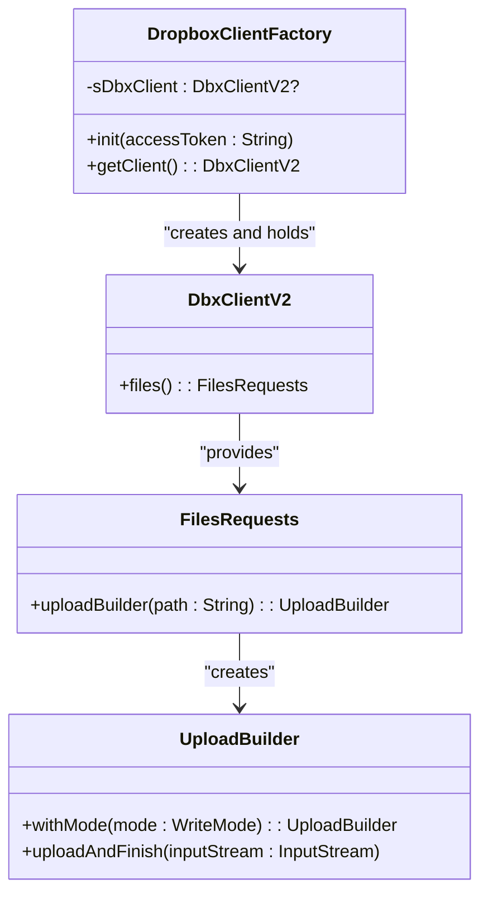
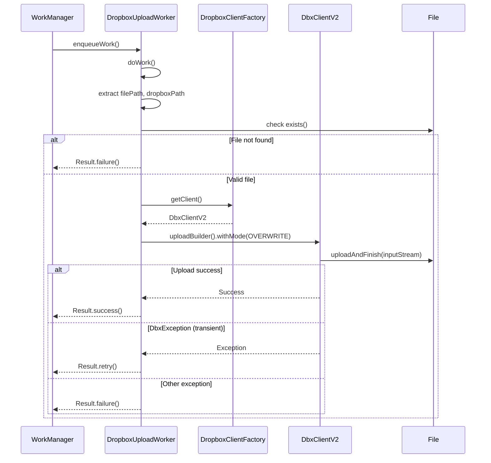
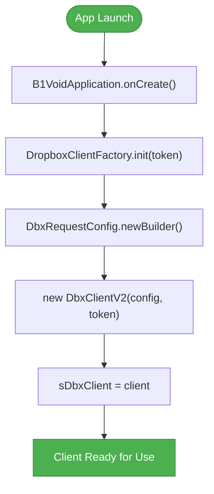

# Cloud Integration with Dropbox

<cite>
**Referenced Files in This Document**   
- [DropboxClientFactory.kt](file://app/src/main/java/com/example/b1void/utils/DropboxClientFactory.kt)
- [DropboxUploadWorker.kt](file://app/src/main/java/com/example/b1void/workers/DropboxUploadWorker.kt)
- [B1VoidApplication.kt](file://app/src/main/java/com/example/b1void/B1VoidApplication.kt)
- [FileManagerActivity.kt](file://app/src/main/java/com/example/b1void/activities/FileManagerActivity.kt)
- [CameraActivity.kt](file://app/src/main/java/com/example/b1void/activities/CameraActivity.kt)
</cite>

## Table of Contents
1. [Singleton Pattern Implementation](#singleton-pattern-implementation)
2. [Background Synchronization Mechanism](#background-synchronization-mechanism)
3. [Input Parameters and Data Processing](#input-parameters-and-data-processing)
4. [Authentication Flow and Token Management](#authentication-flow-and-token-management)
5. [Enqueuing Upload Tasks](#enqueuing-upload-tasks)
6. [Error Handling and Common Issues](#error-handling-and-common-issues)
7. [Performance Optimization Strategies](#performance-optimization-strategies)

## Singleton Pattern Implementation

The `DropboxClientFactory` object implements the singleton pattern to ensure thread-safe access to a single instance of `DbxClientV2` across the entire application. The implementation uses a private nullable variable `sDbxClient` that is initialized only once through the `init()` method when an access token is provided. Subsequent calls to `getClient()` return the same initialized instance, preventing multiple client creations and ensuring consistent state management.

Thread safety is inherently guaranteed by Kotlin's object declaration, which ensures lazy initialization and synchronization under the hood. If `getClient()` is invoked before `init()`, an `IllegalStateException` is thrown, enforcing proper initialization sequence and preventing null pointer exceptions during file operations.

**Diagram sources**
- [DropboxClientFactory.kt](file://app/src/main/java/com/example/b1void/utils/DropboxClientFactory.kt#L5-L22)

**Section sources**
- [DropboxClientFactory.kt](file://app/src/main/java/com/example/b1void/utils/DropboxClientFactory.kt#L5-L22)

## Background Synchronization Mechanism

The background synchronization process is powered by Android's WorkManager API through the `DropboxUploadWorker` class, which extends `CoroutineWorker`. This architecture ensures reliable execution of upload tasks even if the app exits or the device restarts. Each upload operation runs as a scheduled work request, managed by the system's job scheduler for optimal resource usage.

The worker handles file uploads within a coroutine context using `Dispatchers.IO`, ensuring non-blocking I/O operations. It retrieves the pre-initialized `DbxClientV2` instance from `DropboxClientFactory` and performs the upload via Dropbox's SDK `uploadBuilder()` method. Upon successful completion, it returns `Result.success()`, signaling WorkManager that the task has completed successfully.

For transient failures such as network interruptions, the worker catches `DbxException` and returns `Result.retry()`, allowing WorkManager to reschedule the upload according to its backoff policy. Other unexpected exceptions result in `Result.failure()`, indicating permanent failure.

**Diagram sources**
- [DropboxUploadWorker.kt](file://app/src/main/java/com/example/b1void/workers/DropboxUploadWorker.kt#L16-L56)

**Section sources**
- [DropboxUploadWorker.kt](file://app/src/main/java/com/example/b1void/workers/DropboxUploadWorker.kt#L16-L56)

## Input Parameters and Data Processing

Input parameters for the upload task are passed using Android's `Data` object, which safely transfers key-value pairs between components. The `DropboxUploadWorker` expects two string values: `KEY_FILE_PATH` for the local file path on the device and `KEY_DROPBOX_PATH` for the target location in the user's Dropbox account. These keys are defined as constants in the worker's companion object for consistency.

During `doWork()`, the worker extracts these values from `inputData`. If either value is missing, the method immediately returns `Result.failure()`, ensuring robust error handling at the entry point. The local file is validated for existence before proceeding with the upload, preventing unnecessary API calls for non-existent files.

The actual file transfer occurs within a coroutine context (`withContext(Dispatchers.IO)`), where an `InputStream` is created from the local file and passed directly to Dropbox's `uploadAndFinish()` method. This streaming approach minimizes memory usage by avoiding full file loading into RAM.

**Section sources**
- [DropboxUploadWorker.kt](file://app/src/main/java/com/example/b1void/workers/DropboxUploadWorker.kt#L21-L49)

## Authentication Flow and Token Management

Authentication is initialized in the `B1VoidApplication.onCreate()` method, where `DropboxClientFactory.init()` is called with a hardcoded access token ("YOUR_ACCESS_TOKEN"). While this demonstrates the integration point, production implementations should securely retrieve tokens through OAuth 2.0 flows rather than embedding them directly in code.

Currently, there is no explicit token refresh mechanism implemented. The application assumes the provided access token remains valid for the duration of use. In a real-world scenario, integrating with Dropbox's refresh token system would be essential to maintain long-term connectivity without requiring users to re-authenticate frequently.

The centralized initialization in the Application class ensures that the Dropbox client is ready for use as soon as the app starts, enabling immediate file synchronization capabilities upon launch.

**Diagram sources**
- [B1VoidApplication.kt](file://app/src/main/java/com/example/b1void/B1VoidApplication.kt#L21-L25)

**Section sources**
- [B1VoidApplication.kt](file://app/src/main/java/com/example/b1void/B1VoidApplication.kt#L21-L25)

## Enqueuing Upload Tasks

Upload tasks can be enqueued from various activities such as `FileManagerActivity` or `CameraActivity` using WorkManager's API. A typical enqueue operation involves creating a `OneTimeWorkRequest` with the necessary input data containing both the source file path and destination Dropbox path.

For example, after capturing a photo in `CameraActivity`, the newly created file's absolute path can be combined with a predefined Dropbox directory path (e.g., "/Photos/") to construct the upload request. Similarly, `FileManagerActivity` can trigger uploads for selected files by iterating through the selection and queuing individual work requests.

This decoupled design allows any component to initiate uploads without direct knowledge of the underlying implementation details, promoting modularity and ease of maintenance.

**Section sources**
- [FileManagerActivity.kt](file://app/src/main/java/com/example/b1void/activities/FileManagerActivity.kt#L42-L838)
- [CameraActivity.kt](file://app/src/main/java/com/example/b1void/activities/CameraActivity.kt#L76-L880)

## Error Handling and Common Issues

The system addresses several common issues through comprehensive error handling:

- **Network Timeouts**: Handled by catching `DbxException` and returning `Result.retry()`, allowing automatic rescheduling with exponential backoff.
- **Quota Limits**: Detected as specific `DbxException` subtypes from the SDK; currently treated like other transient errors with retry logic.
- **File Not Found**: Explicitly checked before upload attempt; results in `Result.failure()` since it represents a permanent condition.
- **Conflict Resolution**: Achieved through `WriteMode.OVERWRITE`, ensuring newer versions replace existing files in Dropbox without manual intervention.

Additional safeguards include validating input parameters at the start of `doWork()` and logging detailed error messages using Android's `Log.e()` for debugging purposes. This layered approach ensures resilience against both expected and unexpected failure modes.

**Section sources**
- [DropboxUploadWorker.kt](file://app/src/main/java/com/example/b1void/workers/DropboxUploadWorker.kt#L21-L49)

## Performance Optimization Strategies

To optimize performance and user experience, consider implementing the following strategies:

- **Batching Uploads**: Group multiple small files into a single archive before uploading to reduce overhead from repeated connection establishment.
- **Sync Status Monitoring**: Observe WorkManager's `LiveData<WorkInfo>` to display real-time upload progress and completion status in the UI.
- **Conditional Uploads**: Implement file change detection to avoid re-uploading unchanged files, saving bandwidth and time.
- **Background Throttling**: Respect WorkManager's constraints by adding network type conditions (e.g., only upload over Wi-Fi) to prevent excessive data usage.

These optimizations enhance efficiency while maintaining reliability, ensuring smooth operation even under constrained network conditions or with large volumes of data.

**Section sources**
- [DropboxUploadWorker.kt](file://app/src/main/java/com/example/b1void/workers/DropboxUploadWorker.kt#L16-L56)
- [B1VoidApplication.kt](file://app/src/main/java/com/example/b1void/B1VoidApplication.kt#L14-L53)