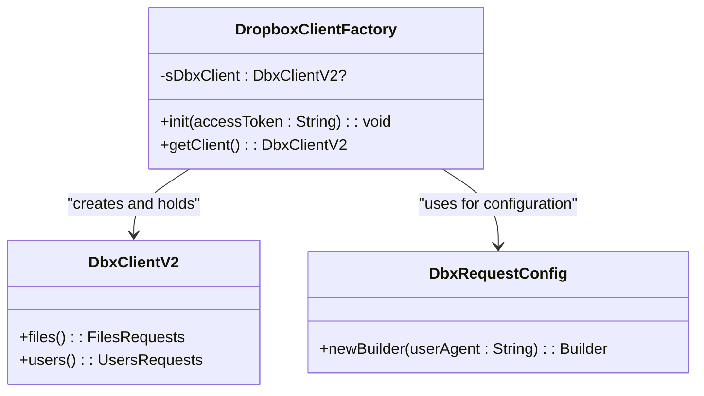
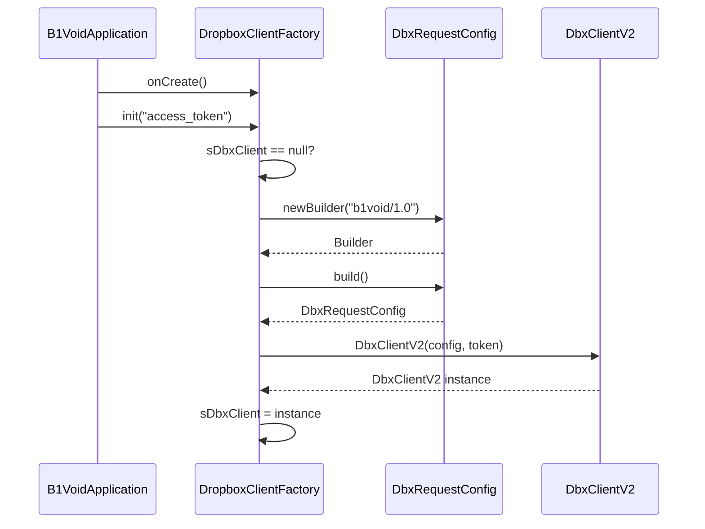
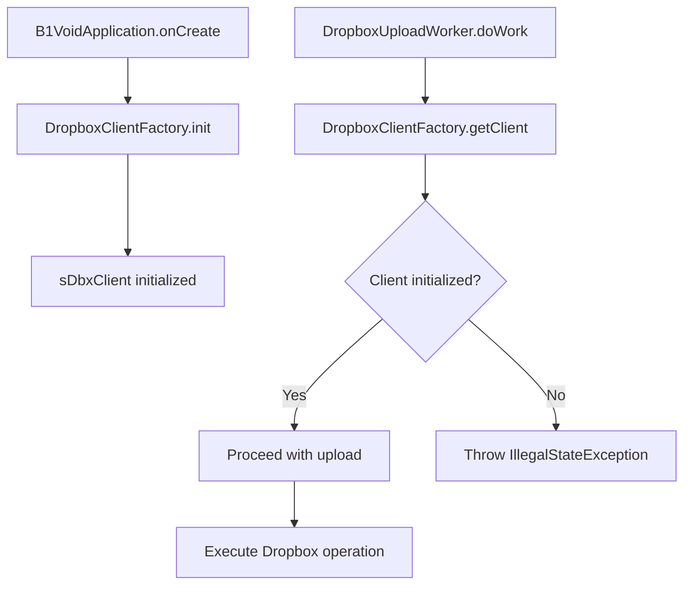

# Dropbox Client Factory

<cite>
**Referenced Files in This Document **   
- [DropboxClientFactory.kt](file://app/src/main/java/com/example/b1void/utils/DropboxClientFactory.kt)
- [B1VoidApplication.kt](file://app/src/main/java/com/example/b1void/B1VoidApplication.kt)
- [DropboxUploadWorker.kt](file://app/src/main/java/com/example/b1void/workers/DropboxUploadWorker.kt)
</cite>

## Table of Contents
1. [Introduction](#introduction)
2. [Core Components](#core-components)
3. [Thread-Safe Singleton Implementation](#thread-safe-singleton-implementation)
4. [Initialization Process and Configuration](#initialization-process-and-configuration)
5. [Security Implications and Token Management](#security-implications-and-token-management)
6. [Usage Patterns and Integration Points](#usage-patterns-and-integration-points)
7. [Error Handling and Common Issues](#error-handling-and-common-issues)
8. [Performance Considerations](#performance-considerations)
9. [Conclusion](#conclusion)

## Introduction

This document provides a comprehensive analysis of the `DropboxClientFactory` singleton implementation within the Android application. The factory pattern ensures centralized management of the Dropbox API client instance, providing thread-safe access across the application lifecycle. The implementation leverages Kotlin's object declaration to guarantee a single instance while incorporating proper initialization checks and configuration setup for the Dropbox SDK. This documentation details the architectural decisions, security considerations, integration patterns, and best practices associated with this critical component.

## Core Components

The Dropbox client infrastructure consists of three primary components working in concert: the `DropboxClientFactory` singleton that manages the client instance, the `B1VoidApplication` class that handles initialization during app startup, and the `DropboxUploadWorker` that utilizes the shared client for background file operations. These components demonstrate a clean separation of concerns where initialization, instance management, and usage are distinctly separated while maintaining type safety and proper error handling throughout the system.

**Section sources**
- [DropboxClientFactory.kt](file://app/src/main/java/com/example/b1void/utils/DropboxClientFactory.kt#L5-L22)
- [B1VoidApplication.kt](file://app/src/main/java/com/example/b1void/B1VoidApplication.kt#L21-L25)
- [DropboxUploadWorker.kt](file://app/src/main/java/com/example/b1void/workers/DropboxUploadWorker.kt#L21-L49)

## Thread-Safe Singleton Implementation

The `DropboxClientFactory` employs Kotlin's object declaration syntax to create a thread-safe singleton instance. This approach leverages the JVM's class loading mechanism to ensure that only one instance of the object is ever created, regardless of concurrent access from multiple threads. The private nullable property `sDbxClient` holds the actual `DbxClientV2` instance, which remains uninitialized until explicitly configured through the `init()` method. This lazy initialization pattern prevents resource allocation until needed while the object wrapper guarantees that all threads accessing `getClient()` will reference the same underlying instance after initialization.

**Diagram sources **
- [DropboxClientFactory.kt](file://app/src/main/java/com/example/b1void/utils/DropboxClientFactory.kt#L5-L22)

**Section sources**
- [DropboxClientFactory.kt](file://app/src/main/java/com/example/b1void/utils/DropboxClientFactory.kt#L5-L22)

## Initialization Process and Configuration

The initialization process begins in the `B1VoidApplication.onCreate()` method, where `DropboxClientFactory.init()` is called with an access token parameter. The `init()` method first checks if the client instance is null before proceeding with configuration, preventing reinitialization and potential resource leaks. It creates a `DbxRequestConfig` object with a custom user agent string ("b1void/1.0") that identifies requests from this application to Dropbox's servers. This configuration is then used to instantiate the `DbxClientV2` with the provided access token. The conditional check ensures idempotent behavior, allowing safe repeated calls to `init()` without side effects once the client has been established.

**Diagram sources **
- [DropboxClientFactory.kt](file://app/src/main/java/com/example/b1void/utils/DropboxClientFactory.kt#L9-L14)
- [B1VoidApplication.kt](file://app/src/main/java/com/example/b1void/B1VoidApplication.kt#L21-L25)

**Section sources**
- [DropboxClientFactory.kt](file://app/src/main/java/com/example/b1void/utils/DropboxClientFactory.kt#L9-L14)
- [B1VoidApplication.kt](file://app/src/main/java/com/example/b1void/B1VoidApplication.kt#L21-L25)

## Security Implications and Token Management

The current implementation contains a significant security vulnerability by hardcoding the access token value "YOUR_ACCESS_TOKEN" directly in the `B1VoidApplication.onCreate()` method. This practice exposes sensitive credentials in the source code, making them accessible to anyone with access to the compiled APK through reverse engineering. Best practices dictate that access tokens should be securely stored using Android's Keystore system or retrieved dynamically from a secure backend service. Environment-specific configuration files (not included in version control) or secure remote configuration services should be employed instead of hardcoded values to prevent unauthorized access to Dropbox accounts and potential data breaches.

**Section sources**
- [B1VoidApplication.kt](file://app/src/main/java/com/example/b1void/B1VoidApplication.kt#L24-L24)

## Usage Patterns and Integration Points

The `DropboxClientFactory` is designed to be consumed throughout the application via the `getClient()` method, which provides access to the initialized client instance. A key integration point exists in the `DropboxUploadWorker`, where background file uploads utilize the shared client instance obtained from the factory. This worker demonstrates proper asynchronous usage of the client within a coroutine context, ensuring network operations do not block the main thread. By centralizing client access through the factory, the application maintains a single point of truth for Dropbox connectivity, simplifying maintenance and ensuring consistent configuration across all components that interact with the Dropbox API.

**Diagram sources **
- [DropboxClientFactory.kt](file://app/src/main/java/com/example/b1void/utils/DropboxClientFactory.kt#L16-L21)
- [DropboxUploadWorker.kt](file://app/src/main/java/com/example/b1void/workers/DropboxUploadWorker.kt#L21-L49)

**Section sources**
- [DropboxClientFactory.kt](file://app/src/main/java/com/example/b1void/utils/DropboxClientFactory.kt#L16-L21)
- [DropboxUploadWorker.kt](file://app/src/main/java/com/example/b1void/workers/DropboxUploadWorker.kt#L21-L49)

## Error Handling and Common Issues

The implementation includes robust error handling through explicit validation in the `getClient()` method, which throws an `IllegalStateException` when called before initialization. This fail-fast approach prevents null pointer exceptions by immediately alerting developers to improper usage rather than allowing silent failures later in the execution flow. Common issues include multiple initialization attempts (handled gracefully by the null check in `init()`), premature client access (caught by `getClient()`), and race conditions (mitigated by the thread-safe nature of Kotlin objects). Developers must ensure initialization occurs early in the application lifecycle, typically in the Application class's `onCreate()` method, before any components attempt to access the client.

**Section sources**
- [DropboxClientFactory.kt](file://app/src/main/java/com/example/b1void/utils/DropboxClientFactory.kt#L16-L21)

## Performance Considerations

The singleton pattern provides significant performance benefits by reusing a single `DbxClientV2` instance across the entire application lifecycle. This approach eliminates the overhead of repeatedly establishing network connections, authenticating with Dropbox servers, and configuring request parameters for each operation. The client instance maintains internal connection pooling and session state, reducing latency for subsequent API calls. Additionally, sharing one instance conserves memory resources and reduces battery consumption on mobile devices by minimizing network handshakes and cryptographic operations. The lazy initialization ensures these resources are only allocated when actually needed, balancing startup performance with efficient runtime operation.

**Section sources**
- [DropboxClientFactory.kt](file://app/src/main/java/com/example/b1void/utils/DropboxClientFactory.kt#L5-L22)

## Conclusion

The `DropboxClientFactory` implementation effectively addresses the need for centralized, thread-safe management of Dropbox API connectivity within the Android application. Its use of Kotlin's object declaration ensures proper singleton behavior while providing clear initialization semantics and appropriate error handling for unconfigured states. However, the hardcoded access token represents a critical security flaw that must be addressed through proper credential management practices. When properly configured, this pattern enables efficient, reliable access to Dropbox services across multiple components while minimizing resource usage and ensuring consistent behavior throughout the application's lifecycle.