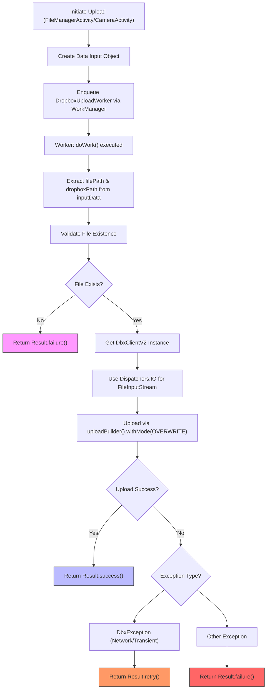
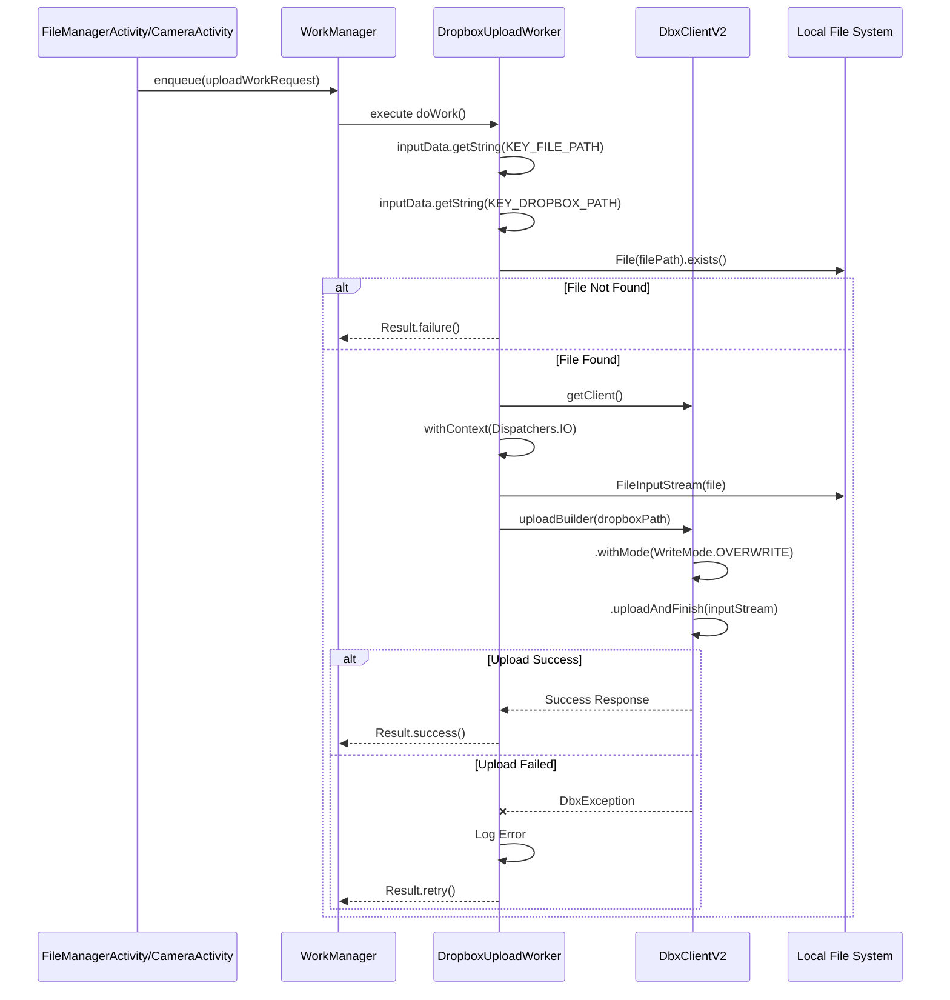
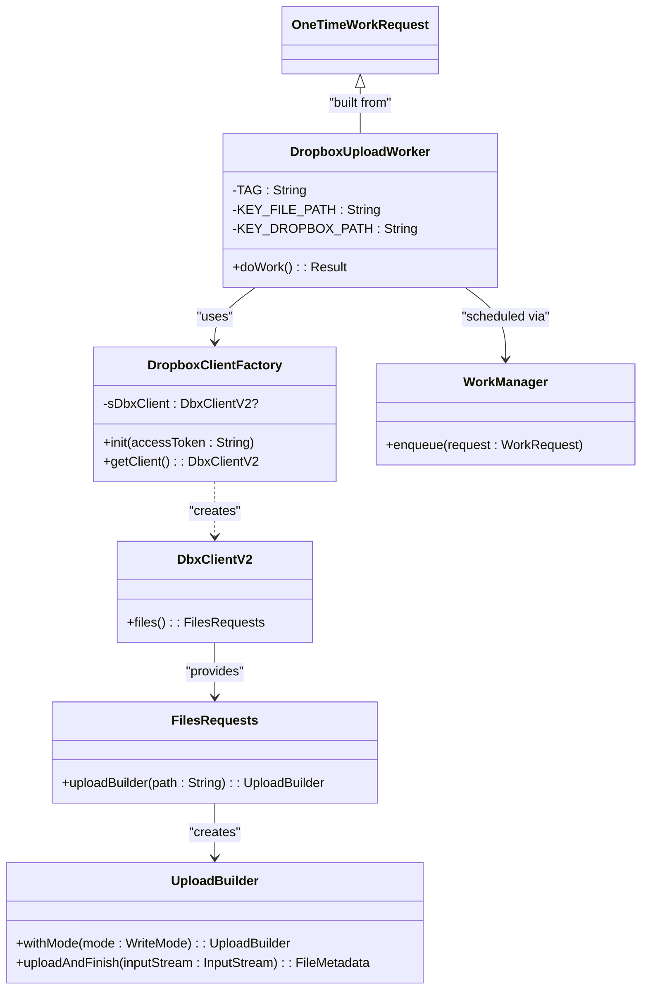

# Dropbox Upload Worker

<cite>
**Referenced Files in This Document **   
- [DropboxUploadWorker.kt](file://app/src/main/java/com/example/b1void/workers/DropboxUploadWorker.kt)
- [DropboxClientFactory.kt](file://app/src/main/java/com/example/b1void/utils/DropboxClientFactory.kt)
- [FileManagerActivity.kt](file://app/src/main/java/com/example/b1void/activities/FileManagerActivity.kt)
- [CameraActivity.kt](file://app/src/main/java/com/example/b1void/activities/CameraActivity.kt)
</cite>

## Table of Contents
1. [Introduction](#introduction)
2. [Core Components](#core-components)
3. [Architecture Overview](#architecture-overview)
4. [Detailed Component Analysis](#detailed-component-analysis)
5. [Dependency Analysis](#dependency-analysis)
6. [Performance Considerations](#performance-considerations)
7. [Troubleshooting Guide](#troubleshooting-guide)

## Introduction
The `DropboxUploadWorker` class is a critical background component in the Inspector_appVX application responsible for handling asynchronous file uploads to Dropbox using Android's WorkManager and Kotlin coroutines. This worker enables reliable, efficient, and resilient file synchronization without blocking the main thread or draining device resources unnecessarily. It plays a key role in ensuring that media files captured via the camera or selected through the file manager are securely backed up to cloud storage even when the app is not actively running.

This document provides an in-depth analysis of the `DropboxUploadWorker`, focusing on its implementation of the `doWork()` method, error handling strategies, integration with external components like `DbxClientV2`, and usage patterns from activities such as `FileManagerActivity` and `CameraActivity`. Special attention is given to concurrency management using `Dispatchers.IO`, retry logic for transient failures, and best practices around input parameter handling and resource cleanup.

## Core Components

The core functionality of the `DropboxUploadWorker` revolves around executing a suspendable background task that reads a local file and streams it to Dropbox using the official SDK. The worker extracts two essential parameters—`filePath` and `dropboxPath`—from the input data, validates the existence of the source file, and performs the upload within a coroutine context optimized for I/O operations. Upon success, it returns `Result.success()`, while network-related exceptions trigger retries via `Result.retry()`, and other errors result in permanent failure.

Key constants defined in the companion object include `KEY_FILE_PATH` and `KEY_DROPBOX_PATH`, which are used to pass file location data between initiating components and the worker. The use of `CoroutineWorker` ensures seamless integration with Kotlin’s structured concurrency model, allowing safe cancellation and lifecycle-aware execution.

**Section sources**
- [DropboxUploadWorker.kt](file://app/src/main/java/com/example/b1void/workers/DropboxUploadWorker.kt#L16-L56)

## Architecture Overview



**Diagram sources **
- [DropboxUploadWorker.kt](file://app/src/main/java/com/example/b1void/workers/DropboxUploadWorker.kt#L16-L56)
- [FileManagerActivity.kt](file://app/src/main/java/com/example/b1void/activities/FileManagerActivity.kt#L42-L838)
- [CameraActivity.kt](file://app/src/main/java/com/example/b1void/activities/CameraActivity.kt#L76-L880)

## Detailed Component Analysis

### DropboxUploadWorker Implementation

The `DropboxUploadWorker` extends `CoroutineWorker`, enabling it to perform long-running I/O tasks safely within a coroutine scope. Its primary responsibility is encapsulated in the overridden `doWork()` function, which executes the actual upload logic.

#### Input Parameter Extraction and Validation
The worker retrieves two string values from the `inputData`: `filePath` (local path of the file to upload) and `dropboxPath` (target path in Dropbox). If either value is missing, the worker immediately fails by returning `Result.failure()`. After retrieving the paths, it checks whether the local file exists using `File.exists()`. If the file does not exist, an error is logged and the work is marked as failed.

#### Streaming Upload with FileInputStream
To efficiently handle potentially large files, the upload uses a streaming approach via `FileInputStream`. This prevents loading the entire file into memory at once, reducing RAM consumption. The stream is passed directly to `uploadAndFinish()` after configuring the upload builder with `WriteMode.OVERWRITE`, ensuring any existing file at the destination path is replaced.

Concurrency is managed using `withContext(Dispatchers.IO)`, which switches the coroutine to a thread pool optimized for blocking I/O operations such as reading from disk and making network requests. This avoids blocking the main thread and maintains UI responsiveness.

#### Error Handling Strategy
Error handling distinguishes between recoverable and non-recoverable conditions:
- **`DbxException`**: Typically caused by network issues or temporary server errors. These are considered transient, so the worker returns `Result.retry()`, signaling WorkManager to reschedule the work according to its backoff policy.
- **Other Exceptions**: Include unexpected runtime errors (e.g., permission issues, malformed URIs). These lead to `Result.failure()`, indicating permanent failure and preventing further retries.

Logging is performed using `Log.e()` with a static tag `"DropboxUploadWorker"` to aid debugging.



**Diagram sources **
- [DropboxUploadWorker.kt](file://app/src/main/java/com/example/b1void/workers/DropboxUploadWorker.kt#L16-L56)
- [DropboxClientFactory.kt](file://app/src/main/java/com/example/b1void/utils/DropboxClientFactory.kt#L16-L21)

**Section sources**
- [DropboxUploadWorker.kt](file://app/src/main/java/com/example/b1void/workers/DropboxUploadWorker.kt#L16-L56)

### Integration with DropboxClientFactory

The `DropboxUploadWorker` relies on `DropboxClientFactory.getClient()` to obtain an authenticated instance of `DbxClientV2`. This singleton pattern ensures that only one client is created per application session, improving efficiency and connection reuse. The factory must be initialized earlier in the app lifecycle (typically during login) by calling `init(accessToken)` with a valid OAuth 2 access token.

If the client has not been initialized before the worker runs, `getClient()` throws an `IllegalStateException`, which propagates as a failure in `doWork()`. Therefore, proper initialization sequencing is crucial.

**Section sources**
- [DropboxClientFactory.kt](file://app/src/main/java/com/example/b1void/utils/DropboxClientFactory.kt#L16-L21)

### Usage from FileManagerActivity and CameraActivity

Both `FileManagerActivity` and `CameraActivity` can initiate Dropbox uploads by creating a `OneTimeWorkRequest` for `DropboxUploadWorker`.

In `FileManagerActivity`, users may manually select files for upload, triggering the creation of a `Data` object containing both `KEY_FILE_PATH` and `KEY_DROPBOX_PATH`. Similarly, after capturing a photo or video in `CameraActivity`, the app can automatically enqueue an upload request using the saved file path.

Example code snippet (conceptual):
```kotlin
val data = Data.Builder()
    .putString(DropboxUploadWorker.KEY_FILE_PATH, localFilePath)
    .putString(DropboxUploadWorker.KEY_DROPBOX_PATH, remoteDropboxPath)
    .build()

val uploadWorkRequest = OneTimeWorkRequestBuilder<DropboxUploadWorker>()
    .setInputData(data)
    .setBackoffCriteria(BackoffPolicy.EXPONENTIAL, Duration.ofSeconds(10))
    .build()

WorkManager.getInstance(context).enqueue(uploadWorkRequest)
```

This pattern allows decoupling of upload logic from UI components, promoting modularity and testability.

**Section sources**
- [FileManagerActivity.kt](file://app/src/main/java/com/example/b1void/activities/FileManagerActivity.kt#L42-L838)
- [CameraActivity.kt](file://app/src/main/java/com/example/b1void/activities/CameraActivity.kt#L76-L880)

## Dependency Analysis

The `DropboxUploadWorker` depends on several internal and external components:
- **WorkManager**: For scheduling and managing background execution
- **Kotlin Coroutines**: For asynchronous, non-blocking operation
- **Dropbox SDK (`DbxClientV2`)**: For cloud storage interaction
- **Android File API**: For accessing local files via `FileInputStream`
- **DropboxClientFactory**: As a wrapper for client instantiation

These dependencies are tightly integrated but loosely coupled through dependency injection via constructor parameters and shared state (in the case of the singleton client).



**Diagram sources **
- [DropboxUploadWorker.kt](file://app/src/main/java/com/example/b1void/workers/DropboxUploadWorker.kt#L16-L56)
- [DropboxClientFactory.kt](file://app/src/main/java/com/example/b1void/utils/DropboxClientFactory.kt#L16-L21)

**Section sources**
- [DropboxUploadWorker.kt](file://app/src/main/java/com/example/b1void/workers/DropboxUploadWorker.kt#L16-L56)
- [DropboxClientFactory.kt](file://app/src/main/java/com/example/b1void/utils/DropboxClientFactory.kt#L16-L21)

## Performance Considerations

Uploading large files requires careful consideration of memory usage, battery impact, and network efficiency:
- **Memory Management**: By using `FileInputStream` and streaming uploads, the worker avoids loading entire files into RAM, minimizing heap pressure.
- **Large File Limits**: While the Dropbox API supports chunked uploads for very large files (>150MB), this implementation uses `uploadAndFinish()` which loads the stream entirely in memory during transmission. For larger files, consider switching to `uploadSessionAppendV2()` with chunked uploads.
- **Battery Optimization**: WorkManager respects system constraints (e.g., `setConstraints()` with `NetworkType.CONNECTED)` and integrates with Doze mode, ensuring uploads occur only under favorable conditions unless explicitly bypassed.
- **Backoff Policy**: The use of exponential backoff (`BackoffPolicy.EXPONENTIAL`) helps prevent overwhelming the server during repeated transient failures.

Developers should monitor upload progress for user feedback and consider adding cancellation support where appropriate.

## Troubleshooting Guide

Common issues and their resolutions:

| Issue | Cause | Solution |
|------|-------|----------|
| Upload never starts | Worker not enqueued properly | Verify `WorkManager.enqueue()` is called with correct `WorkRequest` |
| `IllegalStateException`: Client not initialized | `DropboxClientFactory.init()` not called | Ensure initialization occurs during authentication flow |
| `Result.failure()` due to missing file | Invalid `filePath` passed | Validate file existence before enqueueing work |
| Repeated retries without success | Persistent `DbxException` (e.g., invalid token) | Check token validity; handle auth errors separately |
| High memory usage on large files | Full stream buffered in memory | Implement chunked upload for files >100MB |

Logs tagged with `"DropboxUploadWorker"` should be checked for detailed exception messages.

**Section sources**
- [DropboxUploadWorker.kt](file://app/src/main/java/com/example/b1void/workers/DropboxUploadWorker.kt#L16-L56)
- [DropboxClientFactory.kt](file://app/src/main/java/com/example/b1void/utils/DropboxClientFactory.kt#L16-L21)