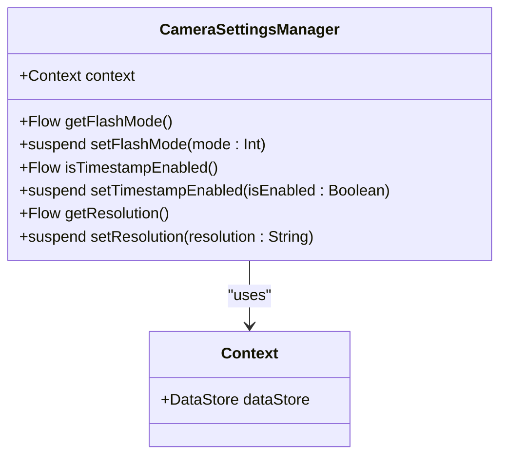
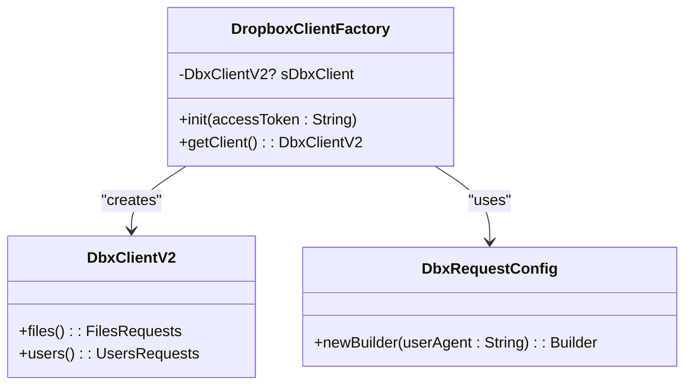
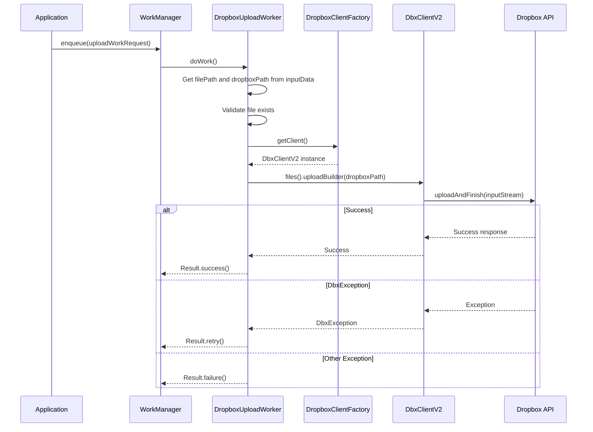
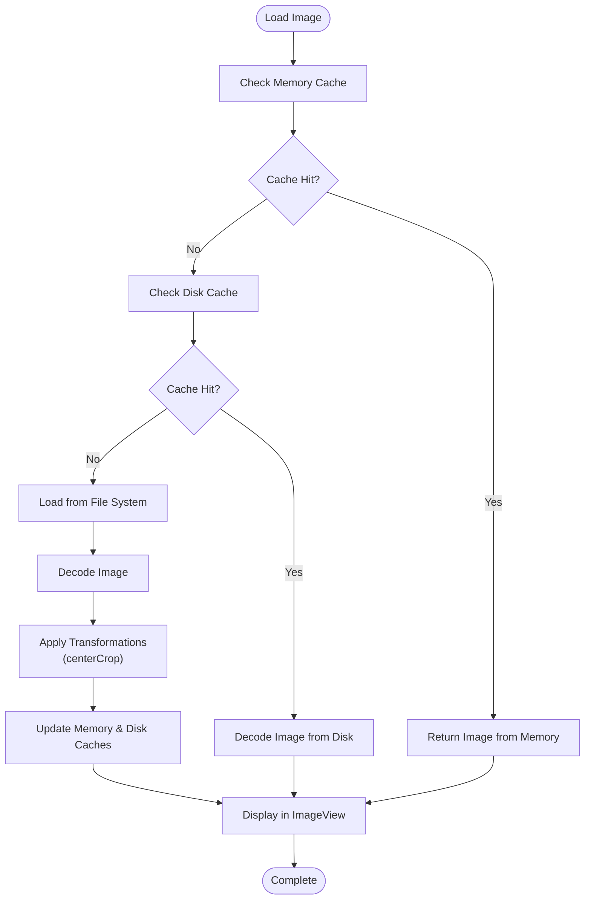
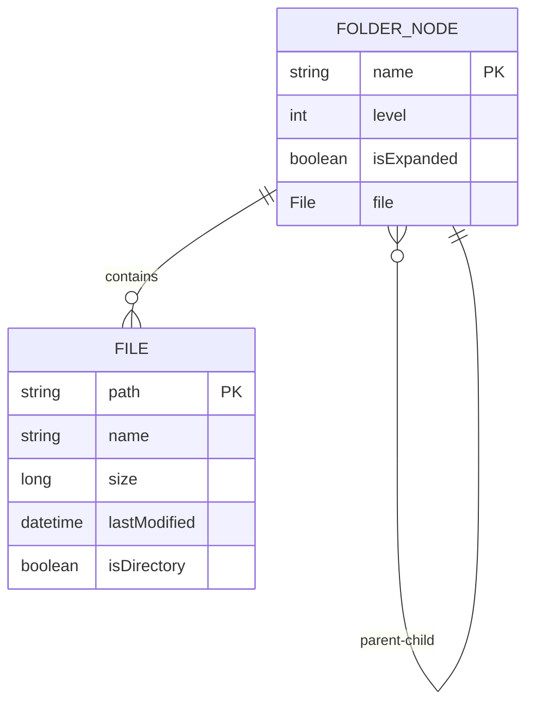

# Data Management

<cite>
**Referenced Files in This Document **   
- [CameraSettingsManager.kt](file://app/src/main/java/com/example/b1void/data/CameraSettingsManager.kt)
- [DropboxClientFactory.kt](file://app/src/main/java/com/example/b1void/utils/DropboxClientFactory.kt)
- [DropboxUploadWorker.kt](file://app/src/main/java/com/example/b1void/workers/DropboxUploadWorker.kt)
- [FileAdapter.kt](file://app/src/main/java/com/example/b1void/adapters/FileAdapter.kt)
- [InspectionAdapter.java](file://app/src/main/java/com/example/b1void/adapters/InspectionAdapter.java)
- [FolderRepository.kt](file://app/src/main/java/com/example/b1void/data/FolderRepository.kt)
</cite>

## Table of Contents
1. [Local and Remote Data Management Overview](#local-and-remote-data-management-overview)
2. [Camera Settings Persistence with Android DataStore](#camera-settings-persistence-with-android-datastore)
3. [Dropbox Integration and Authentication Management](#dropbox-integration-and-authentication-management)
4. [Background Synchronization with WorkManager](#background-synchronization-with-workmanager)
5. [Image Loading and Caching Strategy](#image-loading-and-caching-strategy)
6. [Local File Storage Structure](#local-file-storage-structure)
7. [Security Considerations](#security-considerations)
8. [Data Management Examples](#data-management-examples)

## Local and Remote Data Management Overview

The application implements a comprehensive data management strategy that combines local persistence, cloud synchronization, and efficient caching mechanisms. The system is designed to provide seamless user experience regardless of network availability while maintaining data integrity and security. Local data storage follows Android best practices using appropriate directories for different file types, while remote synchronization is handled through Dropbox integration. The architecture separates concerns between data access, business logic, and presentation layers, ensuring maintainability and testability.

**Section sources**
- [CameraSettingsManager.kt](file://app/src/main/java/com/example/b1void/data/CameraSettingsManager.kt#L1-L60)
- [DropboxClientFactory.kt](file://app/src/main/java/com/example/b1void/utils/DropboxClientFactory.kt#L1-L24)
- [FolderRepository.kt](file://app/src/main/java/com/example/b1void/data/FolderRepository.kt#L1-L56)

## Camera Settings Persistence with Android DataStore

The application uses Android's DataStore to persist camera preferences such as resolution, flash mode, and exposure settings. The `CameraSettingsManager` class provides a type-safe interface for accessing and modifying these settings using Kotlin coroutines and Flow for reactive data observation. The implementation leverages Preferences DataStore, which is the recommended approach for storing key-value pairs, replacing the deprecated SharedPreferences API.

The manager exposes three primary settings: flash mode (stored as an integer), timestamp visibility (stored as a boolean), and resolution (stored as a string). Each setting has corresponding getter methods that return a Flow<Int>, Flow<Boolean>, or Flow<String?> respectively, enabling reactive UI updates when settings change. Setter methods are implemented as suspend functions, allowing for asynchronous persistence without blocking the main thread.



**Diagram sources **
- [CameraSettingsManager.kt](file://app/src/main/java/com/example/b1void/data/CameraSettingsManager.kt#L15-L58)

**Section sources**
- [CameraSettingsManager.kt](file://app/src/main/java/com/example/b1void/data/CameraSettingsManager.kt#L15-L58)

## Dropbox Integration and Authentication Management

The application integrates with Dropbox for cloud storage using the official Dropbox SDK. The `DropboxClientFactory` singleton manages authentication tokens and provides thread-safe client access throughout the app. This factory pattern ensures that only one instance of the Dropbox client exists in the application, preventing resource duplication and potential race conditions.

The factory initializes the Dropbox client with a request configuration that identifies the application ("b1void/1.0") and stores the authenticated client instance as a private nullable variable. The `init()` method accepts an access token and creates the client if it doesn't already exist, while the `getClient()` method returns the existing client or throws an `IllegalStateException` if the client hasn't been initialized. This design enforces proper initialization sequence and prevents null pointer exceptions.



**Diagram sources **
- [DropboxClientFactory.kt](file://app/src/main/java/com/example/b1void/utils/DropboxClientFactory.kt#L5-L22)

**Section sources**
- [DropboxClientFactory.kt](file://app/src/main/java/com/example/b1void/utils/DropboxClientFactory.kt#L5-L22)

## Background Synchronization with WorkManager

The application implements reliable background file uploads using Android's WorkManager API. The `DropboxUploadWorker` class extends `CoroutineWorker` to handle asynchronous file transfers to Dropbox, ensuring uploads continue even when the app is not active or the device restarts. This worker receives input data containing the local file path and the target Dropbox path, then performs the upload operation within a coroutine context.

The upload process runs on the IO dispatcher to avoid blocking the main thread, reading the local file into an input stream and uploading it to Dropbox using the client obtained from `DropboxClientFactory`. The worker is configured to overwrite existing files on Dropbox using `WriteMode.OVERWRITE`. Error handling is comprehensive: `DbxException` triggers a retry (allowing recovery from temporary network issues), while other exceptions result in failure. The worker logs errors for debugging purposes and returns appropriate `Result` types to inform WorkManager of the operation outcome.



**Diagram sources **
- [DropboxUploadWorker.kt](file://app/src/main/java/com/example/b1void/workers/DropboxUploadWorker.kt#L16-L57)

**Section sources**
- [DropboxUploadWorker.kt](file://app/src/main/java/com/example/b1void/workers/DropboxUploadWorker.kt#L16-L57)

## Image Loading and Caching Strategy

The application employs Glide, a powerful image loading and caching library, to efficiently display images in both the `FileAdapter` and `InspectionAdapter`. In `FileAdapter`, Glide is used to load thumbnails for image and video files directly from the filesystem, applying center cropping and placeholder/error drawables for consistent UI presentation. The library automatically handles memory and disk caching, reducing redundant disk reads and improving scrolling performance in file listings.

For image files, Glide loads the file object directly, displaying a default image icon as a placeholder during loading and in case of errors. Video files receive similar treatment but with a video-specific placeholder icon and an additional play icon overlay. The caching strategy includes both memory cache (for recently viewed items) and disk cache (for previously loaded images), with automatic cache eviction based on LRU (Least Recently Used) policy. This approach minimizes battery consumption and network usage while providing smooth scrolling experiences.



**Diagram sources **
- [FileAdapter.kt](file://app/src/main/java/com/example/b1void/adapters/FileAdapter.kt#L37-L86)

**Section sources**
- [FileAdapter.kt](file://app/src/main/java/com/example/b1void/adapters/FileAdapter.kt#L37-L86)
- [InspectionAdapter.java](file://app/src/main/java/com/example/b1void/adapters/InspectionAdapter.java#L20-L40)

## Local File Storage Structure

The application follows Android best practices for local file storage, organizing files into appropriate directories based on their type and purpose. While specific directory paths are not explicitly defined in the provided code, the `FolderRepository` class indicates a structured approach to file management, recursively scanning directories to build folder trees and supporting file operations like moving files between locations.

The file storage structure likely includes separate directories for photos, videos, and inspection data, following the principle of separation of concerns. The `FileManagerActivity` (referenced in the project structure) would interact with this repository to present the file hierarchy to users. Temporary files are managed securely, and the application respects Android's scoped storage model, particularly on newer API levels. The `moveFiles` method in `FolderRepository` demonstrates support for file organization operations, enabling users to maintain a clean and logical file structure.



**Diagram sources **
- [FolderRepository.kt](file://app/src/main/java/com/example/b1void/data/FolderRepository.kt#L1-L56)

**Section sources**
- [FolderRepository.kt](file://app/src/main/java/com/example/b1void/data/FolderRepository.kt#L1-L56)

## Security Considerations

The application addresses several security aspects in its data management implementation. While credential storage specifics are not visible in the provided code, the use of Dropbox's access token mechanism suggests that authentication credentials are handled securely, likely using Android's Keystore system or encrypted shared preferences for token storage. The `DropboxClientFactory` validates client initialization before use, preventing unauthorized API calls with invalid or missing credentials.

Temporary file handling appears to follow secure practices, with file operations wrapped in try-catch blocks to prevent crashes from permission or I/O exceptions. The `FolderRepository` class logs errors without exposing sensitive information in error messages. For file uploads, the application uses secure HTTPS connections via the Dropbox SDK, ensuring data in transit is encrypted. Additionally, the use of WorkManager for background tasks ensures that sensitive operations like file uploads occur in a controlled environment with appropriate permissions and lifecycle management.

**Section sources**
- [DropboxClientFactory.kt](file://app/src/main/java/com/example/b1void/utils/DropboxClientFactory.kt#L5-L22)
- [DropboxUploadWorker.kt](file://app/src/main/java/com/example/b1void/workers/DropboxUploadWorker.kt#L16-L57)
- [FolderRepository.kt](file://app/src/main/java/com/example/b1void/data/FolderRepository.kt#L1-L56)

## Data Management Examples

The following examples demonstrate common data management operations in the application:

**Reading camera settings**: Components can observe camera settings changes reactively using Flow. For example, to observe flash mode changes:
`cameraSettingsManager.getFlashMode().collect { mode -> /* update UI */ }`

**Writing camera settings**: To persist a new resolution setting:
`cameraSettingsManager.setResolution("1920x1080")`

**Initiating manual sync**: To upload a file to Dropbox immediately:
```kotlin
val workData = workDataOf(
    KEY_FILE_PATH to localFilePath,
    KEY_DROPBOX_PATH to dropboxFilePath
)
val uploadWorkRequest = OneTimeWorkRequestBuilder<DropboxUploadWorker>()
    .setInputData(workData)
    .build()
WorkManager.getInstance(context).enqueue(uploadWorkRequest)
```

**Monitoring upload progress**: While not implemented in the current worker, progress monitoring could be added by extending the worker to set progress updates using `setProgressAsync()`.

**Loading files in adapter**: The `FileAdapter` automatically handles different file types, displaying appropriate icons and thumbnails using Glide for media files.

**Section sources**
- [CameraSettingsManager.kt](file://app/src/main/java/com/example/b1void/data/CameraSettingsManager.kt#L23-L57)
- [DropboxUploadWorker.kt](file://app/src/main/java/com/example/b1void/workers/DropboxUploadWorker.kt#L16-L57)
- [FileAdapter.kt](file://app/src/main/java/com/example/b1void/adapters/FileAdapter.kt#L15-L167)