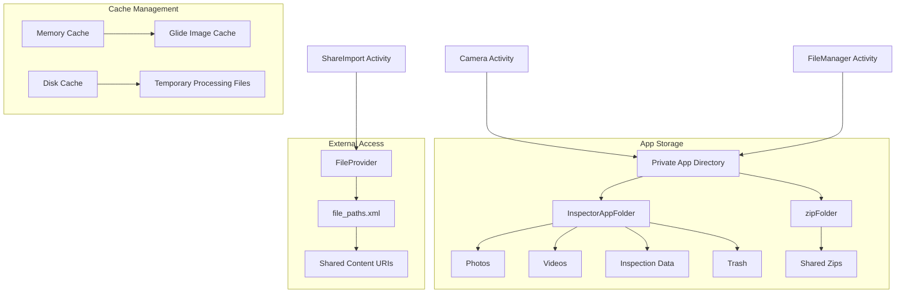
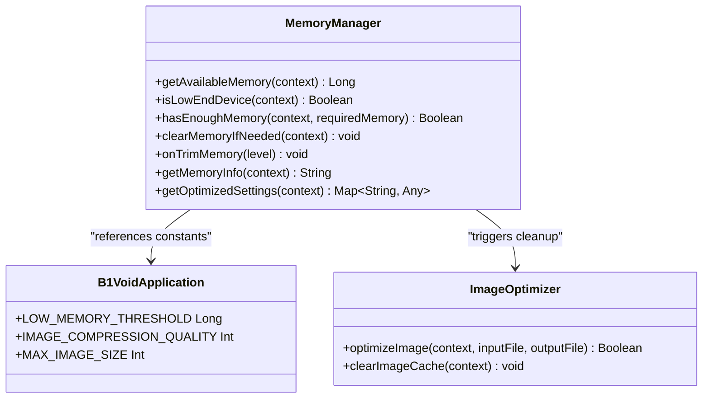
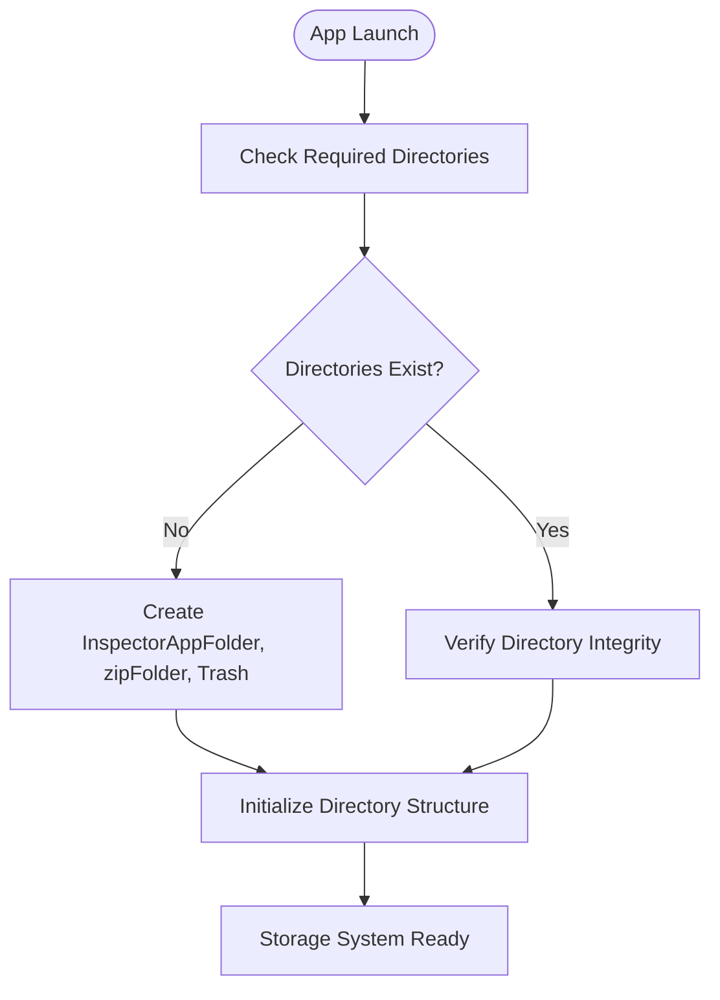
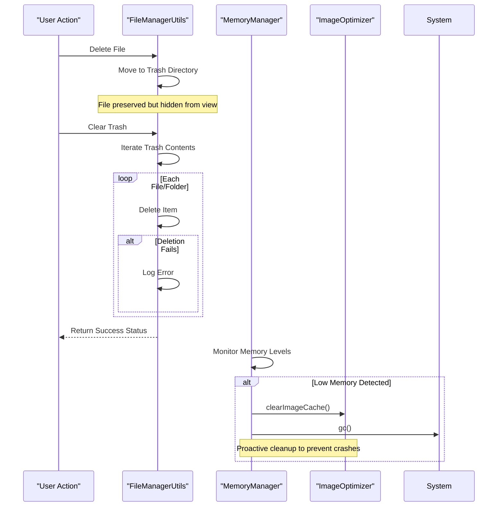

# Local Storage Strategy

<cite>
**Referenced Files in This Document**   
- [B1VoidApplication.kt](file://app/src/main/java/com/example/b1void/B1VoidApplication.kt)
- [FileManagerUtils.kt](file://app/src/main/java/com/example/b1void/utils/FileManagerUtils.kt)
- [MemoryManager.kt](file://app/src/main/java/com/example/b1void/utils/MemoryManager.kt)
- [ImageOptimizer.kt](file://app/src/main/java/com/example/b1void/utils/ImageOptimizer.kt)
- [CameraOptimizer.kt](file://app/src/main/java/com/example/b1void/utils/CameraOptimizer.kt)
- [FolderRepository.kt](file://app/src/main/java/com/example/b1void/data/FolderRepository.kt)
- [file_paths.xml](file://app/src/main/res/xml/file_paths.xml)
</cite>

## Table of Contents
1. [Introduction](#introduction)
2. [Storage Architecture Overview](#storage-architecture-overview)
3. [Core Storage Components](#core-storage-components)
4. [File Organization and Directory Structure](#file-organization-and-directory-structure)
5. [Secure File Sharing with FileProvider](#secure-file-sharing-with-fileprovider)
6. [Temporary File Handling and Cleanup](#temporary-file-handling-and-cleanup)
7. [B1VoidApplication: Core Storage Initialization](#b1voidapplication-core-storage-initialization)
8. [File Operations: Create, Access, Delete](#file-operations-create-access-delete)
9. [Security and Permissions](#security-and-permissions)
10. [Extending the Storage Structure](#extending-the-storage-structure)

## Introduction
This document details the local storage strategy implemented in the B1Void inspection application. The system follows Android best practices for file management, implementing a structured approach to organizing photos, videos, and inspection data while maintaining security and performance across various device capabilities. The architecture incorporates private app directories, secure file sharing mechanisms, and intelligent memory management to ensure reliable operation on both high-end and low-memory devices.

## Storage Architecture Overview
The application implements a comprehensive storage architecture that balances accessibility, security, and performance. The system uses Android's scoped storage model with private app directories as the primary storage location, supplemented by cache management and external sharing capabilities through FileProvider. The architecture is designed to handle inspection workflows efficiently, from capturing media to organizing and sharing inspection data.



**Diagram sources**
- [FileManagerUtils.kt](file://app/src/main/java/com/example/b1void/utils/FileManagerUtils.kt#L15-L248)
- [file_paths.xml](file://app/src/main/res/xml/file_paths.xml#L1-L7)

**Section sources**
- [B1VoidApplication.kt](file://app/src/main/java/com/example/b1void/B1VoidApplication.kt#L1-L54)
- [FileManagerUtils.kt](file://app/src/main/java/com/example/b1void/utils/FileManagerUtils.kt#L15-L248)

## Core Storage Components
The storage system comprises several key components that work together to manage files efficiently. These include FileManagerUtils for directory management, MemoryManager for resource monitoring, and optimization utilities for handling media files. The components are designed to work in concert, ensuring optimal performance while maintaining data integrity.

### FileManagerUtils
The FileManagerUtils object provides essential functionality for managing the application's file system. It handles directory creation, file operations, and trash management, serving as the primary interface for file system interactions throughout the application.

**Section sources**
- [FileManagerUtils.kt](file://app/src/main/java/com/example/b1void/utils/FileManagerUtils.kt#L15-L248)

### MemoryManager
The MemoryManager component monitors system resources and implements strategies to prevent memory-related issues. It plays a crucial role in maintaining application stability, particularly on low-end devices with limited RAM.



**Diagram sources**
- [MemoryManager.kt](file://app/src/main/java/com/example/b1void/utils/MemoryManager.kt#L11-L132)
- [B1VoidApplication.kt](file://app/src/main/java/com/example/b1void/B1VoidApplication.kt#L1-L54)
- [ImageOptimizer.kt](file://app/src/main/java/com/example/b1void/utils/ImageOptimizer.kt#L16-L170)

**Section sources**
- [MemoryManager.kt](file://app/src/main/java/com/example/b1void/utils/MemoryManager.kt#L11-L132)

## File Organization and Directory Structure
The application implements a well-organized directory structure that separates different types of content while maintaining a logical hierarchy. This structure follows Android best practices for app-specific storage, using private directories that are automatically managed by the system.

### Primary Directory Layout
The application creates three main directories within the app's private storage space:

- **InspectorAppFolder**: Main directory for all inspection-related content
- **zipFolder**: Dedicated directory for compressed archives
- **Trash**: Subdirectory within InspectorAppFolder for temporarily deleted files

Each directory serves a specific purpose in the application's workflow, ensuring that files are stored in appropriate locations based on their type and usage.

### Media File Organization
While the current implementation stores all media files directly in the main app directory, the system can be extended to create dedicated subdirectories for different media types:

- Photos: Store image files captured during inspections
- Videos: Store video recordings from inspection sessions
- Documents: Store PDFs, signatures, and other document types
- Backups: Store periodic backups of inspection data

This organizational approach improves file discoverability and simplifies management operations.



**Diagram sources**
- [FileManagerUtils.kt](file://app/src/main/java/com/example/b1void/utils/FileManagerUtils.kt#L15-L248)

**Section sources**
- [FileManagerUtils.kt](file://app/src/main/java/com/example/b1void/utils/FileManagerUtils.kt#L15-L248)

## Secure File Sharing with FileProvider
The application implements secure file sharing through Android's FileProvider mechanism, allowing controlled access to app files while maintaining security boundaries. This approach enables sharing functionality without requiring broad storage permissions.

### FileProvider Configuration
The FileProvider is configured through the file_paths.xml resource file, which defines the accessible directories:

```xml
<?xml version="1.0" encoding="utf-8"?>
<paths xmlns:android="http://schemas.android.com/apk/res/android">
    <files-path name="inspector_app_files" path="." />
    <cache-path name="cache_files" path="." />
    <cache-path name="shared_zips" path="shared_zips/" />
</paths>
```

This configuration exposes three access points:
- **inspector_app_files**: Root of the app's private files directory
- **cache_files**: App cache directory for temporary files
- **shared_zips**: Specific subdirectory within cache for shared zip files

### Content URI Generation
When sharing files, the application converts file paths to content URIs using FileProvider.getUriForFile(), which generates secure URIs that other apps can use to access the files. The receiving app must have the appropriate permissions to access these URIs, typically granted through intent flags.

**Section sources**
- [file_paths.xml](file://app/src/main/res/xml/file_paths.xml#L1-L7)

## Temporary File Handling and Cleanup
The application implements robust mechanisms for managing temporary files and preventing storage bloat. These systems ensure that temporary data is properly cleaned up and that the app maintains a minimal footprint on the user's device.

### Trash Management System
The FileManagerUtils includes a comprehensive trash management system that moves files to a designated Trash directory before permanent deletion. This provides users with the ability to recover accidentally deleted files while still protecting storage space.

Key features of the trash system:
- Files are moved to the Trash directory rather than immediately deleted
- Duplicate filenames are handled by appending timestamps
- Recursive deletion for directory contents
- Protection against moving the trash directory itself into the trash

### Automatic Cleanup Mechanisms
The application employs several automatic cleanup strategies:

1. **Memory-based cleanup**: When available memory falls below the LOW_MEMORY_THRESHOLD (50MB), the system automatically clears image caches and triggers garbage collection.

2. **Cache clearing**: The ImageOptimizer component provides methods to clear cached images, freeing up disk space when needed.

3. **Periodic maintenance**: While not explicitly implemented in the current code, the architecture supports scheduled cleanup operations that could run as background tasks.



**Diagram sources**
- [FileManagerUtils.kt](file://app/src/main/java/com/example/b1void/utils/FileManagerUtils.kt#L15-L248)
- [MemoryManager.kt](file://app/src/main/java/com/example/b1void/utils/MemoryManager.kt#L11-L132)
- [ImageOptimizer.kt](file://app/src/main/java/com/example/b1void/utils/ImageOptimizer.kt#L16-L170)

**Section sources**
- [FileManagerUtils.kt](file://app/src/main/java/com/example/b1void/utils/FileManagerUtils.kt#L15-L248)
- [MemoryManager.kt](file://app/src/main/java/com/example/b1void/utils/MemoryManager.kt#L11-L132)

## B1VoidApplication: Core Storage Initialization
The B1VoidApplication class serves as the central initialization point for the application's storage and memory management systems. As the Application subclass, it configures critical components during app startup, ensuring that storage dependencies are properly initialized before any activities are launched.

### Glide Configuration
The application configures Glide, the image loading library, with optimized settings for both memory and disk caching:

- **Memory cache**: Uses LRU (Least Recently Used) algorithm with size calculated based on screen count
- **Disk cache**: Prefers external storage with a 50MB limit in the "glide_cache" directory
- **Request options**: Disables animations by default to improve performance

This configuration ensures efficient image loading while preventing excessive memory usage, particularly important for an inspection app that may handle numerous images.

### Dropbox Integration
The application initializes Dropbox client integration with an access token, enabling cloud synchronization capabilities. While the current implementation uses a placeholder token, this establishes the foundation for backup and sync functionality.

### WorkManager Configuration
B1VoidApplication implements the WorkConfigurationProvider interface to configure WorkManager, Android's job scheduling system. The configuration includes:
- Minimum logging level set to INFO
- Maximum scheduler limit of 3 concurrent jobs

This setup enables reliable background processing for file operations, uploads, and other storage-related tasks.

**Section sources**
- [B1VoidApplication.kt](file://app/src/main/java/com/example/b1void/B1VoidApplication.kt#L1-L54)

## File Operations: Create, Access, Delete
The application provides comprehensive functionality for creating, accessing, and deleting files within both private and shared storage areas. These operations are abstracted through utility classes to ensure consistent behavior across different parts of the application.

### Creating Files
Files are created through several mechanisms:

1. **Direct creation**: Using standard Java File APIs within the app's private directories
2. **Media capture**: Camera and video recording functions save files to designated locations
3. **Import operations**: The importUrisToDirectory function processes content URIs from other apps, copying them to the app's storage with appropriate naming

The import system intelligently determines file extensions based on MIME types and applies naming conventions that include prefixes ("Image-" or "Video-") and timestamps to ensure uniqueness.

### Accessing Files
Files are accessed through the FolderRepository, which provides a structured way to navigate the file system:

- **getFolderTree()**: Recursively scans directories to build a hierarchical representation
- **FileAdapter**: Binds file data to UI components in file browsing interfaces

The system maintains file references as File objects, enabling consistent access patterns throughout the application.

### Deleting Files
The application implements a two-stage deletion process:

1. **Soft delete**: Files are moved to the Trash directory using moveToTrash()
2. **Permanent delete**: Files in the trash are permanently removed when clearTrash() is called

This approach provides data protection while still allowing users to reclaim storage space.

**Section sources**
- [FileManagerUtils.kt](file://app/src/main/java/com/example/b1void/utils/FileManagerUtils.kt#L15-L248)
- [FolderRepository.kt](file://app/src/main/java/com/example/b1void/data/FolderRepository.kt#L7-L54)

## Security and Permissions
The application's storage strategy incorporates multiple security considerations to protect user data and comply with Android's permission model.

### Permission Handling
While the specific permission declarations are not visible in the provided code, the architecture suggests compliance with modern Android storage practices:

- **Scoped storage**: The use of private app directories and FileProvider indicates adherence to scoped storage principles introduced in Android 10
- **Minimal permissions**: By using app-specific directories, the application likely avoids requiring broad READ/WRITE_EXTERNAL_STORAGE permissions
- **Content providers**: FileProvider enables secure sharing without granting persistent access to the entire file system

### Data Privacy
The storage implementation protects user data through several mechanisms:

- **Private directories**: All primary data is stored in app-private locations that are inaccessible to other apps
- **Secure sharing**: FileProvider grants temporary, granular access to specific files rather than exposing entire directories
- **In-app encryption**: While not explicitly shown, the architecture supports adding encryption for sensitive inspection data

### Best Practices Compliance
The implementation follows Android storage best practices:

- Uses context.getFilesDir() for primary storage needs
- Leverages cache directories appropriately for temporary files
- Implements proper cleanup of temporary resources
- Avoids storing files in public directories unless necessary for sharing

**Section sources**
- [FileManagerUtils.kt](file://app/src/main/java/com/example/b1void/utils/FileManagerUtils.kt#L15-L248)
- [file_paths.xml](file://app/src/main/res/xml/file_paths.xml#L1-L7)

## Extending the Storage Structure
The current storage architecture provides a solid foundation that can be extended to support additional file types and custom directories. The modular design allows for incremental improvements without disrupting existing functionality.

### Adding New File Types
To support additional file types, developers can:

1. **Create dedicated subdirectories**: Extend the directory structure to include specialized folders for new content types
2. **Update file detection**: Enhance the isImageFile() method or create similar functions for other file types
3. **Implement type-specific processing**: Add optimization and viewing capabilities tailored to the new formats

### Custom Directory Support
The FileManagerUtils.createAppDirectories() function can be modified to accept configuration parameters, allowing dynamic creation of custom directories based on user preferences or inspection requirements.

### Enhanced Organization Features
Potential extensions include:

- **Metadata tagging**: Implement file tagging system for improved search and filtering
- **Versioning**: Add file versioning capabilities for inspection reports
- **Synchronization profiles**: Create configurable sync settings for different cloud services
- **Storage analytics**: Add monitoring of storage usage patterns to optimize cleanup strategies

These extensions would build upon the existing architecture while maintaining the security and performance characteristics of the current implementation.

**Section sources**
- [FileManagerUtils.kt](file://app/src/main/java/com/example/b1void/utils/FileManagerUtils.kt#L15-L248)
- [B1VoidApplication.kt](file://app/src/main/java/com/example/b1void/B1VoidApplication.kt#L1-L54)