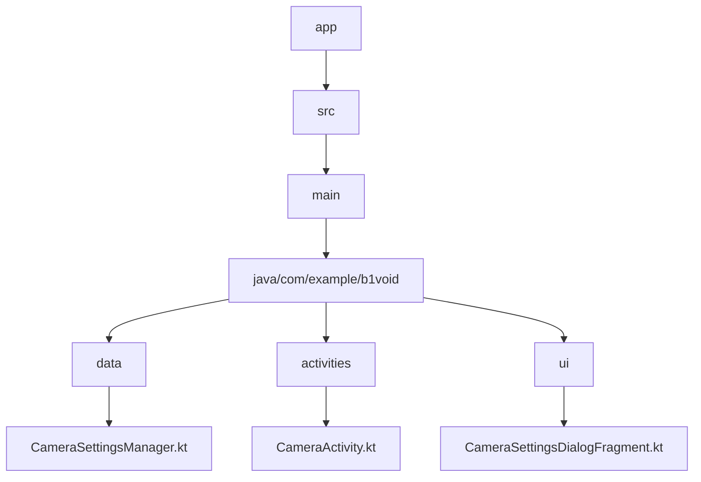
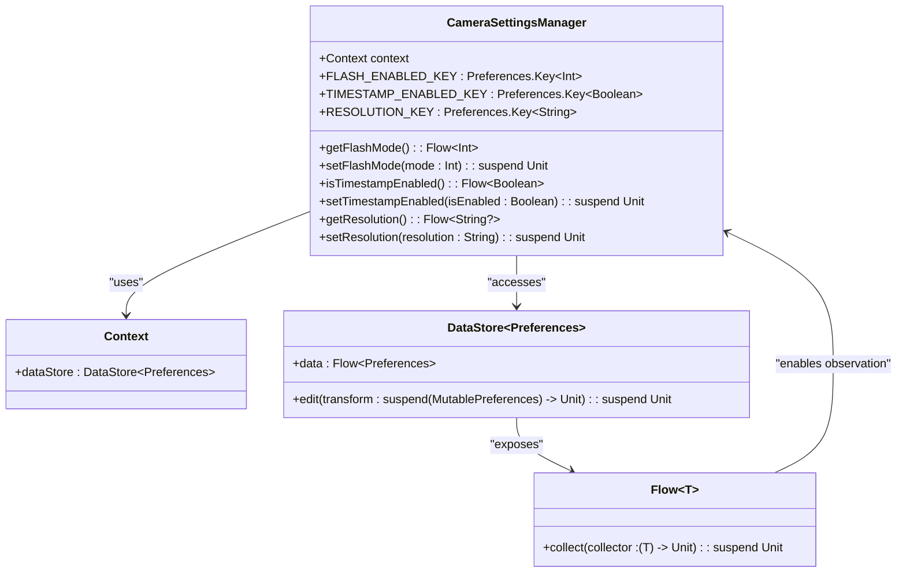
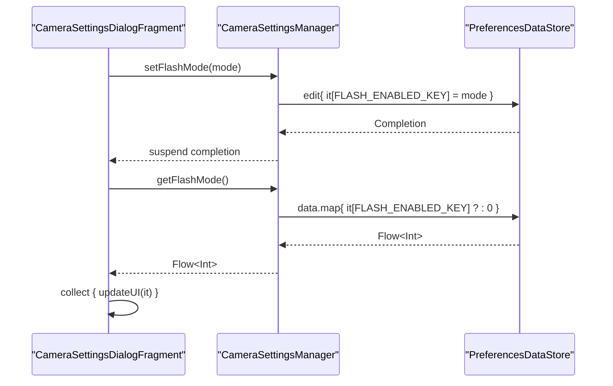
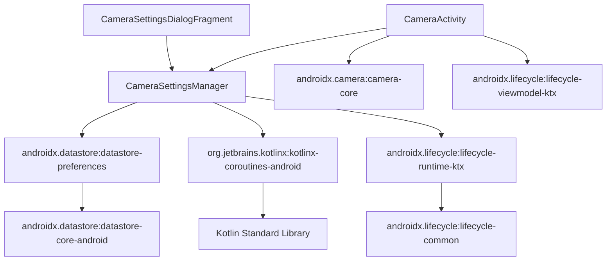

# Settings Persistence with DataStore

<cite>
**Referenced Files in This Document**   
- [CameraSettingsManager.kt](file://app/src/main/java/com/example/b1void/data/CameraSettingsManager.kt)
- [CameraActivity.kt](file://app/src/main/java/com/example/b1void/activities/CameraActivity.kt)
- [CameraSettingsDialogFragment.kt](file://app/src/main/java/com/example/b1void/ui/CameraSettingsDialogFragment.kt)
- [build.gradle.kts](file://app/build.gradle.kts)
</cite>

## Table of Contents
1. [Introduction](#introduction)
2. [Project Structure](#project-structure)
3. [Core Components](#core-components)
4. [Architecture Overview](#architecture-overview)
5. [Detailed Component Analysis](#detailed-component-analysis)
6. [Dependency Analysis](#dependency-analysis)
7. [Performance Considerations](#performance-considerations)
8. [Troubleshooting Guide](#troubleshooting-guide)
9. [Conclusion](#conclusion)

## Introduction
This document provides a comprehensive analysis of the settings persistence mechanism implemented using Android DataStore in the Inspector_appVX application. The focus is on the CameraSettingsManager class, which utilizes PreferencesDataStore to manage camera-related preferences such as flash mode, timestamp overlay toggle, and selected resolution. The implementation leverages Kotlin Flow for reactive programming, enabling real-time UI updates across components like CameraActivity and CameraSettingsDialogFragment. The documentation covers type-safe keys, suspend functions for data operations, migration considerations from SharedPreferences, testing strategies, and performance benefits of DataStore over legacy solutions.

## Project Structure
The project follows a standard Android application structure with clear separation of concerns through package organization. The core functionality related to camera settings persistence is located in the `data` package, while UI components are organized in separate packages for activities and UI fragments. The implementation uses modern Android development practices including ViewBinding, CameraX, and Kotlin coroutines.



**Diagram sources**
- [CameraSettingsManager.kt](file://app/src/main/java/com/example/b1void/data/CameraSettingsManager.kt)
- [CameraActivity.kt](file://app/src/main/java/com/example/b1void/activities/CameraActivity.kt)
- [CameraSettingsDialogFragment.kt](file://app/src/main/java/com/example/b1void/ui/CameraSettingsDialogFragment.kt)

**Section sources**
- [CameraSettingsManager.kt](file://app/src/main/java/com/example/b1void/data/CameraSettingsManager.kt)
- [CameraActivity.kt](file://app/src/main/java/com/example/b1void/activities/CameraActivity.kt)
- [CameraSettingsDialogFragment.kt](file://app/src/main/java/com/example/b1void/ui/CameraSettingsDialogFragment.kt)

## Core Components
The core components of the settings persistence system include CameraSettingsManager for managing preferences, CameraActivity for displaying and responding to settings changes, and CameraSettingsDialogFragment for providing a user interface to modify settings. These components work together to create a reactive settings management system using DataStore and Kotlin Flow.

**Section sources**
- [CameraSettingsManager.kt](file://app/src/main/java/com/example/b1void/data/CameraSettingsManager.kt)
- [CameraActivity.kt](file://app/src/main/java/com/example/b1void/activities/CameraActivity.kt)
- [CameraSettingsDialogFragment.kt](file://app/src/main/java/com/example/b1void/ui/CameraSettingsDialogFragment.kt)

## Architecture Overview
The architecture follows a clean separation between data storage, business logic, and presentation layers. DataStore serves as the persistent storage layer, CameraSettingsManager acts as the domain layer abstraction, and the various activities and fragments constitute the presentation layer. The system uses reactive programming principles to ensure that UI components automatically update when settings change.

```mermaid
graph TD
A[UI Layer] --> B[Domain Layer]
B --> C[Data Layer]
A --> |Observe| B
B --> |Persist| C
C --> |PreferencesDataStore| D[(Persistent Storage)]
subgraph "UI Layer"
E[CameraActivity]
F[CameraSettingsDialogFragment]
end
subgraph "Domain Layer"
G[CameraSettingsManager]
end
subgraph "Data Layer"
H[DataStore]
end
E --> |Collect Flow| G
F --> |Collect Flow| G
G --> |edit()| H
H --> |Flow| G
```

**Diagram sources**
- [CameraSettingsManager.kt](file://app/src/main/java/com/example/b1void/data/CameraSettingsManager.kt)
- [CameraActivity.kt](file://app/src/main/java/com/example/b1void/activities/CameraActivity.kt)
- [CameraSettingsDialogFragment.kt](file://app/src/main/java/com/example/b1void/ui/CameraSettingsDialogFragment.kt)

## Detailed Component Analysis

### CameraSettingsManager Analysis
The CameraSettingsManager class provides a type-safe interface for managing camera preferences using Android DataStore. It encapsulates the complexity of data persistence and exposes simple methods for reading and writing settings.

#### For Object-Oriented Components:


**Diagram sources**
- [CameraSettingsManager.kt](file://app/src/main/java/com/example/b1void/data/CameraSettingsManager.kt#L15-L58)

#### For API/Service Components:


**Diagram sources**
- [CameraSettingsManager.kt](file://app/src/main/java/com/example/b1void/data/CameraSettingsManager.kt#L15-L58)
- [CameraSettingsDialogFragment.kt](file://app/src/main/java/com/example/b1void/ui/CameraSettingsDialogFragment.kt#L15-L65)

#### For Complex Logic Components:
```mermaid
flowchart TD
Start([Application Start]) --> Initialize["Create CameraSettingsManager instance"]
Initialize --> Observe["Set up Flow collectors in CameraActivity"]
Observe --> Wait["Wait for setting changes"]
subgraph "Setting Change"
Direction LR
UserAction["User changes setting in UI"] --> CallSet["Call setFlashMode/setTimestampEnabled/setResolution"]
CallSet --> DataStoreEdit["DataStore.edit { transaction }"]
DataStoreEdit --> Persist["Write to disk asynchronously"]
Persist --> Emit["Emit new value through Flow"]
Emit --> Collectors["Notify all Flow collectors"]
Collectors --> UpdateUI["Update UI components"]
end
UpdateUI --> Wait
Wait --> UserAction
```

**Diagram sources**
- [CameraSettingsManager.kt](file://app/src/main/java/com/example/b1void/data/CameraSettingsManager.kt#L15-L58)
- [CameraActivity.kt](file://app/src/main/java/com/example/b1void/activities/CameraActivity.kt#L76-L880)

**Section sources**
- [CameraSettingsManager.kt](file://app/src/main/java/com/example/b1void/data/CameraSettingsManager.kt#L15-L58)

### Camera Activity Integration
The CameraActivity integrates with the CameraSettingsManager to observe settings changes and update the camera configuration accordingly. This ensures that changes made in the settings dialog are immediately reflected in the camera behavior.

**Section sources**
- [CameraActivity.kt](file://app/src/main/java/com/example/b1void/activities/CameraActivity.kt#L76-L880)

### Settings Dialog Implementation
The CameraSettingsDialogFragment provides a user interface for modifying camera settings. It interacts with the CameraSettingsManager to both read current settings and save new values, creating a complete settings management workflow.

**Section sources**
- [CameraSettingsDialogFragment.kt](file://app/src/main/java/com/example/b1void/ui/CameraSettingsDialogFragment.kt#L15-L65)

## Dependency Analysis
The settings persistence system has well-defined dependencies that follow modern Android development practices. The implementation relies on official Android libraries for data persistence and reactive programming, ensuring compatibility and maintainability.



**Diagram sources**
- [build.gradle.kts](file://app/build.gradle.kts#L0-L129)
- [CameraSettingsManager.kt](file://app/src/main/java/com/example/b1void/data/CameraSettingsManager.kt#L15-L58)

**Section sources**
- [build.gradle.kts](file://app/build.gradle.kts#L0-L129)
- [CameraSettingsManager.kt](file://app/src/main/java/com/example/b1void/data/CameraSettingsManager.kt#L15-L58)

## Performance Considerations
The implementation of DataStore provides several performance advantages over traditional SharedPreferences:

1. **Asynchronous Operations**: All data operations are performed asynchronously using coroutines, preventing blocking of the main thread.
2. **Type Safety**: Type-safe keys eliminate runtime errors related to incorrect data types.
3. **Reactive Programming**: Kotlin Flow enables efficient observation of settings changes without polling.
4. **Atomic Writes**: DataStore ensures atomic writes, preventing data corruption.
5. **Proto DataStore Option**: While this implementation uses PreferencesDataStore, Proto DataStore could be used for more complex structured data with better performance.

The use of Flow.collect in lifecycleScope ensures that observers are automatically managed according to the component lifecycle, preventing memory leaks and unnecessary processing.

## Troubleshooting Guide
When encountering issues with the settings persistence system, consider the following common problems and solutions:

**Section sources**
- [CameraSettingsManager.kt](file://app/src/main/java/com/example/b1void/data/CameraSettingsManager.kt#L15-L58)
- [CameraActivity.kt](file://app/src/main/java/com/example/b1void/activities/CameraActivity.kt#L76-L880)
- [CameraSettingsDialogFragment.kt](file://app/src/main/java/com/example/b1void/ui/CameraSettingsDialogFragment.kt#L15-L65)

## Conclusion
The CameraSettingsManager implementation demonstrates an effective use of Android DataStore for managing application settings. By leveraging type-safe keys, Kotlin Flow, and coroutines, the system provides a robust, reactive settings management solution that ensures consistency across UI components. The architecture promotes separation of concerns, testability, and maintainability, serving as a model implementation for similar requirements in other applications.