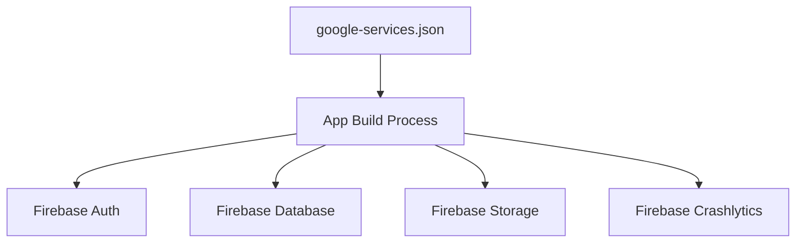
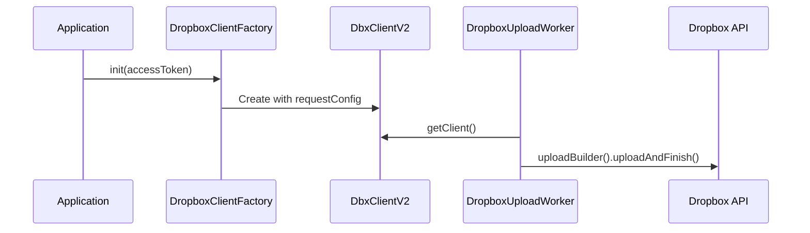

# Developer Setup Guide

<cite>
**Referenced Files in This Document**   
- [settings.gradle.kts](file://settings.gradle.kts)
- [build.gradle.kts](file://build.gradle.kts)
- [app/build.gradle.kts](file://app/build.gradle.kts)
- [gradle.properties](file://gradle.properties)
- [app/google-services.json](file://app/google-services.json)
- [app/src/main/java/com/example/b1void/B1VoidApplication.kt](file://app/src/main/java/com/example/b1void/B1VoidApplication.kt)
- [app/src/main/java/com/example/b1void/utils/DropboxClientFactory.kt](file://app/src/main/java/com/example/b1void/utils/DropboxClientFactory.kt)
- [app/src/main/java/com/example/b1void/workers/DropboxUploadWorker.kt](file://app/src/main/java/com/example/b1void/workers/DropboxUploadWorker.kt)
</cite>

## Table of Contents
1. [Development Environment Setup](#development-environment-setup)  
2. [Project Import and Configuration](#project-import-and-configuration)  
3. [Firebase Integration](#firebase-integration)  
4. [Build Optimization Settings](#build-optimization-settings)  
5. [Dropbox API Integration](#dropbox-api-integration)  
6. [Troubleshooting Common Issues](#troubleshooting-common-issues)  
7. [Debugging Workflows](#debugging-workflows)  
8. [Contribution Guidelines](#contribution-guidelines)

## Development Environment Setup

To set up the development environment for the V1 Android application, follow these steps:

1. **Install Android Studio**: Download and install the latest stable version of Android Studio from the official website. Ensure that the bundled Android SDK is installed during setup.

2. **Install JDK 17**: The project requires Java Development Kit (JDK) version 17. Install it via the Android Studio SDK Manager or manually by downloading from Oracle or OpenJDK sources. Configure the JDK path in Android Studio under *File > Project Structure > SDK Location*.

3. **Gradle Wrapper**: The project uses Gradle wrapper (`gradlew`). No separate Gradle installation is required. The wrapper will automatically use the version specified in `gradle/wrapper/gradle-wrapper.properties`. On first build, Gradle will be downloaded and configured.

4. **Enable Kotlin Support**: The project is primarily written in Kotlin. Android Studio should automatically detect this based on the `.kt` files and apply the Kotlin plugin as defined in the top-level `build.gradle.kts`.

**Section sources**
- [build.gradle.kts](file://build.gradle.kts#L7-L10)
- [settings.gradle.kts](file://settings.gradle.kts#L1-L24)

## Project Import and Configuration

Import the project into Android Studio using the following procedure:

1. Open Android Studio and select *Open an existing Android Studio project*.
2. Navigate to the root directory: ``.
3. Select the folder and click *OK*. Android Studio will automatically detect the `settings.gradle.kts` file.

The `settings.gradle.kts` file defines the project structure:
```kotlin
rootProject.name = "b1Void"
include(":app")
```
This includes only the `:app` module in the build.

Dependencies are managed through the `build.gradle.kts` files at both project and module levels. The app-level dependencies include CameraX, Firebase, Dropbox SDK, Glide, and other libraries essential for functionality.

**Section sources**
- [settings.gradle.kts](file://settings.gradle.kts#L22-L24)
- [app/build.gradle.kts](file://app/build.gradle.kts#L1-L130)

## Firebase Integration

Firebase services are integrated using the Google Services plugin and configuration file.

1. **Place google-services.json**: The file `google-services.json` must be located in the `app/` directory. It is already present at `app/google-services.json` and contains configuration for Firebase Storage, Authentication, Crashlytics, and Database.

2. **Apply Google Services Plugin**: In `app/build.gradle.kts`, the plugin is applied:
```kotlin
plugins {
    id("com.google.gms.google-services")
}
```

3. **Enable Required APIs**: Based on the dependencies, ensure the following Firebase services are enabled in the Firebase Console:
   - Firebase Authentication
   - Firebase Realtime Database
   - Firebase Storage
   - Firebase Crashlytics

The `google-services` plugin automatically configures the application ID and API keys during build time.

**Diagram sources**


**Section sources**
- [app/google-services.json](file://app/google-services.json#L1-L29)
- [app/build.gradle.kts](file://app/build.gradle.kts#L3-L5)

## Build Optimization Settings

Optimize build performance and app behavior using `gradle.properties`.

Key settings in `gradle.properties`:
- `org.gradle.jvmargs=-Xmx2048m -Dfile.encoding=UTF-8`: Allocates sufficient heap memory for the Gradle daemon.
- `android.useAndroidX=true`: Enables AndroidX migration.
- `android.nonTransitiveRClass=true`: Reduces R class size by including only direct resources.

Additional optimizations in `app/build.gradle.kts`:
- **MultiDex Enabled**: For devices with limited memory (`minSdk=25`).
- **ABI Filters**: Limits native libraries to common architectures: armeabi-v7a, arm64-v8a, x86, x86_64.
- **ProGuard Rules**: Minification and resource shrinking enabled for release builds.

**Section sources**
- [gradle.properties](file://gradle.properties#L1-L21)
- [app/build.gradle.kts](file://app/build.gradle.kts#L15-L25)

## Dropbox API Integration

The app integrates with Dropbox for file synchronization using the official Dropbox Core SDK.

1. **Register App on Dropbox Developer Console**:
   - Go to [Dropbox Developers](https://www.dropbox.com/developers/apps).
   - Create a new app with "Full Dropbox" access.
   - Note the App Key and generate an App Secret.

2. **Configure Access Token**:
   - Generate a short-lived access token from the Dropbox console.
   - Initialize the client in code using `DropboxClientFactory.init("YOUR_ACCESS_TOKEN")`.

3. **Code Implementation**:
   - `DropboxClientFactory` manages the singleton instance of `DbxClientV2`.
   - `DropboxUploadWorker` handles background uploads using WorkManager.
   - The SDK versions used are `dropbox-core-sdk:7.0.0` and `dropbox-android-sdk:7.0.0`.

Example initialization in `B1VoidApplication.kt`:
```kotlin
DropboxClientFactory.init("YOUR_ACCESS_TOKEN")
```

Replace `"YOUR_ACCESS_TOKEN"` with a valid token before testing.

**Diagram sources**


**Section sources**
- [app/src/main/java/com/example/b1void/utils/DropboxClientFactory.kt](file://app/src/main/java/com/example/b1void/utils/DropboxClientFactory.kt#L5-L22)
- [app/src/main/java/com/example/b1void/workers/DropboxUploadWorker.kt](file://app/src/main/java/com/example/b1void/workers/DropboxUploadWorker.kt#L1-L58)
- [app/src/main/java/com/example/b1void/B1VoidApplication.kt](file://app/src/main/java/com/example/b1void/B1VoidApplication.kt#L14-L53)

## Troubleshooting Common Issues

### Signing Certificate Fingerprints
If encountering authentication errors with Firebase or Dropbox:
- Generate SHA-1 fingerprint: Run `./gradlew signingReport` in the project root.
- Add the debug and release fingerprints in Firebase Console under *Project Settings > General > Your apps*.

### Emulator Compatibility
Some emulators may lack camera or sensor support:
- Use a physical device for camera-related testing.
- Enable camera emulation in AVD settings if necessary.
- Ensure HAXM or Hypervisor is installed for better performance.

### Dependency Resolution Errors
If Gradle fails to resolve dependencies:
- Verify internet connectivity.
- Check repository URLs in `settings.gradle.kts`:
```kotlin
repositories {
    google()
    mavenCentral()
    maven { url = uri("https://www.jitpack.io") }
}
```
- Clear Gradle cache: Delete `.gradle` folder in user home or run `./gradlew cleanBuildCache`.

**Section sources**
- [settings.gradle.kts](file://settings.gradle.kts#L10-L18)
- [app/build.gradle.kts](file://app/build.gradle.kts#L65-L70)

## Debugging Workflows

Use the following tools for effective debugging:

1. **Logcat**: Filter logs by tag `CameraActivity`, `DropboxUploadWorker`, or `ImageOptimizer` to monitor specific components.
2. **Breakpoint Debugging**: Set breakpoints in Kotlin files like `CameraActivity.kt` or `ImagePreviewActivity.kt`. Use step-over, step-into, and variable inspection.
3. **Network Inspection**: Use Android Studio’s Network Profiler to monitor Dropbox and Firebase API calls.
4. **Memory Profiler**: Detect leaks in image handling via `ImageOptimizer` and `Glide` cache management.

For background tasks, inspect `WorkManager` status using:
```kotlin
WorkManager.getInstance(context).getWorkInfosByTag("dropbox_upload").observe(...)
```

**Section sources**
- [app/src/main/java/com/example/b1void/activities/CameraActivity.kt](file://app/src/main/java/com/example/b1void/activities/CameraActivity.kt#L76-L880)
- [app/src/main/java/com/example/b1void/utils/ImageOptimizer.kt](file://app/src/main/java/com/example/b1void/utils/ImageOptimizer.kt#L16-L170)

## Contribution Guidelines

Follow these standards when contributing to the project:

### Code Style (Kotlin)
- Use KDoc comments for public classes and methods.
- Follow Kotlin naming conventions: `camelCase` for variables, `PascalCase` for types.
- Limit line length to 120 characters.
- Use delegated properties and extension functions where appropriate.

### Commit Message Conventions
Format: `<type>: <subject>`
Types: `feat`, `fix`, `docs`, `style`, `refactor`, `test`, `chore`
Example: `feat(camera): add flash mode toggle`

### Pull Request Process
1. Fork the repository.
2. Create a feature branch: `git checkout -b feature/your-feature-name`.
3. Commit changes with descriptive messages.
4. Push to your fork and open a PR to `main`.
5. Include screenshots or logs if applicable.
6. Wait for review and address feedback.

**Section sources**
- [app/src/main/java/com/example/b1void/data/CameraSettingsManager.kt](file://app/src/main/java/com/example/b1void/data/CameraSettingsManager.kt#L15-L58)
- [app/src/main/java/com/example/b1void/ui/CameraSettingsDialogFragment.kt](file://app/src/main/java/com/example/b1void/ui/CameraSettingsDialogFragment.kt#L15-L65)