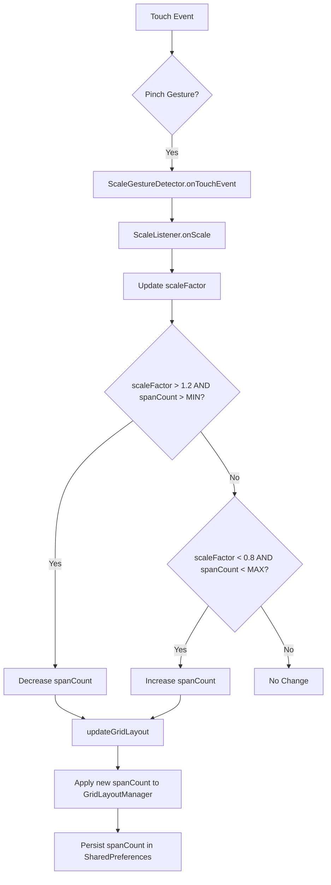
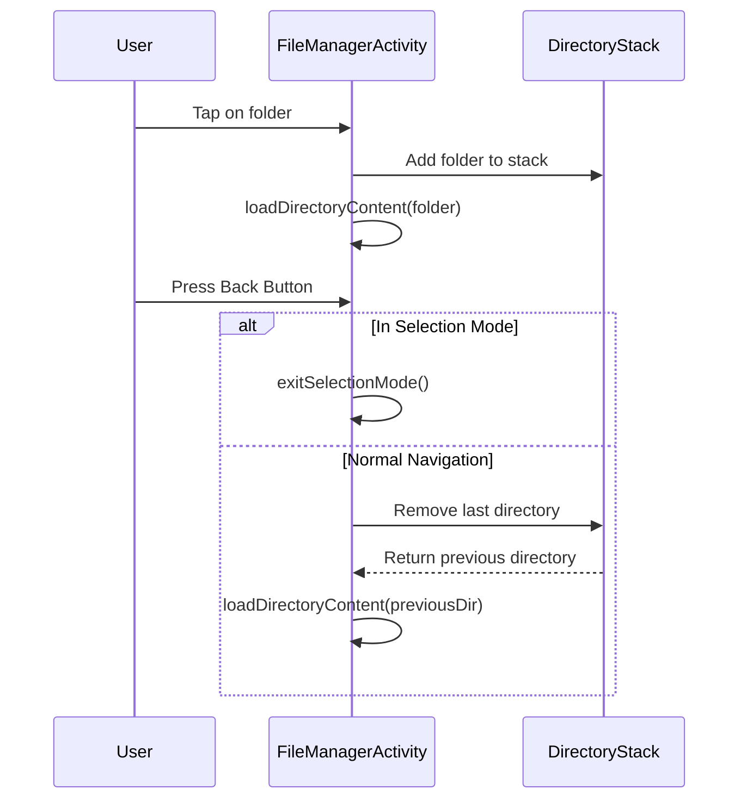
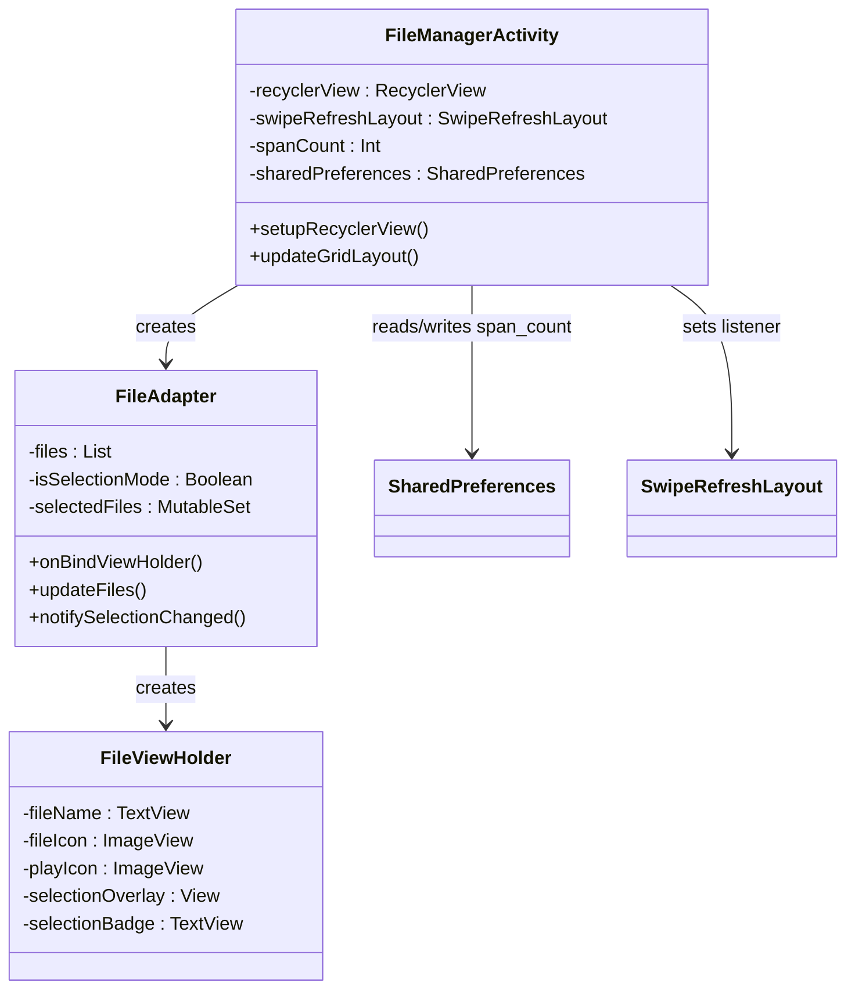
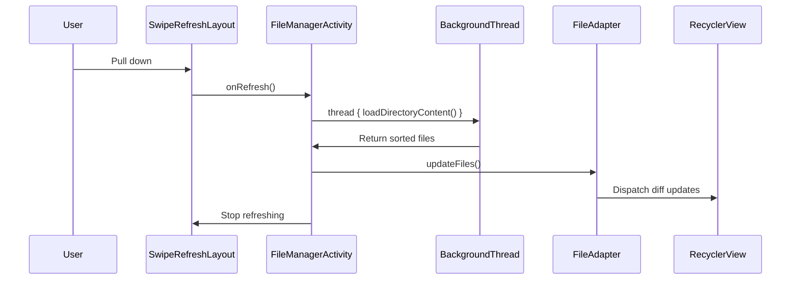

# File Browsing Interface

<cite>
**Referenced Files in This Document**   
- [FileManagerActivity.kt](file://app/src/main/java/com/example/b1void/activities/FileManagerActivity.kt)
- [FileAdapter.kt](file://app/src/main/java/com/example/b1void/adapters/FileAdapter.kt)
- [item_file.xml](file://app/src/main/res/layout/item_file.xml)
- [activity_file_manager.xml](file://app/src/main/res/layout/activity_file_manager.xml)
- [FileManagerUtils.kt](file://app/src/main/java/com/example/b1void/utils/FileManagerUtils.kt)
</cite>

## Table of Contents
1. [Introduction](#introduction)
2. [Grid Layout and Pinch-to-Zoom Support](#grid-layout-and-pinch-to-zoom-support)
3. [Folder Navigation with Directory Stack](#folder-navigation-with-directory-stack)
4. [RecyclerView Integration and Layout Persistence](#recyclerview-integration-and-layout-persistence)
5. [Visual Design of Item Layout](#visual-design-of-item-layout)
6. [Performance Optimizations](#performance-optimizations)
7. [Swipe Refresh and Configuration Handling](#swipe-refresh-and-configuration-handling)
8. [Conclusion](#conclusion)

## Introduction
The file browsing interface in `FileManagerActivity` provides a responsive, user-friendly way to navigate, view, and manage files within the application's private storage. It features a dynamic grid layout with pinch-to-zoom support, efficient RecyclerView rendering, and seamless folder navigation using a directory stack. The UI supports selection mode, contextual actions, and maintains state across configuration changes. This document details the implementation of core components including grid layout management, navigation logic, visual design, and performance optimizations.

## Grid Layout and Pinch-to-Zoom Support

The file browsing interface uses a dynamically adjustable grid layout powered by `GridLayoutManager` and enhanced with `ScaleGestureDetector` for intuitive pinch-to-zoom interaction. The number of columns (span count) adjusts based on user gestures, allowing users to zoom in for larger thumbnails or zoom out to see more items.

A custom `ScaleListener` extends `ScaleGestureDetector.SimpleOnScaleGestureListener` to detect scaling gestures. During a scale event, cumulative scaling is tracked, and when thresholds are crossed (scale factor > 1.2 or < 0.8), the span count is decreased or increased respectively, triggering a layout update. This enables smooth transitions between different grid densities.

The initial span count is calculated based on screen width and a desired item size (120dp), ensuring optimal use of available space. The current span count is persisted across sessions using `SharedPreferences`, maintaining user preference between app launches.



**Diagram sources**
- [FileManagerActivity.kt](file://app/src/main/java/com/example/b1void/activities/FileManagerActivity.kt#L75-L120)

**Section sources**
- [FileManagerActivity.kt](file://app/src/main/java/com/example/b1void/activities/FileManagerActivity.kt#L75-L120)

## Folder Navigation with Directory Stack

Folder navigation is implemented using a `LinkedList<File>` as a directory stack, enabling forward and backward navigation through the file system hierarchy. When a user opens a directory, it is added to the stack via `openDirectory()`. Pressing the back button removes the current directory from the stack and loads the previous one.

This approach ensures that users can seamlessly navigate into subdirectories and return to parent directories without losing context. The stack is preserved during configuration changes via `onSaveInstanceState()` and restored in `onCreate()`, maintaining navigation history across screen rotations.

The root of navigation is the app's main directory, created at startup using `FileManagerUtils.createAppDirectories()`. Special handling exists for the trash directory, which is hidden from the main view but accessible via a dedicated button.



**Diagram sources**
- [FileManagerActivity.kt](file://app/src/main/java/com/example/b1void/activities/FileManagerActivity.kt#L39-L41)
- [FileManagerActivity.kt](file://app/src/main/java/com/example/b1void/activities/FileManagerActivity.kt#L350-L370)

**Section sources**
- [FileManagerActivity.kt](file://app/src/main/java/com/example/b1void/activities/FileManagerActivity.kt#L39-L41)
- [FileManagerActivity.kt](file://app/src/main/java/com/example/b1void/activities/FileManagerActivity.kt#L350-L370)

## RecyclerView Integration and Layout Persistence

The file list is rendered using `RecyclerView` with `GridLayoutManager`, providing efficient scrolling and view recycling. The adapter, `FileAdapter`, binds file data to views defined in `item_file.xml`. Each item displays either a thumbnail (for images/videos) or an icon with filename (for folders/other files).

Layout persistence is achieved by saving the span count in `SharedPreferences` whenever it changes. During `setupRecyclerView()`, the last saved span count is retrieved, ensuring consistent grid appearance across app restarts. On configuration changes (e.g., screen rotation), `onConfigurationChanged()` reinitializes the RecyclerView with the current span count.

The swipe-to-refresh functionality is integrated via `SwipeRefreshLayout`, allowing users to reload the current directory contents. During refresh, the UI shows a progress indicator while loading occurs on a background thread.



**Diagram sources**
- [FileManagerActivity.kt](file://app/src/main/java/com/example/b1void/activities/FileManagerActivity.kt#L42-L45)
- [FileAdapter.kt](file://app/src/main/java/com/example/b1void/adapters/FileAdapter.kt#L15-L22)

**Section sources**
- [FileManagerActivity.kt](file://app/src/main/java/com/example/b1void/activities/FileManagerActivity.kt#L42-L45)
- [FileAdapter.kt](file://app/src/main/java/com/example/b1void/adapters/FileAdapter.kt#L15-L22)

## Visual Design of Item Layout

The visual presentation of each file item is defined in `item_file.xml`, a `FrameLayout` containing multiple overlapping elements:

- **File Icon/Image**: An `ImageView` (`file_icon`) that displays either a static icon or a loaded thumbnail via Glide.
- **Play Indicator**: A centered `ImageView` (`play_icon`) shown only for video files, overlaying the thumbnail.
- **Selection Overlay**: A semi-transparent layer visible when a file is selected.
- **Selection Badge**: A circular badge in the top-right corner showing the selection order.
- **File Name**: A text label at the bottom with a dark background, used for non-media files.

For image and video files, Glide loads thumbnails directly from `File` objects, applying center cropping and placeholder/error drawables. The layout dynamically hides the filename and shows the media preview, creating a clean, modern gallery-like interface.

```mermaid
erDiagram
ITEM_FILE_LAYOUT ||--o{ ImageView : "file_icon"
ITEM_FILE_LAYOUT ||--o{ ImageView : "play_icon"
ITEM_FILE_LAYOUT ||--o{ View : "selection_overlay"
ITEM_FILE_LAYOUT ||--o{ TextView : "file_name"
ITEM_FILE_LAYOUT ||--o{ TextView : "selection_badge"
class ITEM_FILE_LAYOUT {
FrameLayout container
ImageView file_icon (match_parent x 0dp)
ImageView play_icon (48dp x 48dp, center)
View selection_overlay (match_parent x match_parent)
TextView file_name (match_parent x wrap_content, bottom)
TextView selection_badge (28dp x 28dp, top|end)
}
```

**Diagram sources**
- [item_file.xml](file://app/src/main/res/layout/item_file.xml#L1-L54)

**Section sources**
- [item_file.xml](file://app/src/main/res/layout/item_file.xml#L1-L54)
- [FileAdapter.kt](file://app/src/main/java/com/example/b1void/adapters/FileAdapter.kt#L50-L90)

## Performance Optimizations

The file browsing interface implements several performance optimizations to ensure smooth operation:

### DiffUtil in FileAdapter
The `FileAdapter` uses `DiffUtil.calculateDiff()` to efficiently update the RecyclerView when directory contents change. The `FileDiffCallback` compares files by absolute path and content (last modified time, name), minimizing unnecessary view updates and animations.

### Asynchronous Directory Loading
Directory listing and file operations occur on background threads using Kotlin's `thread {}` builder, preventing UI blocking. After loading, results are posted to the UI thread using `runOnUiThread {}`.

### Image Caching and Optimization
Glide handles image loading with built-in memory and disk caching. Additionally, `ImageOptimizer.clearImageCache()` is called after file operations to maintain cache consistency.

### Efficient Selection Management
In selection mode, only changed items are updated via `notifySelectionChanged()`, which identifies impacted positions and calls `notifyItemChanged()` selectively rather than refreshing the entire dataset.

```mermaid
flowchart LR
A[Directory Change] --> B[Load files on background thread]
B --> C[Sort and filter files]
C --> D[Calculate Diff with DiffUtil]
D --> E[Dispatch updates to RecyclerView]
E --> F[Minimal view binding]
G[User selects file] --> H[Add to selectedFiles set]
H --> I[Find affected items]
I --> J[notifyItemChanged() only for impacted positions]
```

**Diagram sources**
- [FileAdapter.kt](file://app/src/main/java/com/example/b1void/adapters/FileAdapter.kt#L130-L150)
- [FileManagerActivity.kt](file://app/src/main/java/com/example/b1void/activities/FileManagerActivity.kt#L280-L300)

**Section sources**
- [FileAdapter.kt](file://app/src/main/java/com/example/b1void/adapters/FileAdapter.kt#L130-L150)
- [FileManagerActivity.kt](file://app/src/main/java/com/example/b1void/activities/FileManagerActivity.kt#L280-L300)

## Swipe Refresh and Configuration Handling

The `SwipeRefreshLayout` provides a standard pull-to-refresh gesture for reloading the current directory. It disables swipe-to-refresh during scaling gestures to prevent conflicts.

During configuration changes (e.g., screen rotation), `onConfigurationChanged()` triggers `setupRecyclerView()` to reapply the current span count. The activity also saves and restores critical state—including the directory stack and selection state—using `onSaveInstanceState()` and `onCreate()` bundle handling.

The UI adapts to landscape mode using a separate layout (`activity_file_manager.xml` in `layout-land`), which includes additional controls like a vertical seekbar for brightness adjustment and reorganized action buttons.



**Diagram sources**
- [FileManagerActivity.kt](file://app/src/main/java/com/example/b1void/activities/FileManagerActivity.kt#L190-L195)
- [activity_file_manager.xml](file://app/src/main/res/layout/activity_file_manager.xml#L1-L27)

**Section sources**
- [FileManagerActivity.kt](file://app/src/main/java/com/example/b1void/activities/FileManagerActivity.kt#L190-L195)
- [activity_file_manager.xml](file://app/src/main/res/layout/activity_file_manager.xml#L1-L27)

## Conclusion
The file browsing interface in `FileManagerActivity` delivers a robust, performant, and user-friendly experience for managing files within the application. Key features include dynamic grid layout with pinch-to-zoom, efficient RecyclerView rendering with DiffUtil, and seamless folder navigation via a directory stack. The visual design prioritizes media content with Glide-powered thumbnails and contextual indicators, while performance optimizations ensure smooth operation even with large directories. State persistence across configuration changes and sessions enhances usability, making this component a central part of the application's file management capabilities.