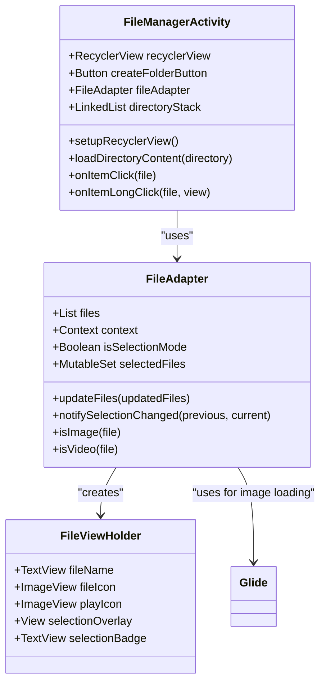
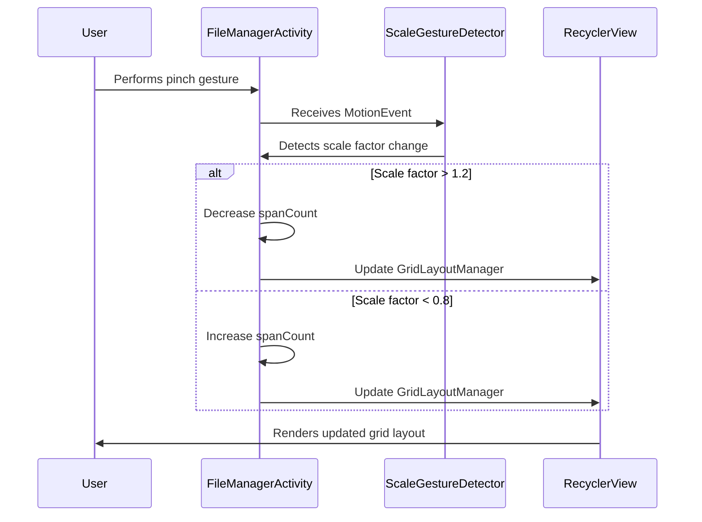
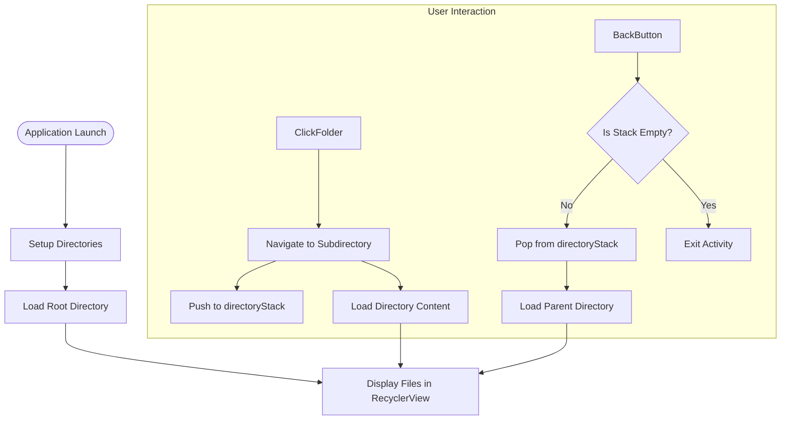
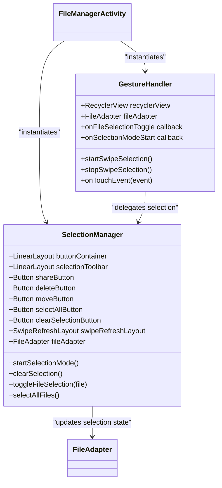
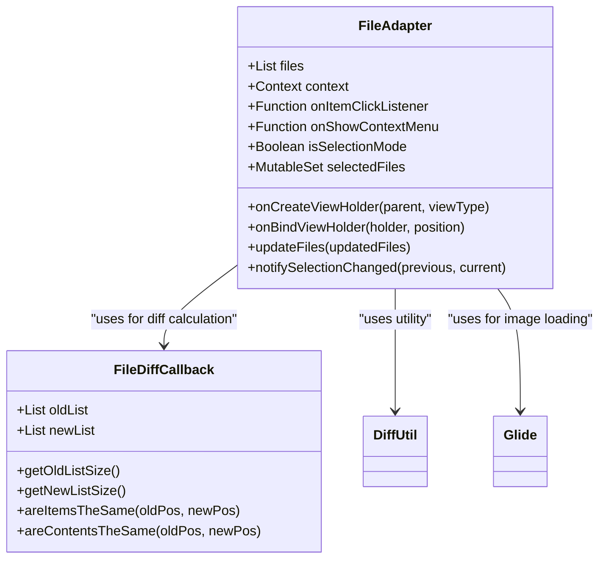
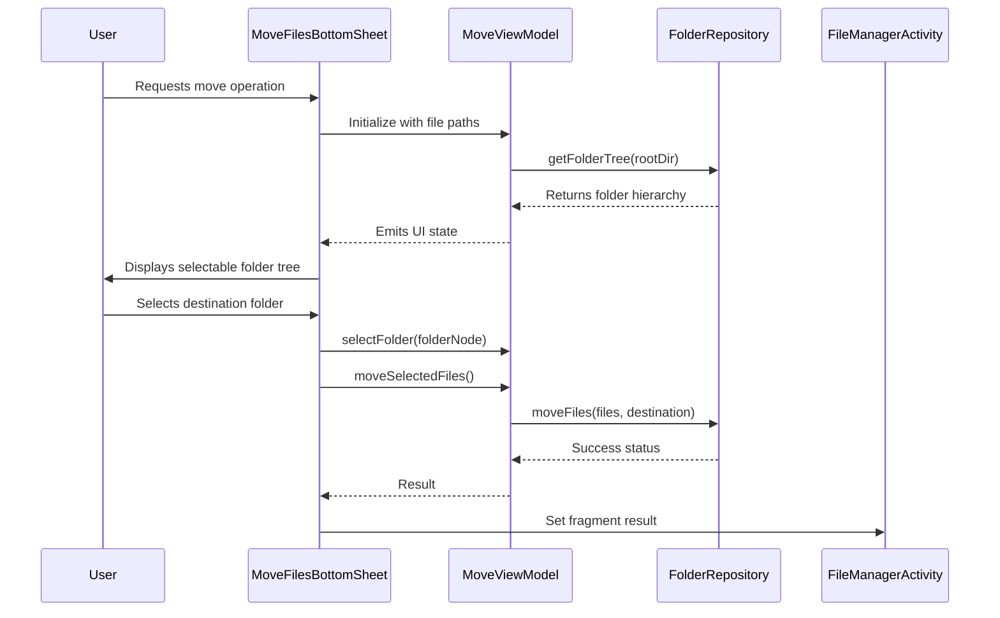
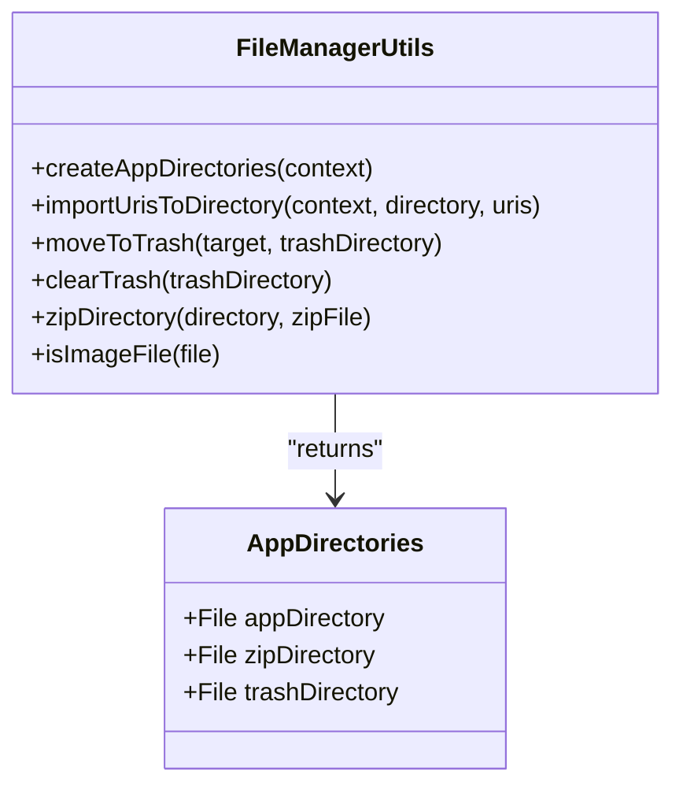
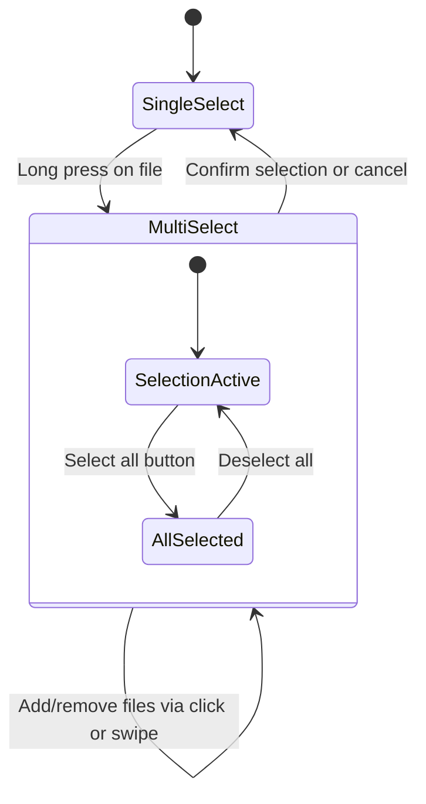

# File Management System

<cite>
**Referenced Files in This Document**   
- [FileManagerActivity.kt](file://app/src/main/java/com/example/b1void/activities/FileManagerActivity.kt)
- [FileAdapter.kt](file://app/src/main/java/com/example/b1void/adapters/FileAdapter.kt)
- [item_file.xml](file://app/src/main/res/layout/item_file.xml)
- [activity_file_manager.xml](file://app/src/main/res/layout/activity_file_manager.xml)
- [GestureHandler.kt](file://app/src/main/java/com/example/b1void/utils/GestureHandler.kt)
- [SelectionManager.kt](file://app/src/main/java/com/example/b1void/utils/SelectionManager.kt)
- [CreateFolderTask.kt](file://app/src/main/java/com/example/b1void/tasks/CreateFolderTask.kt)
- [DeleteTask.kt](file://app/src/main/java/com/example/b1void/tasks/DeleteTask.kt)
- [MoveFilesBottomSheet.kt](file://app/src/main/java/com/example/b1void/ui/MoveFilesBottomSheet.kt)
- [MoveViewModel.kt](file://app/src/main/java/com/example/b1void/viewmodels/MoveViewModel.kt)
- [ListFolderTask.kt](file://app/src/main/java/com/example/b1void/tasks/ListFolderTask.kt)
- [FileManagerUtils.kt](file://app/src/main/java/com/example/b1void/utils/FileManagerUtils.kt)
- [bottom_sheet_move_files.xml](file://app/src/main/res/layout/bottom_sheet_move_files.xml)
</cite>

## Table of Contents
1. [Introduction](#introduction)
2. [Core Components](#core-components)
3. [File Browsing Interface Architecture](#file-browsing-interface-architecture)
4. [Grid Layout and Pinch-to-Zoom Implementation](#grid-layout-and-pinch-to-zoom-implementation)
5. [Folder Navigation System](#folder-navigation-system)
6. [Selection Mode with Gesture Support](#selection-mode-with-gesture-support)
7. [RecyclerView-Based Architecture](#recyclerview-based-architecture)
8. [File Operations](#file-operations)
9. [Path Manipulation and Directory Listing](#path-manipulation-and-directory-listing)
10. [Sharing Mechanisms](#sharing-mechanisms)
11. [Single vs Multi-Select Modes](#single-vs-multi-select-modes)
12. [Common Issues and Solutions](#common-issues-and-solutions)

## Introduction

The file management system provides a comprehensive interface for managing files within the application, offering features such as grid layout browsing, folder navigation, selection modes, and various file operations. The system is centered around the `FileManagerActivity` which orchestrates the user interface and interactions between various components including adapters, utilities, and view models.

## Core Components

The file management system consists of several key components that work together to provide a seamless user experience:

- **FileManagerActivity**: Main activity handling UI presentation and user interactions
- **FileAdapter**: RecyclerView adapter binding file data to UI elements
- **GestureHandler**: Manages touch gestures for selection operations
- **SelectionManager**: Coordinates selection state across the interface
- **MoveFilesBottomSheet**: Bottom sheet dialog for moving files between directories
- **MoveViewModel**: ViewModel managing state for file movement operations
- **FileManagerUtils**: Utility functions for file operations like zipping and trash management

**Section sources**
- [FileManagerActivity.kt](file://app/src/main/java/com/example/b1void/activities/FileManagerActivity.kt#L42-L838)
- [FileAdapter.kt](file://app/src/main/java/com/example/b1void/adapters/FileAdapter.kt#L15-L167)
- [GestureHandler.kt](file://app/src/main/java/com/example/b1void/utils/GestureHandler.kt#L8-L58)
- [SelectionManager.kt](file://app/src/main/java/com/example/b1void/utils/SelectionManager.kt#L11-L121)
- [MoveFilesBottomSheet.kt](file://app/src/main/java/com/example/b1void/ui/MoveFilesBottomSheet.kt#L20-L133)
- [MoveViewModel.kt](file://app/src/main/java/com/example/b1void/viewmodels/MoveViewModel.kt#L14-L123)

## File Browsing Interface Architecture

The file browsing interface is implemented as a modern Android activity using Material Design principles. The architecture follows a clean separation of concerns with distinct responsibilities for UI presentation, data binding, and business logic.

**Diagram sources**
- [FileManagerActivity.kt](file://app/src/main/java/com/example/b1void/activities/FileManagerActivity.kt#L42-L838)
- [FileAdapter.kt](file://app/src/main/java/com/example/b1void/adapters/FileAdapter.kt#L15-L167)

## Grid Layout and Pinch-to-Zoom Implementation

The file browsing interface implements a responsive grid layout with pinch-to-zoom functionality for adjusting the number of columns displayed. This allows users to customize their viewing experience based on their preferences and device size.

The implementation uses Android's `ScaleGestureDetector` to detect pinch gestures and dynamically adjusts the `spanCount` of the `GridLayoutManager`. The current span count is persisted in SharedPreferences to maintain user preferences across sessions.

**Section sources**
- [FileManagerActivity.kt](file://app/src/main/java/com/example/b1void/activities/FileManagerActivity.kt#L42-L838)

## Folder Navigation System

The folder navigation system provides intuitive browsing capabilities through a stack-based approach that maintains the user's navigation history. Users can navigate into subdirectories and return to parent directories using the back button or navigation controls.

The navigation state is preserved during configuration changes through the `onSaveInstanceState` mechanism, ensuring that users don't lose their place when rotating the device or switching apps.

**Section sources**
- [FileManagerActivity.kt](file://app/src/main/java/com/example/b1void/activities/FileManagerActivity.kt#L42-L838)

## Selection Mode with Gesture Support

The selection mode provides users with multiple ways to select files for batch operations, combining traditional long-press activation with swipe-to-select gestures for enhanced usability.

The `GestureHandler` class intercepts touch events on the RecyclerView, detecting scroll gestures while in selection mode to enable continuous file selection by swiping over items. Long press on any file item activates selection mode and selects that item.

**Diagram sources**
- [GestureHandler.kt](file://app/src/main/java/com/example/b1void/utils/GestureHandler.kt#L8-L58)
- [SelectionManager.kt](file://app/src/main/java/com/example/b1void/utils/SelectionManager.kt#L11-L121)

## RecyclerView-Based Architecture

The file browsing interface leverages RecyclerView for efficient rendering of file items, with a custom adapter that handles different file types and selection states.

The adapter efficiently updates the UI using `DiffUtil` to calculate minimal changes between dataset versions, reducing unnecessary rebinds and improving performance. Different view types are handled through conditional logic in `onBindViewHolder`, displaying appropriate icons and metadata for files, images, videos, and directories.

**Diagram sources**
- [FileAdapter.kt](file://app/src/main/java/com/example/b1void/adapters/FileAdapter.kt#L15-L167)

## File Operations

The file management system supports various operations including creating folders, deleting files, moving files, and trash functionality.

### Create Operation
The create folder operation is handled through a simple dialog interface that prompts the user for a folder name and creates the directory in the current location.

[SPEC SYMBOL](file://app/src/main/java/com/example/b1void/activities/FileManagerActivity.kt#L350-L365)

### Delete Operation
Files are not permanently deleted but moved to a trash directory to prevent accidental data loss. The `FileManagerUtils.moveToTrash` method handles this operation with conflict resolution for duplicate filenames.

[SPEC SYMBOL](file://app/src/main/java/com/example/b1void/utils/FileManagerUtils.kt#L94-L145)

### Move Operation
The move operation is implemented using a bottom sheet dialog (`MoveFilesBottomSheet`) that displays a hierarchical tree of available directories. The `MoveViewModel` manages the state and logic for this operation, working with `FolderRepository` to build the directory tree.

**Diagram sources**
- [MoveFilesBottomSheet.kt](file://app/src/main/java/com/example/b1void/ui/MoveFilesBottomSheet.kt#L20-L133)
- [MoveViewModel.kt](file://app/src/main/java/com/example/b1void/viewmodels/MoveViewModel.kt#L14-L123)
- [FolderRepository.kt](file://app/src/main/java/com/example/b1void/data/FolderRepository.kt#L7-L54)

**Section sources**
- [CreateFolderTask.kt](file://app/src/main/java/com/example/b1void/tasks/CreateFolderTask.kt#L8-L43)
- [DeleteTask.kt](file://app/src/main/java/com/example/b1void/tasks/DeleteTask.kt#L8-L42)
- [MoveFilesBottomSheet.kt](file://app/src/main/java/com/example/b1void/ui/MoveFilesBottomSheet.kt#L20-L133)
- [MoveViewModel.kt](file://app/src/main/java/com/example/b1void/viewmodels/MoveViewModel.kt#L14-L123)

## Path Manipulation and Directory Listing

The `FileManagerUtils` class provides essential utilities for path manipulation and directory operations. The `createAppDirectories` method ensures the necessary directory structure exists on application startup, while `importUrisToDirectory` handles importing files from external sources.

Directory listing is handled through the `ListFolderTask` which asynchronously retrieves file listings and updates the UI accordingly, preventing blocking of the main thread during potentially slow I/O operations.

**Diagram sources**
- [FileManagerUtils.kt](file://app/src/main/java/com/example/b1void/utils/FileManagerUtils.kt#L15-L248)
- [ListFolderTask.kt](file://app/src/main/java/com/example/b1void/tasks/ListFolderTask.kt#L8-L44)

## Sharing Mechanisms

The file management system supports both individual file sharing and bulk sharing through ZIP archive creation. For individual files, the system uses Android's ShareCompat library to present sharing options.

For multiple files, the system creates a temporary ZIP archive in the cache directory and shares it via a content provider. This approach ensures that large numbers of files can be shared efficiently without exceeding intent size limits.

[SPEC SYMBOL](file://app/src/main/java/com/example/b1void/activities/FileManagerActivity.kt#L650-L750)

## Single vs Multi-Select Modes

The interface seamlessly transitions between single and multi-select modes based on user interaction. Single selection is used for navigation and individual file operations, while multi-select mode enables batch operations.

The transition is visually indicated by showing a top toolbar with selection controls and animating its appearance. The `SelectionManager` coordinates the state between UI elements and the adapter.

**Section sources**
- [FileManagerActivity.kt](file://app/src/main/java/com/example/b1void/activities/FileManagerActivity.kt#L42-L838)
- [SelectionManager.kt](file://app/src/main/java/com/example/b1void/utils/SelectionManager.kt#L11-L121)

## Common Issues and Solutions

### Permission Handling
The system relies on proper storage permissions which should be requested at runtime on Android 6.0+. While not explicitly shown in the code, proper permission handling is essential for file operations.

### Storage Access Framework Integration
When importing files from external sources, the system uses the Storage Access Framework through `ACTION_PICK` and `ACTION_GET_CONTENT` intents, providing compatibility with various document providers.

### Performance Optimization
For large directories, the system implements several optimizations:
- Using `DiffUtil` for efficient RecyclerView updates
- Background threading for directory listing and file operations
- Image loading optimization through Glide with caching
- Lazy loading of directory contents only when needed

These measures ensure smooth performance even with thousands of files in a directory.

**Section sources**
- [FileManagerActivity.kt](file://app/src/main/java/com/example/b1void/activities/FileManagerActivity.kt#L42-L838)
- [FileAdapter.kt](file://app/src/main/java/com/example/b1void/adapters/FileAdapter.kt#L15-L167)