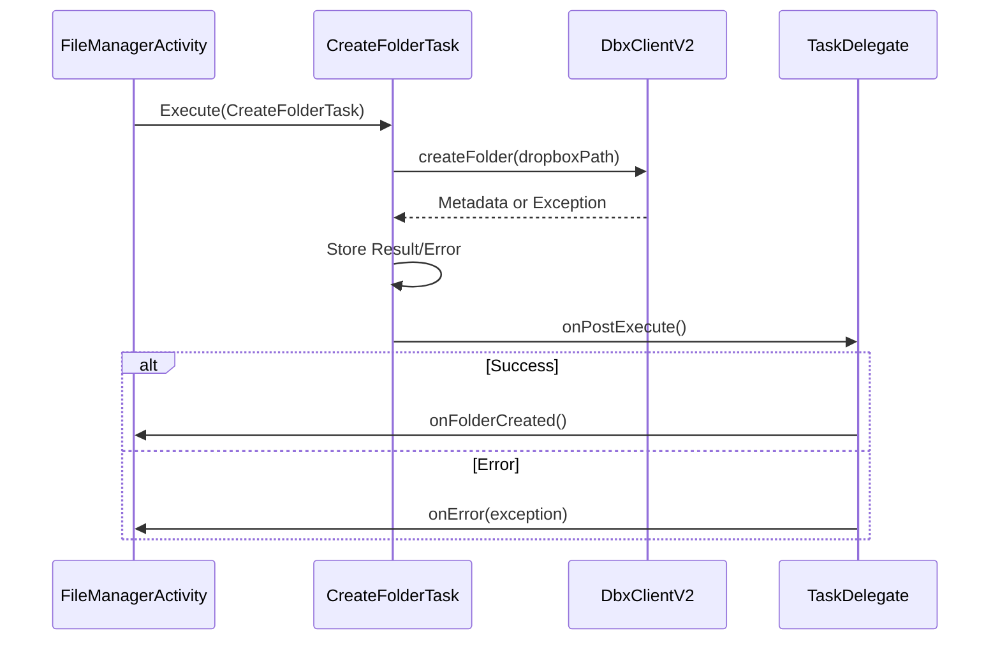
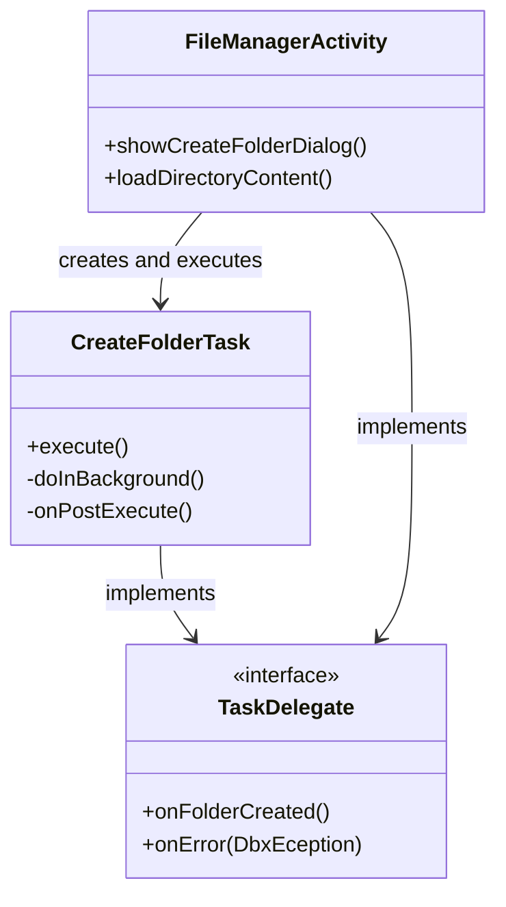
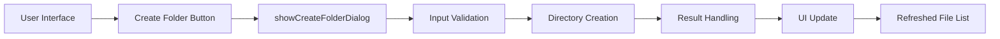
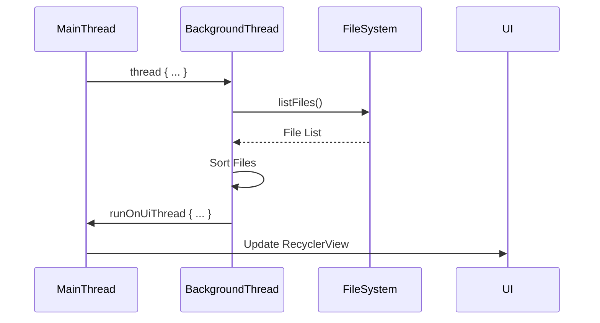
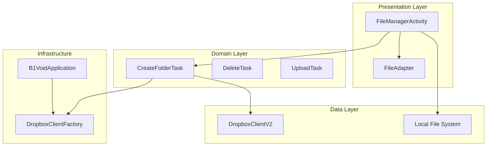

# Create Folder

<cite>
**Referenced Files in This Document **   
- [FileManagerActivity.kt](file://app/src/main/java/com/example/b1void/activities/FileManagerActivity.kt)
- [CreateFolderTask.kt](file://app/src/main/java/com/example/b1void/tasks/CreateFolderTask.kt)
- [DropboxClientFactory.kt](file://app/src/main/java/com/example/b1void/utils/DropboxClientFactory.kt)
- [B1VoidApplication.kt](file://app/src/main/java/com/example/b1void/B1VoidApplication.kt)
</cite>

## Table of Contents
1. [Introduction](#introduction)
2. [Local Folder Creation Implementation](#local-folder-creation-implementation)
3. [Cloud Folder Creation with Dropbox SDK](#cloud-folder-creation-with-dropbox-sdk)
4. [TaskDelegate Pattern for Asynchronous Communication](#taskdelegate-pattern-for-asynchronous-communication)
5. [UI Flow and User Experience](#ui-flow-and-user-experience)
6. [Error Handling and Feedback Mechanisms](#error-handling-and-feedback-mechanisms)
7. [Thread Management and I/O Operations](#thread-management-and-i-o-operations)
8. [UI Refresh and State Synchronization](#ui-refresh-and-state-synchronization)
9. [Permission Requirements and Security Considerations](#permission-requirements-and-security-considerations)
10. [Edge Cases and Validation](#edge-cases-and-validation)
11. [Architecture Overview](#architecture-overview)

## Introduction
This document provides a comprehensive analysis of the folder creation functionality in the Inspector_appVX application, covering both local and cloud-based implementations. The system enables users to create directories either on the device's local storage or in their Dropbox account through a unified interface. The implementation follows Android best practices for asynchronous operations, user interface responsiveness, and error handling. The core components include the `showCreateFolderDialog` method for local directory creation, the `CreateFolderTask` AsyncTask for cloud operations, and a TaskDelegate pattern for communication between background tasks and the UI layer.

## Local Folder Creation Implementation

The local folder creation functionality is implemented in the `FileManagerActivity` class through the `showCreateFolderDialog` method. When triggered, this method displays an AlertDialog containing an EditText field where users can input the desired folder name. The new directory is created as a subdirectory of the current working directory, which is managed by the `directoryStack` LinkedList. The actual directory creation uses the standard Java `File.mkdir()` method to create the directory on the filesystem.

```mermaid
flowchart TD
A[User Clicks Create Button] --> B[showCreateFolderDialog]
B --> C[Display AlertDialog with EditText]
C --> D[User Enters Folder Name]
D --> E[Construct File Object with Path]
E --> F[Call mkdir() on File Object]
F --> G{Success?}
G --> |Yes| H[Invoke onFolderCreated Callback]
G --> |No| I[Show Toast Error Message]
```

**Diagram sources**
- [FileManagerActivity.kt](file://app/src/main/java/com/example/b1void/activities/FileManagerActivity.kt#L492-L507)

**Section sources**
- [FileManagerActivity.kt](file://app/src/main/java/com/example/b1void/activities/FileManagerActivity.kt#L492-L507)

## Cloud Folder Creation with Dropbox SDK

For cloud-based folder creation, the application utilizes the Dropbox SDK through the `CreateFolderTask` AsyncTask implementation. This task interfaces with the `DbxClientV2` instance obtained from the `DropboxClientFactory` to create folders in the user's Dropbox account. The task takes three parameters: the Dropbox client, a delegate for result communication, and the target path where the folder should be created. The actual API call is made via `dbxClient.files().createFolder(dropboxPath)`, which creates the specified folder in the user's Dropbox.



**Diagram sources**
- [CreateFolderTask.kt](file://app/src/main/java/com/example/b1void/tasks/CreateFolderTask.kt#L8-L43)

**Section sources**
- [CreateFolderTask.kt](file://app/src/main/java/com/example/b1void/tasks/CreateFolderTask.kt#L8-L43)

## TaskDelegate Pattern for Asynchronous Communication

The application implements a TaskDelegate pattern to facilitate communication between background tasks and the UI thread. The `CreateFolderTask` defines an inner interface `TaskDelegate` with two methods: `onFolderCreated()` for successful operations and `onError(error: DbxException)` for handling exceptions. This delegation pattern allows the AsyncTask to notify the originating activity about operation results without creating tight coupling between components. Other tasks in the application follow the same pattern, with similar delegate interfaces defined in `DeleteTask`, `UploadTask`, `DownloadTask`, and `ListFolderTask`.



**Diagram sources**
- [CreateFolderTask.kt](file://app/src/main/java/com/example/b1void/tasks/CreateFolderTask.kt#L14-L17)
- [FileManagerActivity.kt](file://app/src/main/java/com/example/b1void/activities/FileManagerActivity.kt#L492-L507)

**Section sources**
- [CreateFolderTask.kt](file://app/src/main/java/com/example/b1void/tasks/CreateFolderTask.kt#L14-L17)

## UI Flow and User Experience

The user experience for folder creation begins when the user clicks the create folder button in the FileManagerActivity interface. This triggers the `setupButtons()` method which sets up the click listener for the `createFolderButton`. The dialog-driven flow ensures that users can provide input before any filesystem operations occur. After successful folder creation (either local or cloud), the UI automatically refreshes to reflect the new directory structure. The implementation uses Kotlin lambda expressions to pass the `loadDirectoryContent(getCurrentDirectory())` function as a callback, ensuring the file list is updated immediately after folder creation.



**Diagram sources**
- [FileManagerActivity.kt](file://app/src/main/java/com/example/b1void/activities/FileManagerActivity.kt#L138-L192)
- [FileManagerActivity.kt](file://app/src/main/java/com/example/b1void/activities/FileManagerActivity.kt#L492-L507)

**Section sources**
- [FileManagerActivity.kt](file://app/src/main/java/com/example/b1void/activities/FileManagerActivity.kt#L138-L192)

## Error Handling and Feedback Mechanisms

The application implements robust error handling for folder creation operations. For local directory creation, if the `mkdir()` method returns false, indicating failure, the system displays a Toast message with the text "Ошибка при создании папки" (Error creating folder). For cloud operations, the `CreateFolderTask` catches `DbxException` exceptions during the `doInBackground` execution and passes them to the delegate via the `onError` method. Special handling exists for `InvalidAccessTokenException`, which indicates authentication issues with the Dropbox API. The UI layer is responsible for interpreting these errors and providing appropriate feedback to users.

**Section sources**
- [FileManagerActivity.kt](file://app/src/main/java/com/example/b1void/activities/FileManagerActivity.kt#L492-L507)
- [CreateFolderTask.kt](file://app/src/main/java/com/example/b1void/tasks/CreateFolderTask.kt#L30-L42)

## Thread Management and I/O Operations

The implementation properly separates UI and I/O operations across different threads to maintain application responsiveness. Local file operations use Kotlin's `thread` function for background execution, while cloud operations leverage the AsyncTask framework. The `CreateFolderTask` executes its Dropbox API call in the `doInBackground` method, preventing network operations from blocking the main UI thread. For local operations, the `loadDirectoryContent` method uses a background thread to scan directories and sort files, then switches back to the UI thread using `runOnUiThread` to update the adapter and refresh the interface.



**Diagram sources**
- [FileManagerActivity.kt](file://app/src/main/java/com/example/b1void/activities/FileManagerActivity.kt#L390-L430)

**Section sources**
- [FileManagerActivity.kt](file://app/src/main/java/com/example/b1void/activities/FileManagerActivity.kt#L390-L430)

## UI Refresh and State Synchronization

After successful folder creation, the application ensures UI consistency by refreshing the displayed content through the `loadDirectoryContent` method. This method scans the current directory, filters out the trash directory when in the root, sorts files according to the current sort order preference, and updates the `FileAdapter` with the new file list. The implementation checks whether the adapter is already initialized and either creates a new one or updates the existing adapter's data set, followed by calling `notifyDataSetChanged()` to trigger a UI refresh. This mechanism ensures that both local and cloud folder creations result in an up-to-date view of the file system.

**Section sources**
- [FileManagerActivity.kt](file://app/src/main/java/com/example/b1void/activities/FileManagerActivity.kt#L390-L430)

## Permission Requirements and Security Considerations

The application handles permissions and security through several mechanisms. The `DropboxClientFactory` is initialized with an access token in the `B1VoidApplication.onCreate()` method, establishing the authentication context for all Dropbox operations. File operations use the `FileProvider` for secure URI sharing between components, adhering to Android's security best practices. The `moveToTrash` and `clearTrash` methods in `FileManagerUtils` include proper exception handling for `SecurityException` and `IOException`, ensuring that permission-related failures are gracefully handled. The app requests necessary permissions at runtime for accessing external storage when importing media files.

**Section sources**
- [B1VoidApplication.kt](file://app/src/main/java/com/example/b1void/B1VoidApplication.kt#L15-L17)
- [FileManagerUtils.kt](file://app/src/main/java/com/example/b1void/utils/FileManagerUtils.kt)

## Edge Cases and Validation

The implementation addresses several edge cases in folder management. When moving files to the trash, the system checks if the target is already within the trash directory to prevent recursive moves. If a file with the same name exists in the trash, the system appends a timestamp to create a unique filename. The directory creation process includes validation through the return value of `mkdir()`, with appropriate error feedback provided to users. The `getCurrentDirectory()` method includes null safety by returning the `appDirectory` as a default when the directory stack is empty. The zoom gesture detection for grid layout adjustment includes bounds checking to prevent span count from going below 2 or above 6.

**Section sources**
- [FileManagerUtils.kt](file://app/src/main/java/com/example/b1void/utils/FileManagerUtils.kt)
- [FileManagerActivity.kt](file://app/src/main/java/com/example/b1void/activities/FileManagerActivity.kt#L388-L388)

## Architecture Overview

The folder creation architecture follows a clean separation of concerns between UI, business logic, and data access layers. The `FileManagerActivity` handles user interface interactions and displays feedback, while specialized tasks manage background operations. The `CreateFolderTask` encapsulates the Dropbox API interaction logic, and utility classes like `FileManagerUtils` contain reusable file system operations. The delegation pattern enables loose coupling between components, making the system more maintainable and testable. Configuration and global state are managed through the Application class, ensuring consistent access to services like the Dropbox client throughout the app lifecycle.



**Diagram sources**
- [FileManagerActivity.kt](file://app/src/main/java/com/example/b1void/activities/FileManagerActivity.kt)
- [CreateFolderTask.kt](file://app/src/main/java/com/example/b1void/tasks/CreateFolderTask.kt)
- [DropboxClientFactory.kt](file://app/src/main/java/com/example/b1void/utils/DropboxClientFactory.kt)
- [B1VoidApplication.kt](file://app/src/main/java/com/example/b1void/B1VoidApplication.kt)