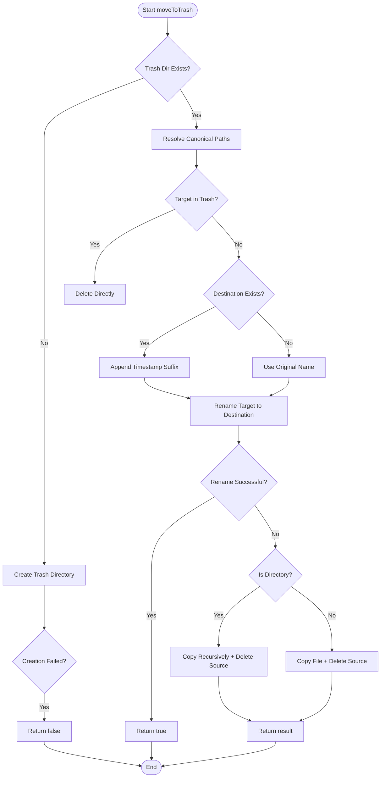
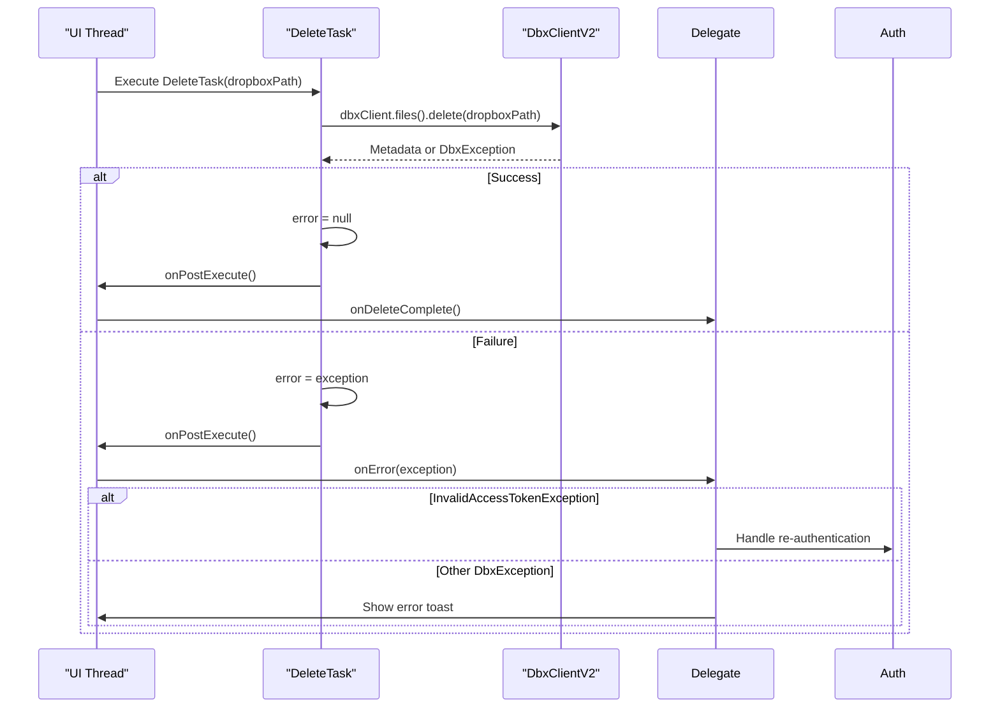

# Delete File

<cite>
**Referenced Files in This Document**   
- [FileManagerUtils.kt](file://app/src/main/java/com/example/b1void/utils/FileManagerUtils.kt)
- [DeleteTask.kt](file://app/src/main/java/com/example/b1void/tasks/DeleteTask.kt)
- [FileManagerActivity.kt](file://app/src/main/java/com/example/b1void/activities/FileManagerActivity.kt)
- [ImageOptimizer.kt](file://app/src/main/java/com/example/b1void/utils/ImageOptimizer.kt)
</cite>

## Table of Contents
1. [Introduction](#introduction)
2. [Soft-Delete Mechanism: moveToTrash Function](#soft-delete-mechanism-movetotrash-function)
3. [Permanent Deletion: Clear Trash and Recursive Removal](#permanent-deletion-clear-trash-and-recursive-removal)
4. [Cloud File Deletion with DeleteTask](#cloud-file-deletion-with-deletetask)
5. [MediaStore Integration and Cache Invalidation](#mediastore-integration-and-cache-invalidation)
6. [Usage Examples and User Workflows](#usage-examples-and-user-workflows)
7. [Security Considerations and Path Validation](#security-considerations-and-path-validation)
8. [Error Handling and Edge Cases](#error-handling-and-edge-cases)
9. [Recovery Workflow from Trash](#recovery-workflow-from-trash)

## Introduction
This document provides a comprehensive overview of file deletion operations within the application, covering both local soft-delete (trash-based) and permanent removal mechanisms, as well as cloud-based deletion via Dropbox integration. The system ensures data safety through a two-stage deletion process, supports recursive directory handling, and integrates with Android’s media ecosystem for consistent user experience. Key components include the `moveToTrash` utility for local file relocation, `DeleteTask` for asynchronous cloud deletions, and cache invalidation routines to maintain UI consistency.

## Soft-Delete Mechanism: moveToTrash Function

The `moveToTrash` function in `FileManagerUtils.kt` implements a robust soft-delete mechanism by relocating files to a dedicated trash directory while preventing naming collisions and directory traversal attacks.



**Diagram sources**
- [FileManagerUtils.kt](file://app/src/main/java/com/example/b1void/utils/FileManagerUtils.kt#L94-L145)

**Section sources**
- [FileManagerUtils.kt](file://app/src/main/java/com/example/b1void/utils/FileManagerUtils.kt#L94-L145)

### Key Features:
- **Collision Avoidance**: When a file with the same name exists in the trash, a timestamp suffix (`_currentTimeMillis`) is appended before the extension.
- **Fallback Strategy**: If `renameTo()` fails (e.g., across filesystem boundaries), the system falls back to copying the file/directory and then deleting the original.
- **Canonical Path Validation**: Both source and destination paths are resolved using `canonicalPath` to prevent directory traversal vulnerabilities.
- **Self-Protection**: Attempts to move files already inside or equal to the trash directory result in direct deletion instead.

## Permanent Deletion: Clear Trash and Recursive Removal

Permanent deletion occurs when users clear the trash or delete files directly from it. The `clearTrash` method removes all contents recursively, leveraging `deleteDirectory` for nested structures.

```mermaid
flowchart TD
StartClear([clearTrash]) --> Exists{"Trash Exists?"}
Exists --> |No| TryCreate[Attempt mkdirs()]
TryCreate --> Created{"Created?"}
Created --> |No| LogError & ReturnFalse
Created --> |Yes| ListChildren[List Files/Directories]
Exists --> |Yes| ListChildren
ListChildren --> HasChildren{"Has Children?"}
HasChildren --> |No| ReturnTrue
HasChildren --> |Yes| Loop[For Each Child]
Loop --> IsDir{"Is Directory?"}
IsDir --> |Yes| CallDeleteDir[deleteDirectory(child)]
IsDir --> |No| DeleteFile[child.delete()]
CallDeleteDir --> Deleted
DeleteFile --> Deleted
Deleted --> Success{"Deleted?"}
Success --> |No| LogFailure & MarkFailed
Success --> |Yes| ContinueLoop
ContinueLoop --> NextChild
NextChild --> EndLoop
EndLoop --> AllSuccess{"All Deleted?"}
AllSuccess --> |Yes| ReturnTrue
AllSuccess --> |No| ReturnFalse
```

**Diagram sources**
- [FileManagerUtils.kt](file://app/src/main/java/com/example/b1void/utils/FileManagerUtils.kt#L147-L192)

**Section sources**
- [FileManagerUtils.kt](file://app/src/main/java/com/example/b1void/utils/FileManagerUtils.kt#L147-L192)

### Recursive Directory Deletion
The `deleteDirectory` function traverses all subdirectories and files, ensuring complete removal. It returns `false` immediately upon any deletion failure, maintaining atomicity expectations.

## Cloud File Deletion with DeleteTask

The `DeleteTask` class handles asynchronous deletion of files stored in Dropbox using the official SDK. It extends `AsyncTask` and communicates results via a delegate interface.



**Diagram sources**
- [DeleteTask.kt](file://app/src/main/java/com/example/b1void/tasks/DeleteTask.kt#L8-L42)

**Section sources**
- [DeleteTask.kt](file://app/src/main/java/com/example/b1void/tasks/DeleteTask.kt#L8-L42)

### Error Handling
- **InvalidAccessTokenException**: Triggered when the access token is expired or revoked; requires user re-authentication.
- **Other DbxException Types**: Include network issues, permission errors, or file not found; handled generically with user feedback.
- **Asynchronous Execution**: Prevents blocking the main thread during network operations.

## MediaStore Integration and Cache Invalidation

Although the app does not directly write to `MediaStore`, imported media from galleries may be registered there. To ensure gallery updates reflect current state:

- After deletion, no explicit `MediaStore` update is performed since files reside in private app directories.
- However, cache invalidation is critical for UI consistency.

### Image Cache Invalidation
The `ImageOptimizer.clearImageCache` method deletes Glide's internal cache directory to force reload of thumbnails and previews after file operations.

```kotlin
fun clearImageCache(context: Context) {
    val imageCacheDir = File(context.cacheDir, "glide_cache")
    if (imageCacheDir.exists()) {
        imageCacheDir.deleteRecursively()
    }
}
```

This is called after every local delete operation in `FileManagerActivity`.

**Section sources**
- [ImageOptimizer.kt](file://app/src/main/java/com/example/b1void/utils/ImageOptimizer.kt#L159-L169)
- [FileManagerActivity.kt](file://app/src/main/java/com/example/b1void/activities/FileManagerActivity.kt#L526-L537)

## Usage Examples and User Workflows

### Single File Deletion
1. User long-presses a file in `FileManagerActivity`.
2. Context menu appears; selects "Delete".
3. `deleteFile(file)` is invoked.
4. `moveToTrash(file, trashDirectory)` relocates the file.
5. `ImageOptimizer.clearImageCache(this)` invalidates image cache.
6. UI refreshes via `loadDirectoryContent()`.

### Bulk Deletion
1. User enters selection mode by selecting multiple files.
2. Clicks "Delete" from action sheet.
3. Confirmation dialog shows count of items.
4. On confirmation, each file is processed via `moveToTrash`.
5. Any failures are aggregated and reported.
6. Cache cleared and UI refreshed.

### Cloud Deletion
1. User triggers deletion of a synced file.
2. `DeleteTask(dbxClient, path, delegate)` is instantiated.
3. Executed asynchronously; progress not shown (fire-and-forget).
4. On success, local copy may be removed.
5. On failure, appropriate error recovery initiated.

**Section sources**
- [FileManagerActivity.kt](file://app/src/main/java/com/example/b1void/activities/FileManagerActivity.kt#L526-L537)
- [FileManagerActivity.kt](file://app/src/main/java/com/example/b1void/activities/FileManagerActivity.kt#L727-L761)

## Security Considerations and Path Validation

To prevent directory traversal attacks (e.g., `../../../private/data`), canonical paths are used:

```kotlin
val trashPath = trashDirectory.canonicalPath
val targetPath = target.canonicalPath
```

If resolving fails, absolute paths are used as fallback. The check:

```kotlin
if (targetPath == trashPath || targetPath.startsWith("$trashPath${File.separator}"))
```

ensures that files already in the trash (or its subdirectories) are not moved again, avoiding infinite loops or self-moves.

Additionally, all file operations occur within app-private directories created at startup, limiting exposure to external tampering.

**Section sources**
- [FileManagerUtils.kt](file://app/src/main/java/com/example/b1void/utils/FileManagerUtils.kt#L94-L145)

## Error Handling and Edge Cases

### Concurrent Modifications
If a file is modified or deleted externally during an operation:
- `renameTo()` will fail.
- Fallback copy-and-delete may also fail if source disappears.
- Exception caught and logged; operation marked as failed.

### Network Failures During Cloud Deletion
- `DeleteTask` catches `DbxException` and reports via `onError`.
- Retry logic must be implemented externally.
- Users should verify deletion status manually if needed.

### Low Storage or Permission Issues
- `mkdirs()` failures are logged and reported.
- Copy operations may fail due to insufficient space.
- Security exceptions (rare on internal storage) are caught and logged.

**Section sources**
- [DeleteTask.kt](file://app/src/main/java/com/example/b1void/tasks/DeleteTask.kt#L30-L41)
- [FileManagerUtils.kt](file://app/src/main/java/com/example/b1void/utils/FileManagerUtils.kt#L94-L145)

## Recovery Workflow from Trash

Currently, the system supports only permanent deletion of trash contents via "Clear Trash". There is no built-in file restoration feature. Future enhancements could include:
- A restore option in the trash context menu.
- Maintaining metadata about original file paths.
- Time-limited retention policy before auto-purge.

Until such features are implemented, recovery requires manual extraction from the `Trash` directory before clearing.