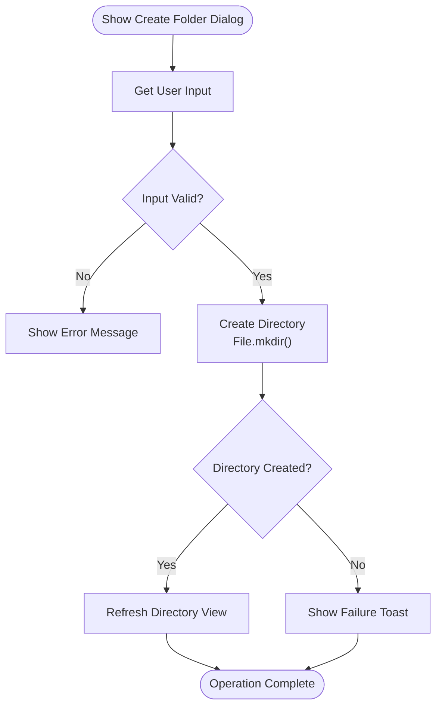
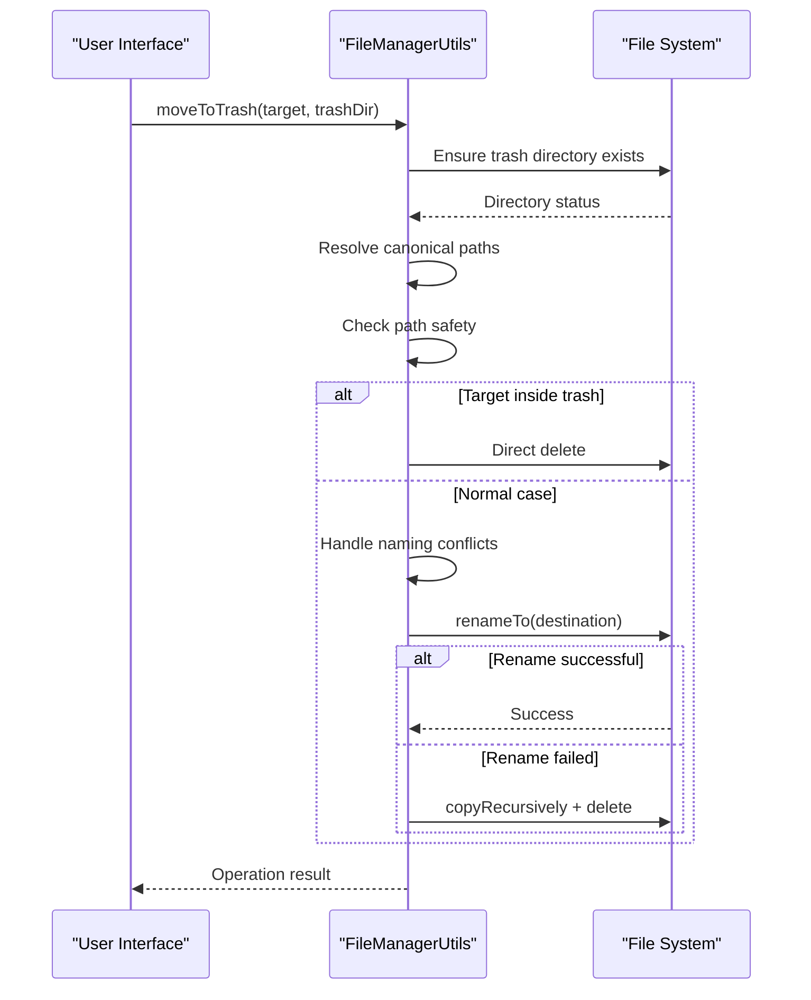
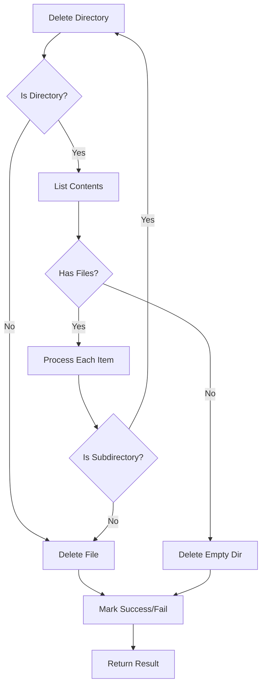
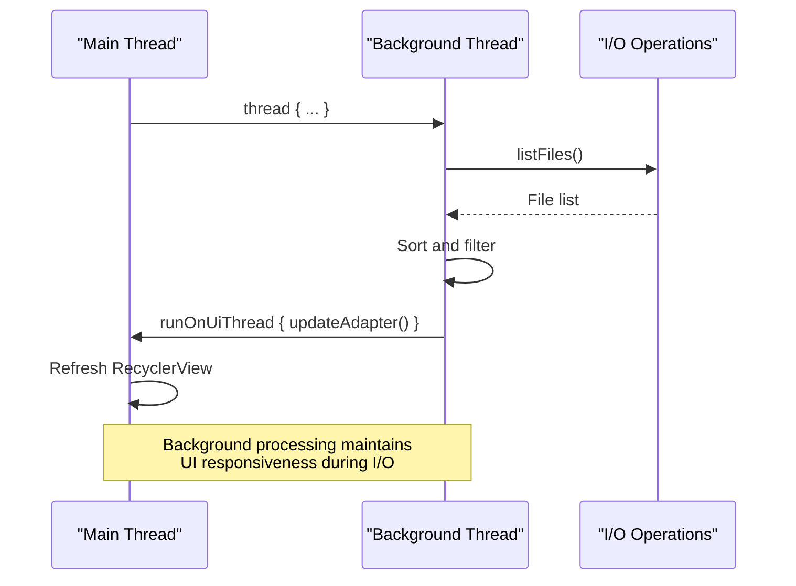
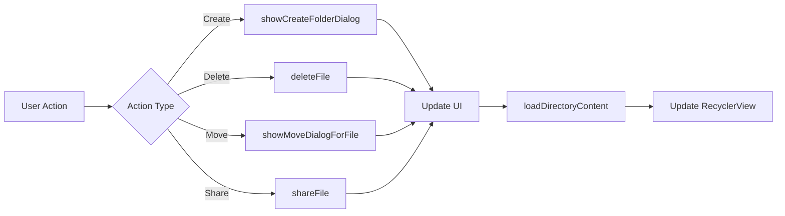
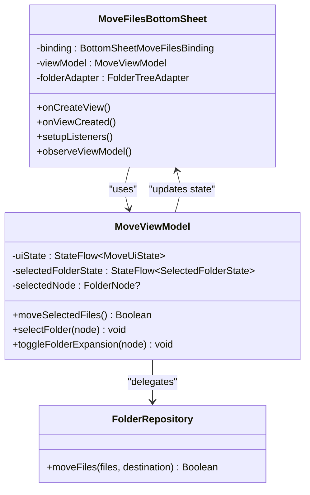

# File Operations

<cite>
**Referenced Files in This Document**   
- [FileManagerActivity.kt](file://app/src/main/java/com/example/b1void/activities/FileManagerActivity.kt)
- [FileManagerUtils.kt](file://app/src/main/java/com/example/b1void/utils/FileManagerUtils.kt)
- [ImageOptimizer.kt](file://app/src/main/java/com/example/b1void/utils/ImageOptimizer.kt)
- [MoveFilesBottomSheet.kt](file://app/src/main/java/com/example/b1void/ui/MoveFilesBottomSheet.kt)
- [MoveViewModel.kt](file://app/src/main/java/com/example/b1void/viewmodels/MoveViewModel.kt)
- [FolderRepository.kt](file://app/src/main/java/com/example/b1void/data/FolderRepository.kt)
</cite>

## Table of Contents
1. [Introduction](#introduction)
2. [Core File Operations](#core-file-operations)
3. [Folder Creation Implementation](#folder-creation-implementation)
4. [Soft Deletion and Trash Management](#soft-deletion-and-trash-management)
5. [Recursive Deletion and Cache Management](#recursive-deletion-and-cache-management)
6. [Background Processing for I/O Operations](#background-processing-for-i-o-operations)
7. [Error Handling Strategies](#error-handling-strategies)
8. [User Interaction and UI Refresh](#user-interaction-and-ui-refresh)
9. [File Movement Architecture](#file-movement-architecture)

## Introduction
This document provides a comprehensive analysis of the file operations system within the Inspector_appVX application. The core functionality revolves around creating, deleting, moving, and managing files and folders through a user-friendly interface while maintaining application responsiveness and data integrity. The implementation leverages Android's threading model to perform I/O operations in the background, ensuring smooth UI performance. Key components include dialog-driven user interactions, a dedicated trash directory for soft deletion, recursive file operations, and integration with image caching systems.

## Core File Operations
The application implements four fundamental file operations: create, delete, move, and trash management. These operations are orchestrated through the FileManagerActivity, which serves as the central controller for file system interactions. Each operation follows a consistent pattern of user interaction, background processing, and UI state updates. The system is designed to handle both local file operations and potential cloud storage integrations through a unified interface.

**Section sources**
- [FileManagerActivity.kt](file://app/src/main/java/com/example/b1void/activities/FileManagerActivity.kt#L363-L386)

## Folder Creation Implementation
Folder creation is implemented through two complementary approaches: a user-facing dialog interface and direct file system operations. The `showCreateFolderDialog` method in FileManagerActivity presents an AlertDialog that prompts users to input a folder name. Upon confirmation, the system creates a new File object using the current directory context and attempts to create the directory using the standard `mkdir()` method. Success is indicated by refreshing the directory listing, while failure triggers a Toast notification to inform the user.

**Diagram sources**
- [FileManagerActivity.kt](file://app/src/main/java/com/example/b1void/activities/FileManagerActivity.kt#L492-L507)

**Section sources**
- [FileManagerActivity.kt](file://app/src/main/java/com/example/b1void/activities/FileManagerActivity.kt#L492-L507)

## Soft Deletion and Trash Management
The application implements a soft deletion mechanism through the `moveToTrash` function in FileManagerUtils, which relocates files to a dedicated Trash directory instead of permanent deletion. This approach provides users with recovery options and prevents accidental data loss. The implementation first ensures the trash directory exists, then resolves canonical paths to prevent directory traversal attacks. When moving files, the system handles naming conflicts by appending timestamps to duplicate filenames. For cases where direct renaming fails (such as across different filesystems), the system falls back to copy-and-delete operations.

**Diagram sources**
- [FileManagerUtils.kt](file://app/src/main/java/com/example/b1void/utils/FileManagerUtils.kt#L94-L145)

**Section sources**
- [FileManagerUtils.kt](file://app/src/main/java/com/example/b1void/utils/FileManagerUtils.kt#L94-L145)

## Recursive Deletion and Cache Management
For directory removal, the system implements recursive deletion through the `deleteDirectory` method in FileManagerUtils, which traverses directory trees and removes files and subdirectories depth-first. This ensures proper cleanup of nested structures. Complementing this, the ImageOptimizer class provides cache management functionality through its `clearImageCache` method, which targets Glide's image cache directory for cleanup. This is particularly important after file deletions to prevent stale references and memory leaks. The cache clearing operation runs within a try-catch block to handle potential I/O exceptions gracefully.

**Diagram sources**
- [FileManagerUtils.kt](file://app/src/main/java/com/example/b1void/utils/FileManagerUtils.kt#L177-L192)
- [ImageOptimizer.kt](file://app/src/main/java/com/example/b1void/utils/ImageOptimizer.kt#L159-L169)

**Section sources**
- [FileManagerUtils.kt](file://app/src/main/java/com/example/b1void/utils/FileManagerUtils.kt#L177-L192)
- [ImageOptimizer.kt](file://app/src/main/java/com/example/b1void/utils/ImageOptimizer.kt#L159-L169)

## Background Processing for I/O Operations
The application employs background threading to maintain UI responsiveness during file operations. The `loadDirectoryContent` method uses Kotlin's `thread` function to perform file listing operations off the main thread, preventing UI freezes during directory scans. Similarly, the MoveFilesBottomSheet utilizes coroutines through `viewLifecycleOwner.lifecycleScope.launch` to handle the asynchronous nature of file movement operations. This approach combines traditional threading for simple operations with modern coroutine patterns for more complex asynchronous workflows, providing a responsive user experience regardless of operation duration.

**Diagram sources**
- [FileManagerActivity.kt](file://app/src/main/java/com/example/b1void/activities/FileManagerActivity.kt#L390-L430)
- [MoveFilesBottomSheet.kt](file://app/src/main/java/com/example/b1void/ui/MoveFilesBottomSheet.kt#L20-L133)

**Section sources**
- [FileManagerActivity.kt](file://app/src/main/java/com/example/b1void/activities/FileManagerActivity.kt#L390-L430)
- [MoveFilesBottomSheet.kt](file://app/src/main/java/com/example/b1void/ui/MoveFilesBottomSheet.kt#L20-L133)

## Error Handling Strategies
The system implements comprehensive error handling across file operations. SecurityException is explicitly caught in the deleteFile method, logging the error while preventing application crashes. The moveToTrash function wraps operations in a broad try-catch block to handle various IOException scenarios, including path resolution failures. For network-related operations (implied by Dropbox integration), specific DbxException handling is implemented in task classes like DeleteTask and CreateFolderTask. The error strategy prioritizes graceful degradation—attempting alternative methods when primary operations fail—while providing meaningful feedback to users through Toast notifications.

**Section sources**
- [FileManagerActivity.kt](file://app/src/main/java/com/example/b1void/activities/FileManagerActivity.kt#L526-L537)
- [DeleteTask.kt](file://app/src/main/java/com/example/b1void/tasks/DeleteTask.kt#L8-L42)

## User Interaction and UI Refresh
User interactions are managed through a combination of context menus and modal dialogs. The onContextItemSelected method in FileManagerActivity routes user actions from popup menus to appropriate handlers. After any file modification operation, the system automatically refreshes the UI by calling loadDirectoryContent with the current directory context. This ensures the displayed file list remains synchronized with the actual file system state. The refresh process includes sorting according to user preferences and filtering out the trash directory from the main view, providing a clean user experience.

**Diagram sources**
- [FileManagerActivity.kt](file://app/src/main/java/com/example/b1void/activities/FileManagerActivity.kt#L363-L386)
- [FileManagerActivity.kt](file://app/src/main/java/com/example/b1void/activities/FileManagerActivity.kt#L390-L430)

**Section sources**
- [FileManagerActivity.kt](file://app/src/main/java/com/example/b1void/activities/FileManagerActivity.kt#L363-L386)
- [FileManagerActivity.kt](file://app/src/main/java/com/example/b1void/activities/FileManagerActivity.kt#L390-L430)

## File Movement Architecture
The file movement system follows a layered architecture with clear separation of concerns. The MoveFilesBottomSheet provides the user interface, collecting source files and destination selection. The MoveViewModel acts as a mediator, managing UI state and coordinating between the view and data layers. The FolderRepository contains the business logic for file operations, executing moves within a Dispatchers.IO context to prevent blocking the main thread. This architecture enables responsive UI feedback during operations, with progress indicators and enabled/disabled states reflecting the current operation status.

**Diagram sources**
- [MoveFilesBottomSheet.kt](file://app/src/main/java/com/example/b1void/ui/MoveFilesBottomSheet.kt#L20-L133)
- [MoveViewModel.kt](file://app/src/main/java/com/example/b1void/viewmodels/MoveViewModel.kt#L56-L87)
- [FolderRepository.kt](file://app/src/main/java/com/example/b1void/data/FolderRepository.kt#L38-L53)

**Section sources**
- [MoveFilesBottomSheet.kt](file://app/src/main/java/com/example/b1void/ui/MoveFilesBottomSheet.kt#L20-L133)
- [MoveViewModel.kt](file://app/src/main/java/com/example/b1void/viewmodels/MoveViewModel.kt#L56-L87)
- [FolderRepository.kt](file://app/src/main/java/com/example/b1void/data/FolderRepository.kt#L38-L53)