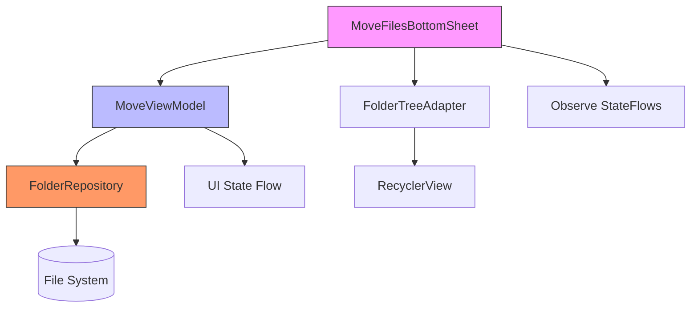
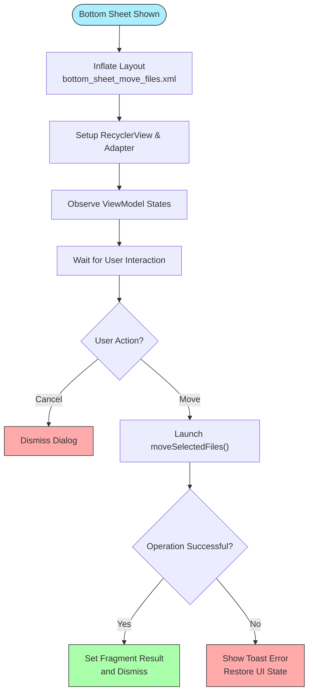
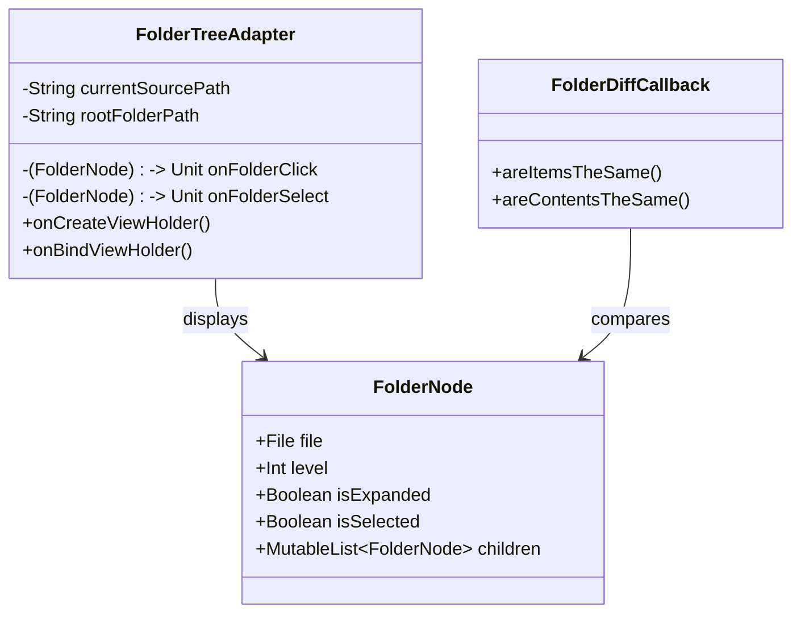

# Move File

<cite>
**Referenced Files in This Document**   
- [MoveFilesBottomSheet.kt](file://app/src/main/java/com/example/b1void/ui/MoveFilesBottomSheet.kt)
- [MoveViewModel.kt](file://app/src/main/java/com/example/b1void/viewmodels/MoveViewModel.kt)
- [FolderRepository.kt](file://app/src/main/java/com/example/b1void/data/FolderRepository.kt)
- [MoveState.kt](file://app/src/main/java/com/example/b1void/models/MoveState.kt)
- [FolderTreeAdapter.kt](file://app/src/main/java/com/example/b1void/adapters/FolderTreeAdapter.kt)
- [bottom_sheet_move_files.xml](file://app/src/main/res/layout/bottom_sheet_move_files.xml)
</cite>

## Table of Contents
1. [Introduction](#introduction)
2. [Architecture Overview](#architecture-overview)
3. [MVVM Architecture and State Management](#mvvm-architecture-and-state-management)
4. [Bottom Sheet UI Implementation](#bottom-sheet-ui-implementation)
5. [File Move Operation Logic](#file-move-operation-logic)
6. [Threading Model and Background Execution](#threading-model-and-background-execution)
7. [UI Updates and ViewModel Observations](#ui-updates-and-viewmodel-observations)
8. [RecyclerView Integration and Folder Navigation](#recyclerview-integration-and-folder-navigation)
9. [Search and Filtering Functionality](#search-and-filtering-functionality)
10. [Error Handling and User Feedback](#error-handling-and-user-feedback)
11. [Configuration Change Persistence](#configuration-change-persistence)

## Introduction
This document provides a comprehensive analysis of the file moving functionality implemented in the application using `MoveFilesBottomSheet` and `MoveViewModel`. The system follows the MVVM (Model-View-ViewModel) architectural pattern to separate concerns between UI presentation, business logic, and data management. Users can select files from a source location and move them to a destination folder via an interactive bottom sheet interface that supports folder navigation, search filtering, and visual feedback during operations.

**Section sources**
- [MoveFilesBottomSheet.kt](file://app/src/main/java/com/example/b1void/ui/MoveFilesBottomSheet.kt#L20-L133)
- [MoveViewModel.kt](file://app/src/main/java/com/example/b1void/viewmodels/MoveViewModel.kt#L14-L123)

## Architecture Overview

**Diagram sources**
- [MoveFilesBottomSheet.kt](file://app/src/main/java/com/example/b1void/ui/MoveFilesBottomSheet.kt#L20-L133)
- [MoveViewModel.kt](file://app/src/main/java/com/example/b1void/viewmodels/MoveViewModel.kt#L14-L123)
- [FolderRepository.kt](file://app/src/main/java/com/example/b1void/data/FolderRepository.kt#L16-L53)

## MVVM Architecture and State Management

The implementation strictly adheres to the MVVM pattern where `MoveFilesBottomSheet` acts as the View layer, `MoveViewModel` serves as the ViewModel, and `FolderRepository` encapsulates data access logic. The ViewModel holds observable state objects such as `_uiState` and `_selectedFolderState`, both exposed as `StateFlow` types for safe, lifecycle-aware observation.

Key state components include:
- `uiState`: Sealed class representing loading, success with folder tree, or error states
- `selectedFolderState`: Tracks breadcrumbs text and move button enablement
- SavedStateHandle: Preserves file paths, source, and root folder across configuration changes

The ViewModel initializes by fetching the full folder tree from the repository and maintains a cache (`fullTreeCache`) for efficient re-rendering and filtering operations.

**Section sources**
- [MoveViewModel.kt](file://app/src/main/java/com/example/b1void/viewmodels/MoveViewModel.kt#L14-L123)
- [MoveState.kt](file://app/src/main/java/com/example/b1void/models/MoveState.kt#L1-L36)

## Bottom Sheet UI Implementation

The `MoveFilesBottomSheet` is implemented as a `BottomSheetDialogFragment` providing a modal interface for file relocation. It uses view binding (`BottomSheetMoveFilesBinding`) for type-safe access to layout elements defined in `bottom_sheet_move_files.xml`.

Key UI elements:
- Search input field for filtering folders
- Breadcrumbs display showing selected path
- RecyclerView listing hierarchical folder structure
- Progress indicator shown during async operations
- Cancel and Move action buttons

The bottom sheet receives parameters such as selected file paths, source folder, and root directory through its companion object's `newInstance()` factory method, ensuring clean instantiation with required context.

**Diagram sources**
- [MoveFilesBottomSheet.kt](file://app/src/main/java/com/example/b1void/ui/MoveFilesBottomSheet.kt#L20-L133)
- [bottom_sheet_move_files.xml](file://app/src/main/res/layout/bottom_sheet_move_files.xml#L1-L77)

## File Move Operation Logic

The file move operation begins when the user clicks the "Move" button, triggering `moveSelectedFiles()` in `MoveViewModel`. This function validates that a destination folder has been selected and maps the stored file paths into `File` objects.

Core validation rules:
- Prevents selection of source folder as destination
- Validates non-empty file list
- Ensures destination directory exists

The actual move is delegated to `FolderRepository.moveFiles()`, which attempts atomic relocation using `File.renameTo()`. No explicit timestamp-based renaming is implemented; conflicts result in failed moves. There is no fallback copy-and-delete mechanism currently in place.

Destination paths are constructed using `File(destinationDir, file.name)` without conflict resolution logic.

**Section sources**
- [MoveViewModel.kt](file://app/src/main/java/com/example/b1void/viewmodels/MoveViewModel.kt#L83-L87)
- [FolderRepository.kt](file://app/src/main/java/com/example/b1void/data/FolderRepository.kt#L38-L53)

## Threading Model and Background Execution

All file operations execute on background threads using Kotlin coroutines. The `viewModelScope` ensures tasks are automatically canceled when the ViewModel is cleared, preventing memory leaks.

Critical threading aspects:
- `getFolderTree()` and `moveFiles()` run on `Dispatchers.IO`
- `lifecycleScope.launch` in the fragment observes flows and handles results
- Long-running operations do not block the main thread
- Progress updates are reflected immediately in UI

Despite background execution, progress reporting is limited to showing/hiding a ProgressBar without granular percentage updates. Success or failure is reported only upon completion.

**Section sources**
- [MoveViewModel.kt](file://app/src/main/java/com/example/b1void/viewmodels/MoveViewModel.kt#L14-L123)
- [FolderRepository.kt](file://app/src/main/java/com/example/b1void/data/FolderRepository.kt#L16-L53)

## UI Updates and ViewModel Observations

The `MoveFilesBottomSheet` observes two key StateFlows from `MoveViewModel`:

1. **uiState**: Controls visibility of ProgressBar and RecyclerView, and updates folder list on success
2. **selectedFolderState**: Enables/disables move button and updates breadcrumb text

Observation occurs within `viewLifecycleOwner.lifecycleScope.launch {}` blocks, ensuring subscriptions respect the fragment's lifecycle. When the UI state changes:
- Loading state shows progress bar
- Success state displays updated folder tree
- Error state triggers Toast message

After a successful move, the fragment sets a result using `setFragmentResult()` with key `REQUEST_KEY` and boolean flag `RESULT_MOVED=true`, allowing the parent fragment/activity to react accordingly.

**Section sources**
- [MoveFilesBottomSheet.kt](file://app/src/main/java/com/example/b1void/ui/MoveFilesBottomSheet.kt#L84-L108)
- [MoveViewModel.kt](file://app/src/main/java/com/example/b1void/viewmodels/MoveViewModel.kt#L20-L23)

## RecyclerView Integration and Folder Navigation

The folder hierarchy is displayed using a RecyclerView with `FolderTreeAdapter`, which implements `ListAdapter<FolderNode, FolderViewHolder>` for efficient diffing via `FolderDiffCallback`.

Key adapter features:
- Indentation based on node level (24dp per level)
- Click handlers for expansion (arrow icon) and selection (item click)
- Visual differentiation of source folder (disabled), selected folder (highlighted), and regular items
- Dynamic padding applied relative to nesting depth

Users navigate by expanding/collapsing nodes via the expand icon or selecting a destination folder. Selection is prevented on the source folder itself to avoid invalid operations.

**Diagram sources**
- [FolderTreeAdapter.kt](file://app/src/main/java/com/example/b1void/adapters/FolderTreeAdapter.kt#L1-L99)
- [MoveState.kt](file://app/src/main/java/com/example/b1void/models/MoveState.kt#L1-L15)

## Search and Filtering Functionality

The search feature allows users to filter the folder tree by name. As the user types in the `searchInputEditText`, `onSearchQueryChanged()` is triggered in the ViewModel.

Filtering behavior:
- Blank query: Shows full cached tree
- Non-blank query: Recursively filters nodes whose name matches or have matching children
- Case-insensitive comparison using `contains(query, ignoreCase = true)`
- Filtered results are expanded automatically for visibility

Filtered trees are built recursively using `filterTree()`, creating shallow copies of nodes while preserving the original cache. This enables quick restoration when clearing the search.

**Section sources**
- [MoveFilesBottomSheet.kt](file://app/src/main/java/com/example/b1void/ui/MoveFilesBottomSheet.kt#L78-L82)
- [MoveViewModel.kt](file://app/src/main/java/com/example/b1void/viewmodels/MoveViewModel.kt#L75-L81)

## Error Handling and User Feedback

Errors are communicated through multiple channels:
- **Toast messages**: Displayed for general errors and move failures
- **Progress indicators**: Shown during loading and hidden on completion
- **Button states**: Disabled during operation, re-enabled on failure
- **Visual cues**: RecyclerView dimmed during processing

The `FolderRepository` logs exceptions using `Log.e()` but continues processing other files rather than failing fast. However, if any single file fails to move, the entire operation returns `false`, indicating partial or complete failure.

No rollback strategy exists for partially completed moves; once some files are moved, they remain in the destination even if subsequent moves fail.

**Section sources**
- [MoveFilesBottomSheet.kt](file://app/src/main/java/com/example/b1void/ui/MoveFilesBottomSheet.kt#L65-L74)
- [FolderRepository.kt](file://app/src/main/java/com/example/b1void/data/FolderRepository.kt#L45-L53)

## Configuration Change Persistence

ViewModel state survives configuration changes (e.g., screen rotation) due to:
- Use of `by viewModels()` delegate in fragment
- State stored in `SavedStateHandle` injected into ViewModel
- Key parameters (`arg_file_ids`, `arg_source_folder_path`, `arg_root_folder_path`) preserved automatically

Cached folder tree (`fullTreeCache`) prevents redundant I/O operations after rotation. Observers in `observeViewModel()` are relaunched safely thanks to structured concurrency with `lifecycleScope`.

No additional persistence mechanisms (e.g., onSaveInstanceState) are needed beyond the ViewModel pattern.

**Section sources**
- [MoveViewModel.kt](file://app/src/main/java/com/example/b1void/viewmodels/MoveViewModel.kt#L14-L123)
- [MoveFilesBottomSheet.kt](file://app/src/main/java/com/example/b1void/ui/MoveFilesBottomSheet.kt#L20-L133)