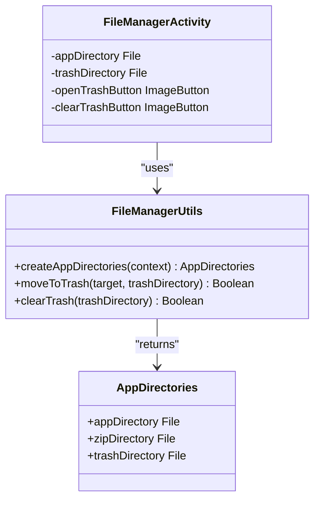
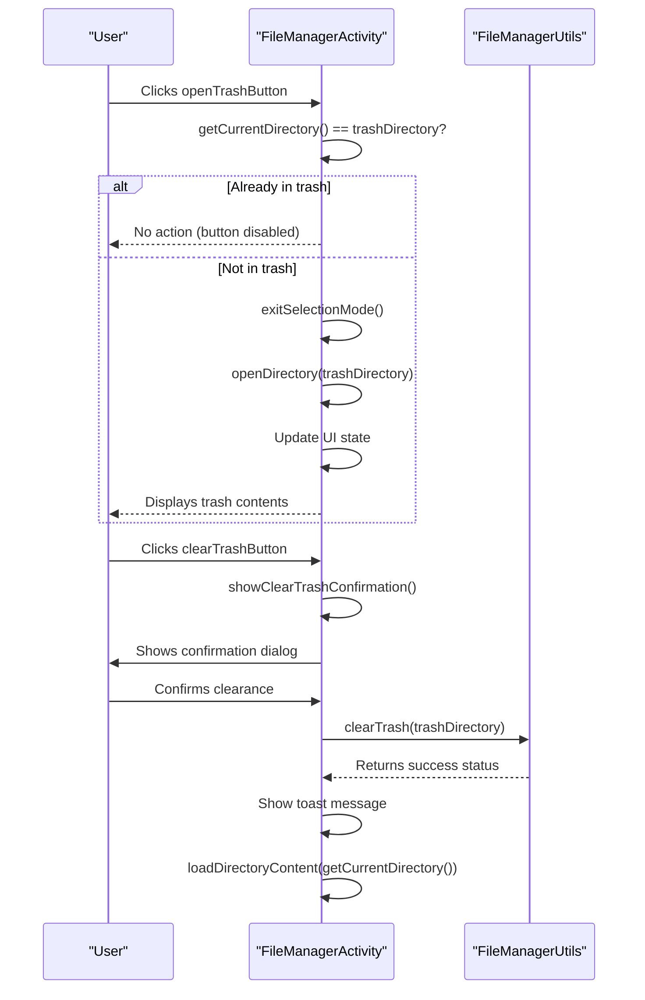
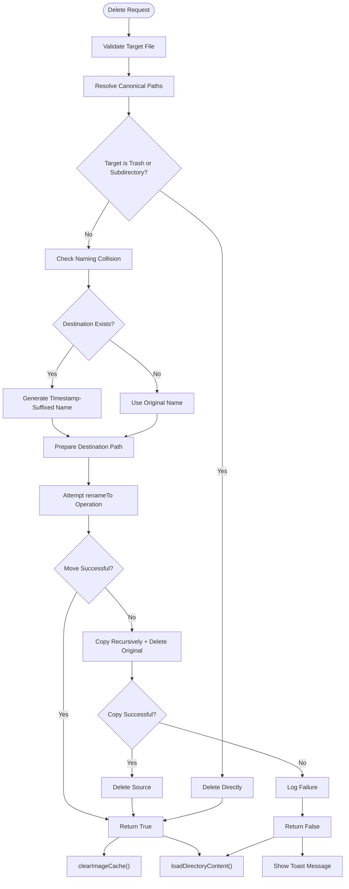
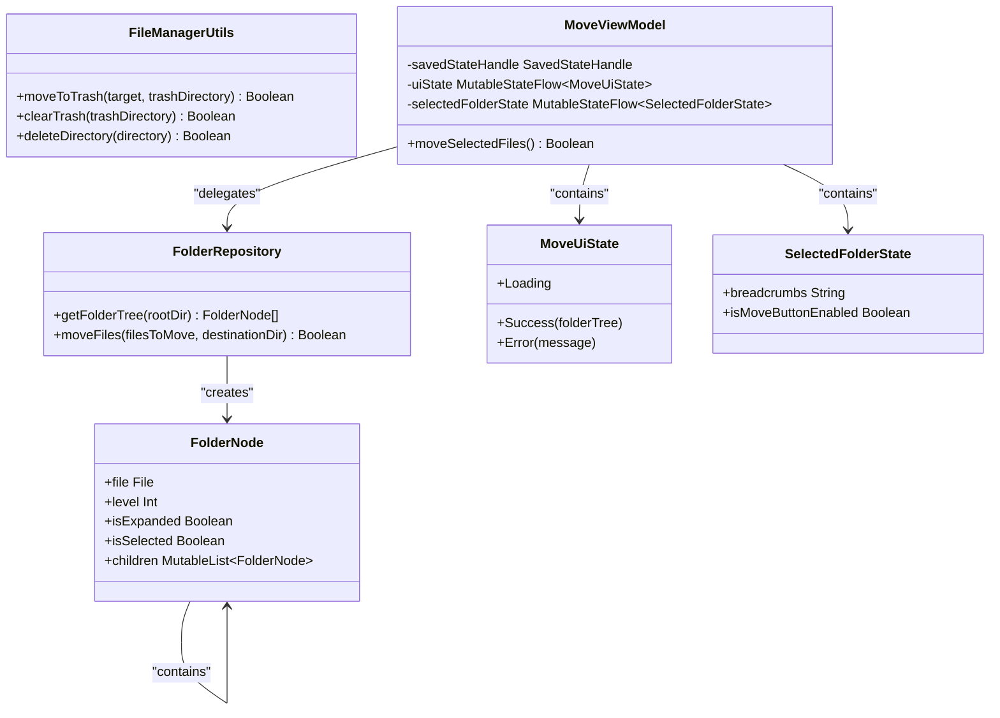

# Trash Management

<cite>
**Referenced Files in This Document **   
- [FileManagerUtils.kt](file://app/src/main/java/com/example/b1void/utils/FileManagerUtils.kt)
- [FileManagerActivity.kt](file://app/src/main/java/com/example/b1void/activities/FileManagerActivity.kt)
- [ImageOptimizer.kt](file://app/src/main/java/com/example/b1void/utils/ImageOptimizer.kt)
- [MoveFilesBottomSheet.kt](file://app/src/main/java/com/example/b1void/ui/MoveFilesBottomSheet.kt)
- [MoveViewModel.kt](file://app/src/main/java/com/example/b1void/viewmodels/MoveViewModel.kt)
- [FolderRepository.kt](file://app/src/main/java/com/example/b1void/data/FolderRepository.kt)
- [FileAdapter.kt](file://app/src/main/java/com/example/b1void/adapters/FileAdapter.kt)
- [FolderTreeAdapter.kt](file://app/src/main/java/com/example/b1void/adapters/FolderTreeAdapter.kt)
</cite>

## Table of Contents
1. [Introduction](#introduction)
2. [Core Components](#core-components)
3. [Trash Directory Management](#trash-directory-management)
4. [UI Controls and Visibility Logic](#ui-controls-and-visibility-logic)
5. [File Deletion Workflow](#file-deletion-workflow)
6. [Naming Collision Resolution](#naming-collision-resolution)
7. [Recursive Operations and Error Handling](#recursive-operations-and-error-handling)
8. [Cache Cleanup Mechanism](#cache-cleanup-mechanism)
9. [Security and Data Persistence Considerations](#security-and-data-persistence-considerations)
10. [Potential Enhancements](#potential-enhancements)

## Introduction
The trash system implementation provides a safe file deletion mechanism with recovery capability, preventing permanent data loss by intercepting deletion operations and relocating files to a dedicated trash directory. This documentation details the design and functionality of the trash management system, including its core components, user interface controls, workflow logic, and error handling practices. The system supports both individual files and nested directories while implementing safeguards against self-trashing and naming collisions.

## Core Components
The trash management system consists of several key components working together to provide a robust file deletion and recovery experience. The primary functionality is implemented in `FileManagerUtils.moveToTrash`, which handles the relocation of files to the trash directory. The `FileManagerActivity` manages UI interactions and state, while supporting utilities like `ImageOptimizer` handle cache cleanup. The system uses ViewModel architecture for state management during complex operations like file moving.

**Section sources**
- [FileManagerUtils.kt](file://app/src/main/java/com/example/b1void/utils/FileManagerUtils.kt#L94-L145)
- [FileManagerActivity.kt](file://app/src/main/java/com/example/b1void/activities/FileManagerActivity.kt#L42-L838)
- [ImageOptimizer.kt](file://app/src/main/java/com/example/b1void/utils/ImageOptimizer.kt#L159-L169)

## Trash Directory Management
The trash directory is created as part of the application's main directory structure using `FileManagerUtils.createAppDirectories`. This method establishes three key directories: the main application folder, a zip folder for compressed files, and the dedicated trash directory. The trash directory is initialized as a subdirectory named "Trash" within the main application folder, ensuring it follows the same security and access permissions as other app data.

**Diagram sources **
- [FileManagerUtils.kt](file://app/src/main/java/com/example/b1void/utils/FileManagerUtils.kt#L24-L35)
- [FileManagerUtils.kt](file://app/src/main/java/com/example/b1void/utils/FileManagerUtils.kt#L17-L21)
- [FileManagerActivity.kt](file://app/src/main/java/com/example/b1void/activities/FileManagerActivity.kt#L42-L838)

**Section sources**
- [FileManagerUtils.kt](file://app/src/main/java/com/example/b1void/utils/FileManagerUtils.kt#L24-L35)
- [FileManagerUtils.kt](file://app/src/main/java/com/example/b1void/utils/FileManagerUtils.kt#L17-L21)

## UI Controls and Visibility Logic
The user interface provides intuitive controls for managing the trash system through two key buttons: `openTrashButton` and `clearTrashButton`. These controls follow specific visibility and enablement rules to prevent invalid operations. The `openTrashButton` allows navigation to the trash directory but is disabled when already viewing the trash content. Conversely, the `clearTrashButton` only appears and becomes enabled when the user is actively viewing the trash directory, preventing accidental permanent deletion from other contexts.

**Diagram sources **
- [FileManagerActivity.kt](file://app/src/main/java/com/example/b1void/activities/FileManagerActivity.kt#L42-L838)

**Section sources**
- [FileManagerActivity.kt](file://app/src/main/java/com/example/b1void/activities/FileManagerActivity.kt#L42-L838)

## File Deletion Workflow
When a user initiates file deletion, the system intercepts the operation through `deleteFile(file)` in `FileManagerActivity`. Instead of permanent removal, this method calls `FileManagerUtils.moveToTrash`, which implements the core logic for safe deletion. The process begins by verifying the trash directory exists, creating it if necessary. It then performs canonical path resolution to prevent directory traversal attacks and checks for self-trashing conditions where a user attempts to move the trash directory into itself.

**Diagram sources **
- [FileManagerUtils.kt](file://app/src/main/java/com/example/b1void/utils/FileManagerUtils.kt#L94-L145)
- [FileManagerActivity.kt](file://app/src/main/java/com/example/b1void/activities/FileManagerActivity.kt#L42-L838)

**Section sources**
- [FileManagerUtils.kt](file://app/src/main/java/com/example/b1void/utils/FileManagerUtils.kt#L94-L145)
- [FileManagerActivity.kt](file://app/src/main/java/com/example/b1void/activities/FileManagerActivity.kt#L42-L838)

## Naming Collision Resolution
The system handles naming collisions when moving files to the trash by implementing an automatic timestamp suffixing mechanism. When a file with the same name already exists in the trash directory, the system generates a new filename by appending the current system time in milliseconds to the base name. For files, this preserves the original extension while modifying the name portion. This approach ensures all trashed items remain accessible without overwriting existing entries, maintaining data integrity during concurrent deletion operations.

**Section sources**
- [FileManagerUtils.kt](file://app/src/main/java/com/example/b1void/utils/FileManagerUtils.kt#L94-L145)

## Recursive Operations and Error Handling
The trash system implements robust recursive operations for handling nested directories and comprehensive error handling throughout the deletion process. The `moveToTrash` function includes fallback logic that switches from atomic `renameTo` operations to manual copy-and-delete sequences when direct renaming fails, accommodating cross-filesystem scenarios. Directory removal is handled recursively through `deleteDirectory`, which processes all children before attempting to remove the parent directory. Comprehensive logging captures failures at each step, providing diagnostic information while allowing partial success in multi-file operations.

**Diagram sources **
- [FileManagerUtils.kt](file://app/src/main/java/com/example/b1void/utils/FileManagerUtils.kt#L177-L192)
- [FolderRepository.kt](file://app/src/main/java/com/example/b1void/data/FolderRepository.kt#L7-L54)
- [MoveViewModel.kt](file://app/src/main/java/com/example/b1void/viewmodels/MoveViewModel.kt#L14-L123)
- [MoveState.kt](file://app/src/main/java/com/example/b1void/models/MoveState.kt#L23-L27)
- [MoveState.kt](file://app/src/main/java/com/example/b1void/models/MoveState.kt#L12-L18)
- [MoveState.kt](file://app/src/main/java/com/example/b1void/models/MoveState.kt#L32-L35)

**Section sources**
- [FileManagerUtils.kt](file://app/src/main/java/com/example/b1void/utils/FileManagerUtils.kt#L177-L192)
- [FolderRepository.kt](file://app/src/main/java/com/example/b1void/data/FolderRepository.kt#L7-L54)
- [MoveViewModel.kt](file://app/src/main/java/com/example/b1void/viewmodels/MoveViewModel.kt#L14-L123)

## Cache Cleanup Mechanism
Following successful file deletion operations, the system triggers cache cleanup to maintain optimal performance and storage usage. The `ImageOptimizer.clearImageCache` method is called after both single and batch deletions to remove cached image data associated with deleted files. This process targets the Glide image loading library's cache directory within the app's private cache space, ensuring that temporary image representations are removed along with their source files. The cache cleanup occurs on a background thread to prevent UI blocking and includes exception handling to prevent crashes during the deletion process.

**Section sources**
- [ImageOptimizer.kt](file://app/src/main/java/com/example/b1void/utils/ImageOptimizer.kt#L159-L169)
- [FileManagerActivity.kt](file://app/src/main/java/com/example/b1void/activities/FileManagerActivity.kt#L42-L838)

## Security and Data Persistence Considerations
The trash system implements several security measures to protect user data and prevent unauthorized access. By storing the trash directory within the app's private internal storage, it leverages Android's sandboxing model to restrict access to other applications. The use of canonical path resolution prevents directory traversal vulnerabilities that could allow manipulation of files outside the intended scope. However, the current implementation stores files indefinitely until manual clearance, which may have implications for data privacy and storage management. Users should be aware that sensitive information remains recoverable until the trash is explicitly emptied.

## Potential Enhancements
Several potential enhancements could improve the trash management system's functionality and user experience. Implementing a retention policy would automatically purge files older than a specified duration, preventing indefinite storage growth. Adding undo functionality immediately after deletion would provide an additional safety net beyond the manual trash recovery process. A preview feature showing the contents and size of the trash could help users make informed decisions about when to clear it. Integration with device backup systems could ensure trashed files are also backed up, while encryption of trash contents would enhance security for sensitive data.