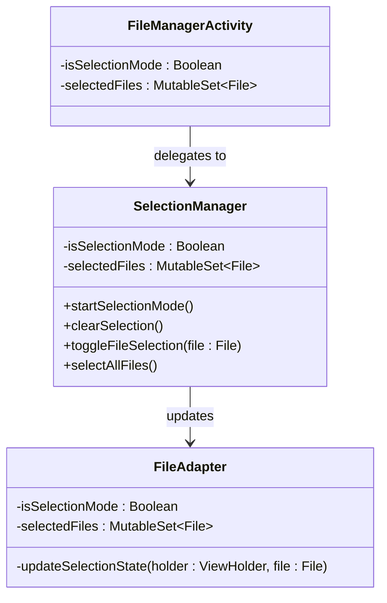
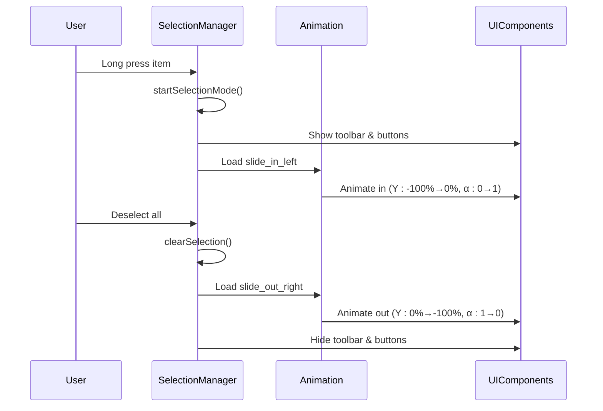
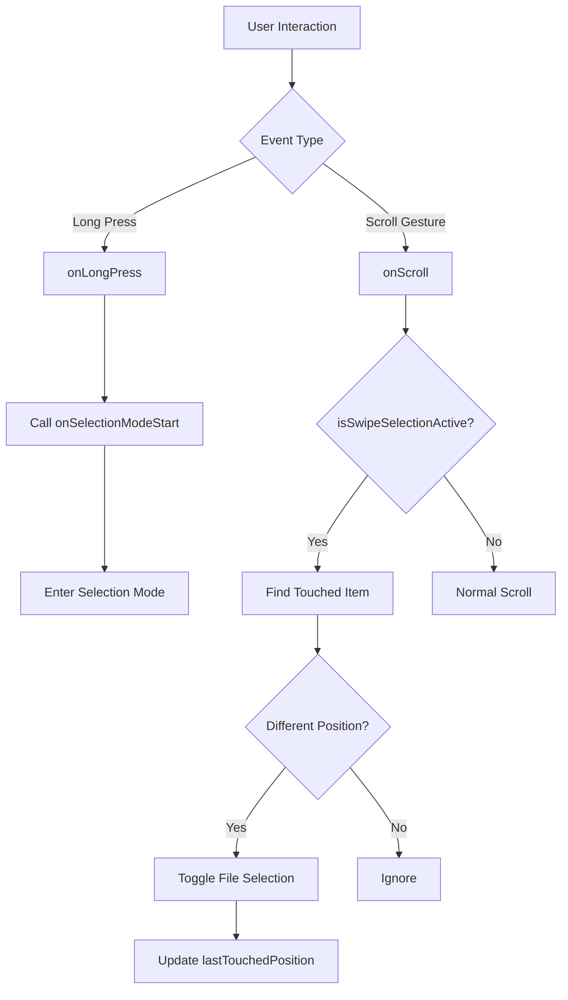
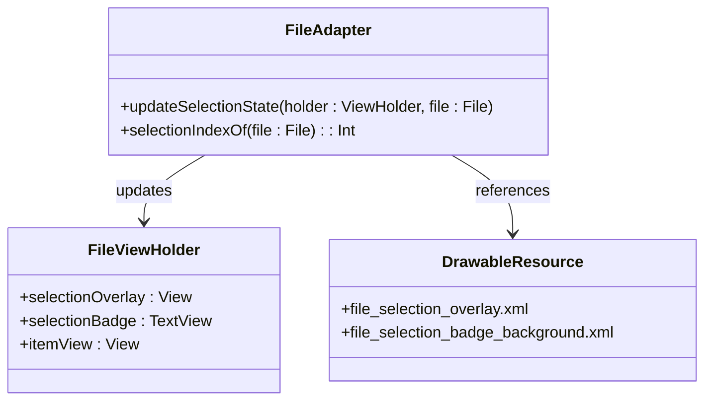
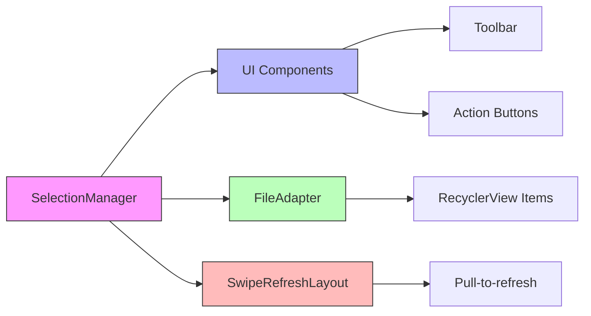
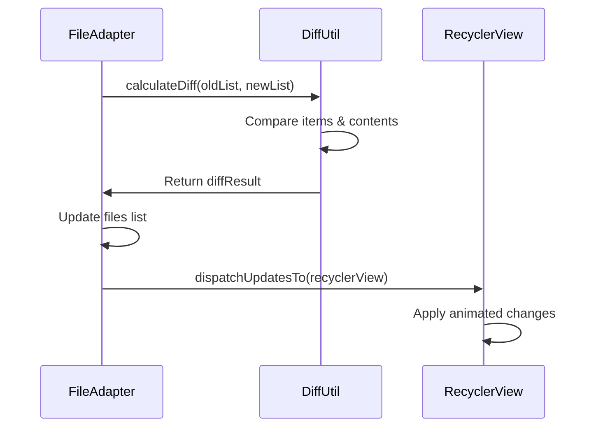

# Selection Mode

<cite>
**Referenced Files in This Document**   
- [FileManagerActivity.kt](file://app/src/main/java/com/example/b1void/activities/FileManagerActivity.kt)
- [FileAdapter.kt](file://app/src/main/java/com/example/b1void/adapters/FileAdapter.kt)
- [SelectionManager.kt](file://app/src/main/java/com/example/b1void/utils/SelectionManager.kt)
- [GestureHandler.kt](file://app/src/main/java/com/example/b1void/utils/GestureHandler.kt)
- [slide_in_top.xml](file://app/src/main/res/anim/slide_in_top.xml)
- [slide_out_top.xml](file://app/src/main/res/anim/slide_out_top.xml)
- [file_selection_overlay.xml](file://app/src/main/res/drawable/file_selection_overlay.xml)
- [file_selection_badge_background.xml](file://app/src/main/res/drawable/file_selection_badge_background.xml)
</cite>

## Table of Contents
1. [Introduction](#introduction)
2. [State Management](#state-management)
3. [UI Transitions and Animations](#ui-transitions-and-animations)
4. [Gesture Handling](#gesture-handling)
5. [Visual Feedback Mechanisms](#visual-feedback-mechanisms)
6. [SelectionManager Utility Class](#selectionmanager-utility-class)
7. [Selection Updates and DiffUtil Integration](#selection-updates-and-diffutil-integration)

## Introduction
The selection mode system enables users to select multiple files for batch operations such as sharing, deletion, or moving. This document details the implementation of selection mode across key components including state management, UI transitions, gesture detection, visual feedback, and coordination logic.

**Section sources**
- [FileManagerActivity.kt](file://app/src/main/java/com/example/b1void/activities/FileManagerActivity.kt#L66-L67)
- [SelectionManager.kt](file://app/src/main/java/com/example/b1void/utils/SelectionManager.kt#L11-L121)

## State Management
The selection state is managed through two primary variables: `isSelectionMode` and `selectedFiles`. The `isSelectionMode` boolean flag controls whether the interface is in selection mode, while `selectedFiles` maintains a mutable set of currently selected file objects.

In `FileManagerActivity`, these are declared as:
```kotlin
private var isSelectionMode = false
private val selectedFiles = mutableSetOf<File>()
```

These states are mirrored and coordinated by the `SelectionManager` class, which encapsulates both the selection state and related UI behaviors.



**Diagram sources**
- [FileManagerActivity.kt](file://app/src/main/java/com/example/b1void/activities/FileManagerActivity.kt#L66-L67)
- [SelectionManager.kt](file://app/src/main/java/com/example/b1void/utils/SelectionManager.kt#L11-L21)
- [FileAdapter.kt](file://app/src/main/java/com/example/b1void/adapters/FileAdapter.kt#L15-L22)

**Section sources**
- [FileManagerActivity.kt](file://app/src/main/java/com/example/b1void/activities/FileManagerActivity.kt#L66-L67)
- [SelectionManager.kt](file://app/src/main/java/com/example/b1void/utils/SelectionManager.kt#L11-L21)

## UI Transitions and Animations
When entering or exiting selection mode, slide-in and slide-out animations provide smooth visual transitions for the selection toolbar and action buttons.

The animation is triggered within `SelectionManager.startSelectionMode()` using Android's built-in animation resources:
```kotlin
val slideIn = AnimationUtils.loadAnimation(buttonContainer.context, android.R.anim.slide_in_left)
buttonContainer.startAnimation(slideIn)
selectionToolbar.startAnimation(slideIn)
```

Conversely, when clearing selection:
```kotlin
val slideOut = AnimationUtils.loadAnimation(buttonContainer.context, android.R.anim.slide_out_right)
buttonContainer.startAnimation(slideOut)
selectionToolbar.startAnimation(slideOut)
```

The actual animation definitions are defined in XML:
- `slide_in_top.xml`: Translates views from -100% Y position with fade-in (alpha 0.0 → 1.0)
- `slide_out_top.xml`: Translates views to -100% Y position with fade-out (alpha 1.0 → 0.0)

Both use `@android:integer/config_shortAnimTime` for consistent timing.



**Diagram sources**
- [SelectionManager.kt](file://app/src/main/java/com/example/b1void/utils/SelectionManager.kt#L26-L40)
- [SelectionManager.kt](file://app/src/main/java/com/example/b1void/utils/SelectionManager.kt#L42-L58)
- [slide_in_top.xml](file://app/src/main/res/anim/slide_in_top.xml)
- [slide_out_top.xml](file://app/src/main/res/anim/slide_out_top.xml)

**Section sources**
- [SelectionManager.kt](file://app/src/main/java/com/example/b1void/utils/SelectionManager.kt#L26-L58)

## Gesture Handling
The `GestureHandler` class manages user interactions that trigger and manipulate selection:

- **Long-press**: Activates selection mode via `onSelectionModeStart()`
- **Swipe-to-select**: Enables continuous selection during scroll gestures
- **Single-item selection**: Toggles individual items via `onFileSelectionToggle()`

The handler uses Android's `GestureDetector` with a custom `SimpleOnGestureListener`:
```kotlin
override fun onLongPress(e: MotionEvent) {
    onSelectionModeStart()
}

override fun onScroll(...): Boolean {
    if (isSwipeSelectionActive) {
        // Detect touched item and toggle selection
        val position = recyclerView.getChildAdapterPosition(childView)
        if (position != RecyclerView.NO_POSITION && position != lastTouchedPosition) {
            val file = fileAdapter.files[position]
            onFileSelectionToggle(file)
            lastTouchedPosition = position
        }
        return true
    }
    return false
}
```

Methods `startSwipeSelection()` and `stopSwipeSelection()` control swipe detection state.



**Diagram sources**
- [GestureHandler.kt](file://app/src/main/java/com/example/b1void/utils/GestureHandler.kt#L8-L13)
- [GestureHandler.kt](file://app/src/main/java/com/example/b1void/utils/GestureHandler.kt#L18-L43)
- [GestureHandler.kt](file://app/src/main/java/com/example/b1void/utils/GestureHandler.kt#L45-L53)

**Section sources**
- [GestureHandler.kt](file://app/src/main/java/com/example/b1void/utils/GestureHandler.kt#L8-L58)

## Visual Feedback Mechanisms
The `FileAdapter` provides visual feedback during selection through three elements:

1. **Selection Overlay**: A semi-transparent layer shown over selected items, defined by `file_selection_overlay.xml` with color `@color/file_selection_overlay`.
2. **Selection Badge**: Circular badge displaying selection order (1, 2, 3...), styled using `file_selection_badge_background.xml`.
3. **Alpha Dimming**: Unselected items are dimmed to 75% opacity (`alpha = 0.75f`) while selected items remain at full opacity.

The `updateSelectionState()` method orchestrates this behavior:
```kotlin
private fun updateSelectionState(holder: FileViewHolder, file: File) {
    if (isSelectionMode) {
        val isSelected = selectedFiles.contains(file)
        holder.selectionOverlay.isVisible = isSelected
        holder.selectionBadge.isVisible = isSelected
        holder.itemView.alpha = if (isSelected) 1f else 0.75f

        if (isSelected) {
            val order = selectionIndexOf(file)
            holder.selectionBadge.text = if (order >= 0) (order + 1).toString() else ""
        } else {
            holder.selectionBadge.text = ""
        }
    } else {
        // Reset all visual indicators
        holder.selectionOverlay.isVisible = false
        holder.selectionBadge.isVisible = false
        holder.selectionBadge.text = ""
        holder.itemView.alpha = 1f
    }
}
```

The `selectionIndexOf()` function determines the sequential order of each selected file.



**Diagram sources**
- [FileAdapter.kt](file://app/src/main/java/com/example/b1void/adapters/FileAdapter.kt#L88-L107)
- [FileAdapter.kt](file://app/src/main/java/com/example/b1void/adapters/FileAdapter.kt#L109-L118)
- [file_selection_overlay.xml](file://app/src/main/res/drawable/file_selection_overlay.xml)
- [file_selection_badge_background.xml](file://app/src/main/res/drawable/file_selection_badge_background.xml)

**Section sources**
- [FileAdapter.kt](file://app/src/main/java/com/example/b1void/adapters/FileAdapter.kt#L88-L118)

## SelectionManager Utility Class
The `SelectionManager` class serves as the central coordinator for selection mode functionality, handling:

- **Toolbar Visibility**: Shows/hides selection toolbar and action buttons
- **Button State Management**: Updates text on "Select All" and "Clear" buttons
- **Swipe Refresh Control**: Disables pull-to-refresh during selection
- **Batch Operations**: Supports select-all and clear-all actions

Key methods include:
- `showSelectionUI()` / `hideSelectionUI()`: Controls visibility of selection controls
- `enableSelectionMode()` / `disableSelectionMode()`: Disables/enables swipe refresh
- `updateSelectionButtons()`: Dynamically updates button labels based on selection state

For example, the select-all button toggles between "Выделить все" (Select All) and "Отменить все" (Deselect All), while the clear button shows the current count: "Отменить (3)".



**Diagram sources**
- [SelectionManager.kt](file://app/src/main/java/com/example/b1void/utils/SelectionManager.kt#L92-L114)
- [SelectionManager.kt](file://app/src/main/java/com/example/b1void/utils/SelectionManager.kt#L116-L120)

**Section sources**
- [SelectionManager.kt](file://app/src/main/java/com/example/b1void/utils/SelectionManager.kt#L92-L120)

## Selection Updates and DiffUtil Integration
To efficiently update the UI when selections change, the system employs targeted notifications rather than full adapter refreshes.

The `notifySelectionChanged()` method identifies only the files affected by a selection change and updates their specific positions:
```kotlin
fun notifySelectionChanged(previousSelection: Set<File>, currentSelection: Set<File>) {
    val impacted = mutableSetOf<File>()
    impacted.addAll(previousSelection)
    impacted.addAll(currentSelection)
    impacted.forEach { file ->
        val index = files.indexOf(file)
        if (index != -1) {
            notifyItemChanged(index)
        }
    }
}
```

Additionally, the adapter implements `DiffUtil.Callback` through `FileDiffCallback` to optimize list updates:
- `areItemsTheSame()`: Compares file paths for identity
- `areContentsTheSame()`: Checks modification time and name for content equality

This ensures smooth animations and minimal redraws during file list changes while maintaining accurate selection states.



**Diagram sources**
- [FileAdapter.kt](file://app/src/main/java/com/example/b1void/adapters/FileAdapter.kt#L128-L138)
- [FileAdapter.kt](file://app/src/main/java/com/example/b1void/adapters/FileAdapter.kt#L149-L167)

**Section sources**
- [FileAdapter.kt](file://app/src/main/java/com/example/b1void/adapters/FileAdapter.kt#L128-L167)