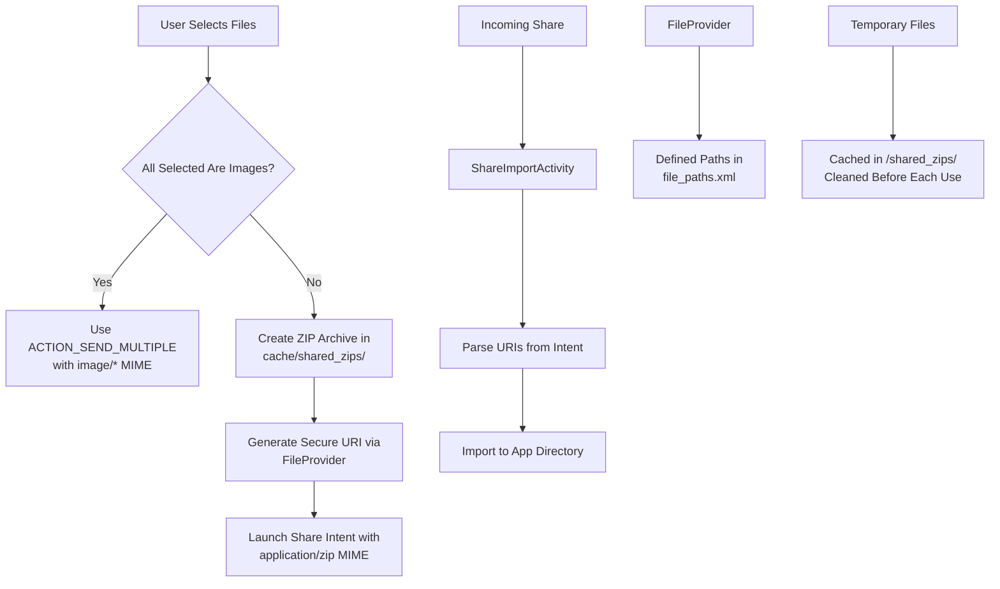
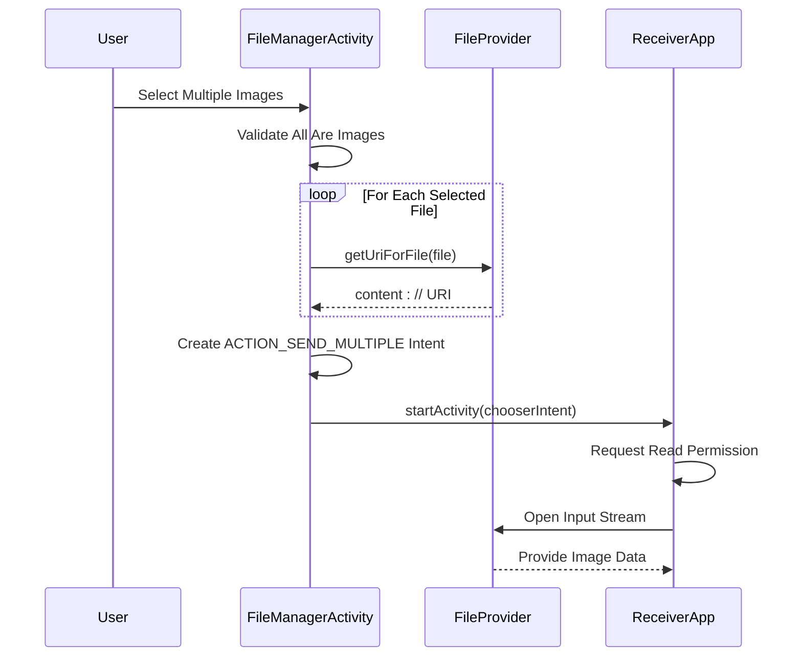
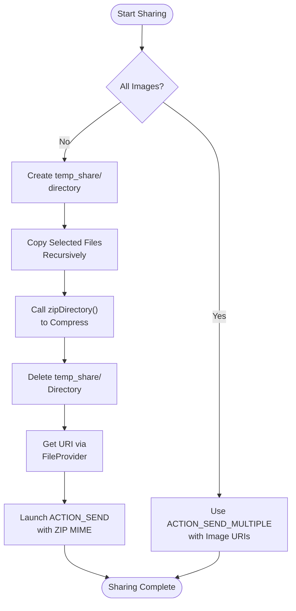
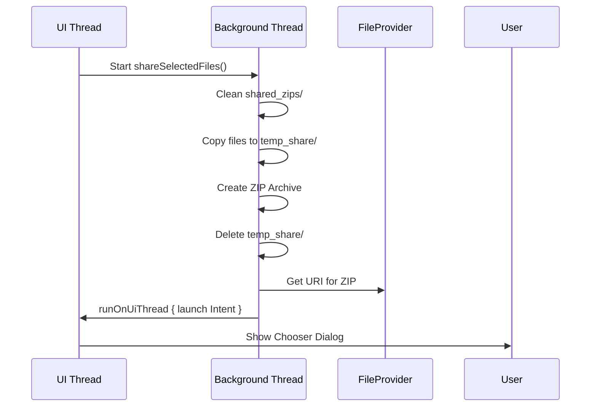

# Sharing Functionality

<cite>
**Referenced Files in This Document **   
- [FileManagerActivity.kt](file://app/src/main/java/com/example/b1void/activities/FileManagerActivity.kt)
- [ShareImportActivity.kt](file://app/src/main/java/com/example/b1void/activities/ShareImportActivity.kt)
- [FileManagerUtils.kt](file://app/src/main/java/com/example/b1void/utils/FileManagerUtils.kt)
- [file_paths.xml](file://app/src/main/res/xml/file_paths.xml)
- [AndroidManifest.xml](file://app/src/main/AndroidManifest.xml)
</cite>

## Table of Contents
1. [Introduction](#introduction)
2. [Individual File Sharing with FileProvider](#individual-file-sharing-with-fileprovider)
3. [Bulk Image Sharing Using ACTION_SEND_MULTIPLE](#bulk-image-sharing-using-action_send_multiple)
4. [ZIP Archive Creation for Folders and Mixed Selections](#zip-archive-creation-for-folders-and-mixed-selections)
5. [Temporary File Management in Cache Directory](#temporary-file-management-in-cache-directory)
6. [File Provider Path Configuration via file_paths.xml](#file-provider-path-configuration-via-file_pathsxm)
7. [Code Examples and Implementation Workflows](#code-examples-and-implementation-workflows)
8. [Common Issues and Limitations](#common-issues-and-limitations)
9. [Conclusion](#conclusion)

## Introduction
This document details the file sharing mechanisms implemented in the application, focusing on secure and efficient methods for sharing individual files, multiple images, and compressed archives. The system leverages Android's `FileProvider` to securely expose files through URI permissions, supports bulk image sharing via `ACTION_SEND_MULTIPLE`, and enables folder or mixed-content sharing by creating ZIP archives in temporary directories. Special attention is given to MIME type detection, background processing, and cleanup of temporary shared files.

The architecture ensures security through scoped directory access defined in `file_paths.xml`, uses background threads for compression tasks, and handles incoming shares through dedicated activities. Error handling during ZIP creation and compatibility across devices are also addressed.



**Diagram sources**
- [FileManagerActivity.kt](file://app/src/main/java/com/example/b1void/activities/FileManagerActivity.kt#L730-L793)
- [ShareImportActivity.kt](file://app/src/main/java/com/example/b1void/activities/ShareImportActivity.kt#L16-L97)
- [file_paths.xml](file://app/src/main/res/xml/file_paths.xml#L1-L7)

## Individual File Sharing with FileProvider
The application uses `FileProvider` to generate secure content URIs for individual file sharing. When a user selects a single file (image, video, or other), the app generates a content URI using `FileProvider.getUriForFile()`, which grants temporary read access to the receiving app via `Intent.FLAG_GRANT_READ_URI_PERMISSION`.

MIME type detection is handled automatically by querying the `ContentResolver.getType()` method when available, ensuring correct handling by the target application. For direct file sharing, `ShareCompat.IntentBuilder` is used to streamline intent construction and chooser presentation.

This mechanism ensures that sensitive file paths are never exposed and access is limited to the specific URI and duration of the intent.

**Section sources**
- [FileManagerActivity.kt](file://app/src/main/java/com/example/b1void/activities/FileManagerActivity.kt#L770-L775)
- [AndroidManifest.xml](file://app/src/main/AndroidManifest.xml#L32-L38)

## Bulk Image Sharing Using ACTION_SEND_MULTIPLE
When users select multiple image files, the system detects this condition and initiates bulk sharing using `Intent.ACTION_SEND_MULTIPLE`. All selected files are validated as images using `FileManagerUtils.isImageFile()`, and if confirmed, each file is converted into a content URI via `FileProvider`.

These URIs are collected into an `ArrayList<Uri>` and attached to the intent using `EXTRA_STREAM`. The intent's MIME type is set to `"image/*"` to indicate multiple images, and `FLAG_GRANT_READ_URI_PERMISSION` is added to grant access to all URIs.

This approach allows seamless integration with gallery apps, messaging platforms, and social media that support multi-image input.



**Diagram sources**
- [FileManagerActivity.kt](file://app/src/main/java/com/example/b1void/activities/FileManagerActivity.kt#L730-L755)

## ZIP Archive Creation for Folders or Mixed Selections
For non-image selections—including folders, videos, documents, or mixed types—the app creates a ZIP archive containing all selected items. This process runs in a background thread using Kotlin’s `thread {}` block to avoid blocking the UI.

A temporary directory (`cache/temp_share`) is created and populated by recursively copying all selected files and directories. Once complete, `FileManagerUtils.zipDirectory()` is invoked to compress the entire temp folder into a uniquely named ZIP file stored in `cache/shared_zips/`.

After successful compression, the temporary directory is deleted to free space. If the ZIP file is missing or empty after creation, an `IOException` is thrown to prevent sharing invalid data.



**Diagram sources**
- [FileManagerActivity.kt](file://app/src/main/java/com/example/b1void/activities/FileManagerActivity.kt#L757-L793)
- [FileManagerUtils.kt](file://app/src/main/java/com/example/b1void/utils/FileManagerUtils.kt#L212-L216)

## Temporary File Management in Cache Directory
To manage shared ZIP files securely and efficiently, the app utilizes a dedicated subdirectory within the cache: `shared_zips/`. Before initiating any share operation, all existing files in this directory are deleted to prevent accumulation of stale archives.

The `shared_zips` directory is created on-demand using `mkdirs()` and resides under `context.cacheDir`. Since cache files may be cleared by the system at any time, their use for transient sharing operations is appropriate and safe.

This cleanup-before-use strategy ensures minimal disk usage and avoids conflicts between different share sessions.

**Section sources**
- [FileManagerActivity.kt](file://app/src/main/java/com/example/b1void/activities/FileManagerActivity.kt#L760-L762)

## File Provider Path Configuration via file_paths.xml
The `file_paths.xml` resource defines the directories accessible through `FileProvider`. It includes three entries:
- `inspector_app_files`: Maps to the app's private files directory (`.`)
- `cache_files`: Grants access to general cache files
- `shared_zips`: Specifically exposes the `shared_zips/` subdirectory for ZIP sharing

These path definitions allow granular control over what content can be shared, enhancing security by limiting exposure to only necessary directories. The provider is declared in `AndroidManifest.xml` with `android:authorities="${applicationId}.provider"` and `android:grantUriPermissions="true"`.

This configuration enables secure sharing without requiring broad storage permissions.

```xml
<!-- file_paths.xml -->
<?xml version="1.0" encoding="utf-8"?>
<paths xmlns:android="http://schemas.android.com/apk/res/android">
    <files-path name="inspector_app_files" path="." />
    <cache-path name="cache_files" path="." />
    <cache-path name="shared_zips" path="shared_zips/" />
</paths>
```

**Section sources**
- [file_paths.xml](file://app/src/main/res/xml/file_paths.xml#L1-L7)
- [AndroidManifest.xml](file://app/src/main/AndroidManifest.xml#L32-L38)

## Code Examples and Implementation Workflows

### Share Intent Builder Usage
For single file sharing, `ShareCompat.IntentBuilder` simplifies intent creation:

```kotlin
ShareCompat.IntentBuilder(this)
    .setStream(uri)
    .setType(mimeType)
    .setChooserTitle("Share file")
    .startChooser()
```

### ZIP Creation Workflow
The core ZIP creation logic resides in `FileManagerUtils`:

```kotlin
fun zipDirectory(directory: File, zipFile: File) {
    ZipOutputStream(FileOutputStream(zipFile)).use { zipOut ->
        addFileToZip(directory, directory.name, zipOut)
    }
}
```

Error handling wraps this operation in a try-catch block, checking both existence and size of the resulting ZIP file before proceeding.

### Background Execution and UI Updates
All sharing operations involving file manipulation run in background threads using `thread {}`, while UI updates (like showing toast messages or launching intents) occur on the main thread via `runOnUiThread {}`.



**Diagram sources**
- [FileManagerActivity.kt](file://app/src/main/java/com/example/b1void/activities/FileManagerActivity.kt#L730-L793)
- [FileManagerUtils.kt](file://app/src/main/java/com/example/b1void/utils/FileManagerUtils.kt#L212-L216)

## Common Issues and Limitations
Several known issues affect the sharing functionality:

- **Missing Gallery Apps**: Some devices lack apps capable of handling `ACTION_PICK` for images. A fallback to `ACTION_GET_CONTENT` is implemented, but if no handler exists, a "Gallery app not found" message is shown.
  
- **Large File Sharing**: While ZIP creation supports large datasets, memory constraints and timeout limits may cause failures. No progress indication is currently provided during compression.

- **Permission Errors**: On older SDK versions, deprecated methods are used for parcelable extras due to API level checks, potentially affecting reliability.

- **Empty ZIP Detection**: The system explicitly checks for zero-length ZIP files and throws an exception, preventing silent failures.

- **Cache Eviction Risk**: As `cacheDir` contents may be cleared by the OS, long-lived shared links should not rely on cached ZIPs.

**Section sources**
- [FileManagerActivity.kt](file://app/src/main/java/com/example/b1void/activities/FileManagerActivity.kt#L80-L95)
- [FileManagerActivity.kt](file://app/src/main/java/com/example/b1void/activities/FileManagerActivity.kt#L785-L790)

## Conclusion
The application implements a robust and secure file sharing system leveraging Android best practices. By combining `FileProvider` for secure URI generation, background processing for ZIP creation, and careful temporary file management, it enables flexible sharing of both individual and grouped content.

Key strengths include automatic MIME detection, support for bulk image sharing, and structured cleanup of transient files. Areas for improvement include adding progress feedback during compression and expanding error diagnostics for failed share attempts.

Overall, the design balances usability, performance, and security effectively within the constraints of mobile environments.