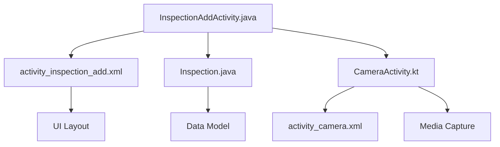
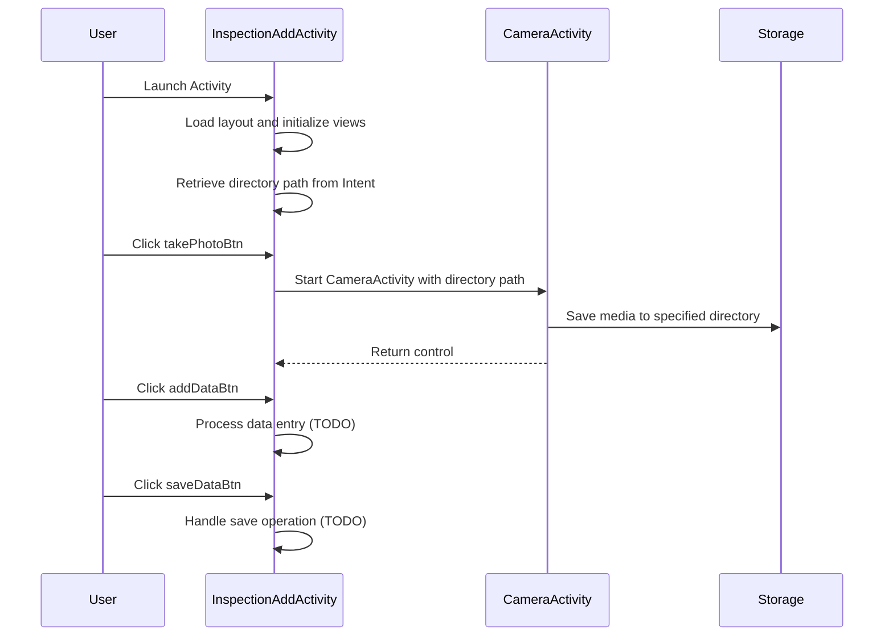
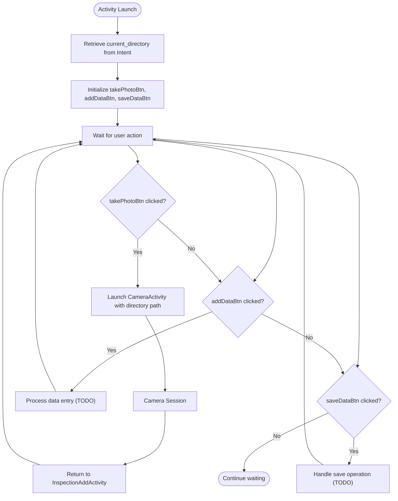
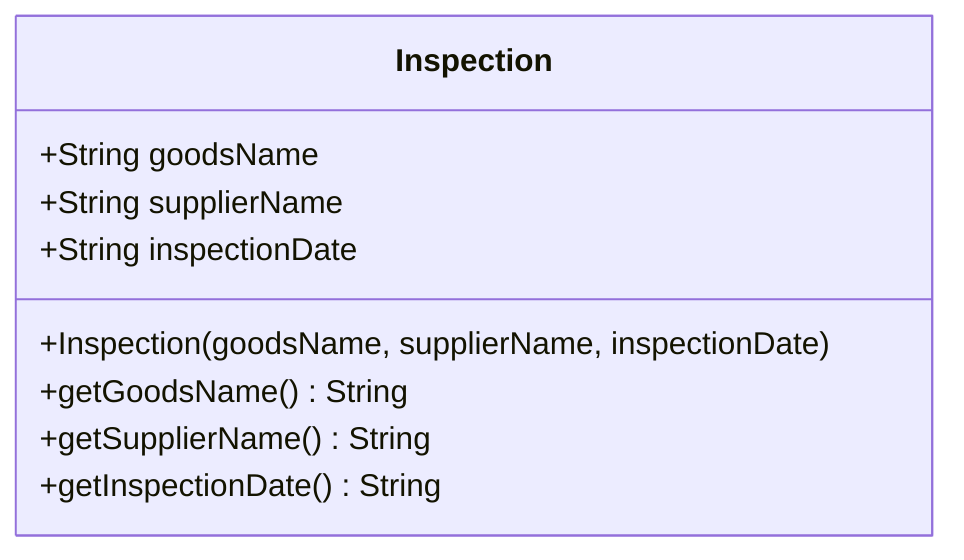
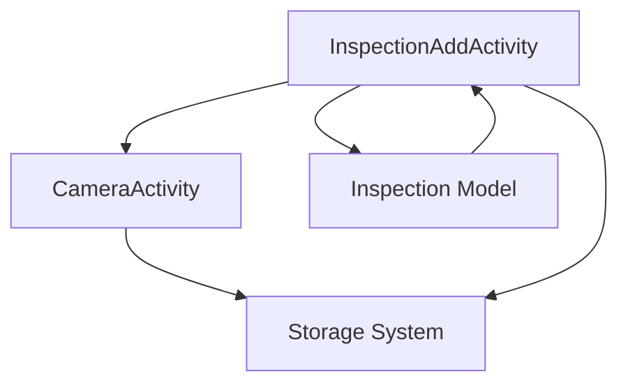

# Inspection Creation

<cite>
**Referenced Files in This Document**   
- [InspectionAddActivity.java](file://app/src/main/java/com/example/b1void/activities/InspectionAddActivity.java)
- [CameraActivity.kt](file://app/src/main/java/com/example/b1void/activities/CameraActivity.kt)
- [Inspection.java](file://app/src/main/java/com/example/b1void/models/Inspection.java)
- [activity_inspection_add.xml](file://app/src/main/res/layout/activity_inspection_add.xml)
</cite>

## Table of Contents
1. [Introduction](#introduction)
2. [Project Structure](#project-structure)
3. [Core Components](#core-components)
4. [Architecture Overview](#architecture-overview)
5. [Detailed Component Analysis](#detailed-component-analysis)
6. [Dependency Analysis](#dependency-analysis)
7. [Performance Considerations](#performance-considerations)
8. [Troubleshooting Guide](#troubleshooting-guide)
9. [Conclusion](#conclusion)

## Introduction
This document provides a comprehensive analysis of the inspection creation workflow within the Inspector application. It details the implementation of the `InspectionAddActivity`, including its UI components, data binding mechanisms, and integration with camera functionality for media capture. The workflow enables users to create new inspections by capturing photos, entering relevant data, and associating all assets with a specific directory path passed via Intent. Special attention is given to the current placeholder logic marked as TODO for future data persistence implementation.

## Project Structure

**Diagram sources**
- [InspectionAddActivity.java](file://app/src/main/java/com/example/b1void/activities/InspectionAddActivity.java#L10-L52)
- [activity_inspection_add.xml](file://app/src/main/res/layout/activity_inspection_add.xml#L0-L784)
- [CameraActivity.kt](file://app/src/main/java/com/example/b1void/activities/CameraActivity.kt#L76-L880)

**Section sources**
- [InspectionAddActivity.java](file://app/src/main/java/com/example/b1void/activities/InspectionAddActivity.java#L10-L52)
- [activity_inspection_add.xml](file://app/src/main/res/layout/activity_inspection_add.xml#L0-L784)

## Core Components

The core components of the inspection creation workflow include:
- **InspectionAddActivity**: Manages user interaction and navigation
- **CameraActivity**: Handles photo and video capture operations
- **Inspection Model**: Represents structured inspection data
- **UI Components**: Buttons for taking photos, adding data, and saving records

These components work together to allow inspectors to initiate an inspection session, capture visual evidence, input key details such as goods name and supplier information, and prepare the data for eventual storage.

**Section sources**
- [InspectionAddActivity.java](file://app/src/main/java/com/example/b1void/activities/InspectionAddActivity.java#L10-L52)
- [Inspection.java](file://app/src/main/java/com/example/b1void/models/Inspection.java#L2-L25)

## Architecture Overview

**Diagram sources**
- [InspectionAddActivity.java](file://app/src/main/java/com/example/b1void/activities/InspectionAddActivity.java#L17-L51)
- [CameraActivity.kt](file://app/src/main/java/com/example/b1void/activities/CameraActivity.kt#L134-L154)

## Detailed Component Analysis

### InspectionAddActivity Implementation

The `InspectionAddActivity` serves as the primary interface for initiating new inspections. It initializes three key UI elements:
- `takePhotoBtn`: ImageButton that triggers camera functionality
- `addDataBtn`: Button for processing form data entry
- `saveDataBtn`: Button intended for finalizing and storing inspection data

Upon creation, the activity retrieves a directory path from the incoming Intent using the key `"current_directory"`. This path is stored in the `currentDirectoryPath` field and used to associate captured media with the correct inspection context.

When the user clicks `takePhotoBtn`, a new Intent is created to launch `CameraActivity`, with the directory path attached as an extra using the same key. This ensures that all photos taken during this session are saved within the designated inspection folder.

Both `addDataBtn` and `saveDataBtn` currently contain placeholder implementations marked with TODO comments, indicating that these features are planned for future development.

#### UI Interaction Flow

**Diagram sources**
- [InspectionAddActivity.java](file://app/src/main/java/com/example/b1void/activities/InspectionAddActivity.java#L17-L51)
- [activity_inspection_add.xml](file://app/src/main/res/layout/activity_inspection_add.xml#L0-L784)

**Section sources**
- [InspectionAddActivity.java](file://app/src/main/java/com/example/b1void/activities/InspectionAddActivity.java#L10-L52)

### Data Binding and Inspection Model

The `Inspection` model class defines the core data structure for inspection records with three essential fields:
- `goodsName`: Name of the inspected goods
- `supplierName`: Supplier or vendor name
- `inspectionDate`: Date when the inspection was conducted

While the current implementation does not yet bind form inputs directly to this model, the architecture supports future integration where text inputs from the UI would populate these fields through getter methods (`getGoodsName()`, `getSupplierName()`, `getInspectionDate()`).

Potential enhancements could include:
- Auto-populating the inspection date using system time
- Implementing input validation for required fields
- Adding signature capture functionality to authenticate submissions

#### Class Structure

**Diagram sources**
- [Inspection.java](file://app/src/main/java/com/example/b1void/models/Inspection.java#L2-L25)

**Section sources**
- [Inspection.java](file://app/src/main/java/com/example/b1void/models/Inspection.java#L2-L25)

### Camera Integration Workflow

The `CameraActivity` receives the directory path through the Intent extra `"extra_save_path"` and uses it to determine where to store captured media files. When a photo is taken via `takePhoto()`, the image is saved using `saveBitmapToFile()`, which constructs a filename with timestamp and saves it to the provided path. Similarly, video recordings in `toggleVideoRecording()` use the same directory for output.

This integration ensures that all media captured during the inspection process is automatically associated with the correct inspection record based on the shared directory context.

**Section sources**
- [CameraActivity.kt](file://app/src/main/java/com/example/b1void/activities/CameraActivity.kt#L644-L649)
- [CameraActivity.kt](file://app/src/main/java/com/example/b1void/activities/CameraActivity.kt#L739-L784)

## Dependency Analysis

The inspection creation workflow demonstrates a clear dependency chain where the `InspectionAddActivity` depends on both the `CameraActivity` for media capture and the `Inspection` model for data representation. Both activities depend on the device's storage system to persist data, with the directory path serving as the linking mechanism between UI actions and file system organization.

**Diagram sources**
- [InspectionAddActivity.java](file://app/src/main/java/com/example/b1void/activities/InspectionAddActivity.java#L10-L52)
- [CameraActivity.kt](file://app/src/main/java/com/example/b1void/activities/CameraActivity.kt#L76-L880)

**Section sources**
- [InspectionAddActivity.java](file://app/src/main/java/com/example/b1void/activities/InspectionAddActivity.java#L10-L52)
- [CameraActivity.kt](file://app/src/main/java/com/example/b1void/activities/CameraActivity.kt#L76-L880)

## Performance Considerations
The current implementation efficiently handles media capture by passing directory paths through Intents rather than transferring large binary data. The use of asynchronous operations in `CameraActivity` ensures smooth UI performance during photo and video capture. Future implementations should consider optimizing data serialization when the TODO save functionality is implemented, potentially using background workers or coroutines to prevent blocking the main thread.

## Troubleshooting Guide
Common issues in this workflow may include:
- Missing permissions preventing camera access
- Invalid directory paths causing media save failures
- Null pointer exceptions if Intent extras are not properly validated
- Configuration changes disrupting activity state

Developers should ensure proper null checks when retrieving the `current_directory` extra and handle permission requests appropriately in `CameraActivity`.

**Section sources**
- [InspectionAddActivity.java](file://app/src/main/java/com/example/b1void/activities/InspectionAddActivity.java#L17-L51)
- [CameraActivity.kt](file://app/src/main/java/com/example/b1void/activities/CameraActivity.kt#L134-L154)

## Conclusion
The inspection creation workflow provides a solid foundation for building comprehensive inspection records with integrated media capture. By leveraging Intent-based communication and directory path sharing, the system effectively links visual documentation with inspection metadata. While current data saving functionality remains as placeholder code, the architectural design supports seamless extension with full CRUD operations, input validation, and additional features like digital signatures. The modular separation between UI, data modeling, and media handling promotes maintainability and scalability for future enhancements.