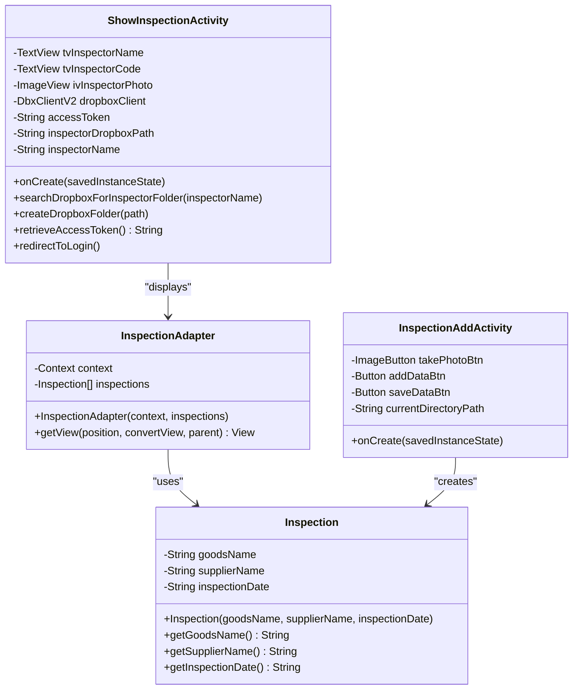
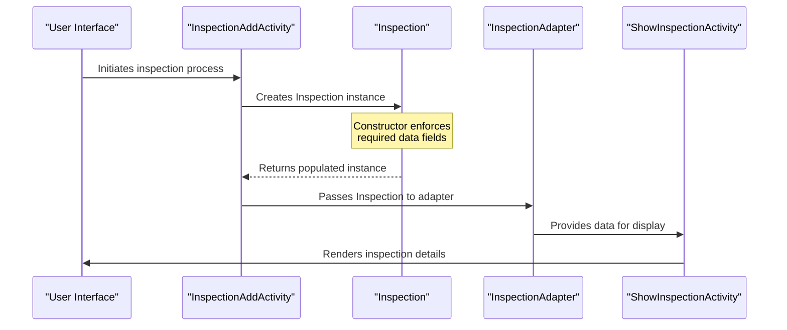
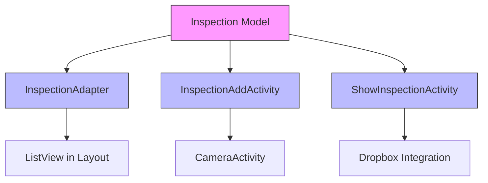

# Inspection Data Model

<cite>
**Referenced Files in This Document**   
- [Inspection.java](file://app/src/main/java/com/example/b1void/models/Inspection.java)
- [InspectionAddActivity.java](file://app/src/main/java/com/example/b1void/activities/InspectionAddActivity.java)
- [ShowInspectionActivity.kt](file://app/src/main/java/com/example/b1void/activities/ShowInspectionActivity.kt)
- [InspectionAdapter.java](file://app/src/main/java/com/example/b1void/adapters/InspectionAdapter.java)
</cite>

## Table of Contents
1. [Introduction](#introduction)
2. [Core Components](#core-components)
3. [Architecture Overview](#architecture-overview)
4. [Detailed Component Analysis](#detailed-component-analysis)
5. [Dependency Analysis](#dependency-analysis)
6. [Performance Considerations](#performance-considerations)
7. [Troubleshooting Guide](#troubleshooting-guide)
8. [Conclusion](#conclusion)

## Introduction
The Inspection data model serves as a fundamental entity within the inspection management system, designed to capture and represent critical information about product inspections. This documentation provides comprehensive details on the structure, usage, and implementation patterns of the Inspection class, which encapsulates essential attributes such as goods name, supplier information, and inspection date. The model plays a pivotal role in maintaining data consistency across various application components and activities.

## Core Components

The Inspection data model is implemented as a simple Java class that follows standard object-oriented principles for data encapsulation. It contains three private string fields representing core inspection attributes: goodsName, supplierName, and inspectionDate. These fields are initialized through a constructor that requires all values to be provided at object creation time, ensuring complete data initialization. The class exposes these fields through getter methods (getGoodsName, getSupplierName, getInspectionDate) while maintaining immutability by not providing setter methods, thus preserving data integrity throughout its lifecycle.

**Section sources**
- [Inspection.java](file://app/src/main/java/com/example/b1void/models/Inspection.java#L2-L25)

## Architecture Overview



**Diagram sources **
- [Inspection.java](file://app/src/main/java/com/example/b1void/models/Inspection.java#L2-L25)
- [InspectionAdapter.java](file://app/src/main/java/com/example/b1void/adapters/InspectionAdapter.java#L14-L41)
- [InspectionAddActivity.java](file://app/src/main/java/com/example/b1void/activities/InspectionAddActivity.java#L10-L52)
- [ShowInspectionActivity.kt](file://app/src/main/java/com/example/b1void/activities/ShowInspectionActivity.kt#L21-L150)

## Detailed Component Analysis

### Inspection Class Analysis
The Inspection class represents a straightforward data transfer object (DTO) pattern implementation, designed specifically for holding inspection-related information. Its design emphasizes simplicity and immutability, with all fields being final in practice due to the absence of mutator methods. This approach ensures that once an inspection record is created, its data remains consistent throughout the application flow, preventing unintended modifications.

#### For Object-Oriented Components:
```mermaid
classDiagram
class Inspection {
-goodsName String
-supplierName String
-inspectionDate String
+Inspection(goodsName, supplierName, inspectionDate)
+getGoodsName() String
+getSupplierName() String
+getInspectionDate() String
}
note right of Inspection
Immutable data model for inspection records
All fields initialized via constructor
No setter methods provided
Fields accessible only through getters
end note
```

**Diagram sources **
- [Inspection.java](file://app/src/main/java/com/example/b1void/models/Inspection.java#L2-L25)

### Data Flow and Usage Patterns
The Inspection data model is utilized across multiple components of the application, serving as the primary vehicle for transferring inspection information between different layers. While direct instantiation examples were not found in the codebase, the design suggests that instances would typically be created when new inspection data is collected and then passed through various UI components for display and processing.

#### For API/Service Components:


**Diagram sources **
- [Inspection.java](file://app/src/main/java/com/example/b1void/models/Inspection.java#L8-L12)
- [InspectionAddActivity.java](file://app/src/main/java/com/example/b1void/activities/InspectionAddActivity.java#L10-L52)
- [InspectionAdapter.java](file://app/src/main/java/com/example/b1void/adapters/InspectionAdapter.java#L14-L41)
- [ShowInspectionActivity.kt](file://app/src/main/java/com/example/b1void/activities/ShowInspectionActivity.kt#L21-L150)

## Dependency Analysis

The Inspection data model demonstrates a clean dependency structure, with higher-level components depending on this foundational class without creating circular dependencies. The InspectionAdapter directly depends on the Inspection class to bind data to UI elements, while activity components like InspectionAddActivity and ShowInspectionActivity interact with Inspection instances for data collection and presentation purposes.



**Diagram sources **
- [Inspection.java](file://app/src/main/java/com/example/b1void/models/Inspection.java#L2-L25)
- [InspectionAdapter.java](file://app/src/main/java/com/example/b1void/adapters/InspectionAdapter.java#L14-L41)
- [InspectionAddActivity.java](file://app/src/main/java/com/example/b1void/activities/InspectionAddActivity.java#L10-L52)
- [ShowInspectionActivity.kt](file://app/src/main/java/com/example/b1void/activities/ShowInspectionActivity.kt#L21-L150)

## Performance Considerations
The Inspection data model is optimized for lightweight data transfer and efficient memory usage. As a simple POJO (Plain Old Java Object) with only three string fields, it imposes minimal overhead on the system. The immutability pattern reduces the risk of unintended data modifications that could lead to unnecessary object copying or synchronization issues. However, since string objects in Java are immutable themselves, repeated operations on large datasets might benefit from considering more memory-efficient alternatives or implementing object pooling patterns for frequently used inspection records.

## Troubleshooting Guide
When working with the Inspection data model, developers should be aware of potential issues related to data validation and formatting. Since the current implementation does not include built-in validation logic, ensure that external validation occurs before creating Inspection instances. Pay particular attention to date formatting consistency, as the inspectionDate field accepts any string value without verification. When debugging display issues in the InspectionAdapter, verify that the layout file item_insp_list.xml contains the correct view IDs (goodsName, supplierName, inspectionDate) that match the findViewById calls in the adapter code.

**Section sources**
- [Inspection.java](file://app/src/main/java/com/example/b1void/models/Inspection.java#L2-L25)
- [InspectionAdapter.java](file://app/src/main/java/com/example/b1void/adapters/InspectionAdapter.java#L25-L39)

## Conclusion
The Inspection data model provides a solid foundation for representing inspection records within the application. Its simple, immutable design promotes data integrity and ease of use across different components. To enhance this model in future iterations, consider implementing additional features such as date validation using proper Date or LocalDateTime objects instead of strings, adding unique identifiers for database persistence, incorporating builder patterns for more flexible object creation, and including basic validation logic within the constructor to ensure data quality at the point of creation.