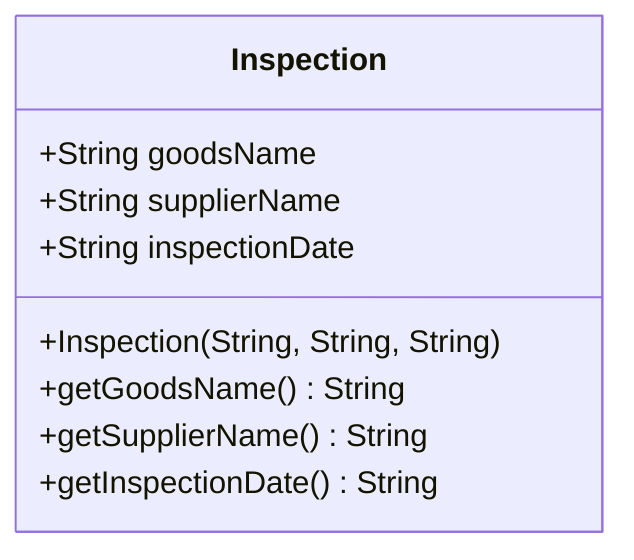
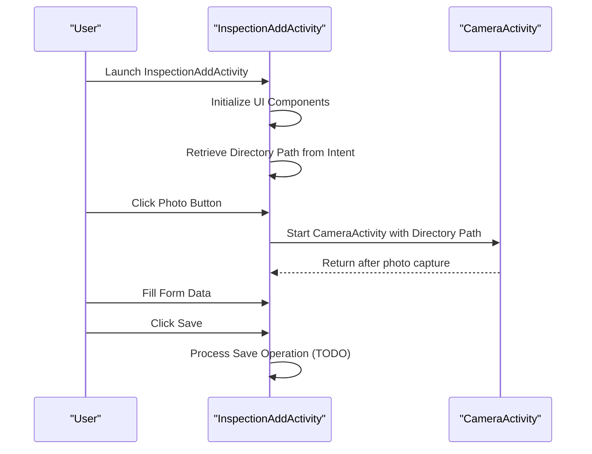
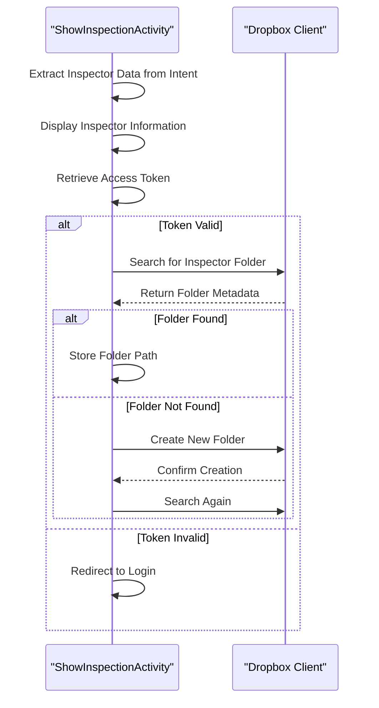

# Inspection Management

<cite>
**Referenced Files in This Document**   
- [Inspection.java](file://app/src/main/java/com/example/b1void/models/Inspection.java)
- [InspectionAddActivity.java](file://app/src/main/java/com/example/b1void/activities/InspectionAddActivity.java)
- [ShowInspectionActivity.kt](file://app/src/main/java/com/example/b1void/activities/ShowInspectionActivity.kt)
- [InspectionAdapter.java](file://app/src/main/java/com/example/b1void/adapters/InspectionAdapter.java)
- [SignatureView.java](file://app/src/main/java/com/example/b1void/activities/SignatureView.java)
- [activity_inspection_add.xml](file://app/src/main/res/layout/activity_inspection_add.xml)
- [item_insp_list.xml](file://app/src/main/res/layout/item_insp_list.xml)
- [activity_show_inspection.xml](file://app/src/main/res/layout/activity_show_inspection.xml)
</cite>

## Table of Contents
1. [Data Model Definition](#data-model-definition)
2. [Inspection Creation Workflow](#inspection-creation-workflow)
3. [Inspection Display Logic](#inspection-display-logic)
4. [List Presentation and Adapter Pattern](#list-presentation-and-adapter-pattern)
5. [Navigation Flows](#navigation-flows)
6. [Business Rules and Validation](#business-rules-and-validation)
7. [Offline Data Persistence](#offline-data-persistence)

## Data Model Definition

The `Inspection` class serves as the core data model for inspection records within the application. It encapsulates essential information about each inspection, including product details, supplier information, and temporal metadata.



**Diagram sources**
- [Inspection.java](file://app/src/main/java/com/example/b1void/models/Inspection.java#L2-L25)

The model contains three private fields:
- **goodsName**: Stores the name of the inspected goods
- **supplierName**: Contains the name of the supplier providing the goods
- **inspectionDate**: Holds the date when the inspection was conducted

These fields are initialized through a constructor that accepts all three parameters. The class provides public getter methods for each field to enable controlled access to the internal state. While the current implementation uses string representations for dates, this approach facilitates straightforward serialization and display operations across the application's UI components.

**Section sources**
- [Inspection.java](file://app/src/main/java/com/example/b1void/models/Inspection.java#L2-L25)

## Inspection Creation Workflow

The inspection creation process is managed by the `InspectionAddActivity`, which provides a form-based interface for capturing inspection data. The activity initializes its UI components during the onCreate lifecycle method, establishing references to key interactive elements including the photo capture button (`takePhotoBtn`), data addition button (`addDataBtn`), and save button (`saveDataBtn`).



**Diagram sources**
- [InspectionAddActivity.java](file://app/src/main/java/com/example/b1void/activities/InspectionAddActivity.java#L10-L52)
- [activity_inspection_add.xml](file://app/src/main/res/layout/activity_inspection_add.xml#L0-L785)

The activity receives a directory path via intent extras, which determines where captured media will be stored. The photo capture functionality is delegated to `CameraActivity` through an explicit intent that passes the current directory path as an extra. This modular design separates camera functionality from inspection data entry, promoting code reuse across the application. The form layout includes structured table elements for organizing inspection parameters such as temperature readings, vehicle identifiers, seal numbers, and various quality metrics categorized into standard, non-standard, waste, and non-caliber classifications. Although the save functionality is currently marked with TODO comments, the UI structure indicates support for comprehensive inspection documentation.

**Section sources**
- [InspectionAddActivity.java](file://app/src/main/java/com/example/b1void/activities/InspectionAddActivity.java#L10-L52)
- [activity_inspection_add.xml](file://app/src/main/res/layout/activity_inspection_add.xml#L0-L785)

## Inspection Display Logic

The `ShowInspectionActivity` handles the presentation of inspection data to users, particularly focusing on inspector information and associated inspection records. Upon initialization, the activity retrieves inspector details passed through intent extras, including the inspector's ID, name, code, and photo path.



**Diagram sources**
- [ShowInspectionActivity.kt](file://app/src/main/java/com/example/b1void/activities/ShowInspectionActivity.kt#L21-L150)
- [activity_show_inspection.xml](file://app/src/main/res/layout/activity_show_inspection.xml#L0-L125)

The UI displays the inspector's name and code in dedicated text views while rendering their photo using Glide for efficient image loading and caching. If no photo is provided, a default placeholder image is displayed. The activity implements Dropbox integration to manage cloud storage of inspection data, automatically creating a dedicated folder for each inspector if one doesn't already exist. This ensures consistent organization of inspection records across devices and sessions. The layout features a ListView component identified by `inspectionList` that would eventually display individual inspection entries, though the current implementation focuses primarily on inspector-level information rather than detailed inspection listings.

**Section sources**
- [ShowInspectionActivity.kt](file://app/src/main/java/com/example/b1void/activities/ShowInspectionActivity.kt#L21-L150)
- [activity_show_inspection.xml](file://app/src/main/res/layout/activity_show_inspection.xml#L0-L125)

## List Presentation and Adapter Pattern

The `InspectionAdapter` implements the adapter pattern to populate list views with inspection data, bridging the gap between the data model and UI presentation. Extending `ArrayAdapter<Inspection>`, it overrides the `getView` method to provide customized view inflation and data binding for each inspection item.

```mermaid
classDiagram
class InspectionAdapter {
+InspectionAdapter(Context, List<Inspection>)
+getView(int, View, ViewGroup) View
}
class Inspection {
+String goodsName
+String supplierName
+String inspectionDate
}
class InspectionAdapter --> Inspection : "displays"
```

**Diagram sources**
- [InspectionAdapter.java](file://app/src/main/java/com/example/b1void/adapters/InspectionAdapter.java#L14-L41)
- [item_insp_list.xml](file://app/src/main/res/layout/item_insp_list.xml#L0-L49)

The adapter inflates the `item_insp_list.xml` layout resource when convertView is null, ensuring efficient view recycling. For each inspection item, it retrieves references to TextView elements for goods name, supplier name, and inspection date, then populates them with corresponding data from the Inspection object using the getter methods. This implementation follows Android's recommended ViewHolder pattern implicitly through the ListView's built-in recycling mechanism. The list item layout organizes information horizontally with an image placeholder followed by text fields, creating a clean, scannable presentation of inspection records. The adapter is designed to work with any context and list of inspections, making it reusable across different activities that need to display inspection lists.

**Section sources**
- [InspectionAdapter.java](file://app/src/main/java/com/example/b1void/adapters/InspectionAdapter.java#L14-L41)
- [item_insp_list.xml](file://app/src/main/res/layout/item_insp_list.xml#L0-L49)

## Navigation Flows

The application implements a hierarchical navigation structure for managing inspections, beginning with inspection creation and progressing to detailed viewing. The primary navigation flow starts with the `InspectionAddActivity`, which serves as the entry point for creating new inspection records. From this screen, users can navigate to the camera module by clicking the photo capture button, which launches `CameraActivity` with the appropriate directory context for storing captured media.

While the current codebase does not explicitly show the transition from inspection creation to viewing, the presence of `ShowInspectionActivity` suggests a workflow where completed inspections can be reviewed and managed. The `WorkerActivity` demonstrates how inspection lists are populated, indicating that multiple inspections can be displayed in a ListView component using the `InspectionAdapter`. Selection of a list item triggers a toast notification, suggesting that future implementation would likely navigate to a detailed inspection view. The navigation architecture relies on Android's intent system for activity transitions, passing necessary data through intent extras to maintain context between screens.

**Section sources**
- [InspectionAddActivity.java](file://app/src/main/java/com/example/b1void/activities/InspectionAddActivity.java#L10-L52)
- [ShowInspectionActivity.kt](file://app/src/main/java/com/example/b1void/activities/ShowInspectionActivity.kt#L21-L150)
- [WorkerActivity.java](file://app/src/main/java/com/example/b1void/activities/WorkerActivity.java#L24-L51)

## Business Rules and Validation

The inspection management system incorporates several business rules and validation requirements to ensure data integrity and compliance with operational procedures. The `Inspection` model enforces mandatory fields through its constructor, requiring goods name, supplier name, and inspection date for every inspection record. These required fields represent fundamental information needed for audit trails and quality control documentation.

The signature capture functionality implemented in `SignatureView` includes interactive validation mechanisms. Users can edit the signature text through a dialog interface, with changes immediately reflected in the view. The component supports touch-based manipulation, allowing users to move and scale the signature through gesture detection. A double-tap gesture toggles the locked state, preventing accidental modifications once the signature is positioned correctly. This interactive validation ensures that signatures are properly placed and sized before finalizing the inspection.

Although explicit validation logic for form fields is not implemented in the current code (indicated by TODO comments in `InspectionAddActivity`), the structured table layout suggests requirements for specific data types and ranges across various inspection parameters. The integration with Dropbox also implies business rules around data synchronization and access control, ensuring that only authenticated inspectors can create and modify inspection records.

**Section sources**
- [Inspection.java](file://app/src/main/java/com/example/b1void/models/Inspection.java#L2-L25)
- [SignatureView.java](file://app/src/main/java/com/example/b1void/activities/SignatureView.java#L22-L225)

## Offline Data Persistence

The application architecture supports offline data persistence through local file storage and deferred cloud synchronization. When creating inspections, all data and media files are initially saved to a local directory specified by the `currentDirectoryPath` parameter passed to `InspectionAddActivity`. This allows inspectors to continue working in environments without network connectivity, such as remote facilities or areas with poor signal coverage.

The `ShowInspectionActivity` implements a hybrid approach to data management, attempting to synchronize with Dropbox only when an access token is available. If no token exists, the application redirects to the login screen, but continues to function with locally stored data. The folder creation logic in Dropbox operates on-demand, checking for the inspector's folder existence only when needed, which reduces unnecessary network requests during offline operation.

Media files captured through the camera functionality are stored locally first, as indicated by the file path transmission between activities. The use of `File` objects in conjunction with Glide for image loading confirms that the application prioritizes local file access for performance and reliability. Cloud synchronization appears to be handled asynchronously, allowing the application to remain responsive during upload operations. This offline-first design ensures uninterrupted workflow continuity regardless of network availability, with automatic synchronization occurring when connectivity is restored.

**Section sources**
- [InspectionAddActivity.java](file://app/src/main/java/com/example/b1void/activities/InspectionAddActivity.java#L10-L52)
- [ShowInspectionActivity.kt](file://app/src/main/java/com/example/b1void/activities/ShowInspectionActivity.kt#L21-L150)
- [SignatureView.java](file://app/src/main/java/com/example/b1void/activities/SignatureView.java#L22-L225)