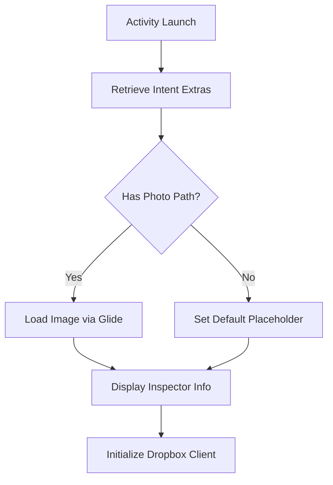
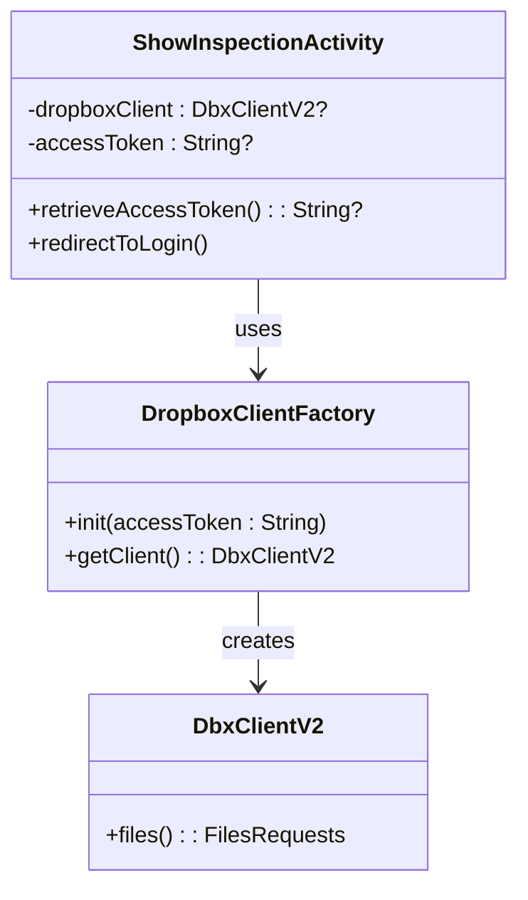
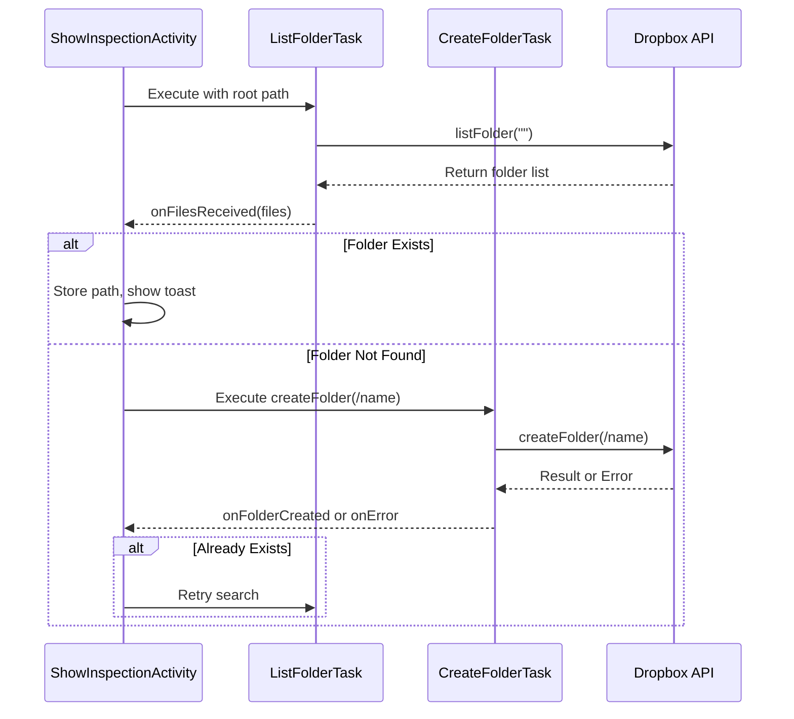
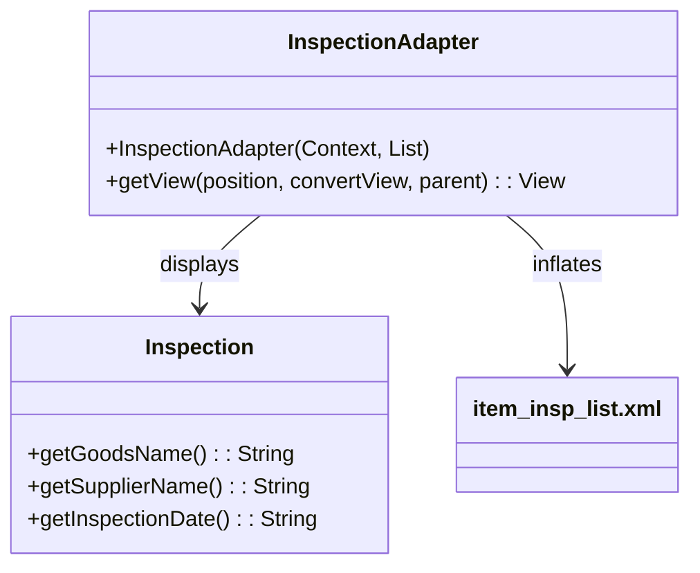

# Inspection Viewing

<cite>
**Referenced Files in This Document**
- [ShowInspectionActivity.kt](file://app/src/main/java/com/example/b1void/activities/ShowInspectionActivity.kt)
- [InspectionAdapter.java](file://app/src/main/java/com/example/b1void/adapters/InspectionAdapter.java)
- [Inspection.java](file://app/src/main/java/com/example/b1void/models/Inspection.java)
- [Inspector.kt](file://app/src/main/java/com/example/b1void/models/Inspector.kt)
- [ListFolderTask.kt](file://app/src/main/java/com/example/b1void/tasks/ListFolderTask.kt)
- [CreateFolderTask.kt](file://app/src/main/java/com/example/b1void/tasks/CreateFolderTask.kt)
- [DropboxClientFactory.kt](file://app/src/main/java/com/example/b1void/utils/DropboxClientFactory.kt)
- [activity_show_inspection.xml](file://app/src/main/res/layout/activity_show_inspection.xml)
- [item_insp_list.xml](file://app/src/main/res/layout/item_insp_list.xml)
</cite>

## Table of Contents
1. [Introduction](#introduction)
2. [Inspector Data Display in ShowInspectionActivity](#inspector-data-display-in-showinspectionactivity)
3. [Glide Integration for Image Loading](#glide-integration-for-image-loading)
4. [Dropbox Cloud Storage Integration](#dropbox-cloud-storage-integration)
5. [Remote Folder Management with ListFolderTask and CreateFolderTask](#remote-folder-management-with-listfoldertask-and-createfoldertask)
6. [Inspection List Presentation via InspectionAdapter](#inspection-list-presentation-via-inspectionadapter)
7. [Authentication State and Offline Behavior](#authentication-state-and-offline-behavior)

## Introduction
The inspection viewing functionality enables users to view detailed information about an inspector, including their name, code, and photo. The `ShowInspectionActivity` serves as the primary interface for displaying this data, retrieving it from intent extras passed during navigation. It also initiates cloud synchronization logic using Dropbox APIs to locate or create inspector-specific folders. Additionally, a list of associated inspections is presented through a custom adapter pattern that binds model data to UI components. This document details the implementation of these features, focusing on data binding, image handling, cloud integration, and user experience considerations.

## Inspector Data Display in ShowInspectionActivity

The `ShowInspectionActivity` is responsible for presenting inspector details by binding data to UI elements such as `TextView` and `ImageView`. Upon creation, the activity retrieves inspector attributes—name, code, and photo path—from intent extras. These values are then assigned directly to corresponding views: `tvInspectorName`, `tvInspectorCode`, and `ivInspectorPhoto`.

The layout file `activity_show_inspection.xml` defines a structured UI with a top section for inspector metadata, separated visually from the inspection list below. Inspector name and code are displayed in labeled horizontal layouts, ensuring clarity and readability. The display logic ensures null safety by checking the presence of a photo path before attempting to load the image.

**Diagram sources**
- [ShowInspectionActivity.kt](file://app/src/main/java/com/example/b1void/activities/ShowInspectionActivity.kt#L32-L67)
- [activity_show_inspection.xml](file://app/src/main/res/layout/activity_show_inspection.xml#L1-L125)

**Section sources**
- [ShowInspectionActivity.kt](file://app/src/main/java/com/example/b1void/activities/ShowInspectionActivity.kt#L21-L150)
- [activity_show_inspection.xml](file://app/src/main/res/layout/activity_show_inspection.xml#L1-L125)

## Glide Integration for Image Loading

Image loading within `ShowInspectionActivity` leverages the Glide library to efficiently render the inspector's photo from the local filesystem. When a valid `inspectorPhoto` path is provided via intent, Glide loads the file asynchronously, applying placeholder and error fallbacks to ensure a consistent visual experience even if the image is missing or corrupted.

The configuration specifies `R.drawable.def_insp_img` as both the placeholder (shown during loading) and the error drawable (displayed on failure). This prevents blank spaces or crashes due to invalid paths. If no photo path is available, the default drawable is set directly using `setImageResource`.

This approach optimizes memory usage and provides smooth transitions while maintaining responsiveness, especially when dealing with large images.

**Section sources**
- [ShowInspectionActivity.kt](file://app/src/main/java/com/example/b1void/activities/ShowInspectionActivity.kt#L58-L65)

## Dropbox Cloud Storage Integration

The application integrates with Dropbox using `DbxClientV2` to manage inspector-specific cloud storage directories. The `DropboxClientFactory` singleton initializes the client using an access token retrieved from shared preferences. This design centralizes authentication state management and ensures consistent client instantiation across the app.

Before initiating any Dropbox operations, the access token is validated via `retrieveAccessToken()`. If absent or invalid, the user is redirected to the login screen (`MainActivity`) to re-authenticate, enforcing secure access control.

**Diagram sources**
- [DropboxClientFactory.kt](file://app/src/main/java/com/example/b1void/utils/DropboxClientFactory.kt#L5-L22)
- [ShowInspectionActivity.kt](file://app/src/main/java/com/example/b1void/activities/ShowInspectionActivity.kt#L21-L150)

**Section sources**
- [DropboxClientFactory.kt](file://app/src/main/java/com/example/b1void/utils/DropboxClientFactory.kt#L5-L22)
- [ShowInspectionActivity.kt](file://app/src/main/java/com/example/b1void/activities/ShowInspectionActivity.kt#L21-L150)

## Remote Folder Management with ListFolderTask and CreateFolderTask

To ensure each inspector has a dedicated folder in Dropbox, the app employs two background tasks: `ListFolderTask` and `CreateFolderTask`. Both extend `AsyncTask` and operate asynchronously to avoid blocking the main thread.

Upon launching `ShowInspectionActivity`, `searchDropboxForInspectorFolder()` triggers a `ListFolderTask` to scan the root directory for a folder matching the inspector’s name. If found, its path is stored for future use. Otherwise, a `CreateFolderTask` attempts to create the folder at `/$inspectorName`.

Error handling includes detecting already-existing folders (`CreateFolderErrorException`) and invalid tokens (`InvalidAccessTokenException`). In case of token expiration, the user is redirected to the login screen. Successful creation prompts a recursive search to confirm existence, ensuring reliability.

**Diagram sources**
- [ListFolderTask.kt](file://app/src/main/java/com/example/b1void/tasks/ListFolderTask.kt#L8-L44)
- [CreateFolderTask.kt](file://app/src/main/java/com/example/b1void/tasks/CreateFolderTask.kt#L8-L43)
- [ShowInspectionActivity.kt](file://app/src/main/java/com/example/b1void/activities/ShowInspectionActivity.kt#L69-L149)

**Section sources**
- [ListFolderTask.kt](file://app/src/main/java/com/example/b1void/tasks/ListFolderTask.kt#L8-L44)
- [CreateFolderTask.kt](file://app/src/main/java/com/example/b1void/tasks/CreateFolderTask.kt#L8-L43)
- [ShowInspectionActivity.kt](file://app/src/main/java/com/example/b1void/activities/ShowInspectionActivity.kt#L69-L149)

## Inspection List Presentation via InspectionAdapter

The list of inspections associated with an inspector is rendered using `InspectionAdapter`, which extends `ArrayAdapter<Inspection>`. This adapter binds instances of the `Inspection` model class to the `item_insp_list.xml` layout through view recycling, enhancing performance and memory efficiency.

Each `Inspection` object contains three fields: `goodsName`, `supplierName`, and `inspectionDate`. During `getView()`, these values are extracted and assigned to respective `TextView` elements identified by `goodsName`, `supplierName`, and `inspectionDate`. The layout organizes these fields horizontally within a `LinearLayout`, providing a clean, tabular appearance.

The adapter follows standard Android ListView optimization practices:
- Reuses `convertView` when available
- Inflates new views only when necessary
- Directly accesses context and resources without leaks

**Diagram sources**
- [InspectionAdapter.java](file://app/src/main/java/com/example/b1void/adapters/InspectionAdapter.java#L14-L41)
- [Inspection.java](file://app/src/main/java/com/example/b1void/models/Inspection.java#L2-L25)
- [item_insp_list.xml](file://app/src/main/res/layout/item_insp_list.xml#L1-L49)

**Section sources**
- [InspectionAdapter.java](file://app/src/main/java/com/example/b1void/adapters/InspectionAdapter.java#L14-L41)
- [Inspection.java](file://app/src/main/java/com/example/b1void/models/Inspection.java#L2-L25)
- [item_insp_list.xml](file://app/src/main/res/layout/item_insp_list.xml#L1-L49)

## Authentication State and Offline Behavior

Authentication state is verified at the start of `ShowInspectionActivity` by retrieving the access token from shared preferences. If missing, immediate redirection to `MainActivity` occurs, preventing unauthorized access to protected functionality.

During offline scenarios, Dropbox tasks will fail with network-related exceptions. While not explicitly handled beyond general `DbxException` logging, the current implementation provides user feedback via Toast messages. Future enhancements could include queuing operations for execution upon reconnection or caching remote paths locally after initial sync.

Token expiration is properly detected via `InvalidAccessTokenException`, triggering logout behavior. This ensures security while guiding users toward resolution.

**Section sources**
- [ShowInspectionActivity.kt](file://app/src/main/java/com/example/b1void/activities/ShowInspectionActivity.kt#L60-L63)
- [DropboxClientFactory.kt](file://app/src/main/java/com/example/b1void/utils/DropboxClientFactory.kt#L9-L14)