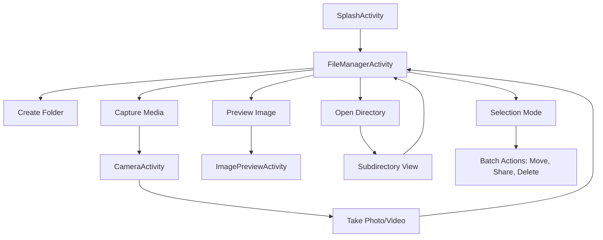
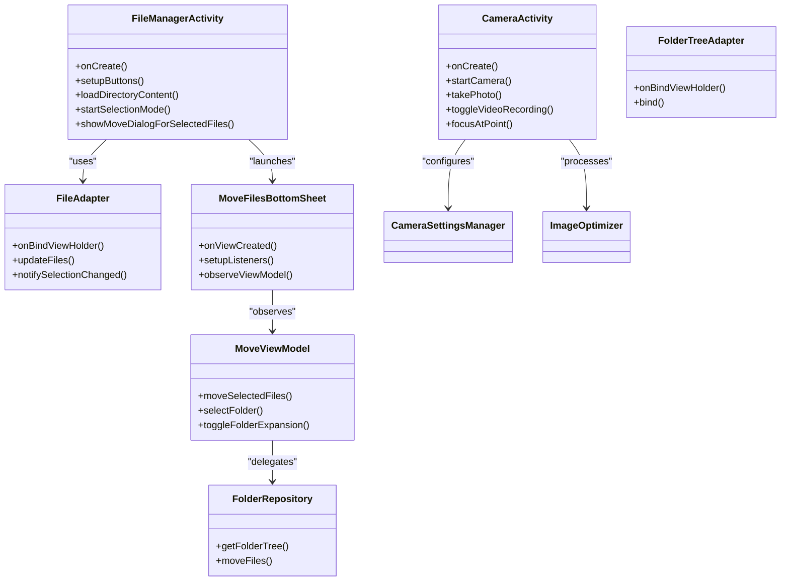

# Project Overview

<cite>
**Referenced Files in This Document**   
- [SplashActivity.java](file://app/src/main/java/com/example/b1void/activities/SplashActivity.java)
- [FileManagerActivity.kt](file://app/src/main/java/com/example/b1void/activities/FileManagerActivity.kt)
- [CameraActivity.kt](file://app/src/main/java/com/example/b1void/activities/CameraActivity.kt)
- [DropboxClientFactory.kt](file://app/src/main/java/com/example/b1void/utils/DropboxClientFactory.kt)
- [DropboxUploadWorker.kt](file://app/src/main/java/com/example/b1void/workers/DropboxUploadWorker.kt)
- [B1VoidApplication.kt](file://app/src/main/java/com/example/b1void/B1VoidApplication.kt)
- [MoveFilesBottomSheet.kt](file://app/src/main/java/com/example/b1void/ui/MoveFilesBottomSheet.kt)
- [MoveViewModel.kt](file://app/src/main/java/com/example/b1void/viewmodels/MoveViewModel.kt)
- [FolderRepository.kt](file://app/src/main/java/com/example/b1void/data/FolderRepository.kt)
- [FileAdapter.kt](file://app/src/main/java/com/example/b1void/adapters/FileAdapter.kt)
- [FolderTreeAdapter.kt](file://app/src/main/java/com/example/b1void/adapters/FolderTreeAdapter.kt)
- [AGENTS.md](file://AGENTS.md)
- [GEMINI.MD](file://GEMINI.MD)
</cite>

## Table of Contents
1. [Introduction](#introduction)
2. [Core Features and Functionality](#core-features-and-functionality)
3. [User Journey and Navigation Flow](#user-journey-and-navigation-flow)
4. [Technical Architecture and Implementation](#technical-architecture-and-implementation)
5. [Integration with Cloud Services](#integration-with-cloud-services)

## Introduction
The V1 Android application is a specialized inspection management and field documentation tool designed for technical workers, particularly field inspectors and warehouse surveyors who conduct product evaluations. The app streamlines inspection workflows by integrating robust file organization, media capture capabilities, and cloud synchronization through Dropbox into a single intuitive interface. Its primary purpose is to enable users to efficiently document inspections with photos and videos, organize files systematically, and securely share reports from remote locations. The target audience includes professionals working in industrial, logistics, and quality assurance environments where rapid documentation and reliable data sharing are critical. The core value proposition lies in its user-centric design that prioritizes efficiency and reliability, featuring an intuitive UI optimized for use with gloves, advanced camera functionality with timestamping and resolution controls, and seamless background synchronization to ensure data integrity and accessibility.

**Section sources**
- [GEMINI.MD](file://GEMINI.MD#L0-L30)

## Core Features and Functionality
The application provides a comprehensive suite of features tailored to inspection workflows. Key functionalities include hierarchical file browsing with grid and list views, high-quality photo and video capture with adjustable resolution and flash settings, inspection logging through organized file structures, and background synchronization with Dropbox. Users can create inspection folders, capture media directly within the app, view thumbnails, preview images in fullscreen, and manage files through operations like move, delete, rename, and share. The file manager supports multiple selection mode activated by long-press or swipe gestures, allowing batch operations on images and videos. Media captured includes optional timestamps burned directly onto images for audit trail purposes. File organization is enhanced through a visual folder tree structure accessible via a bottom sheet dialog, enabling users to navigate and relocate files across directories. The app also incorporates a trash system for deleted files, sorting options, and pinch-to-zoom gesture support for adjusting grid density in the file browser.

**Section sources**
- [FileManagerActivity.kt](file://app/src/main/java/com/example/b1void/activities/FileManagerActivity.kt#L42-L838)
- [CameraActivity.kt](file://app/src/main/java/com/example/b1void/activities/CameraActivity.kt#L76-L880)
- [FileAdapter.kt](file://app/src/main/java/com/example/b1void/adapters/FileAdapter.kt#L15-L167)

## User Journey and Navigation Flow
The user journey begins with the SplashActivity as the entry point, which displays a progress indicator during startup before automatically navigating to the FileManagerActivity—the central hub of the application. Upon launch, FileManagerActivity initializes the app's directory structure and loads the content of the current directory into a RecyclerView. Users interact primarily with this screen to browse existing inspections, create new folders for inspections, or initiate media capture by tapping the capture button, which launches CameraActivity. After capturing photos or videos, users return to the file manager where newly captured media appears as thumbnails. They can then open individual images for preview, perform file operations through context menus, or enter selection mode to apply batch actions like moving or sharing multiple files. The navigation flow follows a stack-based model where users can drill down into subdirectories and use the back button to navigate up, while special intents allow external components to direct the file manager to specific target directories for import operations.

**Diagram sources**
- [SplashActivity.java](file://app/src/main/java/com/example/b1void/activities/SplashActivity.java#L12-L62)
- [FileManagerActivity.kt](file://app/src/main/java/com/example/b1void/activities/FileManagerActivity.kt#L42-L838)
- [CameraActivity.kt](file://app/src/main/java/com/example/b1void/activities/CameraActivity.kt#L76-L880)

## Technical Architecture and Implementation
The application is built using Kotlin with Java interoperability, following the Model-View-ViewModel (MVVM) architectural pattern to separate concerns and enhance testability. It leverages modern Android libraries including CameraX for camera operations, Glide for image loading and caching, Data Binding for layout integration, and AndroidX WorkManager for background tasks. The codebase is organized into feature-based packages under com.example.b1void, including activities, adapters, data, models, tasks, ui, utils, viewmodels, and workers. The architecture employs RecyclerView with custom adapters (FileAdapter, FolderTreeAdapter) for efficient list rendering, LiveData and StateFlow for reactive UI updates, and coroutines for asynchronous operations. Dependency management follows clean separation principles, with repositories handling data operations and viewmodels managing UI state. The application uses BottomSheetDialogFragment for modal interactions like file moving, and implements gesture detection for swipe-to-select functionality. Configuration and state persistence are handled through SharedPreferences and saved instance states, ensuring continuity across configuration changes.

**Diagram sources**
- [FileManagerActivity.kt](file://app/src/main/java/com/example/b1void/activities/FileManagerActivity.kt#L42-L838)
- [CameraActivity.kt](file://app/src/main/java/com/example/b1void/activities/CameraActivity.kt#L76-L880)
- [FileAdapter.kt](file://app/src/main/java/com/example/b1void/adapters/FileAdapter.kt#L15-L167)
- [FolderTreeAdapter.kt](file://app/src/main/java/com/example/b1void/adapters/FolderTreeAdapter.kt#L14-L88)
- [MoveFilesBottomSheet.kt](file://app/src/main/java/com/example/b1void/ui/MoveFilesBottomSheet.kt#L20-L133)
- [MoveViewModel.kt](file://app/src/main/java/com/example/b1void/viewmodels/MoveViewModel.kt#L14-L123)
- [FolderRepository.kt](file://app/src/main/java/com/example/b1void/data/FolderRepository.kt#L7-L54)

**Section sources**
- [B1VoidApplication.kt](file://app/src/main/java/com/example/b1void/B1VoidApplication.kt#L14-L53)
- [AGENTS.md](file://AGENTS.md#L0-L37)

## Integration with Cloud Services
The application integrates with Dropbox for cloud synchronization through a dedicated worker component and client factory. The DropboxClientFactory singleton initializes the Dropbox SDK with an access token and provides authenticated client instances throughout the app. Background uploads are managed by DropboxUploadWorker, a CoroutineWorker implementation that handles file transfer operations off the main thread, supporting retry logic for transient failures. While the current implementation shows a placeholder access token in B1VoidApplication.onCreate(), production deployment would require secure credential management. File synchronization occurs when users explicitly choose to share files or folders, triggering ZIP archive creation and upload via the Dropbox API. The integration enables secure file sharing and backup, allowing inspectors to export inspection packages to cloud storage for review by remote teams. Future enhancements could implement automatic background sync of new media files, configurable sync intervals, and offline conflict resolution strategies to further improve workflow continuity in disconnected environments.

**Section sources**
- [DropboxClientFactory.kt](file://app/src/main/java/com/example/b1void/utils/DropboxClientFactory.kt#L5-L22)
- [DropboxUploadWorker.kt](file://app/src/main/java/com/example/b1void/workers/DropboxUploadWorker.kt#L16-L56)
- [B1VoidApplication.kt](file://app/src/main/java/com/example/b1void/B1VoidApplication.kt#L14-L53)