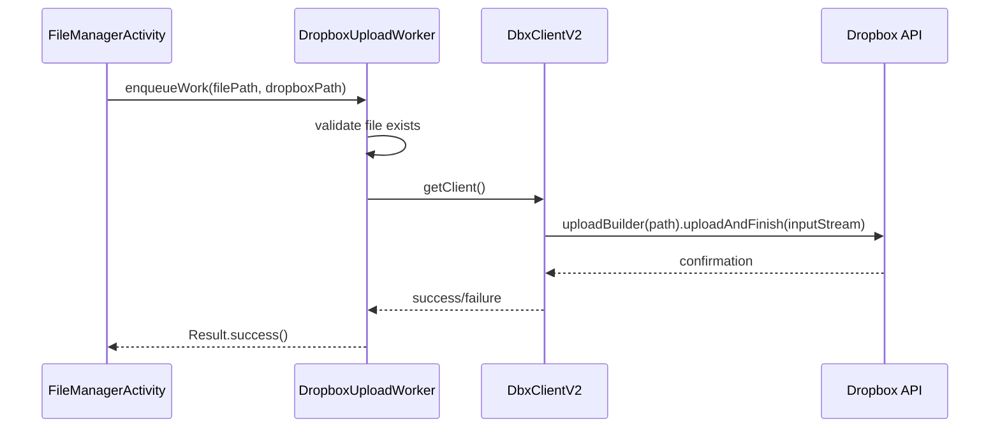

# Security Considerations

<cite>
**Referenced Files in This Document**   
- [AndroidManifest.xml](file://app/src/main/AndroidManifest.xml)
- [file_paths.xml](file://app/src/main/res/xml/file_paths.xml)
- [DropboxClientFactory.kt](file://app/src/main/java/com/example/b1void/utils/DropboxClientFactory.kt)
- [B1VoidApplication.kt](file://app/src/main/java/com/example/b1void/B1VoidApplication.kt)
- [DropboxUploadWorker.kt](file://app/src/main/java/com/example/b1void/workers/DropboxUploadWorker.kt)
- [SignatureView.java](file://app/src/main/java/com/example/b1void/activities/SignatureView.java)
- [FileManagerActivity.kt](file://app/src/main/java/com/example/b1void/activities/FileManagerActivity.kt)
- [ShowInspectionActivity.kt](file://app/src/main/java/com/example/b1void/activities/ShowInspectionActivity.kt)
</cite>

## Table of Contents
1. [File Sharing and Provider Configuration](#file-sharing-and-provider-configuration)  
2. [Runtime Permission Model](#runtime-permission-model)  
3. [Secure Credential Handling](#secure-credential-handling)  
4. [Data Protection and Transfer Security](#data-protection-and-transfer-security)  
5. [Sensitive Data Management](#sensitive-data-management)  
6. [Best Practices and Security Design Principles](#best-practices-and-security-design-principles)  
7. [Security Auditing and Vulnerability Response](#security-auditing-and-vulnerability-response)

## File Sharing and Provider Configuration

The application implements secure file sharing through Android's `FileProvider` mechanism, which allows temporary access to specific files without granting broad storage permissions. The configuration is defined in `file_paths.xml`, specifying the directories accessible via content URIs.

```mermaid
erDiagram
FILE_PROVIDER ||--o{ FILE_PATHS : "maps"
FILE_PATHS }|--|| FILES_PATH : "files-path"
FILE_PATHS }|--|| CACHE_PATH : "cache-path"
class FILE_PROVIDER {
+String authorities: com.example.b1void.provider
+boolean exported: false
+boolean grantUriPermissions: true
}
class FILES_PATH {
+String name: inspector_app_files
+String path: .
}
class CACHE_PATH {
+String name: cache_files
+String path: .
+String name: shared_zips
+String path: shared_zips/
}
```

**Diagram sources**  
- [file_paths.xml](file://app/src/main/res/xml/file_paths.xml#L1-L7)  
- [AndroidManifest.xml](file://app/src/main/AndroidManifest.xml#L28-L34)  

This setup ensures that only designated internal app directories are exposed for sharing, preventing unauthorized access to other parts of the device storage. When sharing files (e.g., images or ZIP archives), the app uses `FileProvider.getUriForFile()` to generate secure content URIs with temporary read permissions granted via `Intent.FLAG_GRANT_READ_URI_PERMISSION`.

**Section sources**  
- [file_paths.xml](file://app/src/main/res/xml/file_paths.xml#L1-L7)  
- [AndroidManifest.xml](file://app/src/main/AndroidManifest.xml#L28-L34)  
- [FileManagerActivity.kt](file://app/src/main/java/com/example/b1void/activities/FileManagerActivity.kt#L309-L315)  

## Runtime Permission Model

The application requests several runtime permissions to access sensitive device features, as declared in `AndroidManifest.xml`. These include:

- `CAMERA`: Required for capturing photos and videos within the inspection workflow.
- `RECORD_AUDIO`: Needed when video recording functionality is active.
- `WRITE_EXTERNAL_STORAGE`: Requested for backward compatibility on devices running Android API levels below 33 (targeting scoped storage improvements).
- `READ_MEDIA_VIDEO`: Used for importing existing video files from the media store.

The app follows Android’s permission model by declaring these in the manifest and handling runtime requests appropriately. Notably, it includes `tools:ignore="ScopedStorage"` to acknowledge the use of legacy storage permissions while planning for future migration to fully scoped storage practices.

A key security consideration is the conditional use of `READ_EXTERNAL_STORAGE` with `android:maxSdkVersion="32"`, indicating a transition strategy toward modern scoped storage APIs introduced in Android 13 (API 33). This minimizes long-term reliance on broad storage access.

**Section sources**  
- [AndroidManifest.xml](file://app/src/main/AndroidManifest.xml#L8-L15)  

## Secure Credential Handling

Authentication tokens for Dropbox integration are stored using Android’s `SharedPreferences`, accessed in `ShowInspectionActivity.kt` via `getSharedPreferences("prefs", MODE_PRIVATE)`. While this provides basic isolation from other apps, the implementation does **not** currently use encrypted SharedPreferences or Android’s `EncryptedSharedPreferences` wrapper, representing a potential security gap.

The access token is retrieved during initialization of Dropbox services:

```kotlin
private fun retrieveAccessToken(): String? {
    val prefs = getSharedPreferences("prefs", MODE_PRIVATE)
    return prefs.getString("access-token", null)
}
```

Once retrieved, the token is passed to `DropboxClientFactory.init()`, which initializes a singleton `DbxClientV2` instance used across the app. This centralized management helps prevent token leakage through multiple instantiation points.

However, storing the token as a plain string in SharedPreferences—especially if not encrypted—exposes it to risks from rooted devices or backup extraction. A more secure approach would involve integrating `AccountManager` or using `EncryptedSharedPreferences` with keys backed by the Android Keystore system.

**Section sources**  
- [ShowInspectionActivity.kt](file://app/src/main/java/com/example/b1void/activities/ShowInspectionActivity.kt#L141-L143)  
- [DropboxClientFactory.kt](file://app/src/main/java/com/example/b1void/utils/DropboxClientFactory.kt#L5-L22)  
- [B1VoidApplication.kt](file://app/src/main/java/com/example/b1void/B1VoidApplication.kt#L19-L21)  

## Data Protection and Transfer Security

All cloud-based data transfers occur through the official Dropbox SDK (`DbxClientV2`), which inherently uses TLS encryption for communication between the app and Dropbox servers. This ensures confidentiality and integrity of inspection data, media files, and metadata during upload and synchronization operations.

Temporary files—such as shared ZIP archives—are created in the app’s private cache directory under `cache/shared_zips/`, as configured in `file_paths.xml`. Access to these files is controlled through `FileProvider`, ensuring that only authorized apps receiving explicit URI grants can access them temporarily.

Background uploads are managed by `DropboxUploadWorker`, a WorkManager-powered background task that securely handles file transfers even when the app is not in the foreground. It reads files via `FileInputStream` and streams them directly to Dropbox, minimizing memory footprint and reducing exposure risk.



**Diagram sources**  
- [DropboxUploadWorker.kt](file://app/src/main/java/com/example/b1void/workers/DropboxUploadWorker.kt#L1-L58)  
- [FileManagerActivity.kt](file://app/src/main/java/com/example/b1void/activities/FileManagerActivity.kt#L250-L255)  

**Section sources**  
- [DropboxUploadWorker.kt](file://app/src/main/java/com/example/b1void/workers/DropboxUploadWorker.kt#L1-L58)  
- [file_paths.xml](file://app/src/main/res/xml/file_paths.xml#L5-L6)  

## Sensitive Data Management

### Signature Data
The `SignatureView` component allows users to create handwritten signatures using touch input. These signatures are rendered dynamically on a canvas and stored as part of inspection records. However, the current implementation stores signature attributes—including text, position, scale, and paint settings—as unencrypted fields in memory and likely persists them in plain text within inspection data models.

While no direct file output or external logging of signature data was found, the absence of encryption at rest increases the risk of data exposure if the device is compromised. Additionally, the default signature text ("Текст подписи") suggests possible hardcoded values that could be localized or removed in production builds.

### Inspection Details
Inspection metadata—including inspector names, codes, and associated photos—is displayed within `ShowInspectionActivity`. Inspector photos are loaded from local storage using Glide, with fallback placeholders applied. Although photo files are stored locally, they are not encrypted, relying solely on Android’s sandboxing for protection.

Access to inspection data is gated by the presence of a valid Dropbox access token. If missing, the app redirects to `MainActivity`, enforcing authentication before allowing further access.

**Section sources**  
- [SignatureView.java](file://app/src/main/java/com/example/b1void/activities/SignatureView.java#L22-L225)  
- [ShowInspectionActivity.kt](file://app/src/main/java/com/example/b1void/activities/ShowInspectionActivity.kt#L21-L150)  

## Best Practices and Security Design Principles

The application demonstrates several positive security practices:

- **Minimal Permission Scope**: Uses `maxSdkVersion` limits on broad permissions like `READ_EXTERNAL_STORAGE`, showing awareness of scoped storage evolution.
- **Secure File Sharing**: Leverages `FileProvider` with granular path definitions to avoid overexposure of app data.
- **Centralized Credential Management**: Initializes Dropbox client once and reuses it across components, reducing token duplication.
- **Use of Modern Background Processing**: Employs `WorkManager` for reliable and secure background uploads with retry logic.
- **Input Validation**: Validates file existence before upload operations to prevent errors and potential abuse.

However, areas for improvement include:
- Migrating from `SharedPreferences` to `EncryptedSharedPreferences` for storing access tokens.
- Implementing biometric or PIN-based authentication for high-sensitivity actions.
- Adding data-at-rest encryption for inspection records containing personal information.
- Removing hardcoded strings like `"YOUR_ACCESS_TOKEN"` from `B1VoidApplication.kt`.
- Enforcing stricter export controls on activities and providers where applicable.

Additionally, the app should consider enabling `android:usesCleartextTraffic="false"` in the manifest unless explicitly required, to enforce strict TLS usage.

**Section sources**  
- [B1VoidApplication.kt](file://app/src/main/java/com/example/b1void/B1VoidApplication.kt#L21)  
- [AndroidManifest.xml](file://app/src/main/AndroidManifest.xml#L28-L34)  
- [DropboxClientFactory.kt](file://app/src/main/java/com/example/b1void/utils/DropboxClientFactory.kt#L5-L22)  

## Security Auditing and Vulnerability Response

To maintain a strong security posture, the following auditing and response guidelines are recommended:

1. **Regular Code Reviews**: Focus on credential handling, file I/O operations, and intent filtering to detect insecure patterns.
2. **Static Analysis Tools**: Integrate tools like Checkmarx, SonarQube, or MobSF to scan for common vulnerabilities such as hardcoded secrets or improper permission usage.
3. **Penetration Testing**: Conduct periodic tests simulating real-world attack scenarios, especially around file sharing and authentication flows.
4. **Dependency Monitoring**: Track versions of third-party libraries (e.g., Dropbox SDK, Glide) for known CVEs using tools like Dependabot or Snyk.
5. **Vulnerability Disclosure Process**: Establish a clear channel (e.g., security@domain.com) for researchers to report issues, with a commitment to timely acknowledgment and resolution.
6. **Logging and Monitoring**: Ensure error logs do not expose sensitive data (e.g., full stack traces with tokens) and implement remote crash reporting with data sanitization.

By adhering to these practices, the application can evolve into a more robust and trustworthy platform for field inspections involving sensitive operational data.

[No sources needed since this section provides general guidance]