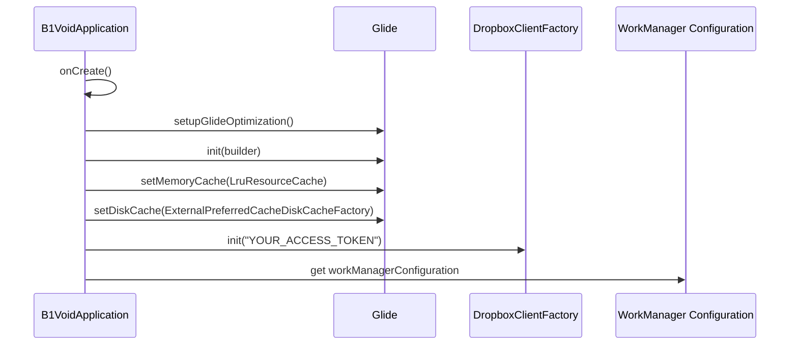

# Technology Stack & Dependencies

<cite>
**Referenced Files in This Document**
- [B1VoidApplication.kt](file://app/src/main/java/com/example/b1void/B1VoidApplication.kt)
- [CameraActivity.kt](file://app/src/main/java/com/example/b1void/activities/CameraActivity.kt)
- [FileManagerActivity.kt](file://app/src/main/java/com/example/b1void/activities/FileManagerActivity.kt)
- [InspectionAddActivity.java](file://app/src/main/java/com/example/b1void/activities/InspectionAddActivity.java)
- [AdmLogActivity.java](file://app/src/main/java/com/example/b1void/activities/AdmLogActivity.java)
- [CameraSettingsManager.kt](file://app/src/main/java/com/example/b1void/data/CameraSettingsManager.kt)
- [CameraViewModel.kt](file://app/src/main/java/com/example/b1void/viewmodels/CameraViewModel.kt)
- [DropboxUploadWorker.kt](file://app/src/main/java/com/example/b1void/workers/DropboxUploadWorker.kt)
- [FileAdapter.kt](file://app/src/main/java/com/example/b1void/adapters/FileAdapter.kt)
- [FolderTreeAdapter.kt](file://app/src/main/java/com/example/b1void/adapters/FolderTreeAdapter.kt)
- [CameraSettingsDialogFragment.kt](file://app/src/main/java/com/example/b1void/ui/CameraSettingsDialogFragment.kt)
- [MoveFilesBottomSheet.kt](file://app/src/main/java/com/example/b1void/ui/MoveFilesBottomSheet.kt)
- [build.gradle.kts](file://app/build.gradle.kts)
</cite>

## Table of Contents
1. [Programming Languages](#programming-languages)
2. [Core Frameworks and Libraries](#core-frameworks-and-libraries)
3. [Critical Dependencies](#critical-dependencies)
4. [Versioning Strategy and Compatibility](#versioning-strategy-and-compatibility)
5. [Architectural Implications](#architectural-implications)
6. [Dependency Management Procedures](#dependency-management-procedures)
7. [Technology Initialization and Usage Examples](#technology-initialization-and-usage-examples)

## Programming Languages

The V1 Android application utilizes a hybrid approach to programming languages, strategically leveraging both Kotlin and Java based on component requirements and development timelines.

Kotlin serves as the primary language for most application components, reflecting modern Android development practices and taking advantage of its concise syntax, null safety, and coroutines support. Key activities implemented in Kotlin include CameraActivity.kt, FileManagerActivity.kt, ImagePreviewActivity.kt, NavigationApp.kt, ShareImportActivity.kt, ShowInspectionActivity.kt, and WorkerActivity.kt. The application's core data management classes such as CameraSettingsManager.kt and FolderRepository.kt, along with view models like CameraViewModel.kt and MoveViewModel.kt, are also written in Kotlin, demonstrating the language's dominance in implementing business logic and data handling components.

Java is used selectively for specific activities that were likely developed during earlier phases of the project or required integration with legacy code. These include InspectionAddActivity.java, AdmLogActivity.java, CameraSettingsActivity.java, EditImageActivity.java, MainActivity.java, SignatureView.java, and SplashActivity.java. The continued use of Java for these components suggests either backward compatibility requirements or incremental migration from a Java-based codebase to Kotlin.

This mixed-language approach allows the development team to benefit from Kotlin's modern features while maintaining existing Java code that remains functional and stable. The seamless interoperability between Kotlin and Java within the Android ecosystem enables this hybrid architecture without significant integration challenges.

**Section sources**
- [CameraActivity.kt](file://app/src/main/java/com/example/b1void/activities/CameraActivity.kt#L42-L880)
- [FileManagerActivity.kt](file://app/src/main/java/com/example/b1void/activities/FileManagerActivity.kt#L42-L838)
- [InspectionAddActivity.java](file://app/src/main/java/com/example/b1void/activities/InspectionAddActivity.java#L10-L52)
- [AdmLogActivity.java](file://app/src/main/java/com/example/b1void/activities/AdmLogActivity.java#L26-L122)

## Core Frameworks and Libraries

The application leverages several key Android frameworks and libraries to implement essential functionality across different domains including UI, camera operations, image handling, background processing, and data persistence.

AndroidX provides the foundation for UI components and lifecycle management throughout the application. The implementation uses AndroidX AppCompat, Material Design components, ConstraintLayout, and various other AndroidX libraries to ensure compatibility across different Android versions and provide a consistent user interface. The application extensively uses AndroidX components for activities, fragments, and UI elements, as evidenced by the import statements and class inheritance patterns in the source code.

CameraX is the primary framework for camera implementation, providing a modern, simplified API for camera operations compared to the older Camera2 API. CameraX handles device compatibility issues automatically and provides use cases for preview, image capture, and video recording. In CameraActivity.kt, the application utilizes CameraX components such as Preview, ImageCapture, VideoCapture, and Recorder to manage camera operations. The framework's lifecycle awareness allows it to bind directly to the activity lifecycle, simplifying resource management and reducing boilerplate code.

Glide is employed for efficient image loading and display throughout the application. It is used in multiple adapters and activities to load images from files into ImageViews with features like caching, transformation, and placeholder handling. FileAdapter.kt demonstrates Glide's usage for loading thumbnails of image and video files, applying center cropping and error handling. The application further customizes Glide's behavior through configuration in B1VoidApplication.kt, where memory and disk cache settings are optimized for performance on various devices.

WorkManager is utilized for managing background tasks that need guaranteed execution, even if the app exits or the device restarts. DropboxUploadWorker.kt implements a CoroutineWorker that handles file uploads to Dropbox, demonstrating how WorkManager integrates with the application's background processing needs. The worker is designed to retry failed uploads, ensuring reliable cloud synchronization of inspection data.

DataStore serves as the preferred solution for settings persistence, replacing the older SharedPreferences API with a more modern, type-safe, and coroutine-friendly approach. CameraSettingsManager.kt uses DataStore to persist camera-related preferences such as flash mode, timestamp enablement, and resolution settings. The implementation leverages Kotlin flows to provide reactive updates when settings change, enabling real-time UI updates without polling.

**Section sources**
- [CameraActivity.kt](file://app/src/main/java/com/example/b1void/activities/CameraActivity.kt#L42-L880)
- [FileAdapter.kt](file://app/src/main/java/com/example/b1void/adapters/FileAdapter.kt#L15-L167)
- [B1VoidApplication.kt](file://app/src/main/java/com/example/b1void/B1VoidApplication.kt#L14-L53)
- [DropboxUploadWorker.kt](file://app/src/main/java/com/example/b1void/workers/DropboxUploadWorker.kt#L16-L56)
- [CameraSettingsManager.kt](file://app/src/main/java/com/example/b1void/data/CameraSettingsManager.kt#L15-L58)

## Critical Dependencies

The application's build configuration in build.gradle.kts reveals a comprehensive set of critical dependencies that extend its functionality beyond the core Android platform capabilities.

Firebase services are integrated for analytics, crash reporting, authentication, and database operations. The application includes firebase-storage-ktx, firebase-crashlytics-buildtools, firebase-database, and firebase-auth dependencies, indicating robust cloud integration for data storage, user authentication, and application monitoring. Firebase Authentication is specifically used in AdmLogActivity.java for email/password sign-in and account creation, providing secure user management.

Dropbox SDK integration enables cloud storage capabilities through the dropbox-core-sdk and dropbox-android-sdk dependencies. This allows users to upload inspection data to Dropbox, expanding the application's file management capabilities beyond local storage. The integration is facilitated by DropboxClientFactory.kt, which initializes the Dropbox client with an access token and provides a singleton instance for use throughout the application.

Kotlin coroutines are included via kotlinx-coroutines-android, providing structured concurrency for asynchronous operations. This dependency is essential for non-blocking operations such as network requests, file I/O, and database access, allowing the application to maintain responsiveness while performing intensive tasks. Coroutines are used extensively in view models, repository classes, and workers to handle background operations efficiently.

Additional notable dependencies include:
- Picasso for alternative image loading (though Glide appears to be the primary choice)
- SwipeRefreshLayout for pull-to-refresh functionality
- GetStream Photoview for enhanced image viewing capabilities
- AmbilWarna color picker library
- Gson for JSON serialization
- VerticalSeekBar for specialized UI controls
- CameraView library for advanced camera features

The multidex support library (multidex) is included to handle the application's potentially large method count, which is common in applications with numerous dependencies. This ensures compatibility with older Android versions that have limitations on the number of methods per dex file.

**Section sources**
- [build.gradle.kts](file://app/build.gradle.kts#L0-L129)
- [AdmLogActivity.java](file://app/src/main/java/com/example/b1void/activities/AdmLogActivity.java#L26-L122)
- [DropboxClientFactory.kt](file://app/src/main/java/com/example/b1void/utils/DropboxClientFactory.kt#L5-L22)

## Versioning Strategy and Compatibility

The application employs a thoughtful versioning strategy that balances the adoption of modern Android features with broad device compatibility.

The build configuration specifies a compileSdk of 35, targeting the latest available Android SDK at the time of development, while setting targetSdk to 34 (Android 14). This approach allows the application to utilize recent platform features and security improvements while maintaining compatibility with newer Android versions. The minSdk is set to 25 (Android 7.1), which represents a strategic decision to support devices from late 2016 onward, excluding older devices with limited capabilities and security vulnerabilities.

For third-party dependencies, the application uses specific version numbers rather than dynamic versions (e.g., "1.+"), ensuring build reproducibility and preventing unexpected breaking changes from dependency updates. The versions selected represent a balance between stability and feature availability:

- AndroidX components are updated to recent versions (e.g., core-ktx:1.15.0, appcompat:1.7.0)
- CameraX is at version 1.3.1, providing mature camera functionality
- Glide is at version 4.16.0, a stable release with extensive features
- WorkManager is at version 2.9.0, offering reliable background task scheduling
- Kotlin coroutines are at version 1.7.3, supporting modern async patterns

The application supports multiple CPU architectures through ABI filters for armeabi-v7a, arm64-v8a, x86, and x86_64, ensuring compatibility with both ARM and Intel-based devices. This multi-architecture support expands the potential user base across different device types.

ProGuard rules are configured for release builds with optimization enabled, reducing APK size and obfuscating code for security. The debug build type disables minification but enables debugging, facilitating development and testing.

The versionCode is set to 1 with versionName "1.0", indicating this is likely an initial production release or a major milestone in the application's development lifecycle.

**Section sources**
- [build.gradle.kts](file://app/build.gradle.kts#L0-L129)

## Architectural Implications

The chosen technology stack has significant architectural implications that shape the application's design patterns, data flow, and overall structure.

The combination of Flow and LiveData with ViewModels establishes a reactive architecture pattern that promotes separation of concerns and unidirectional data flow. CameraSettingsManager.kt exposes settings as Kotlin Flow objects, which are collected in CameraActivity.kt using lifecycleScope.launch. This reactive approach ensures that UI components automatically update when underlying data changes, eliminating the need for manual refresh operations and reducing the risk of stale data.

The ViewModel pattern, implemented through AndroidX Lifecycle components, provides a clear separation between UI controllers (activities and fragments) and business logic. CameraViewModel.kt and MoveViewModel.kt encapsulate presentation logic and state management, surviving configuration changes such as screen rotations. This architecture prevents data loss during lifecycle events and reduces memory leaks by decoupling data ownership from UI components.

DataStore's integration with Flow creates a cohesive data persistence layer that aligns with the reactive programming model. Settings changes are published as streams of data, which multiple consumers simultaneously. This eliminates race conditions and ensures consistency across different parts of the application that depend on the same settings.

The use of WorkManager for background tasks introduces a resilient job scheduling system that handles device constraints such as battery level, network availability, and system load. DropboxUploadWorker.kt demonstrates how long-running operations can be executed reliably, with automatic retry mechanisms for transient failures. This architecture ensures that critical operations like data synchronization complete successfully, even in challenging network conditions.

The hybrid Kotlin-Java codebase reflects an evolutionary architecture that accommodates gradual modernization. Newer components are implemented in Kotlin with modern language features, while existing Java components remain functional. This approach allows incremental improvement without requiring a complete rewrite, balancing technical debt reduction with feature development.

**Section sources**
- [CameraSettingsManager.kt](file://app/src/main/java/com/example/b1void/data/CameraSettingsManager.kt#L23-L51)
- [CameraViewModel.kt](file://app/src/main/java/com/example/b1void/viewmodels/CameraViewModel.kt#L57-L265)
- [CameraActivity.kt](file://app/src/main/java/com/example/b1void/activities/CameraActivity.kt#L42-L880)
- [DropboxUploadWorker.kt](file://app/src/main/java/com/example/b1void/workers/DropboxUploadWorker.kt#L16-L56)

## Dependency Management Procedures

The application follows established procedures for dependency updates and conflict resolution, ensuring stability while incorporating improvements and security fixes.

Dependencies are declared in the build.gradle.kts file using explicit version numbers, which provides deterministic builds and prevents unexpected breaking changes from transitive dependencies. When updating dependencies, developers should follow a systematic process:

1. Check for new versions of existing dependencies using Gradle's dependency verification tools or external services like VersionEye.
2. Review release notes and changelogs for breaking changes, deprecations, and new features.
3. Update the version in build.gradle.kts and sync the project.
4. Run all unit and instrumentation tests to verify functionality.
5. Perform manual testing of affected features on multiple device configurations.
6. Monitor for any performance regressions or increased APK size.

For resolving dependency conflicts, particularly those arising from transitive dependencies, the application can use Gradle's dependency resolution strategies. The current configuration already includes multiple versions of some libraries (e.g., activity-ktx appears twice with different versions), which should be consolidated to avoid potential conflicts.

When introducing new dependencies, developers should:
- Evaluate the library's maintenance status, community support, and documentation quality
- Consider the impact on APK size and method count
- Verify license compatibility with the application's distribution model
- Assess security vulnerabilities through tools like OWASP Dependency-Check
- Prefer Android-specific libraries over general-purpose ones when available

The ProGuard configuration in proguard-rules.pro should be updated when adding new libraries to ensure proper code shrinking and obfuscation. For libraries that use reflection (like Gson), appropriate keep rules must be added to prevent essential classes and methods from being removed.

Regular dependency audits should be conducted to identify outdated or vulnerable libraries. The Firebase Crashlytics integration can help identify runtime issues related to dependency conflicts or compatibility problems on specific devices.

**Section sources**
- [build.gradle.kts](file://app/build.gradle.kts#L0-L129)

## Technology Initialization and Usage Examples

The application demonstrates practical examples of how its core technologies are initialized and used across different components.

In B1VoidApplication.kt, the application-wide initialization occurs in the onCreate() method, where Glide is configured with custom memory and disk cache settings, and the Dropbox client is initialized with an access token. The WorkManager configuration is also customized to set minimum logging levels and scheduler limits, demonstrating how global settings can be applied.

**Diagram sources**
- [B1VoidApplication.kt](file://app/src/main/java/com/example/b1void/B1VoidApplication.kt#L14-L53)

CameraActivity.kt illustrates the initialization and usage of CameraX components. The startCamera() method sets up Preview, ImageCapture, and VideoCapture use cases, binding them to the lifecycle. The cameraProviderFuture listener ensures that camera components are only configured after the provider is ready, following the recommended CameraX pattern.

The reactive settings pattern is demonstrated in CameraActivity.kt's observeSettings() method, which collects Flow emissions from CameraSettingsManager to respond to changes in flash mode, timestamp enablement, and resolution. Each collection runs in lifecycleScope.launch, ensuring that the coroutines are tied to the activity's lifecycle and automatically canceled when the activity is destroyed.

FileAdapter.kt shows the practical usage of Glide for image loading, with different configurations for image files, video files, and directories. The adapter applies center cropping, placeholders, and error handling to ensure a consistent user experience regardless of image availability or loading failures.

DropboxUploadWorker.kt exemplifies how WorkManager and coroutines work together for background processing. The doWork() method is a suspend function that performs file upload operations using the Dropbox SDK, with proper exception handling and retry logic. The worker receives input parameters specifying the file path and destination path in Dropbox, demonstrating how data is passed between the main application and background workers.

These examples illustrate how the various technologies in the stack integrate to create a cohesive application architecture that balances performance, reliability, and maintainability.

**Section sources**
- [B1VoidApplication.kt](file://app/src/main/java/com/example/b1void/B1VoidApplication.kt#L14-L53)
- [CameraActivity.kt](file://app/src/main/java/com/example/b1void/activities/CameraActivity.kt#L42-L880)
- [FileAdapter.kt](file://app/src/main/java/com/example/b1void/adapters/FileAdapter.kt#L15-L167)
- [DropboxUploadWorker.kt](file://app/src/main/java/com/example/b1void/workers/DropboxUploadWorker.kt#L16-L56)