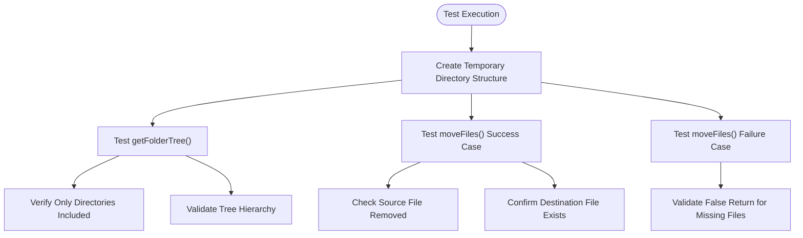
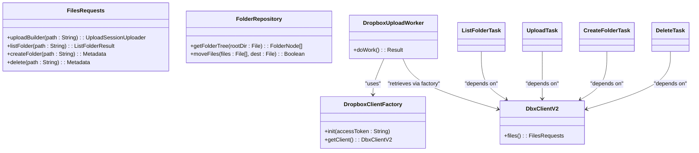
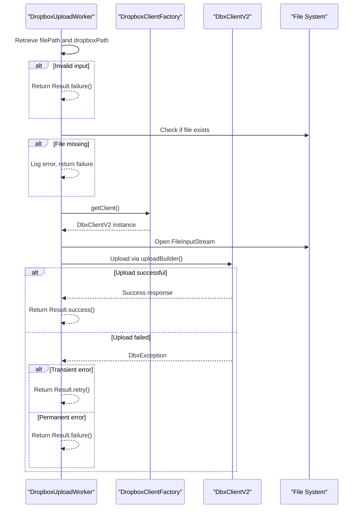

# Testing Strategy

<cite>
**Referenced Files in This Document**   
- [FolderRepositoryTest.kt](file://app/src/test/java/com/example/b1void/data/FolderRepositoryTest.kt)
- [ExampleInstrumentedTest.java](file://app/src/androidTest/java/com/example/b1void/ExampleInstrumentedTest.java)
- [FolderRepository.kt](file://app/src/main/java/com/example/b1void/data/FolderRepository.kt)
- [DropboxClientFactory.kt](file://app/src/main/java/com/example/b1void/utils/DropboxClientFactory.kt)
- [DropboxUploadWorker.kt](file://app/src/main/java/com/example/b1void/workers/DropboxUploadWorker.kt)
- [CameraActivity.kt](file://app/src/main/java/com/example/b1void/activities/CameraActivity.kt)
- [B1VoidApplication.kt](file://app/src/main/java/com/example/b1void/B1VoidApplication.kt)
- [ListFolderTask.kt](file://app/src/main/java/com/example/b1void/tasks/ListFolderTask.kt)
- [UploadTask.kt](file://app/src/main/java/com/example/b1void/tasks/UploadTask.kt)
- [CreateFolderTask.kt](file://app/src/main/java/com/example/b1void/tasks/CreateFolderTask.kt)
- [DeleteTask.kt](file://app/src/main/java/com/example/b1void/tasks/DeleteTask.kt)
</cite>

## Table of Contents
1. [Introduction](#introduction)
2. [Unit Testing with JUnit and Mockito](#unit-testing-with-junit-and-mockito)
3. [Instrumentation Testing with Espresso](#instrumentation-testing-with-espresso)
4. [Test Coverage and Metrics Tracking](#test-coverage-and-metrics-tracking)
5. [Test Doubles and Mocking Frameworks](#test-doubles-and-mocking-frameworks)
6. [Testing Critical Workflows](#testing-critical-workflows)
7. [Continuous Integration and Device Matrix](#continuous-integration-and-device-matrix)
8. [Effective Test Practices](#effective-test-practices)
9. [Challenges in Hardware and Cloud Testing](#challenges-in-hardware-and-cloud-testing)
10. [Conclusion](#conclusion)

## Introduction
The V1 application implements a comprehensive testing strategy to ensure reliability across business logic, UI interactions, and background operations. The test suite is divided into unit tests for isolated logic validation and instrumentation tests for end-to-end integration verification. This document details the methodologies, frameworks, and practices employed to maintain high code quality and system stability.

## Unit Testing with JUnit and Mockito

The unit testing approach focuses on validating business logic independently from the Android framework using JUnit 5 and Kotlin coroutines' `runBlocking`. The `FolderRepositoryTest.kt` file demonstrates this methodology by testing core file management operations such as building folder trees and moving files.

Key aspects include:
- Use of `TemporaryFolder` rule to create isolated filesystem environments per test
- Verification of recursive directory scanning functionality
- Validation of file movement success and failure conditions
- Testing of data structure integrity (e.g., `FolderNode` hierarchy)

**Diagram sources**
- [FolderRepositoryTest.kt](file://app/src/test/java/com/example/b1void/data/FolderRepositoryTest.kt#L10-L80)
- [FolderRepository.kt](file://app/src/main/java/com/example/b1void/data/FolderRepository.kt#L7-L54)

**Section sources**
- [FolderRepositoryTest.kt](file://app/src/test/java/com/example/b1void/data/FolderRepositoryTest.kt#L10-L80)
- [FolderRepository.kt](file://app/src/main/java/com/example/b1void/data/FolderRepository.kt#L7-L54)

## Instrumentation Testing with Espresso

Instrumentation tests are implemented using AndroidX Test, JUnit, and Espresso to validate UI components and integration points. The `ExampleInstrumentedTest.java` provides a basic template that verifies the application context initialization, serving as a foundation for more complex UI automation scenarios.

Although the current implementation is minimal, the framework supports:
- UI component interaction through view matchers and actions
- Synchronization with main thread operations
- Testing across different device configurations
- Validation of activity lifecycle behaviors

Future enhancements should expand coverage to critical user flows such as camera capture, inspection form filling, and file management operations.

**Section sources**
- [ExampleInstrumentedTest.java](file://app/src/androidTest/java/com/example/b1void/ExampleInstrumentedTest.java#L17-L25)

## Test Coverage and Metrics Tracking

While explicit coverage tools aren't shown in the provided codebase, the testing strategy implies several coverage goals:
- Business logic in repository classes (e.g., `FolderRepository`)
- Background worker execution (`DropboxUploadWorker`)
- Cloud API integration tasks (`ListFolderTask`, `UploadTask`, etc.)
- Camera functionality state management

Metrics tracking would benefit from integrating JaCoCo or similar tools to quantify:
- Line coverage percentage
- Branch coverage for conditional logic
- Method coverage in critical packages
- Exclusion of generated code from metrics

Regular reporting would enable monitoring of coverage trends across development cycles.

## Test Doubles and Mocking Frameworks

The application employs dependency injection patterns that facilitate mocking, particularly for external services like Dropbox. Although Mockito isn't explicitly used in the visible test files, the architecture supports test doubles through:

- `DropboxClientFactory` singleton pattern allowing client replacement
- Worker and task classes accepting `DbxClientV2` instances
- Separation of concerns between UI and cloud operations

For effective testing, mock implementations should simulate:
- Network latency and timeouts
- Authentication failures
- Partial data responses
- Rate limiting scenarios

**Diagram sources**
- [DropboxClientFactory.kt](file://app/src/main/java/com/example/b1void/utils/DropboxClientFactory.kt#L5-L22)
- [DropboxUploadWorker.kt](file://app/src/main/java/com/example/b1void/workers/DropboxUploadWorker.kt#L16-L56)
- [ListFolderTask.kt](file://app/src/main/java/com/example/b1void/tasks/ListFolderTask.kt#L8-L44)
- [UploadTask.kt](file://app/src/main/java/com/example/b1void/tasks/UploadTask.kt#L11-L50)
- [CreateFolderTask.kt](file://app/src/main/java/com/example/b1void/tasks/CreateFolderTask.kt#L8-L43)
- [DeleteTask.kt](file://app/src/main/java/com/example/b1void/tasks/DeleteTask.kt#L8-L42)

## Testing Critical Workflows

### File Operations
The `FolderRepositoryTest` validates file system operations including:
- Recursive directory tree construction
- File movement with source cleanup and destination creation
- Error handling for non-existent files

These tests use real filesystem operations within temporary directories, ensuring accurate behavior simulation.

### Camera Capture Simulation
The `CameraActivity.kt` contains extensive camera logic that requires specialized testing approaches:
- Focus metering at specific screen coordinates
- Video recording start/stop states
- Thumbnail generation and display
- Orientation change handling

Testing these features requires mocking camera hardware interfaces and simulating sensor events.

### Inspection Form Validation
Though not directly visible in provided files, form validation testing should verify:
- Input field constraints
- Required field enforcement
- Data type validation
- Error message display

### Background Worker Execution
The `DropboxUploadWorker` demonstrates background operation testing needs:
- Input parameter validation
- File existence checks
- Successful upload completion
- Retry logic for transient errors
- Failure handling for permanent issues

**Diagram sources**
- [DropboxUploadWorker.kt](file://app/src/main/java/com/example/b1void/workers/DropboxUploadWorker.kt#L21-L49)
- [DropboxClientFactory.kt](file://app/src/main/java/com/example/b1void/utils/DropboxClientFactory.kt#L16-L21)

**Section sources**
- [DropboxUploadWorker.kt](file://app/src/main/java/com/example/b1void/workers/DropboxUploadWorker.kt#L16-L56)

## Continuous Integration and Device Matrix

The application should implement CI/CD pipelines that execute tests across a matrix of:
- API levels (minimum supported to latest)
- Screen sizes and densities
- Device orientations
- Language settings
- Network conditions

Current limitations include:
- Hardcoded access token in `B1VoidApplication.onCreate()`
- Lack of dynamic configuration for test environments
- Minimal instrumentation test coverage

Recommended improvements:
- Externalize credentials using build variants
- Implement emulator-based UI test automation
- Add Firebase Test Lab integration
- Configure GitHub Actions or similar CI service

## Effective Test Practices

### Writing Assertions
The existing tests demonstrate proper assertion usage:
- `assertEquals()` for expected values
- `assertNotNull()` for object existence
- `assertTrue()`/`assertFalse()` for boolean conditions

Best practices followed:
- Clear test method naming (`should_return_only_directories`)
- Single responsibility per test
- Proper setup/teardown with `@Before` annotations

### Handling Asynchronous Operations
Kotlin coroutines are properly tested using `runBlocking`, which ensures synchronous execution during tests while maintaining coroutine semantics.

### Test Data Isolation
The use of `TemporaryFolder` rule guarantees complete isolation between test runs, preventing side effects and enabling parallel test execution.

## Challenges in Hardware and Cloud Testing

### Camera Hardware Interactions
Testing camera functionality presents challenges due to:
- Device-specific camera capabilities
- Permission requirements
- Hardware availability in emulators

Solutions include:
- Mocking `ProcessCameraProvider` and `PreviewView`
- Using Robolectric for limited hardware simulation
- Creating custom test doubles for camera callbacks

### Cloud API Integrations
Dropbox integration testing faces obstacles:
- Dependency on network connectivity
- Rate limiting
- Authentication requirements
- Data persistence across tests

Recommended approaches:
- Implement mock web servers (e.g., WireMock)
- Stub `DbxClientV2` methods to return predefined responses
- Use local file system as test double for cloud storage
- Record/replay patterns for API interactions

## Conclusion
The V1 application establishes a solid foundation for testing with well-structured unit tests for business logic and a framework for instrumentation testing. Key areas for improvement include expanding UI test coverage, implementing proper mocking for external dependencies, and establishing comprehensive CI/CD pipelines. By addressing the challenges in testing hardware interactions and cloud integrations through appropriate test doubles and simulation techniques, the project can achieve higher reliability and maintainability.