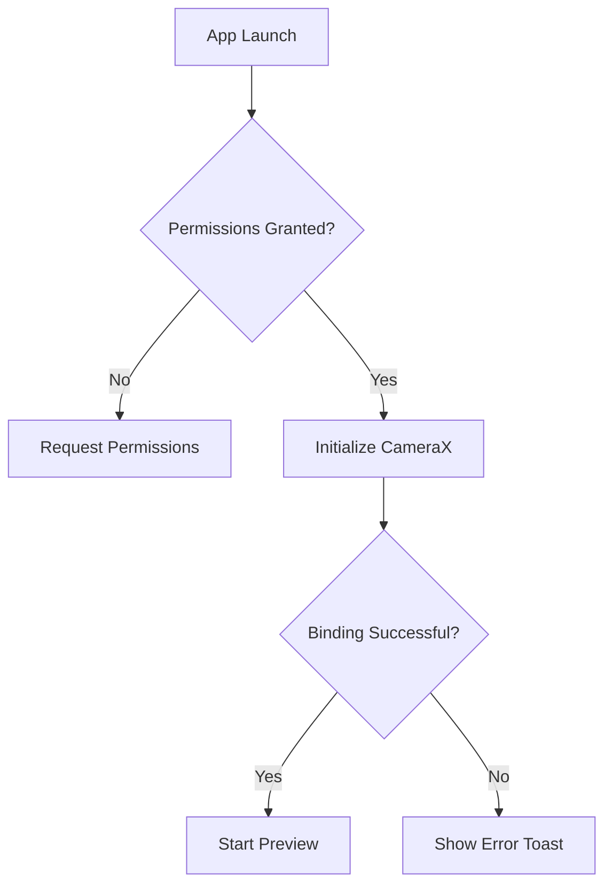
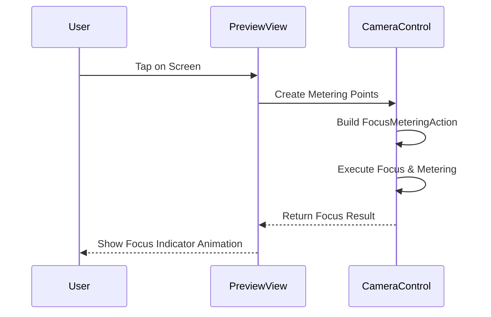
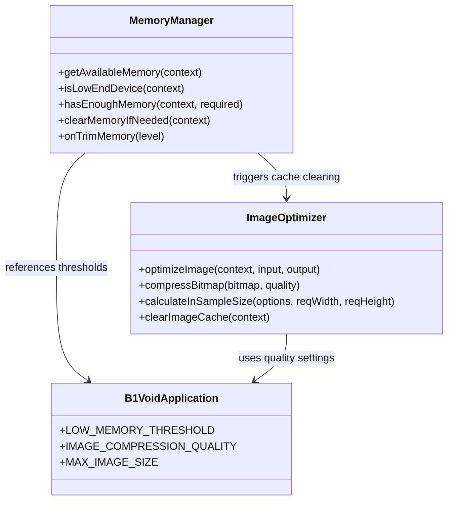

# Troubleshooting

<cite>
**Referenced Files in This Document**   
- [CameraActivity.kt](file://app/src/main/java/com/example/b1void/activities/CameraActivity.kt)
- [FileManagerActivity.kt](file://app/src/main/java/com/example/b1void/activities/FileManagerActivity.kt)
- [DropboxUploadWorker.kt](file://app/src/main/java/com/example/b1void/workers/DropboxUploadWorker.kt)
- [MemoryManager.kt](file://app/src/main/java/com/example/b1void/utils/MemoryManager.kt)
- [ImageOptimizer.kt](file://app/src/main/java/com/example/b1void/utils/ImageOptimizer.kt)
- [B1VoidApplication.kt](file://app/src/main/java/com/example/b1void/B1VoidApplication.kt)
- [DropboxClientFactory.kt](file://app/src/main/java/com/example/b1void/utils/DropboxClientFactory.kt)
- [FileManagerUtils.kt](file://app/src/main/java/com/example/b1void/utils/FileManagerUtils.kt)
</cite>

## Table of Contents
1. [Camera Issues](#camera-issues)
2. [File Management Problems](#file-management-problems)
3. [Sync and Dropbox API Errors](#sync-and-dropbox-api-errors)
4. [Performance and Memory Challenges](#performance-and-memory-challenges)
5. [Debugging Checklists](#debugging-checklists)
6. [Monitoring and Proactive Detection](#monitoring-and-proactive-detection)
7. [Workarounds for Edge Cases](#workarounds-for-edge-cases)

## Camera Issues

### Failed Initialization
When the camera fails to initialize, users may encounter a black screen or app crash during startup. This typically occurs due to missing permissions or hardware incompatibility.

**Diagnostic Steps:**
- Check Logcat for `Use case binding failed` error from `CameraActivity`
- Verify CAMERA and RECORD_AUDIO permissions are granted
- Look for `ProcessCameraProvider.getInstance()` exceptions

**Reproduction Conditions:**
- First launch without granting permissions
- Running on devices with limited camera support

**Verified Fixes:**
1. Ensure all required permissions are requested via `allPermissionsGranted()`
2. Implement proper error handling in `startCamera()` method
3. Provide user feedback when permissions are denied



**Section sources**
- [CameraActivity.kt](file://app/src/main/java/com/example/b1void/activities/CameraActivity.kt#L836-L847)
- [CameraActivity.kt](file://app/src/main/java/com/example/b1void/activities/CameraActivity.kt#L351-L399)

### Black Preview
A black preview screen indicates that the camera feed is not properly connected to the UI component.

**Diagnostic Steps:**
- Search Logcat for "Preview surface not available"
- Check if `previewView.surfaceProvider` is correctly set
- Verify `bindToLifecycle()` completes successfully

**Root Cause:** 
The `Preview` use case fails to connect to the `PreviewView` surface provider.

**Fix:**
Ensure the preview builder includes `.also { it.setSurfaceProvider(previewView.surfaceProvider) }` as implemented in `startCamera()`.

**Section sources**
- [CameraActivity.kt](file://app/src/main/java/com/example/b1void/activities/CameraActivity.kt#L351-L399)

### Focus Issues
Users report inconsistent focus behavior when tapping on the preview screen.

**Diagnostic Steps:**
- Monitor Logcat for focus metering errors
- Check if `focusIndicator` animations appear
- Verify touch events are properly handled

**Implementation Analysis:**
The camera implements tap-to-focus through:
1. Touch listener on `previewView`
2. Creation of metering points via `meteringPointFactory`
3. Execution of `FocusMeteringAction` with AF/AE flags

**Known Limitations:**
- Some low-end devices have limited focus metering support
- Rapid successive taps may be ignored due to 3-second auto-cancel duration



**Diagram sources**
- [CameraActivity.kt](file://app/src/main/java/com/example/b1void/activities/CameraActivity.kt#L470-L490)
- [CameraActivity.kt](file://app/src/main/java/com/example/b1void/activities/CameraActivity.kt#L200-L232)

**Section sources**
- [CameraActivity.kt](file://app/src/main/java/com/example/b1void/activities/CameraActivity.kt#L470-L490)
- [CameraActivity.kt](file://app/src/main/java/com/example/b1void/activities/CameraActivity.kt#L200-L232)

## File Management Problems

### Slow Loading
Large directories cause noticeable delays when browsing files.

**Diagnostic Steps:**
- Profile `loadDirectoryContent()` execution time
- Monitor thread usage during directory listing
- Check for excessive file adapter updates

**Optimization Strategy:**
The application uses background threading via `thread {}` block to prevent UI blocking while loading directory contents.

**Fix Implementation:**
- Maintain sorted file lists using `sortedWith()` comparator
- Implement efficient RecyclerView updates
- Cache frequently accessed directories

**Section sources**
- [FileManagerActivity.kt](file://app/src/main/java/com/example/b1void/activities/FileManagerActivity.kt#L390-L430)

### Missing Files
Files sometimes disappear from the file manager view after operations.

**Root Cause:**
The trash directory (`Trash`) is filtered out when viewing the main application directory.

**Code Analysis:**
```kotlin
val visibleFiles = if (directory == appDirectory) {
    filesAndDirs.filterNot { it == trashDirectory }
} else {
    filesAndDirs
}
```

**Solution:**
Users can access deleted files by navigating to the Trash folder separately. Files are not permanently removed until "Clear Trash" is executed.

**Section sources**
- [FileManagerActivity.kt](file://app/src/main/java/com/example/b1void/activities/FileManagerActivity.kt#L390-L430)
- [FileManagerUtils.kt](file://app/src/main/java/com/example/b1void/utils/FileManagerUtils.kt#L128-L165)

### Permission Errors
Users encounter permission issues when creating directories or moving files.

**Error Patterns:**
- SecurityException during directory creation
- IOException when accessing external storage
- Silent failures in file operations

**Handling Mechanism:**
The app implements try-catch blocks around critical file operations:

```kotlin
private fun createDirectoryIfNotExists(directory: File, directoryName: String, context: Context) {
    try {
        if (directory.mkdirs()) {
            Toast.makeText(context, "$directoryName created", Toast.LENGTH_SHORT).show()
        } else {
            Toast.makeText(context, "Failed to create $directoryName", Toast.LENGTH_SHORT).show()
        }
    } catch (e: SecurityException) {
        Log.e("FileManager", "SecurityException creating directory: ${e.message}")
        Toast.makeText(context, "Error: Insufficient permissions", Toast.LENGTH_SHORT).show()
    } catch (e: IOException) {
        Log.e("FileManager", "IOException creating directory: ${e.message}")
        Toast.makeText(context, "I/O Error during directory creation", Toast.LENGTH_SHORT).show()
    }
}
```

**Section sources**
- [FileManagerUtils.kt](file://app/src/main/java/com/example/b1void/utils/FileManagerUtils.kt#L76-L101)

## Sync and Dropbox API Errors

### Upload Failures
Dropbox uploads fail intermittently, especially on poor connections.

**Error Codes and Remediation:**

| Error Code | Description | Remediation Strategy |
|-----------|-------------|---------------------|
| 401 | Invalid Access Token | Re-authenticate user, redirect to login |
| 429 | Rate Limited | Implement exponential backoff retry |
| 503 | Service Unavailable | Queue upload for later retry |
| FileNotFoundException | Local file missing | Verify file exists before upload |

**Implementation:**
The `DropboxUploadWorker` handles retries automatically:

```kotlin
override suspend fun doWork(): Result {
    // ...
} catch (e: DbxException) {
    Log.e(TAG, "Dropbox upload failed", e)
    Result.retry() // Automatic retry mechanism
}
```

**Section sources**
- [DropboxUploadWorker.kt](file://app/src/main/java/com/example/b1void/workers/DropboxUploadWorker.kt#L21-L49)
- [DropboxClientFactory.kt](file://app/src/main/java/com/example/b1void/utils/DropboxClientFactory.kt#L5-L22)

### Authentication Timeouts
Access tokens expire, causing sync operations to fail.

**Diagnostic Steps:**
- Look for `InvalidAccessTokenException` in Logcat
- Check if `retrieveAccessToken()` returns null
- Monitor authentication flow in `MainActivity`

**Remediation Strategy:**
1. Catch `InvalidAccessTokenException` in all Dropbox tasks
2. Redirect user to login screen
3. Clear stored token and request re-authentication

```kotlin
private fun redirectToLogin() {
    val intent = Intent(this, MainActivity::class.java)
    startActivity(intent)
    finish()
}
```

**Section sources**
- [DropboxUploadWorker.kt](file://app/src/main/java/com/example/b1void/workers/DropboxUploadWorker.kt#L41-L56)
- [ShowInspectionActivity.kt](file://app/src/main/java/com/example/b1void/activities/ShowInspectionActivity.kt#L113-L150)

## Performance and Memory Challenges

### Out-of-Memory Crashes
The application crashes on low-RAM devices during image processing.

**Memory Management System:**
The app employs a comprehensive memory management strategy using `MemoryManager` and `ImageOptimizer`.

**Key Components:**



**Diagram sources**
- [MemoryManager.kt](file://app/src/main/java/com/example/b1void/utils/MemoryManager.kt#L0-L132)
- [ImageOptimizer.kt](file://app/src/main/java/com/example/b1void/utils/ImageOptimizer.kt#L0-L170)
- [B1VoidApplication.kt](file://app/src/main/java/com/example/b1void/B1VoidApplication.kt#L0-L54)

**Thresholds:**
- Low memory threshold: 50MB (`LOW_MEMORY_THRESHOLD`)
- Image compression quality: 80% (`IMAGE_COMPRESSION_QUALITY`)
- Maximum image size: 1024px (`MAX_IMAGE_SIZE`)

**Section sources**
- [MemoryManager.kt](file://app/src/main/java/com/example/b1void/utils/MemoryManager.kt#L0-L132)
- [ImageOptimizer.kt](file://app/src/main/java/com/example/b1void/utils/ImageOptimizer.kt#L0-L170)
- [B1VoidApplication.kt](file://app/src/main/java/com/example/b1void/B1VoidApplication.kt#L49-L51)

### Laggy UI
User interface becomes unresponsive during intensive operations.

**Causes:**
- Heavy image processing on main thread
- Large file operations without proper threading
- Excessive RecyclerView updates

**Solutions:**
1. Use `Dispatchers.IO` for file and image operations
2. Implement background threading for directory loading
3. Optimize RecyclerView with efficient diffing

**Section sources**
- [ImageOptimizer.kt](file://app/src/main/java/com/example/b1void/utils/ImageOptimizer.kt#L16-L170)
- [FileManagerActivity.kt](file://app/src/main/java/com/example/b1void/activities/FileManagerActivity.kt#L390-L430)

## Debugging Checklists

### Crash Investigation Checklist
1. **Check Logcat for stack traces**
   - Look for `NullPointerException`, `OutOfMemoryError`
   - Search for component-specific tags (CameraActivity, FileManager)

2. **Verify lifecycle state**
   - Ensure activities are not finishing when operations start
   - Check if executors are shutdown prematurely

3. **Validate file system operations**
   - Confirm files exist before processing
   - Verify directory permissions
   - Check available storage space

4. **Review memory usage**
   - Monitor allocation patterns
   - Check for bitmap leaks
   - Verify cache sizes

### ANR (Application Not Responding) Checklist
1. **Identify blocked threads**
   - Check if main thread is waiting on I/O
   - Verify no long-running operations on UI thread

2. **Analyze network operations**
   - Ensure Dropbox calls are asynchronous
   - Confirm timeouts are properly set

3. **Review database/file access**
   - Move file operations off main thread
   - Implement proper threading model

**Section sources**
- [DropboxUploadWorker.kt](file://app/src/main/java/com/example/b1void/workers/DropboxUploadWorker.kt#L21-L49)
- [FileManagerActivity.kt](file://app/src/main/java/com/example/b1void/activities/FileManagerActivity.kt#L390-L430)

## Monitoring and Proactive Detection

### Logging Best Practices
Implement structured logging with appropriate levels:

```kotlin
// Error - critical failures
Log.e(TAG, "File not found: $filePath")

// Warning - recoverable issues
Log.w(TAG, "Unable to resolve canonical path")

// Debug - diagnostic information
Log.d(TAG, "UI hidden, clearing UI cache")
```

### Monitoring Tools
1. **Android Studio Profiler**
   - Monitor memory allocation patterns
   - Track CPU usage during camera operations
   - Analyze network traffic for Dropbox sync

2. **Crashlytics Integration**
   - Capture non-fatal exceptions
   - Track custom events for key operations
   - Monitor performance metrics across devices

3. **Custom Diagnostics**
   - Implement `getMemoryInfo()` for runtime diagnostics
   - Use `onTrimMemory()` callbacks for memory pressure monitoring
   - Track operation durations for performance baselines

**Section sources**
- [MemoryManager.kt](file://app/src/main/java/com/example/b1void/utils/MemoryManager.kt#L104-L132)

## Workarounds for Edge Cases

### Full Storage
When device storage is full, implement graceful degradation:

1. **Prevention:**
   - Monitor available space before capture
   - Display warnings when storage is below threshold

2. **Recovery:**
   - Automatically clear image cache
   - Suggest moving files to cloud storage
   - Offer immediate trash clearance

### Poor Network
For unreliable connections, optimize sync behavior:

1. **Connection Awareness:**
   - Check network status before upload attempts
   - Queue operations during offline periods

2. **Efficient Retries:**
   - Implement exponential backoff
   - Prioritize critical files
   - Batch small operations

### Corrupted Databases
Handle data corruption scenarios:

1. **Detection:**
   - Validate file integrity on load
   - Implement checksum verification
   - Monitor for parsing exceptions

2. **Recovery:**
   - Maintain backup copies of critical data
   - Implement safe fallback modes
   - Provide data repair utilities

**Section sources**
- [FileManagerUtils.kt](file://app/src/main/java/com/example/b1void/utils/FileManagerUtils.kt#L128-L165)
- [DropboxUploadWorker.kt](file://app/src/main/java/com/example/b1void/workers/DropboxUploadWorker.kt#L21-L49)