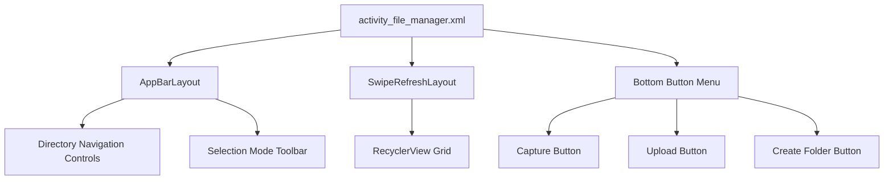
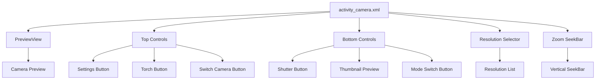
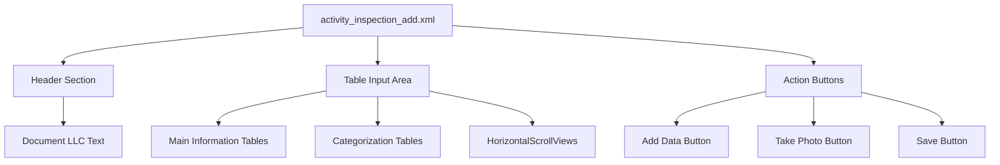
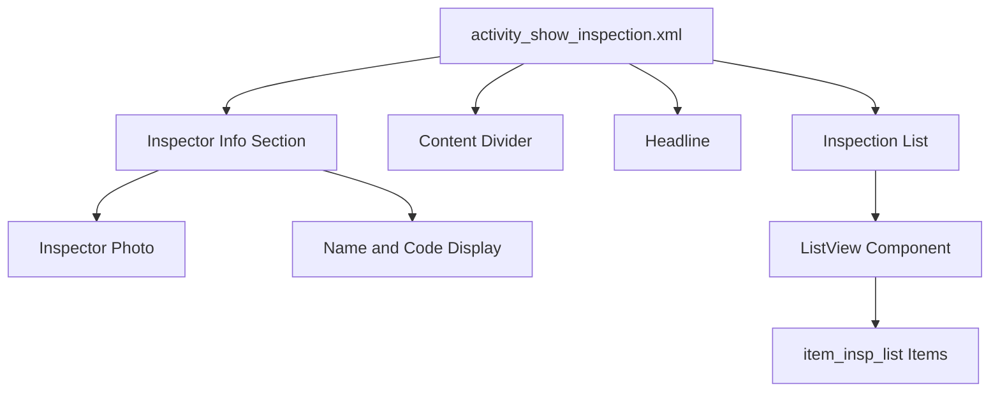
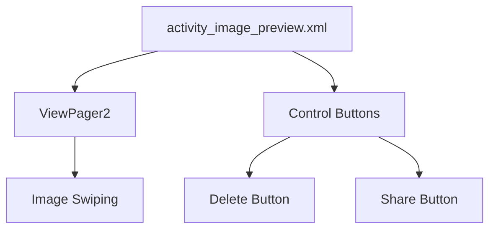
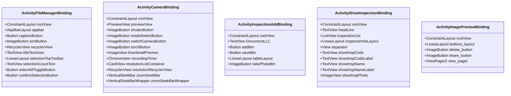
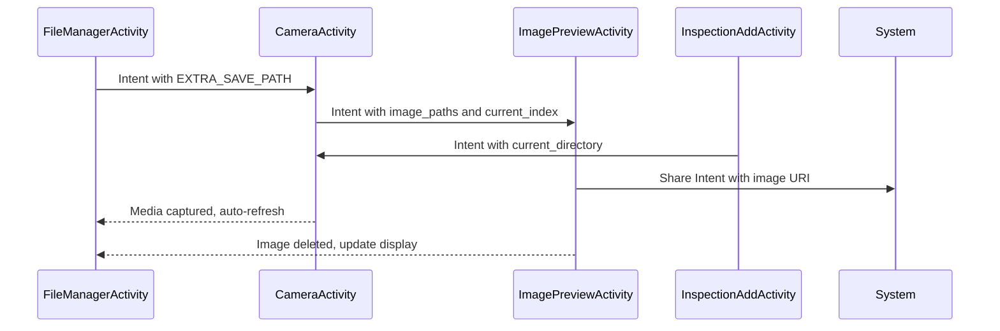

# Activity Layouts

<cite>
**Referenced Files in This Document**   
- [activity_file_manager.xml](file://app/src/main/res/layout/activity_file_manager.xml)
- [activity_camera.xml](file://app/src/main/res/layout/activity_camera.xml)
- [activity_inspection_add.xml](file://app/src/main/res/layout/activity_inspection_add.xml)
- [activity_show_inspection.xml](file://app/src/main/res/layout/activity_show_inspection.xml)
- [activity_image_preview.xml](file://app/src/main/res/layout/activity_image_preview.xml)
- [FileManagerActivity.kt](file://app/src/main/java/com/example/b1void/activities/FileManagerActivity.kt)
- [CameraActivity.kt](file://app/src/main/java/com/example/b1void/activities/CameraActivity.kt)
- [InspectionAddActivity.java](file://app/src/main/java/com/example/b1void/activities/InspectionAddActivity.java)
- [ShowInspectionActivity.kt](file://app/src/main/java/com/example/b1void/activities/ShowInspectionActivity.kt)
- [ImagePreviewActivity.kt](file://app/src/main/java/com/example/b1void/activities/ImagePreviewActivity.kt)
- [ActivityFileManagerBinding.java](file://app/build/generated/data_binding_base_class_source_out/debug/out/com/example/b1void/databinding/ActivityFileManagerBinding.java)
- [ActivityCameraBinding.java](file://app/build/generated/data_binding_base_class_source_out/debug/out/com/example/b1void/databinding/ActivityCameraBinding.java)
- [ActivityInspectionAddBinding.java](file://app/build/generated/data_binding_base_class_source_out/debug/out/com/example/b1void/databinding/ActivityInspectionAddBinding.java)
- [ActivityShowInspectionBinding.java](file://app/build/generated/data_binding_base_class_source_out/debug/out/com/example/b1void/databinding/ActivityShowInspectionBinding.java)
- [ActivityImagePreviewBinding.java](file://app/build/generated/data_binding_base_class_source_out/debug/out/com/example/b1void/databinding/ActivityImagePreviewBinding.java)
</cite>

## Table of Contents
1. [Introduction](#introduction)
2. [File Manager Layout](#file-manager-layout)
3. [Camera Layout](#camera-layout)
4. [Inspection Creation Layout](#inspection-creation-layout)
5. [Inspection Display Layout](#inspection-display-layout)
6. [Image Preview Layout](#image-preview-layout)
7. [View Binding Implementation](#view-binding-implementation)
8. [Navigation and Data Flow](#navigation-and-data-flow)
9. [Lifecycle Considerations](#lifecycle-considerations)
10. [Responsive Design Techniques](#responsive-design-techniques)

## Introduction
This document provides comprehensive documentation for the primary activity layouts in the Inspector application. The application features a collection of specialized activities that handle file management, camera operations, inspection creation, inspection display, and image preview functionality. Each layout is designed with Material Design principles and implements view binding for efficient view access. The activities are interconnected through intent-based navigation, enabling seamless data passing between screens. This documentation details the structure, purpose, and implementation of each key activity layout, along with their corresponding Kotlin activity classes and interaction flows.

## File Manager Layout

The `activity_file_manager.xml` layout serves as the central navigation hub for the application, providing users with comprehensive file management capabilities. This layout is implemented as a ConstraintLayout containing an AppBarLayout at the top, a SwipeRefreshLayout with RecyclerView in the center, and a bottom button menu. The AppBarLayout includes a toolbar with directory navigation controls, including an open trash button, title text view, sort button, and clear trash button. A distinctive selection mode UI appears when multiple files are selected, featuring a top toolbar with selection count, select all toggle, and action confirmation buttons.

The RecyclerView displays files and folders in a grid format, with the number of columns (span count) dynamically adjustable through pinch-to-zoom gestures on the grid itself. This responsive design adapts to different screen sizes and user preferences. The bottom section contains three primary action buttons: capture (for launching the camera), upload (for importing media from gallery), and create folder. The layout supports both portrait and landscape orientations, with certain UI elements like the selection toolbar appearing differently based on orientation.

**Diagram sources**
- [activity_file_manager.xml](file://app/src/main/res/layout/activity_file_manager.xml)
- [FileManagerActivity.kt](file://app/src/main/java/com/example/b1void/activities/FileManagerActivity.kt)

**Section sources**
- [activity_file_manager.xml](file://app/src/main/res/layout/activity_file_manager.xml#L1-L27)
- [FileManagerActivity.kt](file://app/src/main/java/com/example/b1void/activities/FileManagerActivity.kt#L42-L838)

## Camera Layout

The `activity_camera.xml` layout hosts the CameraX preview and associated capture controls, creating a professional camera interface. The layout is structured as a full-screen ConstraintLayout with the PreviewView occupying the entire background, ensuring optimal camera preview quality. Overlayed controls include top and bottom control panels with semi-transparent backgrounds for visibility in various lighting conditions.

The top control panel contains settings, torch (flash), and camera switch buttons, while the bottom panel features the primary shutter button, thumbnail preview of the last captured media, and a mode switch button for toggling between photo and video capture. A resolution selector button in the upper-right corner reveals a CardView containing a RecyclerView of available resolutions when clicked. A vertical seekbar on the left side allows for zoom control, which can also be adjusted via pinch gestures on the preview area.

Additional visual elements include a focus indicator that appears when the user taps to focus, and a capture animation view that briefly displays after taking a photo. A recording timer appears during video capture sessions. The layout is optimized for full-screen camera operation with minimal distractions.

**Diagram sources**
- [activity_camera.xml](file://app/src/main/res/layout/activity_camera.xml)
- [CameraActivity.kt](file://app/src/main/java/com/example/b1void/activities/CameraActivity.kt)

**Section sources**
- [activity_camera.xml](file://app/src/main/res/layout/activity_camera.xml#L1-L226)
- [CameraActivity.kt](file://app/src/main/java/com/example/b1void/activities/CameraActivity.kt#L76-L880)

## Inspection Creation Layout

The `activity_inspection_add.xml` layout facilitates the creation of new inspection records through a comprehensive form interface. This layout uses a ConstraintLayout as its root, organizing content into two main sections: a header with document information and a detailed table-based input area. The header contains a TextView displaying the document LLC information, positioned at the top of the screen.

The primary content area consists of nested LinearLayouts and TableLayouts that organize inspection data into logical categories. HorizontalScrollView containers enable scrolling through wide tables that would otherwise exceed screen width. The form includes multiple tables for different inspection parameters such as product information, temperature readings, supplier details, vehicle numbers, and seal numbers. Additional tables handle categorization data including quantity, weight, tare, net weight, and percentage calculations across various quality categories.

At the bottom of the layout, action buttons provide functionality for adding data, taking photos, and saving the inspection record. The take photo button specifically launches the CameraActivity, allowing inspectors to capture images directly within the inspection workflow. The layout's structure supports complex data entry requirements while maintaining readability through consistent styling and organization.

**Diagram sources**
- [activity_inspection_add.xml](file://app/src/main/res/layout/activity_inspection_add.xml)
- [InspectionAddActivity.java](file://app/src/main/java/com/example/b1void/activities/InspectionAddActivity.java)

**Section sources**
- [activity_inspection_add.xml](file://app/src/main/res/layout/activity_inspection_add.xml#L1-L785)
- [InspectionAddActivity.java](file://app/src/main/java/com/example/b1void/activities/InspectionAddActivity.java#L10-L52)

## Inspection Display Layout

The `activity_show_inspection.xml` layout is designed for displaying completed inspection details in a clean, organized manner. The layout begins with inspector information displayed horizontally, featuring the inspector's photo on the left and their name and code on the right within a LinearLayout. A horizontal separator line visually divides this header section from the main content area.

Below the header, a prominent "INSPECTIONS" headline centers the purpose of the screen. The primary content is rendered using a ListView that displays individual inspection records, with each item following the layout defined in `item_insp_list.xml`. This list presentation allows for scrolling through potentially lengthy inspection histories while maintaining a clean visual hierarchy.

The layout uses a dark color scheme (`@color/back`) for the background, enhancing readability of the white text elements. ConstraintLayout constraints ensure proper alignment and responsiveness across different screen sizes. The overall design prioritizes clarity and ease of information retrieval, making it simple for users to review inspection details without distraction.

**Diagram sources**
- [activity_show_inspection.xml](file://app/src/main/res/layout/activity_show_inspection.xml)
- [ShowInspectionActivity.kt](file://app/src/main/java/com/example/b1void/activities/ShowInspectionActivity.kt)

**Section sources**
- [activity_show_inspection.xml](file://app/src/main/res/layout/activity_show_inspection.xml#L1-L125)
- [ShowInspectionActivity.kt](file://app/src/main/java/com/example/b1void/activities/ShowInspectionActivity.kt#L21-L150)

## Image Preview Layout

The `activity_image_preview.xml` layout enables fullscreen image viewing with swipe gestures for navigating between multiple images. The layout is minimalistic, using a black background to maximize image visibility and focus. At its core is a ViewPager2 component that allows smooth horizontal swiping between images in a collection.

Overlayed at the bottom of the screen is a semi-transparent LinearLayout containing action buttons for deleting and sharing the current image. These controls appear above the image content but do not obstruct the primary viewing area. The ImageButton components use white-tinted icons for visibility against the dark background, following Material Design guidelines.

The layout is designed to be immersive, with the image occupying the majority of the screen real estate. The ViewPager2 implementation automatically handles touch gestures for navigation, while the activity class manages the underlying adapter and position tracking. This layout provides a standard gallery experience that users expect from modern mobile applications.

**Diagram sources**
- [activity_image_preview.xml](file://app/src/main/res/layout/activity_image_preview.xml)
- [ImagePreviewActivity.kt](file://app/src/main/java/com/example/b1void/activities/ImagePreviewActivity.kt)

**Section sources**
- [activity_image_preview.xml](file://app/src/main/res/layout/activity_image_preview.xml#L1-L47)
- [ImagePreviewActivity.kt](file://app/src/main/java/com/example/b1void/activities/ImagePreviewActivity.kt#L23-L114)

## View Binding Implementation

The application implements view binding throughout its activities, generating binding classes that provide type-safe access to views without the need for findViewById calls. For each activity layout, the Android build system generates a corresponding binding class in the `com.example.b1void.databinding` package. These classes follow the naming convention `Activity{ActivityName}Binding`, such as `ActivityFileManagerBinding` for `activity_file_manager.xml`.

Each binding class contains references to all views in the layout that have IDs, exposing them as public final fields. The binding is initialized in the activity's onCreate method by calling `setContentView()` with the inflated binding root view. This approach eliminates potential NullPointerExceptions from incorrect view lookups and provides compile-time checking of view types.

Notably, some views have configuration-specific availability, as indicated by nullable annotations in the binding classes. For example, certain buttons in `ActivityFileManagerBinding` are marked as `@Nullable` because they only exist in specific configurations (landscape vs portrait). The binding pattern improves performance by avoiding repeated view lookups and enhances code readability by providing direct field access to UI components.

**Diagram sources**
- [ActivityFileManagerBinding.java](file://app/build/generated/data_binding_base_class_source_out/debug/out/com/example/b1void/databinding/ActivityFileManagerBinding.java)
- [ActivityCameraBinding.java](file://app/build/generated/data_binding_base_class_source_out/debug/out/com/example/b1void/databinding/ActivityCameraBinding.java)
- [ActivityInspectionAddBinding.java](file://app/build/generated/data_binding_base_class_source_out/debug/out/com/example/b1void/databinding/ActivityInspectionAddBinding.java)
- [ActivityShowInspectionBinding.java](file://app/build/generated/data_binding_base_class_source_out/debug/out/com/example/b1void/databinding/ActivityShowInspectionBinding.java)
- [ActivityImagePreviewBinding.java](file://app/build/generated/data_binding_base_class_source_out/debug/out/com/example/b1void/databinding/ActivityImagePreviewBinding.java)

**Section sources**
- [ActivityFileManagerBinding.java](file://app/build/generated/data_binding_base_class_source_out/debug/out/com/example/b1void/databinding/ActivityFileManagerBinding.java#L25-L510)
- [ActivityCameraBinding.java](file://app/build/generated/data_binding_base_class_source_out/debug/out/com/example/b1void/databinding/ActivityCameraBinding.java#L26-L259)
- [ActivityInspectionAddBinding.java](file://app/build/generated/data_binding_base_class_source_out/debug/out/com/example/b1void/databinding/ActivityInspectionAddBinding.java#L20-L113)

## Navigation and Data Flow

The application implements intent-based navigation between activities, facilitating data passing and screen transitions. The primary navigation flow begins with the FileManagerActivity, which serves as the central hub. From here, users can launch CameraActivity by clicking the capture button, passing the current directory path as an extra to specify where media should be saved.

CameraActivity can navigate to ImagePreviewActivity when users click on the thumbnail of a recently captured image. This transition passes a list of image paths and the current index, enabling the preview activity to display the complete image collection with the correct starting position. Similarly, InspectionAddActivity launches CameraActivity when users need to capture photos during inspection creation, maintaining context by passing the current inspection directory.

ImagePreviewActivity supports sharing functionality, allowing users to share individual images through Android's standard sharing intents. The layout also enables deletion of images, with the activity updating the ViewPager adapter to reflect changes immediately. When returning from CameraActivity to FileManagerActivity, the file manager refreshes its content to display newly captured media.

**Diagram sources**
- [FileManagerActivity.kt](file://app/src/main/java/com/example/b1void/activities/FileManagerActivity.kt)
- [CameraActivity.kt](file://app/src/main/java/com/example/b1void/activities/CameraActivity.kt)
- [ImagePreviewActivity.kt](file://app/src/main/java/com/example/b1void/activities/ImagePreviewActivity.kt)
- [InspectionAddActivity.java](file://app/src/main/java/com/example/b1void/activities/InspectionAddActivity.java)

**Section sources**
- [FileManagerActivity.kt](file://app/src/main/java/com/example/b1void/activities/FileManagerActivity.kt#L42-L838)
- [CameraActivity.kt](file://app/src/main/java/com/example/b1void/activities/CameraActivity.kt#L76-L880)
- [ImagePreviewActivity.kt](file://app/src/main/java/com/example/b1void/activities/ImagePreviewActivity.kt#L23-L114)

## Lifecycle Considerations

Each activity in the application properly implements lifecycle methods to ensure robust behavior during state changes. The onCreate method is used consistently across activities to initialize views, set content from layouts, and establish event listeners. FileManagerActivity overrides onResume to refresh directory content, ensuring the display reflects any changes made while the activity was paused.

CameraActivity implements permission handling in onCreate, requesting necessary camera and storage permissions before initializing the camera. It also sets up orientation listeners to maintain proper camera rotation during device rotation. The activity properly manages camera resources by unbinding use cases in onDestroy to prevent memory leaks and camera conflicts with other applications.

ImagePreviewActivity handles edge cases in onCreate, checking if the imagePaths list is empty and finishing the activity if no images are available for display. The activity also implements proper cleanup in onDestroy, though specific implementation details are not visible in the provided context. All activities follow Android best practices for lifecycle management, preserving instance state through onSaveInstanceState and restoring it appropriately.

**Section sources**
- [FileManagerActivity.kt](file://app/src/main/java/com/example/b1void/activities/FileManagerActivity.kt#L42-L838)
- [CameraActivity.kt](file://app/src/main/java/com/example/b1void/activities/CameraActivity.kt#L76-L880)
- [ImagePreviewActivity.kt](file://app/src/main/java/com/example/b1void/activities/ImagePreviewActivity.kt#L23-L114)

## Responsive Design Techniques

The application employs several responsive design techniques to ensure usability across different device configurations. The FileManagerActivity layout includes both portrait and landscape variants, with certain UI elements like the selection toolbar appearing differently based on orientation. The RecyclerView grid dynamically adjusts its span count based on screen width and user gestures, using a ScaleGestureDetector to detect pinch-to-zoom actions that increase or decrease the number of columns.

The InspectionAddActivity uses HorizontalScrollView containers to accommodate wide tables that would otherwise be truncated on smaller screens. This allows users to scroll horizontally through extensive inspection data while maintaining vertical scrolling for additional sections. The ImagePreviewActivity provides a consistent fullscreen experience regardless of device size, with overlay controls that adapt to different aspect ratios.

Material Design components are used consistently throughout the application, ensuring visual harmony and predictable user interactions. ConstraintLayout is the preferred root layout manager, enabling flexible positioning that adapts to various screen dimensions. The design system incorporates appropriate padding, margins, and spacing to maintain readability and touch target sizes across different pixel densities.

**Section sources**
- [activity_file_manager.xml](file://app/src/main/res/layout/activity_file_manager.xml)
- [activity_inspection_add.xml](file://app/src/main/res/layout/activity_inspection_add.xml)
- [activity_image_preview.xml](file://app/src/main/res/layout/activity_image_preview.xml)
- [FileManagerActivity.kt](file://app/src/main/java/com/example/b1void/activities/FileManagerActivity.kt)