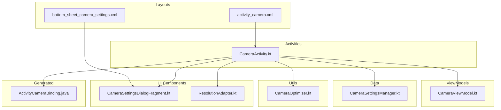
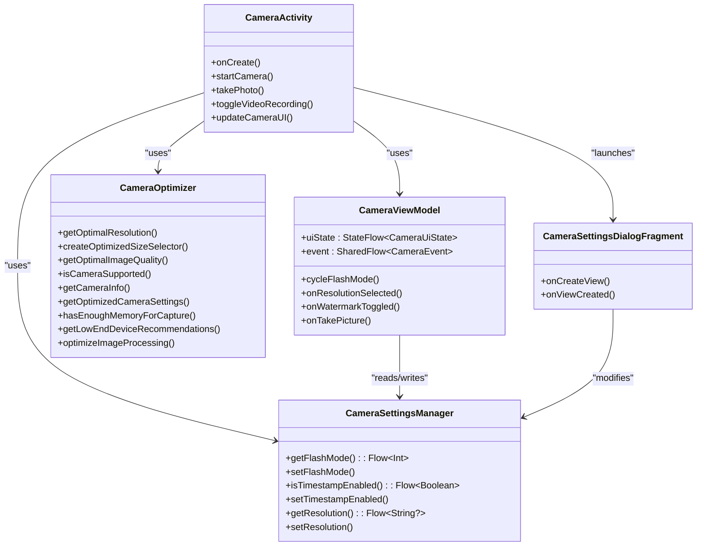
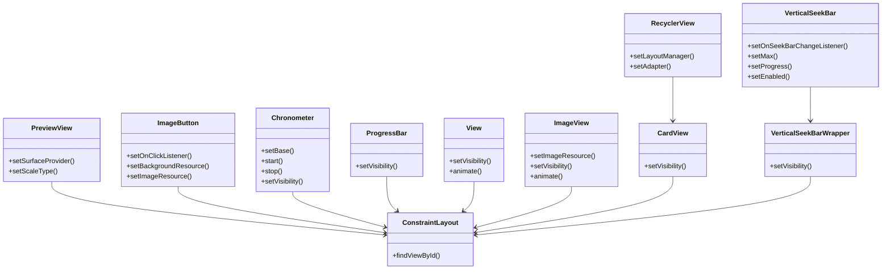
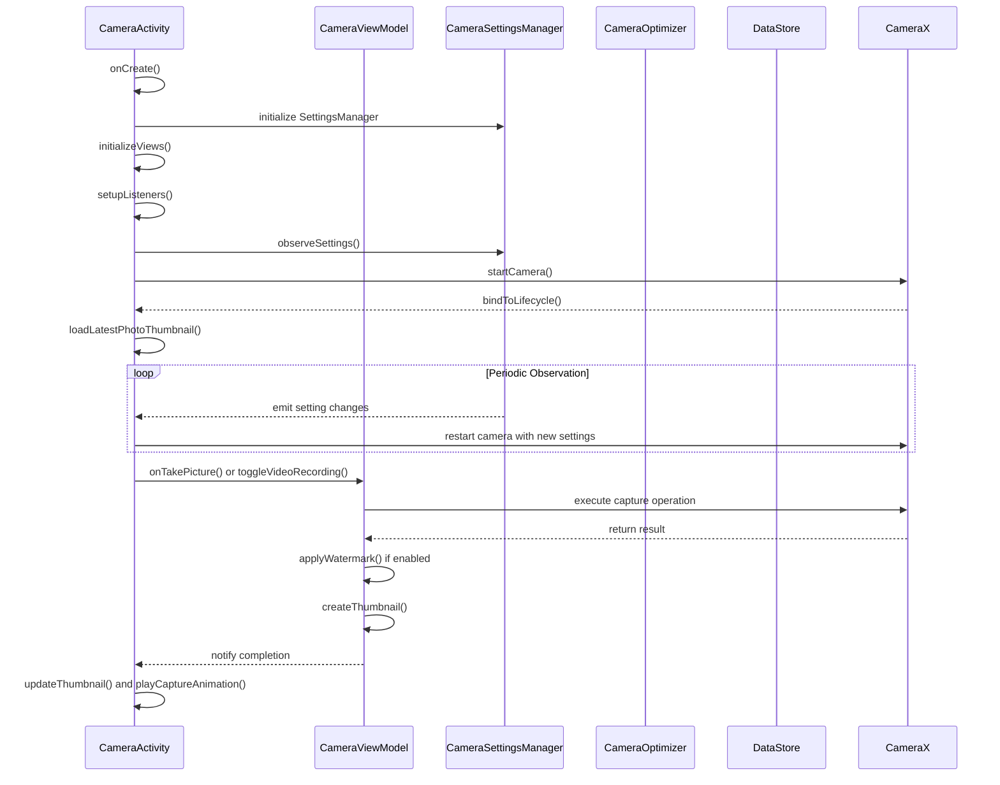
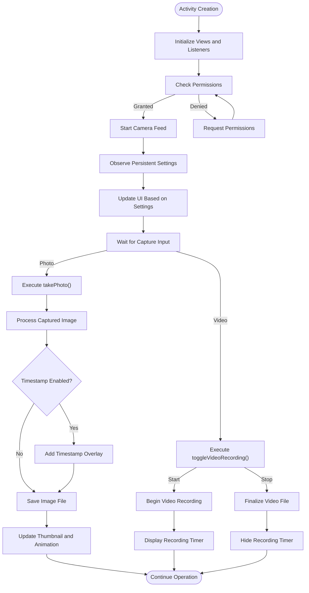
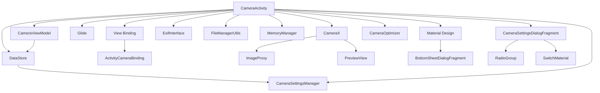

# Camera Activity Layout

<cite>
**Referenced Files in This Document**
- [activity_camera.xml](file://app/src/main/res/layout/activity_camera.xml)
- [CameraActivity.kt](file://app/src/main/java/com/example/b1void/activities/CameraActivity.kt)
- [ActivityCameraBinding.java](file://app/build/generated/data_binding_base_class_source_out/debug/out/com/example/b1void/databinding/ActivityCameraBinding.java)
- [CameraViewModel.kt](file://app/src/main/java/com/example/b1void/viewmodels/CameraViewModel.kt)
- [CameraSettingsManager.kt](file://app/src/main/java/com/example/b1void/data/CameraSettingsManager.kt)
- [CameraOptimizer.kt](file://app/src/main/java/com/example/b1void/utils/CameraOptimizer.kt)
- [CameraSettingsDialogFragment.kt](file://app/src/main/java/com/example/b1void/ui/CameraSettingsDialogFragment.kt)
- [ResolutionAdapter.kt](file://app/src/main/java/com/example/b1void/adapters/ResolutionAdapter.kt)
- [bottom_sheet_camera_settings.xml](file://app/src/main/res/layout/bottom_sheet_camera_settings.xml)
</cite>

## Table of Contents
1. [Introduction](#introduction)
2. [Project Structure](#project-structure)
3. [Core Components](#core-components)
4. [Architecture Overview](#architecture-overview)
5. [Detailed Component Analysis](#detailed-component-analysis)
6. [Dependency Analysis](#dependency-analysis)
7. [Performance Considerations](#performance-considerations)
8. [Troubleshooting Guide](#troubleshooting-guide)
9. [Conclusion](#conclusion)

## Introduction
The Camera Activity layout (activity_camera.xml) serves as the primary interface for camera functionality within the Inspector application. It provides a comprehensive set of controls and visual elements for capturing photos and videos with customizable settings. The layout is designed to host a CameraX PreviewView feed while offering intuitive access to capture functions, flash control, zoom adjustment via a custom vertical seekbar, resolution selection through a dropdown menu, and timestamp overlay capabilities. This document details the implementation of dynamic UI elements such as recording timer visibility, capture button state changes, and settings access via bottom sheet dialog. It also covers integration with key components including CameraViewModel, CameraSettingsManager, and CameraOptimizer utilities.

## Project Structure
The Camera Activity implementation follows Android's recommended architecture patterns, utilizing a combination of XML layouts, Kotlin activity classes, view models, data managers, and utility objects. The project structure organizes these components into logical packages: activities contain the main CameraActivity class, viewmodels house the CameraViewModel, data includes the CameraSettingsManager, utils contains the CameraOptimizer, and ui holds the CameraSettingsDialogFragment. The layout files are located in the res/layout directory, with activity_camera.xml defining the main camera interface and bottom_sheet_camera_settings.xml providing the settings dialog layout. View binding is implemented through ActivityCameraBinding, generated automatically from the XML layout.



**Diagram sources**
- [activity_camera.xml](file://app/src/main/res/layout/activity_camera.xml)
- [CameraActivity.kt](file://app/src/main/java/com/example/b1void/activities/CameraActivity.kt)
- [CameraViewModel.kt](file://app/src/main/java/com/example/b1void/viewmodels/CameraViewModel.kt)
- [CameraSettingsManager.kt](file://app/src/main/java/com/example/b1void/data/CameraSettingsManager.kt)
- [CameraOptimizer.kt](file://app/src/main/java/com/example/b1void/utils/CameraOptimizer.kt)
- [CameraSettingsDialogFragment.kt](file://app/src/main/java/com/example/b1void/ui/CameraSettingsDialogFragment.kt)
- [ResolutionAdapter.kt](file://app/src/main/java/com/example/b1void/adapters/ResolutionAdapter.kt)
- [ActivityCameraBinding.java](file://app/build/generated/data_binding_base_class_source_out/debug/out/com/example/b1void/databinding/ActivityCameraBinding.java)

**Section sources**
- [activity_camera.xml](file://app/src/main/res/layout/activity_camera.xml)
- [CameraActivity.kt](file://app/src/main/java/com/example/b1void/activities/CameraActivity.kt)

## Core Components
The core components of the Camera Activity include the PreviewView for displaying the camera feed, ImageButton controls for photo/video capture, mode switching, camera flipping, and settings access. Additional UI elements comprise a Chronometer for recording time display, ImageView for thumbnail preview and capture animation, RadioGroup for flash mode selection, SwitchMaterial for timestamp toggle, VerticalSeekBar for zoom control, and CardView container for resolution selection dropdown. These components work in concert with the CameraX API to provide a complete camera experience. The implementation leverages view binding through ActivityCameraBinding to reference layout elements safely and efficiently.

**Section sources**
- [activity_camera.xml](file://app/src/main/res/layout/activity_camera.xml)
- [CameraActivity.kt](file://app/src/main/java/com/example/b1void/activities/CameraActivity.kt)
- [ActivityCameraBinding.java](file://app/build/generated/data_binding_base_class_source_out/debug/out/com/example/b1void/databinding/ActivityCameraBinding.java)

## Architecture Overview
The Camera Activity architecture follows the Model-View-ViewModel (MVVM) pattern, with clear separation of concerns between UI presentation, business logic, and data management. The CameraActivity acts as the view layer, responsible for UI rendering and user interaction handling. It communicates with CameraViewModel, which serves as the view model layer, managing UI-related data and exposing observable states. CameraSettingsManager provides persistent storage for camera preferences using DataStore, while CameraOptimizer offers device-specific optimization recommendations. The CameraX library handles low-level camera operations, abstracted through ImageCapture and VideoCapture use cases.



**Diagram sources**
- [CameraActivity.kt](file://app/src/main/java/com/example/b1void/activities/CameraActivity.kt)
- [CameraViewModel.kt](file://app/src/main/java/com/example/b1void/viewmodels/CameraViewModel.kt)
- [CameraSettingsManager.kt](file://app/src/main/java/com/example/b1void/data/CameraSettingsManager.kt)
- [CameraOptimizer.kt](file://app/src/main/java/com/example/b1void/utils/CameraOptimizer.kt)
- [CameraSettingsDialogFragment.kt](file://app/src/main/java/com/example/b1void/ui/CameraSettingsDialogFragment.kt)

## Detailed Component Analysis

### Camera Layout Structure Analysis
The activity_camera.xml layout employs ConstraintLayout as its root container, enabling flexible positioning of UI elements relative to parent boundaries and other views. The PreviewView occupies the entire screen area, serving as the camera feed display surface. Top and bottom control panels contain functional buttons with appropriate constraints ensuring proper alignment across different screen sizes. The resolution selector dropdown uses a CardView wrapper with RecyclerView for dynamic content rendering, while the zoom control utilizes a VerticalSeekBarWrapper containing a VerticalSeekBar for vertical orientation.

#### For Object-Oriented Components:


**Diagram sources**
- [activity_camera.xml](file://app/src/main/res/layout/activity_camera.xml)
- [CameraActivity.kt](file://app/src/main/java/com/example/b1void/activities/CameraActivity.kt)

#### For API/Service Components:


**Diagram sources**
- [CameraActivity.kt](file://app/src/main/java/com/example/b1void/activities/CameraActivity.kt)
- [CameraViewModel.kt](file://app/src/main/java/com/example/b1void/viewmodels/CameraViewModel.kt)
- [CameraSettingsManager.kt](file://app/src/main/java/com/example/b1void/data/CameraSettingsManager.kt)
- [CameraOptimizer.kt](file://app/src/main/java/com/example/b1void/utils/CameraOptimizer.kt)

#### For Complex Logic Components:


**Diagram sources**
- [CameraActivity.kt](file://app/src/main/java/com/example/b1void/activities/CameraActivity.kt)
- [CameraViewModel.kt](file://app/src/main/java/com/example/b1void/viewmodels/CameraViewModel.kt)

**Section sources**
- [activity_camera.xml](file://app/src/main/res/layout/activity_camera.xml)
- [CameraActivity.kt](file://app/src/main/java/com/example/b1void/activities/CameraActivity.kt)
- [CameraViewModel.kt](file://app/src/main/java/com/example/b1void/viewmodels/CameraViewModel.kt)
- [CameraSettingsManager.kt](file://app/src/main/java/com/example/b1void/data/CameraSettingsManager.kt)
- [CameraOptimizer.kt](file://app/src/main/java/com/example/b1void/utils/CameraOptimizer.kt)

### Dynamic UI Elements Implementation
The Camera Activity implements several dynamic UI behaviors to enhance user experience. The recording timer visibility is controlled programmatically, appearing only during video recording sessions. Capture button appearance and functionality change based on the current mode (photo or video), with visual indicators reflecting the active state. The resolution selector dropdown toggles visibility when the corresponding button is pressed, revealing available camera resolutions retrieved from device capabilities. Zoom level is synchronized with the VerticalSeekBar position, providing real-time feedback during pinch-to-zoom gestures. Focus indication animations provide tactile feedback when users tap to focus.

**Section sources**
- [CameraActivity.kt](file://app/src/main/java/com/example/b1void/activities/CameraActivity.kt)

### Settings Management System
The camera settings system employs Android's DataStore for persistent preference storage, with CameraSettingsManager acting as an abstraction layer. This manager exposes Flow-based observables for flash mode, timestamp enablement, and resolution preferences, allowing reactive updates throughout the application. The CameraSettingsDialogFragment provides a user-friendly interface for modifying these settings, with two-way data binding ensuring immediate synchronization between UI controls and underlying preferences. Changes to settings trigger camera reinitialization to apply new configurations, maintaining consistency between user preferences and camera behavior.

```mermaid
erDiagram
USER_SETTINGS ||--o{ CAMERA_SETTINGS : contains
CAMERA_SETTINGS {
int flash_mode PK
boolean timestamp_enabled
string resolution
}
DATASTORE ||--o{ CAMERA_SETTINGS : stores
DATASTORE {
string name PK
string type
}
CAMERA_ACTIVITY ||--o{ CAMERA_SETTINGS : reads/writes
CAMERA_SETTINGS_DIALOG_FRAGMENT ||--o{ CAMERA_SETTINGS : modifies
CAMERA_VIEWMODEL ||--o{ CAMERA_SETTINGS : accesses
```

**Diagram sources**
- [CameraSettingsManager.kt](file://app/src/main/java/com/example/b1void/data/CameraSettingsManager.kt)
- [CameraSettingsDialogFragment.kt](file://app/src/main/java/com/example/b1void/ui/CameraSettingsDialogFragment.kt)
- [CameraActivity.kt](file://app/src/main/java/com/example/b1void/activities/CameraActivity.kt)
- [CameraViewModel.kt](file://app/src/main/java/com/example/b1void/viewmodels/CameraViewModel.kt)

## Dependency Analysis
The Camera Activity has well-defined dependencies on various components within the application ecosystem. It directly depends on CameraX libraries for camera functionality, AndroidX components for UI elements, Glide for image loading, and Material Design components for consistent styling. The activity maintains loose coupling with its dependencies through dependency injection principles, receiving context references rather than creating dependencies internally. Configuration changes such as orientation shifts are handled gracefully through lifecycle-aware components and saved instance state management.



**Diagram sources**
- [CameraActivity.kt](file://app/src/main/java/com/example/b1void/activities/CameraActivity.kt)
- [CameraViewModel.kt](file://app/src/main/java/com/example/b1void/viewmodels/CameraViewModel.kt)
- [CameraSettingsManager.kt](file://app/src/main/java/com/example/b1void/data/CameraSettingsManager.kt)
- [CameraOptimizer.kt](file://app/src/main/java/com/example/b1void/utils/CameraOptimizer.kt)
- [CameraSettingsDialogFragment.kt](file://app/src/main/java/com/example/b1void/ui/CameraSettingsDialogFragment.kt)
- [ActivityCameraBinding.java](file://app/build/generated/data_binding_base_class_source_out/debug/out/com/example/b1void/databinding/ActivityCameraBinding.java)

**Section sources**
- [CameraActivity.kt](file://app/src/main/java/com/example/b1void/activities/CameraActivity.kt)
- [CameraViewModel.kt](file://app/src/main/java/com/example/b1void/viewmodels/CameraViewModel.kt)
- [CameraSettingsManager.kt](file://app/src/main/java/com/example/b1void/data/CameraSettingsManager.kt)
- [CameraOptimizer.kt](file://app/src/main/java/com/example/b1void/utils/CameraOptimizer.kt)
- [CameraSettingsDialogFragment.kt](file://app/src/main/java/com/example/b1void/ui/CameraSettingsDialogFragment.kt)

## Performance Considerations
The Camera Activity incorporates several performance optimizations to ensure smooth operation across various device specifications. CameraOptimizer analyzes device capabilities and adjusts settings accordingly, reducing resolution and quality parameters for low-end devices to prevent memory issues. The implementation uses efficient bitmap processing techniques, including sampling and recycling, to minimize memory footprint during image capture and processing. Background threading is employed for intensive operations such as file I/O and image encoding, preventing UI thread blocking. Lifecycle methods properly manage camera resources, releasing them when the activity is paused to conserve battery and system resources.

**Section sources**
- [CameraOptimizer.kt](file://app/src/main/java/com/example/b1void/utils/CameraOptimizer.kt)
- [CameraActivity.kt](file://app/src/main/java/com/example/b1void/activities/CameraActivity.kt)
- [CameraViewModel.kt](file://app/src/main/java/com/example/b1void/viewmodels/CameraViewModel.kt)

## Troubleshooting Guide
Common issues with the Camera Activity typically relate to permission handling, camera availability, and resource management. The activity checks for required permissions (CAMERA and RECORD_AUDIO) at startup, requesting them if not granted. Camera initialization failures may occur due to hardware unavailability or conflicting camera usage by other applications. Memory issues can arise during high-resolution capture on devices with limited RAM, mitigated by the CameraOptimizer's adaptive settings. Orientation changes are handled through lifecycle callbacks that preserve camera state and rebind use cases appropriately. Error handling is implemented through try-catch blocks around critical camera operations, with appropriate logging for debugging purposes.

**Section sources**
- [CameraActivity.kt](file://app/src/main/java/com/example/b1void/activities/CameraActivity.kt)
- [CameraOptimizer.kt](file://app/src/main/java/com/example/b1void/utils/CameraOptimizer.kt)

## Conclusion
The Camera Activity layout and its associated components provide a robust, feature-rich interface for camera functionality within the Inspector application. By leveraging modern Android development practices such as MVVM architecture, view binding, and reactive programming with Flow, the implementation achieves a clean separation of concerns while maintaining high performance and responsiveness. The integration of CameraX simplifies complex camera operations, allowing developers to focus on user experience rather than low-level camera management. Persistent settings storage through DataStore ensures user preferences are maintained across sessions, while dynamic UI elements provide intuitive control over camera functions. The comprehensive error handling and resource management strategies contribute to a stable and reliable camera experience across diverse device configurations.