# File Manager Activity Layout

<cite>
**Referenced Files in This Document**   
- [activity_file_manager.xml](file://app/src/main/res/layout/activity_file_manager.xml)
- [layout-land/activity_file_manager.xml](file://app/src/main/res/layout-land/activity_file_manager.xml)
- [FileManagerActivity.kt](file://app/src/main/java/com/example/b1void/activities/FileManagerActivity.kt)
- [FileAdapter.kt](file://app/src/main/java/com/example/b1void/adapters/FileAdapter.kt)
- [FolderTreeAdapter.kt](file://app/src/main/java/com/example/b1void/adapters/FolderTreeAdapter.kt)
- [GestureHandler.kt](file://app/src/main/java/com/example/b1void/utils/GestureHandler.kt)
- [ViewExtensions.kt](file://app/src/main/java/com/example/b1void/utils/ViewExtensions.kt)
- [CameraActivity.kt](file://app/src/main/java/com/example/b1void/activities/CameraActivity.kt)
- [ImagePreviewActivity.kt](file://app/src/main/java/com/example/b1void/activities/ImagePreviewActivity.kt)
- [item_file.xml](file://app/src/main/res/layout/item_file.xml)
- [bottom_sheet_actions.xml](file://app/src/main/res/layout/bottom_sheet_actions.xml)
- [file_actions_menu.xml](file://app/src/main/res/menu/file_actions_menu.xml)
- [ActivityFileManagerBinding.java](file://app/build/generated/data_binding_base_class_source_out/debug/out/com/example/b1void/databinding/ActivityFileManagerBinding.java)
</cite>

## Table of Contents
1. [Introduction](#introduction)
2. [Layout Structure and Components](#layout-structure-and-components)
3. [RecyclerView and Grid Display](#recyclerview-and-grid-display)
4. [Toolbar and Navigation Elements](#toolbar-and-navigation-elements)
5. [Floating Action Buttons and Bottom Menu](#floating-action-buttons-and-bottom-menu)
6. [Selection Mode UI for Batch Operations](#selection-mode-ui-for-batch-operations)
7. [Adapters Integration: FileAdapter and FolderTreeAdapter](#adapters-integration-fileadapter-and-foldertreeadapter)
8. [Gesture Handling via GestureHandler](#gesture-handling-via-gesturehandler)
9. [Responsive Design: Portrait and Landscape Modes](#responsive-design-portrait-and-landscape-modes)
10. [View Binding with ActivityFileManagerBinding](#view-binding-with-activityfilemanagerbinding)
11. [Lifecycle Interactions with FileManagerActivity.kt](#lifecycle-interactions-with-filemanageractivitykt)
12. [Event Flow: Clicks, Long Presses, Context Menus](#event-flow-clicks-long-presses-context-menus)
13. [Intent Launches to Other Activities](#intent-launches-to-other-activities)
14. [ViewExtensions for Animation Effects](#viewextensions-for-animation-effects)

## Introduction
The `activity_file_manager.xml` layout serves as the central hub of the application, providing a comprehensive file management interface. It enables users to browse, organize, and interact with files through an intuitive grid-based RecyclerView, supported by navigation controls, action buttons, and batch operation capabilities. The layout is designed to be responsive across device orientations, featuring distinct configurations for portrait and landscape modes. Integrated with Kotlin logic in `FileManagerActivity.kt`, it leverages data binding, gesture detection, and adapter patterns to deliver a seamless user experience.

## Layout Structure and Components
The layout is built using `ConstraintLayout` as the root container, ensuring flexible positioning of UI components. Key structural elements include:
- **AppBarLayout**: Houses the title bar, sorting button, trash access, and selection toolbar.
- **SwipeRefreshLayout**: Wraps the RecyclerView to enable pull-to-refresh functionality.
- **RecyclerView**: Displays files in a dynamic grid format.
- **Bottom Button Menu**: Contains primary action buttons for capture, upload, and folder creation.

In landscape mode (`layout-land`), additional UI elements such as vertical seekbar and expanded action buttons are introduced to utilize screen real estate effectively.

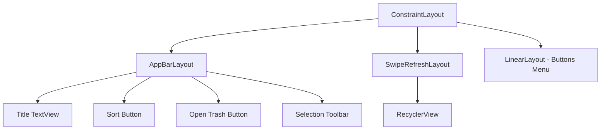

**Diagram sources**
- [activity_file_manager.xml](file://app/src/main/res/layout/activity_file_manager.xml)
- [layout-land/activity_file_manager.xml](file://app/src/main/res/layout-land/activity_file_manager.xml)

**Section sources**
- [activity_file_manager.xml](file://app/src/main/res/layout/activity_file_manager.xml#L1-L27)
- [layout-land/activity_file_manager.xml](file://app/src/main/res/layout-land/activity_file_manager.xml#L1-L215)

## RecyclerView and Grid Display
The `RecyclerView` displays files in a grid layout managed by `GridLayoutManager`. The number of columns (span count) adapts based on screen width and can be adjusted via pinch-to-zoom gestures. Each item uses `item_file.xml`, which includes an `ImageView` for thumbnails, a play icon overlay for videos, filename display, and selection indicators.

The grid dynamically updates content using `DiffUtil` within `FileAdapter`, ensuring efficient rendering during file operations or directory changes.

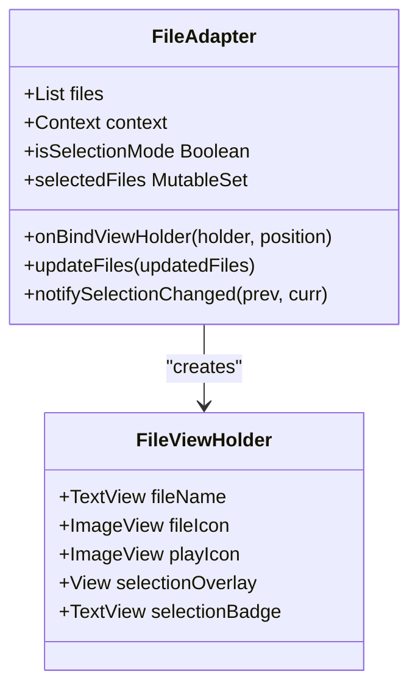

**Diagram sources**
- [FileAdapter.kt](file://app/src/main/java/com/example/b1void/adapters/FileAdapter.kt#L15-L167)
- [item_file.xml](file://app/src/main/res/layout/item_file.xml#L1-L54)

**Section sources**
- [FileManagerActivity.kt](file://app/src/main/java/com/example/b1void/activities/FileManagerActivity.kt#L42-L838)
- [FileAdapter.kt](file://app/src/main/java/com/example/b1void/adapters/FileAdapter.kt#L15-L167)

## Toolbar and Navigation Elements
The toolbar, implemented via `AppBarLayout`, provides essential navigation and control functions:
- **Title TextView**: Shows current directory name.
- **Sort Button**: Toggles sort order (ascending/descending).
- **Open Trash Button**: Navigates to the trash directory.
- **Clear Trash Button**: Appears only when inside the trash, allowing bulk deletion.

During selection mode, the standard toolbar is replaced by a contextual `selection_top_toolbar` that shows the count of selected items and offers actions like select all and confirm.

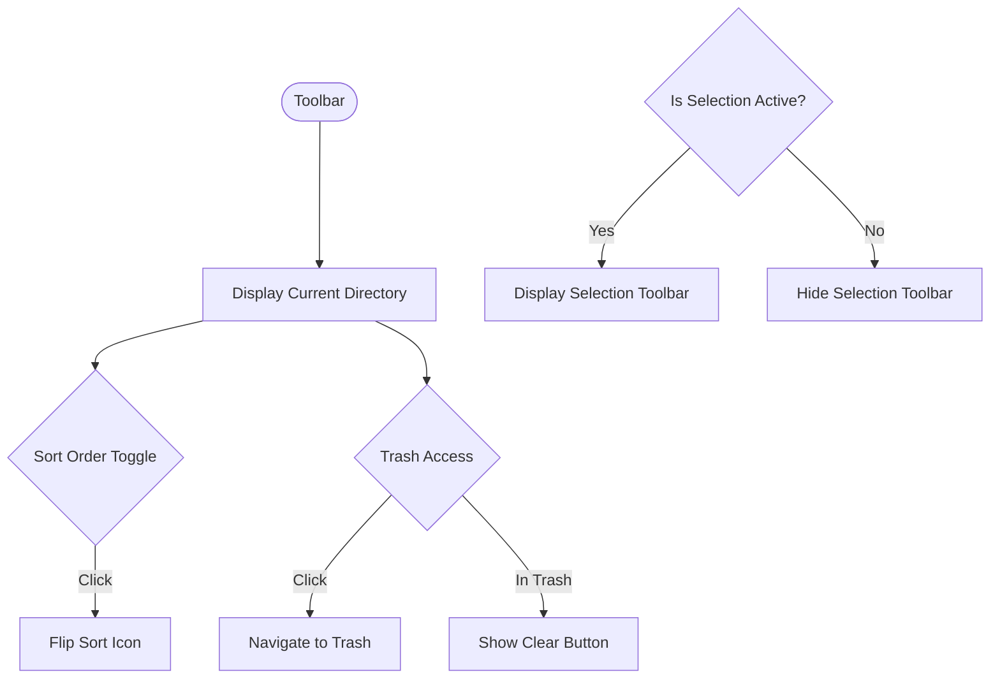

**Diagram sources**
- [activity_file_manager.xml](file://app/src/main/res/layout/activity_file_manager.xml#L1-L27)
- [FileManagerActivity.kt](file://app/src/main/java/com/example/b1void/activities/FileManagerActivity.kt#L42-L838)

**Section sources**
- [activity_file_manager.xml](file://app/src/main/res/layout/activity_file_manager.xml#L1-L27)
- [FileManagerActivity.kt](file://app/src/main/java/com/example/b1void/activities/FileManagerActivity.kt#L42-L838)

## Floating Action Buttons and Bottom Menu
Although not explicitly labeled as floating, the bottom menu contains three primary action buttons styled similarly to FABs:
- **Capture Button**: Launches `CameraActivity` to take photos or record videos.
- **Upload Button**: Opens gallery picker to import media from external sources.
- **Create Folder Button**: Triggers dialog to create new directories.

These buttons are horizontally aligned in both portrait and landscape layouts, maintaining consistent placement at the bottom of the screen.

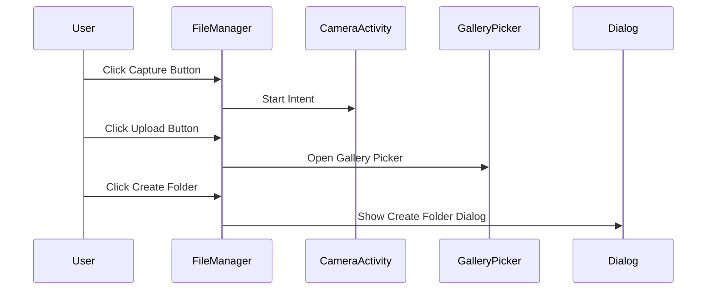

**Diagram sources**
- [activity_file_manager.xml](file://app/src/main/res/layout/activity_file_manager.xml#L1-L27)
- [FileManagerActivity.kt](file://app/src/main/java/com/example/b1void/activities/FileManagerActivity.kt#L42-L838)

**Section sources**
- [activity_file_manager.xml](file://app/src/main/res/layout/activity_file_manager.xml#L1-L27)
- [FileManagerActivity.kt](file://app/src/main/java/com/example/b1void/activities/FileManagerActivity.kt#L42-L838)

## Selection Mode UI for Batch Operations
Selection mode enables batch operations such as sharing, moving, or deleting multiple files. Activated via long press or context menu, it reveals a top toolbar showing:
- **Selection Count**: Number of currently selected files.
- **Select All Toggle**: Switches between selecting all non-directory files and clearing selection.
- **Confirm Button**: Opens `bottom_sheet_actions.xml` with available operations.

Visual feedback includes overlays and numbered badges on selected items, rendered through `FileAdapter`.

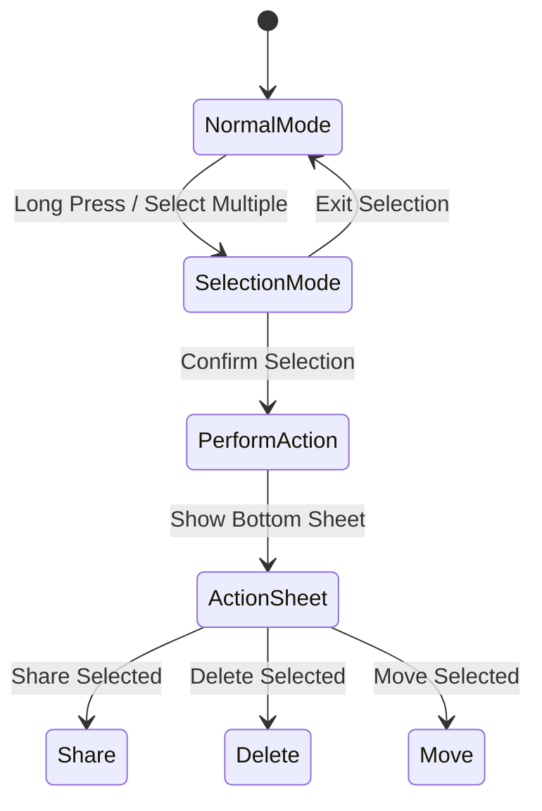

**Diagram sources**
- [activity_file_manager.xml](file://app/src/main/res/layout/activity_file_manager.xml#L1-L27)
- [bottom_sheet_actions.xml](file://app/src/main/res/layout/bottom_sheet_actions.xml#L1-L40)

**Section sources**
- [FileManagerActivity.kt](file://app/src/main/java/com/example/b1void/activities/FileManagerActivity.kt#L42-L838)
- [FileAdapter.kt](file://app/src/main/java/com/example/b1void/adapters/FileAdapter.kt#L15-L167)

## Adapters Integration: FileAdapter and FolderTreeAdapter
The `FileAdapter` binds file data to `RecyclerView` items, handling image loading via Glide and video playback indicators. It supports selection state management and notifies changes efficiently using `DiffUtil`.

The `FolderTreeAdapter` is used in move operations, displaying hierarchical folder structure with indentation and expandable nodes. Both adapters follow Android's `ListAdapter` pattern for optimized list updates.

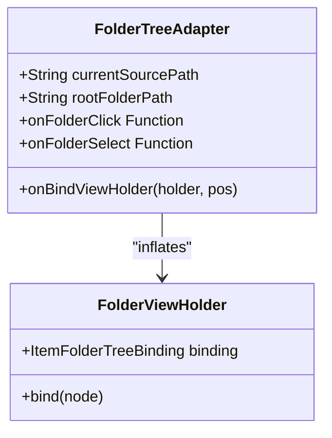

**Diagram sources**
- [FolderTreeAdapter.kt](file://app/src/main/java/com/example/b1void/adapters/FolderTreeAdapter.kt#L14-L88)
- [item_folder_tree.xml](file://app/src/main/res/layout/item_folder_tree.xml#L1-L36)

**Section sources**
- [FolderTreeAdapter.kt](file://app/src/main/java/com/example/b1void/adapters/FolderTreeAdapter.kt#L14-L88)
- [FileAdapter.kt](file://app/src/main/java/com/example/b1void/adapters/FileAdapter.kt#L15-L167)

## Gesture Handling via GestureHandler
A custom `GestureHandler` class manages swipe-to-select gestures on the `RecyclerView`. It detects scroll events during active selection mode and toggles file selection as the user drags across items. Long press initiates selection mode, enabling multi-selection without requiring individual taps.

This handler integrates directly with `FileManagerActivity`'s touch event pipeline, ensuring smooth interaction while preventing conflicts with other gestures like refresh swipes.

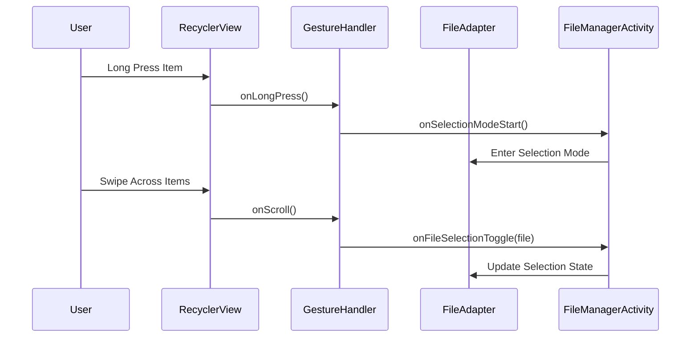

**Diagram sources**
- [GestureHandler.kt](file://app/src/main/java/com/example/b1void/utils/GestureHandler.kt#L8-L58)
- [FileManagerActivity.kt](file://app/src/main/java/com/example/b1void/activities/FileManagerActivity.kt#L42-L838)

**Section sources**
- [GestureHandler.kt](file://app/src/main/java/com/example/b1void/utils/GestureHandler.kt#L8-L58)
- [FileManagerActivity.kt](file://app/src/main/java/com/example/b1void/activities/FileManagerActivity.kt#L42-L838)

## Responsive Design: Portrait and Landscape Modes
The layout adapts significantly between portrait and landscape orientations:
- **Portrait Mode**: Prioritizes vertical space; selection actions appear in a top toolbar.
- **Landscape Mode**: Utilizes horizontal space with additional controls including vertical seekbar for zoom adjustment and inline action buttons (`share_button`, `delete_button`, `move_button`) within the AppBar.

Configuration-specific bindings in `ActivityFileManagerBinding` ensure correct view references regardless of orientation, avoiding null pointer exceptions.

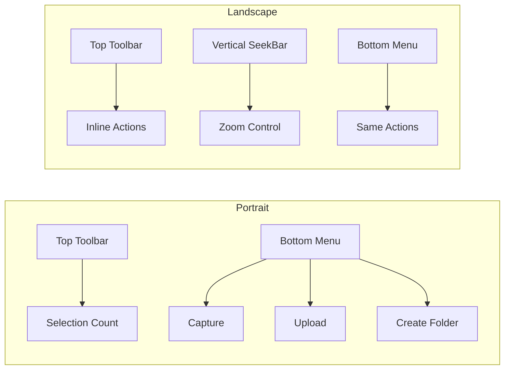

**Diagram sources**
- [activity_file_manager.xml](file://app/src/main/res/layout/activity_file_manager.xml#L1-L27)
- [layout-land/activity_file_manager.xml](file://app/src/main/res/layout-land/activity_file_manager.xml#L1-L215)
- [ActivityFileManagerBinding.java](file://app/build/generated/data_binding_base_class_source_out/debug/out/com/example/b1void/databinding/ActivityFileManagerBinding.java#L25-L510)

**Section sources**
- [activity_file_manager.xml](file://app/src/main/res/layout/activity_file_manager.xml#L1-L27)
- [layout-land/activity_file_manager.xml](file://app/src/main/res/layout-land/activity_file_manager.xml#L1-L215)

## View Binding with ActivityFileManagerBinding
Data binding is enabled for this layout, generating `ActivityFileManagerBinding`. This eliminates the need for manual `findViewById()` calls and ensures type-safe access to views. The binding object is created in `setContentView()` and used throughout `FileManagerActivity` to reference UI components safely.

Conditional bindings (e.g., `clearTrashButton` present only in portrait) are annotated accordingly, guiding developers on availability per configuration.

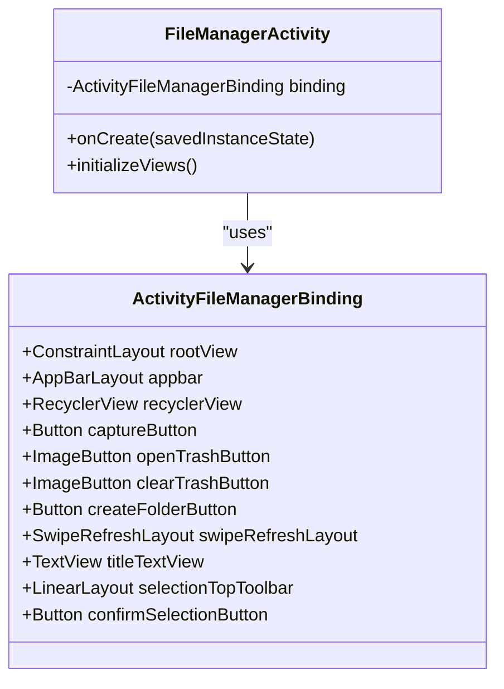

**Diagram sources**
- [ActivityFileManagerBinding.java](file://app/build/generated/data_binding_base_class_source_out/debug/out/com/example/b1void/databinding/ActivityFileManagerBinding.java#L25-L510)
- [FileManagerActivity.kt](file://app/src/main/java/com/example/b1void/activities/FileManagerActivity.kt#L42-L838)

**Section sources**
- [ActivityFileManagerBinding.java](file://app/build/generated/data_binding_base_class_source_out/debug/out/com/example/b1void/databinding/ActivityFileManagerBinding.java#L25-L510)
- [FileManagerActivity.kt](file://app/src/main/java/com/example/b1void/activities/FileManagerActivity.kt#L42-L838)

## Lifecycle Interactions with FileManagerActivity.kt
The `FileManagerActivity` manages its lifecycle in coordination with the layout:
- **onCreate()**: Initializes views, sets up adapters, and restores saved instance state.
- **onResume()**: Reloads directory content to reflect any external changes.
- **onSaveInstanceState()**: Preserves directory stack and selection state.
- **onBackPressed()**: Handles back navigation through directory hierarchy or exits selection mode.

Directory navigation maintains a `LinkedList` stack, enabling breadcrumb-style traversal.

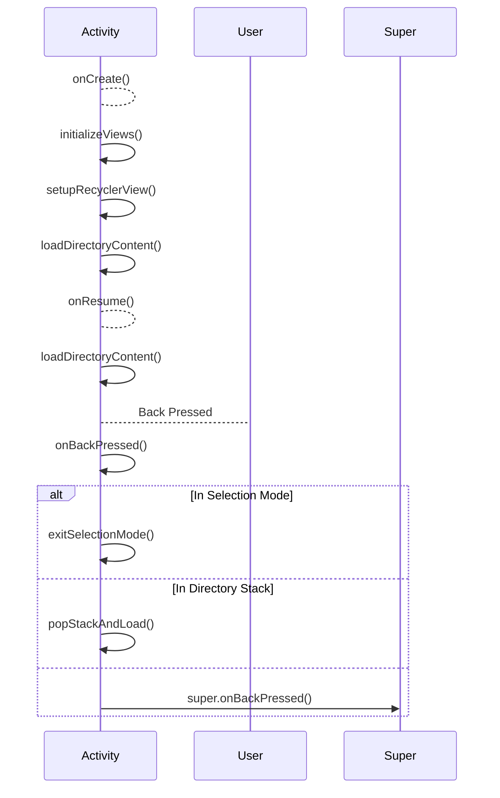

**Section sources**
- [FileManagerActivity.kt](file://app/src/main/java/com/example/b1void/activities/FileManagerActivity.kt#L42-L838)

## Event Flow: Clicks, Long Presses, Context Menus
User interactions trigger a well-defined event chain:
- **Click**: Opens directory or previews media.
- **Long Press**: Initiates selection mode.
- **Context Menu**: Accessed via overflow menu, offering rename, delete, share options.

Menu items defined in `file_actions_menu.xml` are inflated programmatically, with handlers mapped to corresponding actions in `onContextItemSelected()`.

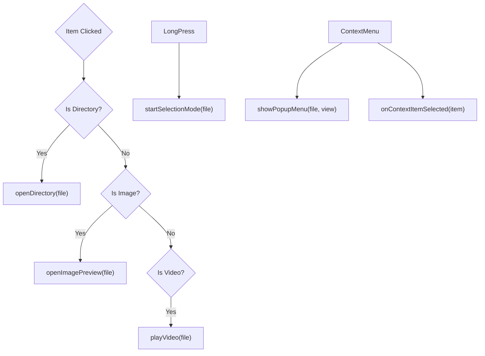

**Diagram sources**
- [file_actions_menu.xml](file://app/src/main/res/menu/file_actions_menu.xml#L1-L17)
- [FileManagerActivity.kt](file://app/src/main/java/com/example/b1void/activities/FileManagerActivity.kt#L42-L838)

**Section sources**
- [file_actions_menu.xml](file://app/src/main/res/menu/file_actions_menu.xml#L1-L17)
- [FileManagerActivity.kt](file://app/src/main/java/com/example/b1void/activities/FileManagerActivity.kt#L42-L838)

## Intent Launches to Other Activities
The layout facilitates navigation to several key activities:
- **CameraActivity**: Launched from capture button, allows photo/video capture.
- **ImagePreviewActivity**: Opens full-screen image viewer with swipeable pager.
- **ShareImportActivity**: Used indirectly via gallery picker for importing media.

Intents carry necessary extras like save path or image lists, ensuring proper initialization.

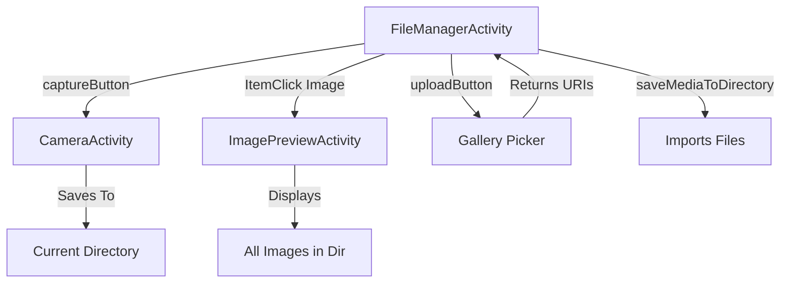

**Section sources**
- [FileManagerActivity.kt](file://app/src/main/java/com/example/b1void/activities/FileManagerActivity.kt#L42-L838)
- [CameraActivity.kt](file://app/src/main/java/com/example/b1void/activities/CameraActivity.kt#L76-L880)
- [ImagePreviewActivity.kt](file://app/src/main/java/com/example/b1void/activities/ImagePreviewActivity.kt#L23-L114)

## ViewExtensions for Animation Effects
Custom extension functions like `dpToPx()` simplify unit conversion across different screen densities. Animations such as slide-in/slide-out effects for the selection toolbar use predefined animations (`slide_in_top.xml`, `slide_out_top.xml`) loaded via `AnimationUtils`.

These utilities enhance UX consistency and reduce boilerplate code across the application.

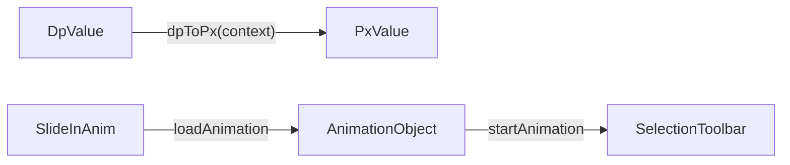

**Section sources**
- [ViewExtensions.kt](file://app/src/main/java/com/example/b1void/utils/ViewExtensions.kt#L1-L8)
- [FileManagerActivity.kt](file://app/src/main/java/com/example/b1void/activities/FileManagerActivity.kt#L42-L838)