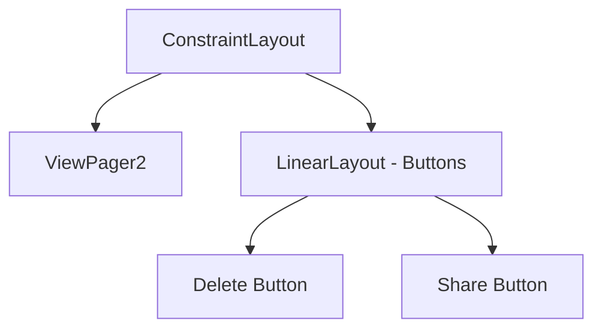
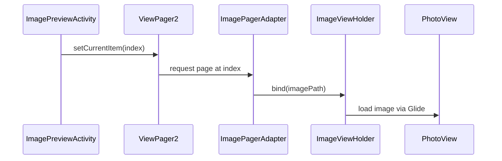
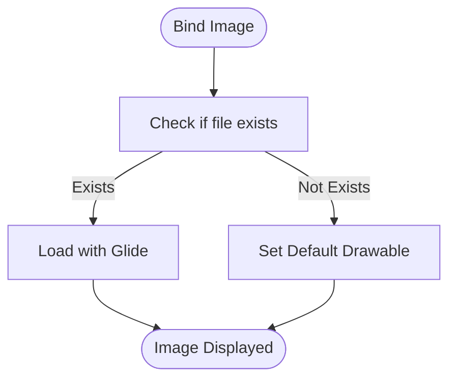
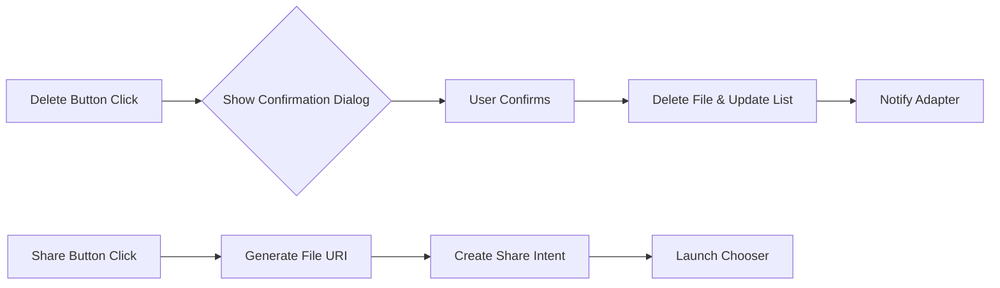

# Image Preview Activity Layout

<cite>
**Referenced Files in This Document**   
- [activity_image_preview.xml](file://app/src/main/res/layout/activity_image_preview.xml)
- [item_image_fullscreen.xml](file://app/src/main/res/layout/item_image_fullscreen.xml)
- [ImagePreviewActivity.kt](file://app/src/main/java/com/example/b1void/activities/ImagePreviewActivity.kt)
- [ImagePagerAdapter.kt](file://app/src/main/java/com/example/b1void/adapters/ImagePagerAdapter.kt)
- [FullscreenImageManager.kt](file://app/src/main/java/com/example/b1void/utils/FullscreenImageManager.kt)
</cite>

## Table of Contents
1. [Introduction](#introduction)
2. [Layout Structure and Components](#layout-structure-and-components)
3. [Core Functionality](#core-functionality)
4. [ViewPager2 Integration and Image Navigation](#viewpager2-integration-and-image-navigation)
5. [Image Loading with Glide and ImagePagerAdapter](#image-loading-with-glide-and-imagepageradapter)
6. [User Interaction and Overlay Controls](#user-interaction-and-overlay-controls)
7. [Lifecycle and Data Handling](#lifecycle-and-data-handling)
8. [FullscreenImageManager Integration](#fullscreenimagemanager-integration)
9. [URI Handling and Sharing Mechanism](#uri-handling-and-sharing-mechanism)
10. [Deletion Workflow and Confirmation](#deletion-workflow-and-confirmation)
11. [Immersive Mode and UI Experience](#immersive-mode-and-ui-experience)

## Introduction
The `activity_image_preview.xml` layout serves as the foundation for fullscreen image viewing within the application, enabling users to navigate between multiple images using swipe gestures via ViewPager2. It supports pinch-to-zoom functionality through integration with the PhotoView library and provides overlay controls for essential actions such as deletion, sharing, and editing. The layout is tightly coupled with `ImagePreviewActivity.kt`, which manages lifecycle events, media loading, and user interactions. This document details the structure, behavior, and integration points of this layout, emphasizing its role in delivering a seamless and immersive image browsing experience.

**Section sources**
- [activity_image_preview.xml](file://app/src/main/res/layout/activity_image_preview.xml#L1-L47)
- [ImagePreviewActivity.kt](file://app/src/main/java/com/example/b1void/activities/ImagePreviewActivity.kt#L23-L114)

## Layout Structure and Components
The layout is built using `ConstraintLayout` as the root container, ensuring flexible positioning and responsiveness across device sizes. It contains two primary components: a full-screen `ViewPager2` for displaying images and a semi-transparent `LinearLayout` at the bottom housing action buttons.

The `ViewPager2` occupies the entire screen area, allowing horizontal swiping between images. The button layout includes two `ImageButton` elements—Delete and Share—each styled with white tinted icons on a translucent black background to maintain visibility without obstructing the image content. These controls are initially visible but can be toggled programmatically based on user interaction or configuration flags.

**Diagram sources**
- [activity_image_preview.xml](file://app/src/main/res/layout/activity_image_preview.xml#L1-L47)

**Section sources**
- [activity_image_preview.xml](file://app/src/main/res/layout/activity_image_preview.xml#L1-L47)

## Core Functionality
The layout enables core image preview features including:
- Fullscreen display with minimal UI distractions
- Swipe navigation between multiple images
- Pinch-to-zoom and pan support via `PhotoView`
- Contextual action buttons (delete, share)
- Dynamic image list handling from intent extras
- Responsive UI feedback during media operations

These capabilities are orchestrated by `ImagePreviewActivity.kt`, which initializes the view components, binds data, and handles user input. The layout itself acts as a declarative blueprint, while the associated activity class implements the logic that brings these elements to life.

**Section sources**
- [ImagePreviewActivity.kt](file://app/src/main/java/com/example/b1void/activities/ImagePreviewActivity.kt#L23-L114)
- [activity_image_preview.xml](file://app/src/main/res/layout/activity_image_preview.xml#L1-L47)

## ViewPager2 Integration and Image Navigation
`ViewPager2` is used to enable smooth horizontal swiping between images. It is connected to an instance of `ImagePagerAdapter`, which populates each page with a fullscreen image view defined in `item_image_fullscreen.xml`. Upon creation, the activity retrieves the current image index from the intent and sets the initial position using `setCurrentItem(currentImageIndex, false)` to prevent animation.

A `ViewPager2.OnPageChangeCallback` is registered to track page changes and update the `currentImageIndex` state accordingly. This ensures that actions like deletion or sharing operate on the currently displayed image.

**Diagram sources**
- [ImagePreviewActivity.kt](file://app/src/main/java/com/example/b1void/activities/ImagePreviewActivity.kt#L56-L66)
- [ImagePagerAdapter.kt](file://app/src/main/java/com/example/b1void/adapters/ImagePagerAdapter.kt#L17-L24)

**Section sources**
- [ImagePreviewActivity.kt](file://app/src/main/java/com/example/b1void/activities/ImagePreviewActivity.kt#L56-L66)
- [ImagePagerAdapter.kt](file://app/src/main/java/com/example/b1void/adapters/ImagePagerAdapter.kt#L12-L44)

## Image Loading with Glide and ImagePagerAdapter
The `ImagePagerAdapter` class inflates the `item_image_fullscreen.xml` layout for each item and uses Glide to asynchronously load images from file paths into the `PhotoView` widget. Placeholder and error drawables (`R.drawable.image_ic`, `R.drawable.def_insp_img`) are applied during loading and failure scenarios respectively.

Each `ImageViewHolder` binds a specific image path to the view, checking file existence before attempting to load it. This prevents crashes due to missing files and maintains UI stability.

**Diagram sources**
- [ImagePagerAdapter.kt](file://app/src/main/java/com/example/b1void/adapters/ImagePagerAdapter.kt#L22-L24)

**Section sources**
- [ImagePagerAdapter.kt](file://app/src/main/java/com/example/b1void/adapters/ImagePagerAdapter.kt#L12-L44)
- [item_image_fullscreen.xml](file://app/src/main/res/layout/item_image_fullscreen.xml#L1-L12)

## User Interaction and Overlay Controls
The overlay control panel includes Delete and Share buttons, both implemented as `ImageButton` with material design styling. Click listeners are set up in `setupButtonListeners()` to trigger confirmation dialogs and sharing intents.

The Delete button invokes `confirmDelete()`, which shows an alert dialog before proceeding. The Share button launches a chooser intent after generating a secure `Uri` using `FileProvider`, ensuring safe access to private files.

**Diagram sources**
- [ImagePreviewActivity.kt](file://app/src/main/java/com/example/b1void/activities/ImagePreviewActivity.kt#L68-L71)

**Section sources**
- [ImagePreviewActivity.kt](file://app/src/main/java/com/example/b1void/activities/ImagePreviewActivity.kt#L73-L113)

## Lifecycle and Data Handling
The activity retrieves image paths and the starting index from the launching intent using `getStringArrayListExtra("image_paths")` and `getIntExtra("current_image_index", 0)`. If no images are provided, it displays a toast and finishes immediately.

During orientation changes, Android automatically retains the activity state, including the `imagePaths` list and `currentImageIndex`, because they are passed through the intent and stored in instance variables. No additional persistence mechanism is required for basic state retention.

If all images are deleted, the activity calls `finish()` to return to the previous screen.

**Section sources**
- [ImagePreviewActivity.kt](file://app/src/main/java/com/example/b1void/activities/ImagePreviewActivity.kt#L34-L54)
- [ImagePreviewActivity.kt](file://app/src/main/java/com/example/b1void/activities/ImagePreviewActivity.kt#L82-L96)

## FullscreenImageManager Integration
The `FullscreenImageManager` utility class encapsulates common image operations such as opening previews, deleting, and sharing. It abstracts the intent construction process for launching `ImagePreviewActivity`, making it reusable across different parts of the app.

When opening an image, it packages the file path into an intent with appropriate extras. This decouples image preview logic from individual activities and promotes consistency in behavior and UI presentation.

**Section sources**
- [FullscreenImageManager.kt](file://app/src/main/java/com/example/b1void/utils/FullscreenImageManager.kt#L12-L60)

## URI Handling and Sharing Mechanism
To securely share images, the system uses `FileProvider` to generate a content URI instead of exposing direct file paths. This URI grants temporary read permissions to receiving apps, complying with Android's scoped storage policies.

The sharing flow constructs a `Chooser Intent` with `ACTION_SEND`, attaches the URI, sets MIME type to `"image/jpeg"`, and requests permission grant via `FLAG_GRANT_READ_URI_PERMISSION`.

**Section sources**
- [ImagePreviewActivity.kt](file://app/src/main/java/com/example/b1void/activities/ImagePreviewActivity.kt#L98-L113)
- [FullscreenImageManager.kt](file://app/src/main/java/com/example/b1void/utils/FullscreenImageManager.kt#L45-L60)

## Deletion Workflow and Confirmation
Before deletion, the user is prompted with an `AlertDialog` asking for confirmation. Upon acceptance, the file is removed from storage, the in-memory list (`imagePaths`) is updated, and the adapter is notified via `notifyItemRemoved()`. The `ImageOptimizer.clearImageCache()` method is also called to ensure cached versions are purged.

If the last image is deleted, the activity finishes automatically.

**Section sources**
- [ImagePreviewActivity.kt](file://app/src/main/java/com/example/b1void/activities/ImagePreviewActivity.kt#L73-L80)
- [ImagePreviewActivity.kt](file://app/src/main/java/com/example/b1void/activities/ImagePreviewActivity.kt#L82-L96)

## Immersive Mode and UI Experience
Although not explicitly configured in the current layout, the use of a black background (`@android:color/black`) and absence of default window decor elements contribute to an immersive viewing experience. Future enhancements could include hiding system bars dynamically using immersive mode flags to further minimize distractions during fullscreen viewing.

The overall design prioritizes content over chrome, aligning with modern mobile UX principles for media consumption applications.

**Section sources**
- [activity_image_preview.xml](file://app/src/main/res/layout/activity_image_preview.xml#L6-L8)