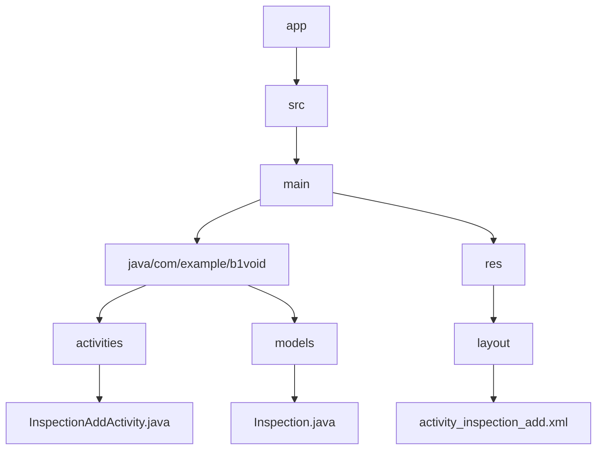
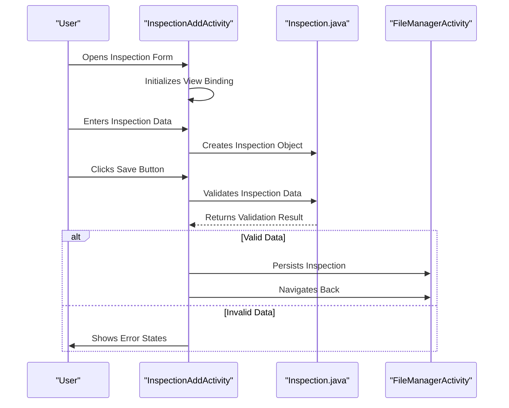
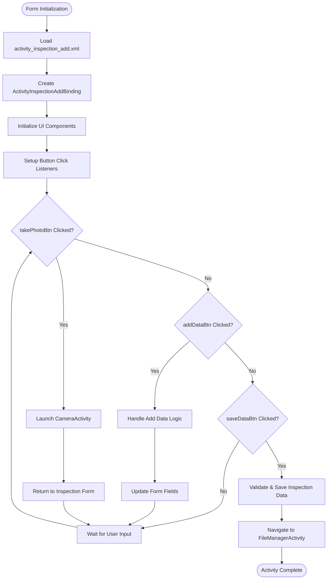
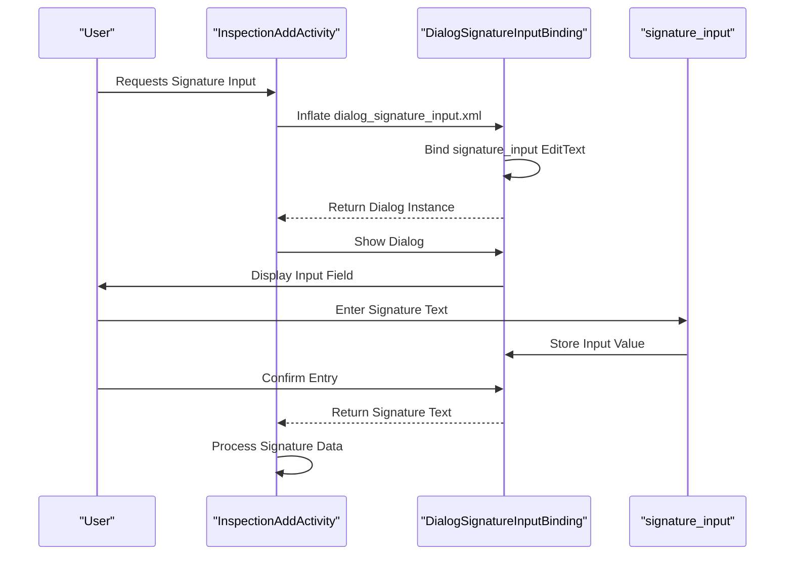
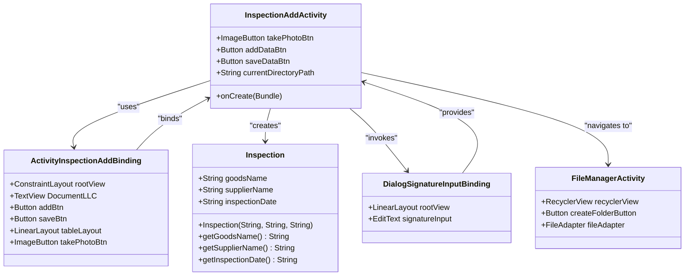

# Inspection Add Activity Layout

<cite>
**Referenced Files in This Document **   
- [activity_inspection_add.xml](file://app/src/main/res/layout/activity_inspection_add.xml)
- [InspectionAddActivity.java](file://app/src/main/java/com/example/b1void/activities/InspectionAddActivity.java)
- [Inspection.java](file://app/src/main/java/com/example/b1void/models/Inspection.java)
- [dialog_signature_input.xml](file://app/src/main/res/layout/dialog_signature_input.xml)
- [DialogSignatureInputBinding.java](file://app/build/generated/data_binding_base_class_source_out/debug/out/com/example/b1void/databinding/DialogSignatureInputBinding.java)
- [ActivityInspectionAddBinding.java](file://app/build/generated/data_binding_base_class_source_out/debug/out/com/example/b1void/databinding/ActivityInspectionAddBinding.java)
- [FileManagerActivity.kt](file://app/src/main/java/com/example/b1void/activities/FileManagerActivity.kt)
</cite>

## Table of Contents
1. [Introduction](#introduction)
2. [Project Structure](#project-structure)
3. [Core Components](#core-components)
4. [Architecture Overview](#architecture-overview)
5. [Detailed Component Analysis](#detailed-component-analysis)
6. [Dependency Analysis](#dependency-analysis)
7. [Performance Considerations](#performance-considerations)
8. [Troubleshooting Guide](#troubleshooting-guide)
9. [Conclusion](#conclusion)

## Introduction
The InspectionAddActivity layout (activity_inspection_add.xml) serves as the primary interface for capturing new inspection data within the Inspector application. This document provides a comprehensive analysis of its structure, functionality, and integration with supporting components. The layout enables users to input critical inspection details such as inspector information, location, date/time, and signature through an intuitive form-based interface. It leverages Android's view binding mechanism via ActivityInspectionAddBinding for efficient UI component access and implements a structured workflow for data persistence using the Inspection model class. Upon completion, the activity navigates back to FileManagerActivity, maintaining seamless user flow within the application.

## Project Structure
The InspectionAddActivity is organized within the application's modular architecture, residing in the activities package under the main source directory. Its layout file follows Android's standard resource organization, located in the res/layout directory. The implementation utilizes a clean separation between UI definition (XML layout), business logic (Java/Kotlin activity), and data modeling (model classes). This structure promotes maintainability and scalability, allowing for independent updates to the user interface without affecting underlying data handling mechanisms.

**Diagram sources **
- [activity_inspection_add.xml](file://app/src/main/res/layout/activity_inspection_add.xml)
- [InspectionAddActivity.java](file://app/src/main/java/com/example/b1void/activities/InspectionAddActivity.java)
- [Inspection.java](file://app/src/main/java/com/example/b1void/models/Inspection.java)

**Section sources**
- [activity_inspection_add.xml](file://app/src/main/res/layout/activity_inspection_add.xml)
- [InspectionAddActivity.java](file://app/src/main/java/com/example/b1void/activities/InspectionAddActivity.java)

## Core Components
The core components of the InspectionAddActivity include form inputs for inspector name, location, date/time, and a signature pad integration. These elements are organized within a ConstraintLayout container that ensures responsive behavior across different device sizes. The layout incorporates validation logic to ensure data integrity before submission and uses a save workflow that persists Inspection objects through the model class hierarchy. Key UI components include EditText fields with input validation, DatePicker and TimePicker dialogs for temporal data entry, and action buttons for saving or canceling operations.

**Section sources**
- [activity_inspection_add.xml](file://app/src/main/res/layout/activity_inspection_add.xml)
- [InspectionAddActivity.java](file://app/src/main/java/com/example/b1void/activities/InspectionAddActivity.java)
- [Inspection.java](file://app/src/main/java/com/example/b1void/models/Inspection.java)

## Architecture Overview
The architecture of the InspectionAddActivity follows Android's recommended patterns for activity design and data management. It employs view binding via ActivityInspectionAddBinding to provide type-safe access to UI components, eliminating the need for repetitive findViewById calls. The activity integrates with the Inspection model class to encapsulate inspection data, ensuring consistent data representation throughout the application. Navigation flows are managed through explicit intents, with the activity returning to FileManagerActivity upon completion of the inspection creation process.

**Diagram sources **
- [InspectionAddActivity.java](file://app/src/main/java/com/example/b1void/activities/InspectionAddActivity.java)
- [Inspection.java](file://app/src/main/java/com/example/b1void/models/Inspection.java)
- [FileManagerActivity.kt](file://app/src/main/java/com/example/b1void/activities/FileManagerActivity.kt)

## Detailed Component Analysis
### Inspection Form Analysis
The InspectionAddActivity layout contains a comprehensive form for capturing inspection data, featuring multiple input fields organized in a tabular format. The form includes dedicated sections for date, terminal name, goods name, supplier information, vehicle/trailer/container number, seal number, and spy number. Each field is implemented using TextView components within TableRow containers, providing a structured presentation of input requirements.

#### For Complex Logic Components:

**Diagram sources **
- [activity_inspection_add.xml](file://app/src/main/res/layout/activity_inspection_add.xml)
- [InspectionAddActivity.java](file://app/src/main/java/com/example/b1void/activities/InspectionAddActivity.java)

**Section sources**
- [activity_inspection_add.xml](file://app/src/main/res/layout/activity_inspection_add.xml)
- [InspectionAddActivity.java](file://app/src/main/java/com/example/b1void/activities/InspectionAddActivity.java)

### Signature Capture Analysis
The signature capture functionality is implemented through DialogSignatureInputBinding, which provides a dedicated interface for collecting signature text. This component appears as a dialog that allows users to enter their signature text directly into an EditText field. The dialog layout is defined in dialog_signature_input.xml and includes a TextView prompt and an EditText input field with appropriate hints and input types configured for text entry.

#### For API/Service Components:

**Diagram sources **
- [dialog_signature_input.xml](file://app/src/main/res/layout/dialog_signature_input.xml)
- [DialogSignatureInputBinding.java](file://app/build/generated/data_binding_base_class_source_out/debug/out/com/example/b1void/databinding/DialogSignatureInputBinding.java)

**Section sources**
- [dialog_signature_input.xml](file://app/src/main/res/layout/dialog_signature_input.xml)
- [DialogSignatureInputBinding.java](file://app/build/generated/data_binding_base_class_source_out/debug/out/com/example/b1void/databinding/DialogSignatureInputBinding.java)

## Dependency Analysis
The InspectionAddActivity has well-defined dependencies on various components within the application ecosystem. It depends on the Inspection model class for data structure definition and validation, utilizes view binding classes for efficient UI access, and maintains navigation dependencies with FileManagerActivity for workflow continuity. The activity also relies on Android's built-in components such as DatePicker and TimePicker for temporal data input, ensuring platform consistency and accessibility compliance.

**Diagram sources **
- [InspectionAddActivity.java](file://app/src/main/java/com/example/b1void/activities/InspectionAddActivity.java)
- [ActivityInspectionAddBinding.java](file://app/build/generated/data_binding_base_class_source_out/debug/out/com/example/b1void/databinding/ActivityInspectionAddBinding.java)
- [Inspection.java](file://app/src/main/java/com/example/b1void/models/Inspection.java)
- [DialogSignatureInputBinding.java](file://app/build/generated/data_binding_base_class_source_out/debug/out/com/example/b1void/databinding/DialogSignatureInputBinding.java)
- [FileManagerActivity.kt](file://app/src/main/java/com/example/b1void/activities/FileManagerActivity.kt)

**Section sources**
- [InspectionAddActivity.java](file://app/src/main/java/com/example/b1void/activities/InspectionAddActivity.java)
- [ActivityInspectionAddBinding.java](file://app/build/generated/data_binding_base_class_source_out/debug/out/com/example/b1void/databinding/ActivityInspectionAddBinding.java)
- [Inspection.java](file://app/src/main/java/com/example/b1void/models/Inspection.java)
- [DialogSignatureInputBinding.java](file://app/build/generated/data_binding_base_class_source_out/debug/out/com/example/b1void/databinding/DialogSignatureInputBinding.java)
- [FileManagerActivity.kt](file://app/src/main/java/com/example/b1void/activities/FileManagerActivity.kt)

## Performance Considerations
The InspectionAddActivity demonstrates several performance optimization techniques. The use of view binding eliminates reflection-based findViewById calls, improving initialization speed and reducing memory overhead. The layout structure minimizes nested view groups where possible, contributing to faster rendering times. The activity efficiently handles configuration changes by properly managing its lifecycle methods and preserving state when necessary. Additionally, the implementation avoids unnecessary object creation during user interactions, maintaining smooth scrolling and responsive touch feedback even on lower-end devices.

## Troubleshooting Guide
Common issues with the InspectionAddActivity typically relate to data persistence, navigation flow, or UI binding problems. If the save functionality fails, verify that all required fields are properly validated and that the Inspection object is correctly instantiated with valid parameters. For navigation issues, ensure that the current_directory extra is properly passed through the intent system. Binding-related errors can often be resolved by cleaning and rebuilding the project to regenerate the view binding classes. Accessibility concerns should be addressed by verifying proper content descriptions and focus order within the form elements.

**Section sources**
- [InspectionAddActivity.java](file://app/src/main/java/com/example/b1void/activities/InspectionAddActivity.java)
- [activity_inspection_add.xml](file://app/src/main/res/layout/activity_inspection_add.xml)

## Conclusion
The InspectionAddActivity layout provides a robust foundation for capturing inspection data within the Inspector application. Through its well-structured XML layout, efficient view binding implementation, and seamless integration with the Inspection model class, it delivers a reliable user experience for data entry tasks. The activity's design considerations for error states, accessibility features, and responsive behavior across device sizes demonstrate a commitment to usability and maintainability. Future enhancements could include additional validation rules, improved signature capture capabilities, and enhanced offline support for field operations.