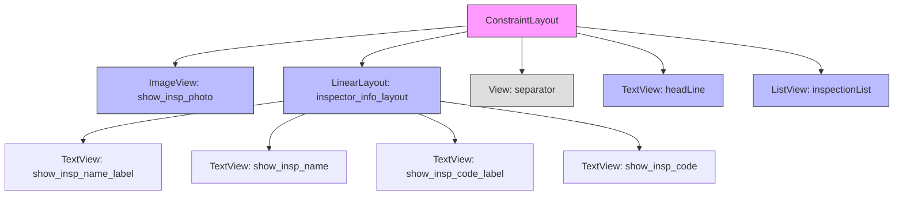
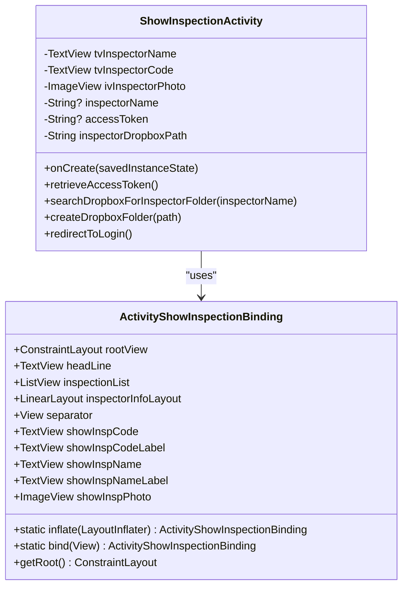
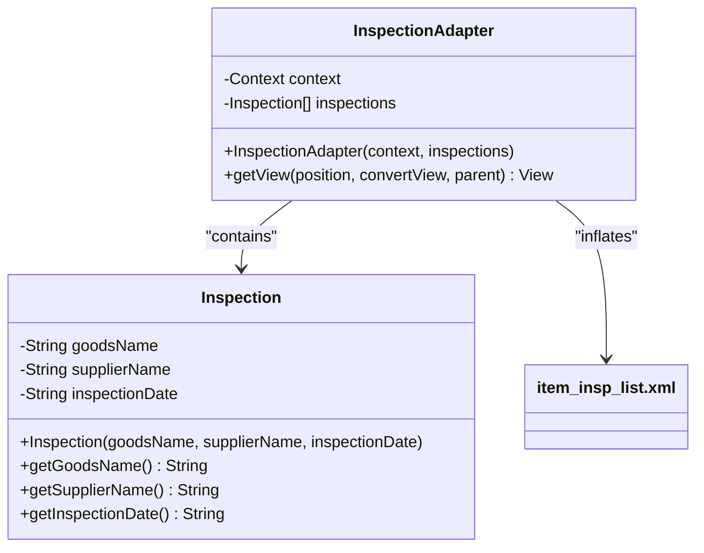
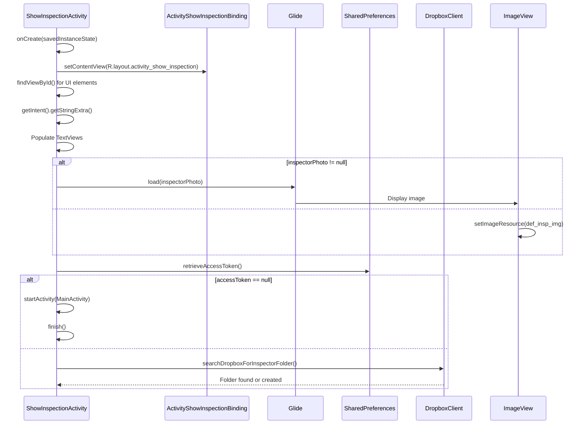

# Show Inspection Activity Layout

<cite>
**Referenced Files in This Document**   
- [activity_show_inspection.xml](file://app/src/main/res/layout/activity_show_inspection.xml)
- [ShowInspectionActivity.kt](file://app/src/main/java/com/example/b1void/activities/ShowInspectionActivity.kt)
- [ActivityShowInspectionBinding.java](file://app/build/generated/data_binding_base_class_source_out/debug/out/com/example/b1void/databinding/ActivityShowInspectionBinding.java)
- [Inspection.java](file://app/src/main/java/com/example/b1void/models/Inspection.java)
- [InspectionAdapter.java](file://app/src/main/java/com/example/b1void/adapters/InspectionAdapter.java)
- [item_insp_list.xml](file://app/src/main/res/layout/item_insp_list.xml)
</cite>

## Table of Contents
1. [Introduction](#introduction)
2. [Layout Structure and UI Components](#layout-structure-and-ui-components)
3. [Data Binding and View Binding](#data-binding-and-view-binding)
4. [Integration with Inspection Model](#integration-with-inspection-model)
5. [Lifecycle and Data Population](#lifecycle-and-data-population)
6. [Navigation and Intent Handling](#navigation-and-intent-handling)
7. [Responsive Design and Accessibility](#responsive-design-and-accessibility)

## Introduction
The `activity_show_inspection.xml` layout is designed to display completed inspection details in a read-only format, primarily used for reviewing inspection records. It presents key metadata such as inspector information, timestamp, associated media files, and signature visualization. The layout integrates tightly with the `ShowInspectionActivity.kt` class and leverages Android's View Binding mechanism through `ActivityShowInspectionBinding`. It supports navigation from inspection lists and enables users to view structured data via a `ListView` populated using an adapter pattern.

**Section sources**
- [activity_show_inspection.xml](file://app/src/main/res/layout/activity_show_inspection.xml#L1-L125)
- [ShowInspectionActivity.kt](file://app/src/main/java/com/example/b1void/activities/ShowInspectionActivity.kt#L21-L150)

## Layout Structure and UI Components
The layout uses `ConstraintLayout` as its root container, ensuring flexible positioning across various screen densities. Key UI components include:

- **ImageView (`show_insp_photo`)**: Displays the inspector’s photo, defaulting to a placeholder if no image is available.
- **TextViews (`show_insp_name`, `show_insp_code`)**: Render inspector name and identification code within a vertical `LinearLayout`.
- **Separator (`View`)**: A horizontal line separating inspector metadata from the inspection list.
- **Headline (`headLine`)**: A centered title indicating the section "INSPECTIONS".
- **ListView (`inspectionList`)**: Displays a scrollable list of inspection entries using a custom item layout (`item_insp_list.xml`).

All text elements use white color (`@color/white`) against a dark background (`@color/back`), enhancing readability and visual contrast.

**Diagram sources**
- [activity_show_inspection.xml](file://app/src/main/res/layout/activity_show_inspection.xml#L8-L124)

**Section sources**
- [activity_show_inspection.xml](file://app/src/main/res/layout/activity_show_inspection.xml#L8-L124)

## Data Binding and View Binding
The layout is accessed via generated binding class `ActivityShowInspectionBinding`, which eliminates the need for manual `findViewById()` calls. This binding class provides direct access to all views defined in the layout, including `headLine`, `inspectionList`, `inspectorInfoLayout`, `separator`, and individual `TextView` and `ImageView` elements.

Binding is initialized in `ShowInspectionActivity.kt` during `onCreate()`, where views are referenced and populated with data passed via intent extras. The binding ensures type safety and null safety, reducing runtime exceptions related to missing or misreferenced views.

**Diagram sources**
- [ActivityShowInspectionBinding.java](file://app/build/generated/data_binding_base_class_source_out/debug/out/com/example/b1void/databinding/ActivityShowInspectionBinding.java#L20-L157)
- [ShowInspectionActivity.kt](file://app/src/main/java/com/example/b1void/activities/ShowInspectionActivity.kt#L21-L150)

**Section sources**
- [ActivityShowInspectionBinding.java](file://app/build/generated/data_binding_base_class_source_out/debug/out/com/example/b1void/databinding/ActivityShowInspectionBinding.java#L20-L157)
- [ShowInspectionActivity.kt](file://app/src/main/java/com/example/b1void/activities/ShowInspectionActivity.kt#L32-L67)

## Integration with Inspection Model
The `ListView` component displays a list of inspections using `InspectionAdapter`, which binds data from the `Inspection.java` model class. Each `Inspection` object contains three properties:
- `goodsName`: Name of the inspected goods
- `supplierName`: Supplier of the goods
- `inspectionDate`: Date when the inspection was conducted

The adapter inflates `item_insp_list.xml` for each entry, mapping model fields to corresponding `TextView` elements (`goodsName`, `supplierName`, `inspectionDate`). This ensures consistent presentation of inspection records in a structured format.

**Diagram sources**
- [Inspection.java](file://app/src/main/java/com/example/b1void/models/Inspection.java#L2-L25)
- [InspectionAdapter.java](file://app/src/main/java/com/example/b1void/adapters/InspectionAdapter.java#L14-L41)
- [item_insp_list.xml](file://app/src/main/res/layout/item_insp_list.xml#L1-L49)

**Section sources**
- [Inspection.java](file://app/src/main/java/com/example/b1void/models/Inspection.java#L2-L25)
- [InspectionAdapter.java](file://app/src/main/java/com/example/b1void/adapters/InspectionAdapter.java#L14-L41)
- [item_insp_list.xml](file://app/src/main/res/layout/item_insp_list.xml#L1-L49)

## Lifecycle and Data Population
During the `onCreate()` lifecycle phase, the activity retrieves inspector data from intent extras, including:
- `inspectorId`
- `inspectorName`
- `inspectorCode`
- `inspectorPhoto` (file path)

These values are used to populate the corresponding `TextView` and `ImageView` elements. If a photo path is provided, Glide loads the image; otherwise, a default drawable (`def_insp_img`) is displayed.

Additionally, the activity checks for a valid Dropbox access token stored in shared preferences. If absent, the user is redirected to the login screen (`MainActivity`). Otherwise, it attempts to locate or create a Dropbox folder named after the inspector, facilitating cloud-based file management.

**Diagram sources**
- [ShowInspectionActivity.kt](file://app/src/main/java/com/example/b1void/activities/ShowInspectionActivity.kt#L32-L67)
- [ShowInspectionActivity.kt](file://app/src/main/java/com/example/b1void/activities/ShowInspectionActivity.kt#L69-L104)
- [ShowInspectionActivity.kt](file://app/src/main/java/com/example/b1void/activities/ShowInspectionActivity.kt#L105-L138)

**Section sources**
- [ShowInspectionActivity.kt](file://app/src/main/java/com/example/b1void/activities/ShowInspectionActivity.kt#L32-L138)

## Navigation and Intent Handling
The `ShowInspectionActivity` is launched from other parts of the application (e.g., inspection list screens) via explicit intents containing inspector details. This allows seamless transition from list views to detailed inspection review. The absence of edit or share buttons in the current layout suggests that these actions may be handled externally or in future implementations.

Intent extras are critical for initializing the UI state, ensuring that the correct inspector and associated data are displayed. The use of string extras aligns with Android best practices for lightweight inter-component communication.

**Section sources**
- [ShowInspectionActivity.kt](file://app/src/main/java/com/example/b1void/activities/ShowInspectionActivity.kt#L40-L50)

## Responsive Design and Accessibility
The layout employs constraint-based positioning to adapt to different screen sizes and orientations. Padding and margins are consistently set to `16dp`, following Material Design guidelines. Text sizes range from `15sp` to `20sp`, ensuring legibility across devices.

The use of `tools:text` attributes in XML provides design-time preview data without affecting runtime behavior. Additionally, the layout avoids hardcoded strings by referencing color resources (`@color/white`, `@color/back`), promoting theming flexibility and localization readiness.

**Section sources**
- [activity_show_inspection.xml](file://app/src/main/res/layout/activity_show_inspection.xml#L1-L125)